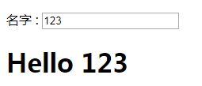
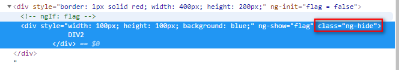

### AngularJS 笔记

#### 1.AngularJS 表达式

```js
AngularJS表达式写在双大括号中：{{expression}};
AngularJS表达式把数据绑定到HTML，这与ng-bind指令有异曲同工之妙。
AngularJS将在表达式书写的位置“输出”数据
AngularJS表达式 很像 JavaScript 表达式：它们可以包含文字、运算符和变量。
	实例 {{ 5 + 5 }} 或 {{ firstName + " " + lastName }}


AngularJS 表达式 与 JavaScript 表达式
1.类似于 JavaScript 表达式，AngularJS 表达式可以包含字母，操作符，变量。
2.与 JavaScript 表达式不同，AngularJS 表达式可以写在 HTML 中。
3.与 JavaScript 表达式不同，AngularJS 表达式不支持条件判断，循环及异常。
4.与 JavaScript 表达式不同，AngularJS 表达式支持过滤器。
```

#### 2.AngularJS 指令

```js
AngularJS通过成为指令的新属性来扩展HTML
AngularJS 通过内置的指令来为应用添加功能。
AngularJS 允许你自定义指令

AngularJS 指令
AngularJS 指令是扩展的 HTML 属性，带有前缀 ng-。
-------->>>指令<<<------------
>>>1.ng-app 指令初始化一个 AngularJS 应用程序。(在一个页面中只能有一个ng-app指令)
>>>2.ng-init 指令初始化应用程序数据。
>>>3.ng-model 指令把元素值（比如输入域的值）绑定到应用程序。

数据绑定
<div ng-app="" ng-init="firstName='John'">
 
     <p>在输入框中尝试输入：</p>
     <p>姓名：<input type="text" ng-model="firstName"></p>
     <p>你输入的为： {{ firstName }}</p>
 
</div>
上面实例中的 {{ firstName }} 表达式是一个 AngularJS 数据绑定表达式。
AngularJS 中的数据绑定，同步了 AngularJS 表达式与 AngularJS 数据。
{{ firstName }} 是通过 ng-model="firstName" 进行同步


>>>4.ng-repeat 指令会重复一个html元素。
相当于jstl中的<c:foreach >标签。

ng-click AngularJS中的点击事件

```

#### ng-model 指令

```html

<div ng-app="">
    <p>名字 : <input type="text" ng-model="name"></p>
    <h1>Hello {{name}}</h1>
</div>
```

结果：（输入的数据会实时的反馈到name变量，即两个进行了绑定）



#### 第一个AngularJS程序

```html
<!DOCTYPE html>
<html>
<head>
	<title></title>
	<script src="http://cdn.static.runoob.com/libs/angular.js/1.4.6/angular.min.js"></script>
	<script type="text/javascript">
		function test() {
			alert("Hello");
		}
	</script>
</head>
<!-- 初始化一个angualr应用程序 -->
<body ng-app="">

	<div style="width: 200px; height: 100px; border: 1px solid red">
		<!-- ng-init 初始化数据 -->
		<ul ng-init="list=[1,2,3,4]">
			<!-- ng-repeat 指令是重复html元素 -->
			<li ng-repeat="ele in list">
				{{ele}}
				<!-- AngularJS 数据绑定表达式 -->
			</li>
		</ul>	
	</div>

	<div>
		<span>
			<!-- ng-model 将元素的值绑定到应用程序中 -->
			<input type="text" ng-model = "username">
		</span>
		<h2>{{username}}</h2>
	</div>

	<div>
		<span ng-init="count = 1"></span>
		<!-- 当被点击时所执行的表达式 -->
		<div style="width: 200px; height: 100px; border: 1px solid red;" ng-click="count = count + 1">
			目标区域
		</div>
		<h2>{{count}}</h2>
	</div>
	
	<form name = "myForm">
		Email:<input type="email" name="myEmail" ng-model="text"  required="true"><!--  required="true" 必填 -->
		<!-- myForm.myEmail.$error.email 进行表单email的验证 -->
		<span ng-show="myForm.myEmail.$error.email" style="color: red;">不是一个合法的邮箱地址</span>
		<input type="submit" value="submit">
	</form>

	
	<div style="border: 1px solid red; width: 400px; height: 200px;" ng-init="flag = false">
		

		<div style="width: 100px; height: 100px; background: blue;" ng-show="flag">
			DIV1
		</div>
		<div style="width: 100px; height: 100px; background: #cccccc;" ng-if="!flag">
			DIV2
		</div>
	</div>
</body>
</html>
```

#### AngularJS实现表单验证

```html
<div class="col-md-6">
	<form role="form" class="form-horizontal">
	  	<div class="form-group">
		  	<div class="col-md-4">
			   <label for="name">1.必填项</label>
			</div>
		  	<div class="col-md-8">
			   <input class="form-control" id="name" type="text" required ng-model='user.name' />
			</div>
	  </div>
	  <div class="form-group">
		  	<div class="col-md-4">
		   		<label for="minlength">2.最小长度=5</label>
		  	</div>
			<div class="col-md-8">
			  	<input type="text" id="minlength" ng-minlength="5" ng-model="user.minlength" class="form-control" />
			</div>
	   	</div>
	  	<div class="form-group">
		  	<div class="col-md-4">
		  	 	<label for="minlength">3.最大长度=20</label>
		　	</div>
		 	<div class="col-md-8">
		   		<input type="text" ng-model="user.maxlength" ng-maxlength="20" class="form-control" />
		  	</div>
	  	</div>
	  	<div class="form-group">
	  		<div class="col-md-4">
	   			<label for="minlength">4. 模式匹配</label>
	  		</div>
	  		<div class="col-md-8">
	   			<input type="text" id="minlength" ng-model="user.pattern" ng-pattern="/^[a-zA-Z]*\d$/" class="form-control" />
	  		</div>
	  	</div>
	  	<div class="form-group">
	  		<div class="col-md-4">
	   			<label for="email">5. 电子邮件</label>
	　　　　 </div>
		  	<div class="col-md-8">
		   		<input type="email" id="email" name="email" ng-model="user.email" class="form-control" />
		  	</div>
	  	</div>
	  	<div class="form-group">
		  	<div class="col-md-4">
		   		<label for="age">6. 数字</label>
		　　</div>
		  	<div class="col-md-8">
	   			<input type="number" id="age" name="age" ng-model="user.age" class="form-control" />
	  		</div>
	  	</div>
	 	<div class="form-group">
	   		<div class="col-md-4">
	   			<label for="url"> 7. URL</label>
	　　　　 </div>
		    <div class="col-md-8">
		  		<input type="url" id="url" name="homepage" ng-model="user.url" class="form-control" />
		  	</div>
	  	</div>
	  	<div class="form-group text-center">
	  		<input class="btn btn-primary btn-lg" type="submit" value="提交" />
	  	</div>
	</form> 
 </div>

 <div class="col-md-12">
 1.必填项:{{user.name}}<br>
 2.最小长度=5:{{user.minlength}}<br>
 3.最大长度=20:{{user.maxlength}}<br>
 4.模式匹配:{{user.pattern}}<br>
 5.电子邮件:{{user.email}}<br>
 6.数字:{{user.age}}<br>
 7.URL:{{user.url}}<br>
 </div>
```


#### AngularJS 指令

##### AngularJS 指令 

| 指令                                                         | 描述                                                         |
| ------------------------------------------------------------ | ------------------------------------------------------------ |
| [ng-app](http://www.runoob.com/angularjs/ng-ng-app.html)     | 定义应用程序的根元素。                                       |
| [ng-bind](http://www.runoob.com/angularjs/ng-ng-bind.html)   | 绑定 HTML 元素到应用程序数据                                 |
| [ng-bind-html](http://www.runoob.com/angularjs/ng-ng-bind-html.html) | 绑定 HTML 元素的 innerHTML 到应用程序数据，并移除 HTML 字符串中危险字符 |
| [ng-bind-template](http://www.runoob.com/angularjs/ng-ng-bind-template.html) | 规定要使用模板替换的文本内容                                 |
| [ng-blur](http://www.runoob.com/angularjs/ng-ng-blur.html)   | 规定 blur 事件的行为                                         |
| [ng-change](http://www.runoob.com/angularjs/ng-ng-change.html) | 规定在内容改变时要执行的表达式                               |
| [ng-checked](http://www.runoob.com/angularjs/ng-ng-checked.html) | 规定元素是否被选中                                           |
| [ng-class](http://www.runoob.com/angularjs/ng-ng-class.html) | 指定 HTML 元素使用的 CSS 类                                  |
| [ng-class-even](http://www.runoob.com/angularjs/ng-ng-class-even.html) | 类似 ng-class，但只在偶数行起作用                            |
| [ng-class-odd](http://www.runoob.com/angularjs/ng-ng-class-odd.html) | 类似 ng-class，但只在奇数行起作用                            |
| [ng-click](http://www.runoob.com/angularjs/ng-ng-click.html) | 定义元素被点击时的行为                                       |
| [ng-cloak](http://www.runoob.com/angularjs/ng-ng-cloak.html) | 在应用正要加载时防止其闪烁                                   |
| [ng-controller](http://www.runoob.com/angularjs/ng-ng-controller.html) | 定义应用的控制器对象                                         |
| [ng-copy](http://www.runoob.com/angularjs/ng-ng-copy.html)   | 规定拷贝事件的行为                                           |
| [ng-csp](http://www.runoob.com/angularjs/ng-ng-csp.html)     | 修改内容的安全策略                                           |
| [ng-cut](http://www.runoob.com/angularjs/ng-ng-cut.html)     | 规定剪切事件的行为                                           |
| [ng-dblclick](http://www.runoob.com/angularjs/ng-ng-dblclick.html) | 规定双击事件的行为                                           |
| [ng-disabled](http://www.runoob.com/angularjs/ng-ng-disabled.html) | 规定一个元素是否被禁用                                       |
| [ng-focus](http://www.runoob.com/angularjs/ng-ng-focus.html) | 规定聚焦事件的行为                                           |
| ng-form                                                      | 指定 HTML 表单继承控制器表单                                 |
| [ng-hide](http://www.runoob.com/angularjs/ng-ng-hide.html)   | 隐藏或显示 HTML 元素                                         |
| [ng-href](http://www.runoob.com/angularjs/ng-ng-href.html)   | 为 the <a> 元素指定链接                                      |
| [ng-if](http://www.runoob.com/angularjs/ng-ng-if.html)       | 如果条件为 false 移除 HTML 元素                              |
| [ng-include](http://www.runoob.com/angularjs/ng-ng-include.html) | 在应用中包含 HTML 文件                                       |
| [ng-init](http://www.runoob.com/angularjs/ng-ng-init.html)   | 定义应用的初始化值                                           |
| ng-jq                                                        | 定义应用必须使用到的库，如：jQuery                           |
| [ng-keydown](http://www.runoob.com/angularjs/ng-ng-keydown.html) | 规定按下按键事件的行为                                       |
| [ng-keypress](http://www.runoob.com/angularjs/ng-ng-keypress.html) | 规定按下按键事件的行为                                       |
| [ng-keyup](http://www.runoob.com/angularjs/ng-ng-keyup.html) | 规定松开按键事件的行为                                       |
| [ng-list](http://www.runoob.com/angularjs/ng-ng-list.html)   | 将文本转换为列表 (数组)                                      |
| [ng-model](http://www.runoob.com/angularjs/ng-ng-model.html) | 绑定 HTML 控制器的值到应用数据                               |
| [ng-model-options](http://www.runoob.com/angularjs/ng-ng-model-options.html) | 规定如何更新模型                                             |
| [ng-mousedown](http://www.runoob.com/angularjs/ng-ng-mousedown.html) | 规定按下鼠标按键时的行为                                     |
| [ng-mouseenter](http://www.runoob.com/angularjs/ng-ng-mouseenter.html) | 规定鼠标指针穿过元素时的行为                                 |
| [ng-mouseleave](http://www.runoob.com/angularjs/ng-ng-mouseleave.html) | 规定鼠标指针离开元素时的行为                                 |
| [ng-mousemove](http://www.runoob.com/angularjs/ng-ng-mousemove.html) | 规定鼠标指针在指定的元素中移动时的行为                       |
| [ng-mouseover](http://www.runoob.com/angularjs/ng-ng-mouseover.html) | 规定鼠标指针位于元素上方时的行为                             |
| [ng-mouseup](http://www.runoob.com/angularjs/ng-ng-mouseup.html) | 规定当在元素上松开鼠标按钮时的行为                           |
| [ng-non-bindable](http://www.runoob.com/angularjs/ng-ng-non-bindable.html) | 规定元素或子元素不能绑定数据                                 |
| [ng-open](http://www.runoob.com/angularjs/ng-ng-open.html)   | 指定元素的 open 属性                                         |
| [ng-options](http://www.runoob.com/angularjs/ng-ng-options.html) | 在 <select> 列表中指定 <options>                             |
| [ng-paste](http://www.runoob.com/angularjs/ng-ng-paste.html) | 规定粘贴事件的行为                                           |
| ng-pluralize                                                 | 根据本地化规则显示信息                                       |
| [ng-readonly](http://www.runoob.com/angularjs/ng-ng-readonly.html) | 指定元素的 readonly 属性                                     |
| [ng-repeat](http://www.runoob.com/angularjs/ng-ng-repeat.html) | 定义集合中每项数据的模板                                     |
| [ng-selected](http://www.runoob.com/angularjs/ng-ng-selected.html) | 指定元素的 selected 属性                                     |
| [ng-show](http://www.runoob.com/angularjs/ng-ng-show.html)   | 显示或隐藏 HTML 元素                                         |
| [ng-src](http://www.runoob.com/angularjs/ng-ng-src.html)     | 指定  元素的 src 属性                                   |
| [ng-srcset](http://www.runoob.com/angularjs/ng-ng-srcset.html) | 指定  元素的 srcset 属性                                |
| [ng-style](http://www.runoob.com/angularjs/ng-ng-style.html) | 指定元素的 style 属性                                        |
| [ng-submit](http://www.runoob.com/angularjs/ng-ng-submit.html) | 规定 onsubmit 事件发生时执行的表达式                         |
| [ng-switch](http://www.runoob.com/angularjs/ng-ng-switch.html) | 规定显示或隐藏子元素的条件                                   |
| ng-transclude                                                | 规定填充的目标位置                                           |
| [ng-value](http://www.runoob.com/angularjs/ng-ng-value.html) | 规定 input 元素的值                                          |

过滤器解析 [AngularJs 过滤器](http://www.runoob.com/angularjs/angularjs-filters.html)。

------

##### AngularJS 事件

AngularJS 支持以下事件:

- ng-click
- ng-dbl-click
- ng-mousedown
- ng-mouseenter
- ng-mouseleave
- ng-mousemove
- ng-keydown
- ng-keyup
- ng-keypress
- ng-change

事件解析： [Angular 事件](http://www.runoob.com/angularjs/angularjs-html-events.html)。

------

##### AngularJS 验证属性

- $dirty
- $invalid
- $error

验证解析：[Angular 验证](http://www.runoob.com/angularjs/angularjs-validation.html)。

------

##### AngularJS 全局 API

转换

| API                 | 描述                 |
| ------------------- | -------------------- |
| angular.lowercase() | 将字符串转换为小写   |
| angular.uppercase() | 将字符串转换为大写   |
| angular.copy()      | 数组或对象深度拷贝   |
| angular.forEach()   | 对象或数组的迭代函数 |

比较

| API                   | 描述                           |
| --------------------- | ------------------------------ |
| angular.isArray()     | 如果引用的是数组返回 true      |
| angular.isDate()      | 如果引用的是日期返回 true      |
| angular.isDefined()   | 如果引用的已定义返回 true      |
| angular.isElement()   | 如果引用的是 DOM 元素返回 true |
| angular.isFunction()  | 如果引用的是函数返回 true      |
| angular.isNumber()    | 如果引用的是数字返回 true      |
| angular.isObject()    | 如果引用的是对象返回 true      |
| angular.isString()    | 如果引用的是字符串返回 true    |
| angular.isUndefined() | 如果引用的未定义返回 true      |
| angular.equals()      | 如果两个对象相等返回 true      |

JSON

| API                | 描述                 |
| ------------------ | -------------------- |
| angular.fromJson() | 反序列化 JSON 字符串 |
| angular.toJson()   | 序列化 JSON 字符串   |

基础

| API                 | 描述                                                         |
| ------------------- | ------------------------------------------------------------ |
| angular.bootstrap() | 手动启动 AngularJS                                           |
| angular.element()   | 包裹着一部分DOM element或者是HTML字符串，把它作为一个jQuery元素来处理。 |
| angular.module()    | 创建，注册或检索 AngularJS 模块                              |

#### ng-show 和 ng-if的区别

```js
相同点：ng-show 与 ng-if 都可以用来控制元素是否显示。当值为true时，表示显示该元素，当值为false时，
		表示不显示该元素。
不同点：
	1.ng-show 在页面渲染时，已经将该元素加载，如果值为false，元素需要隐藏的话，在chrome浏览器中可以查			看出，渲染出来的元素仅仅是加了一个ng-hide的class，以此来控制元素的显示与否。
	2.ng-if 在页面渲染的时候，如果值为false，是不会将元素加载出来的，如果值发生了改变为true，则通过操作DOM的方式动态添加元素。注意：在这个时候，如果通过document或者是jQuery等方式获取元素进行操作的话，可能是获取不到的。
```

**ng-show**   


