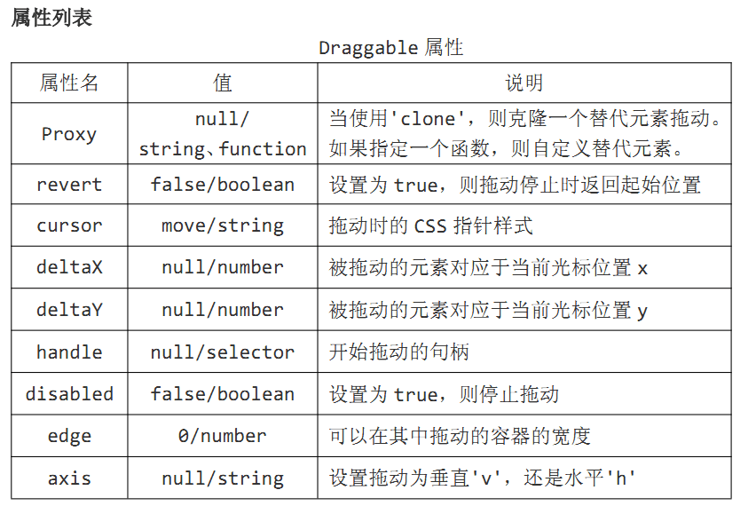
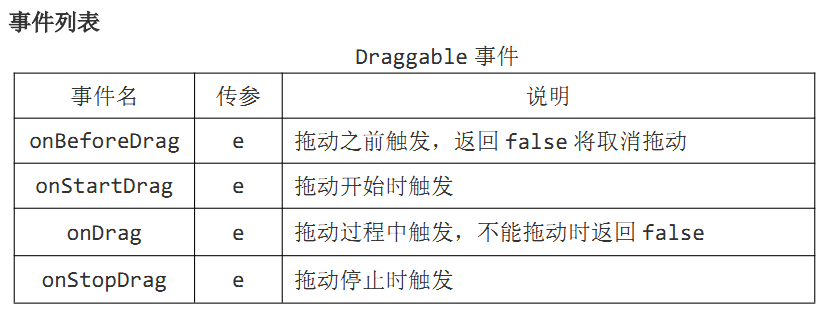

## EasyUI 

### 1.可拖动组件Draggable






#### **JSP文件**

```jsp
<%--
  Created by IntelliJ IDEA.
  User: ooyhao
  Date: 2018/7/29 0029
  Time: 9:21
--%>
<%@ page contentType="text/html;charset=UTF-8" language="java" %>
<html>
<head>
    <title>Combobox下拉框</title>
    <link rel="stylesheet" type="text/css" href="${pageContext.request.contextPath}/easyui/themes/default/easyui.css">
    <link rel="stylesheet" type="text/css" href="${pageContext.request.contextPath}/easyui/themes/icon.css">
    <link rel="stylesheet" type="text/css" href="${pageContext.request.contextPath}/easyui/themes/color.css">
    <script type="text/javascript" src="${pageContext.request.contextPath}/easyui/jquery.min.js"></script>
    <script type="text/javascript" src="${pageContext.request.contextPath}/easyui/jquery.easyui.min.js"></script>
    <script type="text/javascript" src="${pageContext.request.contextPath}/easyui/locale/easyui-lang-zh_CN.js"></script>
    <script type="text/javascript" src="${pageContext.request.contextPath}/js/Draggable.js"></script>
    <style rel="stylesheet" type="text/css">
    </style>
</head>
<body>

    <%--class加载方式--%>
    <%--class="easyui-draggable"--%>
    <div id="box" style="width:400px; height: 200px; background: orange;">
        <div id="content" style="width: 50px;height: 50px; background:red;">内容部分</div>
    </div>

</body>
</html>
```

#### **JS文件**

```js
$(function () {

    // 使用$.fn.draggable.defaults 重写默认值对象。(改变拖动组件的默认值)
    // $.fn.draggable.defaults.cursor = 'text';

    //使用js加载方式
    $("#box").draggable({
//------------------- 属性 ---------------------------
        //设置拖动释放后是否回到原来位置
        // revert:true,
        //设置拖动时鼠标的样式 move(default)/text
        // cursor:"move",
        //设置可执行拖动的区域
        // handle:"#content",
        //设置为不可拖动
        // disabled:true,
        //设置可以拖动的区域离边框的距离
        // edge:50,
        //设置是否只可以水平拖动(h)或是只可以垂直拖动（v）
        // axis:"h",
        //  deltaX deltaY 需与proxy 组合使用
        proxy:"clone",
        //被复制后拖动的元素的左上角距离鼠标光标的位置
        // deltaX:10,
        // deltaY:10,
        /*proxy: function(source){
            console.log(source);
            var p = $('<div style="border:1px solid #ccc;width:400px;height:200px;"></div>');
            p.html($(source).html()).appendTo('body');
            return p;
        },*/
//----------------- 事件 -----------------------
        /*onBeforeDrag : function (e) {
        //返回 false 将取消拖动
            // console.log(e);
            alert("拖动前触发");
        },*/
        onStartDrag : function (e) {
            // alert("拖动开始触发");
            // 如果代理属性被设置则返回该拖动代理元素
            //代理对象是在拖动时才会生成的（代理元素就是其本身）
            console.log($("#box").draggable("proxy"));
        },
        /*onDrag : function (e) {
            alert("拖动过程中触发");
        },*/
        /*onEndDrag : function (e) {
            alert("拖动停止时触发");
        }*/
    });

//------------------- 方法 -------------------
    //返回属性对象
    // console.log($("#box").draggable('options'));
    //设置为不可拖动
    // $("#box").draggable('disable');
    //设置为可以拖动
    // $("#box").draggable('enable');

});
```


**注意**：代理对象是在拖动时才会生成的


### 2.可放置组件Droppable


#### JSP文件

```jsp
<%--
  Created by IntelliJ IDEA.
  User: ooyhao
  Date: 2018/7/29 0029
  Time: 9:21
--%>
<%@ page contentType="text/html;charset=UTF-8" language="java" %>
<html>
<head>
    <title>Droppable</title>
    <link rel="stylesheet" type="text/css" href="${pageContext.request.contextPath}/easyui/themes/default/easyui.css">
    <link rel="stylesheet" type="text/css" href="${pageContext.request.contextPath}/easyui/themes/icon.css">
    <link rel="stylesheet" type="text/css" href="${pageContext.request.contextPath}/easyui/themes/color.css">
    <script type="text/javascript" src="${pageContext.request.contextPath}/easyui/jquery.min.js"></script>
    <script type="text/javascript" src="${pageContext.request.contextPath}/easyui/jquery.easyui.min.js"></script>
    <script type="text/javascript" src="${pageContext.request.contextPath}/easyui/locale/easyui-lang-zh_CN.js"></script>
    <script type="text/javascript" src="${pageContext.request.contextPath}/js/Droppable.js"></script>
    <style rel="stylesheet" type="text/css">
    </style>
</head>
<body>

    <%--class加载方式--%>
    <%--class="easyui-droppable" data-options="accept:'#box',"--%>
    <div id="dd" style="width: 600px; height: 400px; background: black;">

    </div>

    <div id="box" class="easyui-draggable" style="width: 100px; height: 100px;background: #ccc;">

    </div>
    <div id="pox" class="easyui-draggable" style="width: 100px; height: 100px;background: red;">

    </div>
</body>
</html>

```


#### **JS文件**

```js
$(function () {

    // 使用$.fn.droppable.defaults 重写默认值对象。
    $.fn.droppable.defaults.disabled = true;

    $("#dd").droppable({

//------------- 属性 --------------------

        //默认为null，设置哪些元素被接受
        accept:"#box",
        //设置为禁止防止，即不会触发相应的事件
        // disabled:true,

//------------ 事件 ---------------------
        onDragEnter: function (e,source) {
            // alert("拖入时触发");
            $(this).css("background","orange");
        },
        onDragOver: function (e,cource) {
            // alert("经过时触发");
            // $(this).css("background","pink");
        },
        onDragLeave: function (e,source) {
            //拖动组件离开的时候触发
            $(this).css("background","green");
        },
        onDrop: function (e,source) {
            //拖动组件放置的时候触发
            $(this).css("background","#f5f337");
        }

    });
//------------- 方法 --------------------
    //返回属性对象
    console.log($("#dd").droppable("options"));
    //设置为禁用，即为不可放置
    // $("#dd").droppable("disable");
    //设置为启用，即为可放置
    // $("#dd").droppable("enable");

});


```

#### **注意**

- onDragEnter只会触发一次，而onDragOver会在拖动经过的过程中不停的触发
- onDragEnter 先于onDragOver 触发

### 3.Resizable （调整大小组件）


#### **JSP文件**

```jsp
<%--
  Created by IntelliJ IDEA.
  User: ooyhao
  Date: 2018/7/29 0029
  Time: 9:21
--%>
<%@ page contentType="text/html;charset=UTF-8" language="java" %>
<html>
<head>
    <title>Droppable</title>
    <link rel="stylesheet" type="text/css" href="${pageContext.request.contextPath}/easyui/themes/default/easyui.css">
    <link rel="stylesheet" type="text/css" href="${pageContext.request.contextPath}/easyui/themes/icon.css">
    <link rel="stylesheet" type="text/css" href="${pageContext.request.contextPath}/easyui/themes/color.css">
    <script type="text/javascript" src="${pageContext.request.contextPath}/easyui/jquery.min.js"></script>
    <script type="text/javascript" src="${pageContext.request.contextPath}/easyui/jquery.easyui.min.js"></script>
    <script type="text/javascript" src="${pageContext.request.contextPath}/easyui/locale/easyui-lang-zh_CN.js"></script>
    <script type="text/javascript" src="${pageContext.request.contextPath}/js/Resizable.js"></script>
    <style rel="stylesheet" type="text/css">
    </style>
</head>
<body>

    <%--使用class加载方式--%>
    <%--maxWidth:600, maxHeight:400  设置最大高度和最大宽度--%>
  <%--  <div id="rr" class="easyui-resizable"
         data-options="maxWidth:600, maxHeight:400,"
         style="width: 100px; height: 100px; border: 1px solid black;">
    </div>--%>

    <div id="rr" style="width: 100px; height: 100px; border: 1px solid black;">
    </div>

</body>
</html>

```

#### **JS文件**

```js
$(function () {


    //使用$.fn.resizable.defaults 重写默认值对象。
    $.fn.resizable.defaults.disabled = true;

    /*使用js加载方式*/
    $("#rr").resizable({

//-------------- 属性列表 ----------------
        //设置为不可改变大小，即禁用
        // disabled : true,
        //设置可拖动该变大小的方向
        // handles:'e,s',
        minWidth:200,
        minHeight:200,
        maxWidth:400,
        maxHeight:400,
        //设置触发区域离边框的距离
        // edge:20,
//-------------- 事件列表 ----------------
        onStartResize:function (e) {
            // alert("开始改变时触发");
            // $(this).css('background','green');
        },
        onResize: function (e) {
            //改变过程中触发
            // alert("改变过程中触发");
            // $(this).css('background','red');
            //return false; 表示在改变的过程中不是立即改变DOM的大小，而是直接显示停止改变的额结果。
        },
        onStopResize: function (e) {
            // alert("停止改变时触发");
        }


    });
//------------- 方法列表 -----------------
    console.log($("#rr").resizable('options'));
    //禁用
    // $("#rr").resizable('disable');
    //启用
    $("#rr").resizable('enable');

});

```


#### **注意**

onResize 如果返回false，不会立即改变元素的大小，而是直接显示改变停止的结果。

### 4.Tooltip提示框组件


#### **JSP文件 **

```jsp
<%--
  Created by IntelliJ IDEA.
  User: ooyhao
  Date: 2018/7/29 0029
  Time: 9:21
--%>
<%@ page contentType="text/html;charset=UTF-8" language="java" %>
<html>
<head>
    <title>Droppable</title>
    <link rel="stylesheet" type="text/css" href="${pageContext.request.contextPath}/easyui/themes/default/easyui.css">
    <link rel="stylesheet" type="text/css" href="${pageContext.request.contextPath}/easyui/themes/icon.css">
    <link rel="stylesheet" type="text/css" href="${pageContext.request.contextPath}/easyui/themes/color.css">
    <script type="text/javascript" src="${pageContext.request.contextPath}/easyui/jquery.min.js"></script>
    <script type="text/javascript" src="${pageContext.request.contextPath}/easyui/jquery.easyui.min.js"></script>
    <script type="text/javascript" src="${pageContext.request.contextPath}/easyui/locale/easyui-lang-zh_CN.js"></script>
    <script type="text/javascript" src="${pageContext.request.contextPath}/js/Tooltip.js"></script>
    <style rel="stylesheet" type="text/css">
    </style>
</head>
<body style="margin-left: 200px; margin-top: 200px;">

    <%----%>
    <%--<a href="http://www.baidu.com" title="这是一个提示信息！" class="easyui-tooltip">
        HOVER ME
    </a>--%>
    <a href="#" id="box">
        HOVER ME
    </a>
    <br><br><br>
    <button id="showBtn">点击显示提示框</button>
    <button id="hideBtn">点击隐藏提示框</button>
    <button id="destroyBtn">点击销毁提示框</button>
    <button id="repositionBtn">点击改变提示框位置</button>
    <button id="updateBtn">点击改变提示框内容</button>

</body>
</html>

```

#### **JS文件**

```js
$(function () {

    $('#box').tooltip({
//------------- 属性列表 ------------------
        content:"这是可以输入提示内容",
        // position:'top',//bottom(default),left,top,right
        //设置允许提示框跟随鼠标移动,默认为false
        // trackMouse:true,
        //设置提示框距离鼠标的位置
        // deltaX:40,
        // deltaY:20,
        //鼠标进入时显示
        // showEvent:'mouseenter',
        //单击时显示
        // showEvent:'click',
        //鼠标离开时隐藏
        // hideEvent:'mouseleave'
        //双击时隐藏
        // hideEvent:'dblclick',
        //设置延时多少秒显示提示框
        showDelay:200,
        //设置延时多少秒隐藏提示框
        hideDelay:200,

//------------- 事件列表 ---------------
        onShow:function (e) {
            // alert("在显示提示框时触发");
            //返回tip对象。需要tip元素生成之后
            // console.log($('#box').tooltip('tip'));
            //返回箭头元素对象
            $('.tooltip-bottom').css('left',300);
            console.log($('#box').tooltip('arrow'));
        },
        onHide:function (e) {
            // alert("在隐藏提示框时触发");
        },
        onUpdate:function (content) {
            alert("在内容更新时触发，content："+content);
        },
        onPosition: function (left,top) {
            alert("在改变位置时触发：left:"+left+",top:"+top);
        },
        onDestroy:function (none) {
            alert("在提示框销毁时触发");
        }

    });

//-------------- 方法列表 -------------------
    //返回属性对象
    console.log($('#box').tooltip('options'));

    $('#showBtn').click(function () {
        $('#box').tooltip('show');
    });
    $('#hideBtn').click(function () {
        $('#box').tooltip('hide');
    });
    $('#destroyBtn').click(function () {
        $('#box').tooltip('destroy');
    });
    $('#repositionBtn').click(function () {
        //重置提示框位置
        $('#box').tooltip('reposition');
    });
    $('#updateBtn').click(function () {
        $('#box').tooltip('update','内容改变了');
    });


});
```

#### **效果图**


### **5.LinkButton按钮组件**


#### **JSP文件**

```jsp
<%--
  Created by IntelliJ IDEA.
  User: ooyhao
  Date: 2018/7/29 0029
  Time: 9:21
--%>
<%@ page contentType="text/html;charset=UTF-8" language="java" %>
<html>
<head>
    <title>Droppable</title>
    <link rel="stylesheet" type="text/css" href="${pageContext.request.contextPath}/easyui/themes/default/easyui.css">
    <link rel="stylesheet" type="text/css" href="${pageContext.request.contextPath}/easyui/themes/icon.css">
    <link rel="stylesheet" type="text/css" href="${pageContext.request.contextPath}/easyui/themes/color.css">
    <script type="text/javascript" src="${pageContext.request.contextPath}/easyui/jquery.min.js"></script>
    <script type="text/javascript" src="${pageContext.request.contextPath}/easyui/jquery.easyui.min.js"></script>
    <script type="text/javascript" src="${pageContext.request.contextPath}/easyui/locale/easyui-lang-zh_CN.js"></script>
    <script type="text/javascript" src="${pageContext.request.contextPath}/js/LinkButton.js"></script>
    <style rel="stylesheet" type="text/css">
    </style>
</head>
<body style="margin-left: 200px; margin-top: 200px;">

    <%--<a href="#" class="easyui-linkbutton" iconCls="icon-ok">按钮</a>--%>
    <a id="box">

    </a>
    <a id="pox"></a>

    <button id="btn1">
        禁用按钮
    </button>
    <button id="btn2">
        启用按钮
    </button>
    <button id="btn3">
        选择按钮
    </button>
    <button id="btn4">
        取消选择按钮
    </button>

</body>
</html>

```


#### **JS文件**

```js
$(function () {

    //全局修改
    // $.fn.linkbutton.defaults.disabled = true;

    $('#box').linkbutton({

//------------- 属性列表 ---------------
        //将按钮重新定义一个id名称
        // id:'box1',
        //按钮文字
        text:"提交",
        //按钮图标
        iconCls:"icon-save",
        //设置图标的位置 left(默认) right
        iconAlign:'left',
        //禁用按钮
        // disabled:true,
        //设置按钮初始化时是否为选中状态，默认为false
        // selected:false,
        //设置true,则允许用户切换其状态是否被选中，可以实现checkbox复选效果，默认为false
        // toggle:true,
        //要是用单选框效果，需要与toggle配合使用
        // group:'sex',
        //设置扁平化效果，默认为false,
        // plain:true,

    });
//------------- 方法列表 -----------------
    //返回属性对象
    console.log($('#box').linkbutton('options'));

    //禁用按钮
    $("#btn1").click(function () {
        $("#box").linkbutton('disable');
    });

    //启用按钮
    $("#btn2").click(function () {
        $("#box").linkbutton('enable');
    });

    //选择按钮
    $("#btn3").click(function () {
        $("#box").linkbutton('select');
    });

    //取消选择按钮
    $("#btn4").click(function () {
        $("#box").linkbutton('unselect');
    });

    $('#pox').linkbutton({
        text:"取消",
        iconCls:'icon-cancel',
        toggle:true,
        group:'sex',
    });

});


```

#### 效果图


### 6.ProgressBar进度条组件


#### JSP文件

```jsp
<%--
  Created by IntelliJ IDEA.
  User: ooyhao
  Date: 2018/7/29 0029
  Time: 9:21
--%>
<%@ page contentType="text/html;charset=UTF-8" language="java" %>
<html>
<head>
    <title>ProgressBar</title>
    <link rel="stylesheet" type="text/css" href="${pageContext.request.contextPath}/easyui/themes/default/easyui.css">
    <link rel="stylesheet" type="text/css" href="${pageContext.request.contextPath}/easyui/themes/icon.css">
    <link rel="stylesheet" type="text/css" href="${pageContext.request.contextPath}/easyui/themes/color.css">
    <script type="text/javascript" src="${pageContext.request.contextPath}/easyui/jquery.min.js"></script>
    <script type="text/javascript" src="${pageContext.request.contextPath}/easyui/jquery.easyui.min.js"></script>
    <script type="text/javascript" src="${pageContext.request.contextPath}/easyui/locale/easyui-lang-zh_CN.js"></script>
    <script type="text/javascript" src="${pageContext.request.contextPath}/js/ProgressBar.js"></script>
    <style rel="stylesheet" type="text/css">
    </style>
</head>
<body style="text-align: center; margin-top: 200px;">


    <%--Class加载方式实现进度条--%>
    <%--<div class="easyui-progressbar" style="width: 400px;" data-options="value:60,">

    </div>--%>

    <div id="box">

    </div>


    <button id="btn1">
        改变进度条的值
    </button>

    <button id="btn2">
        获得当前进度条的值
    </button>
    <button id="btn3">
        重新设置进度条的长度
     </button>

</body>
</html>
```

#### JS文件

```js
$(function () {


    //全局设置
    $.fn.progressbar.defaults.value = 10;

    $("#box").progressbar({
        //设置进度条的长度,默认auto
        width:400,
        //设置进度条的高度，默认22
        height:22,
        //设置进度条的值，默认0
        // value:60,
        //设置进度条百分比模板
        text:'{value}%',
//----------- 事件列表 -------------------
        onChange:function (newValue,oldValue) {
            console.log('newValue:'+newValue+", oldValue:"+oldValue);
        }

    });


//-------------- 方法列表 -----------------


    //延时执行
    /*setTimeout(function () {
        $('#box').progressbar('setValue',$('#box').progressbar('getValue')+5);
    },1000);
    */

    //循环执行
    setInterval(function () {
        $('#box').progressbar('setValue',$('#box').progressbar('getValue')+1);
    },200);


    //  返回属性对象
    console.log($("#box").progressbar('options'));


    //设置进度条的值
    var j = 0;
    $("#btn1").click(function () {
        $("#box").progressbar('setValue',j++);
    });

    //获得当前进度条的值
    $("#btn2").click(function () {
        alert("当前值为："+$("#box").progressbar('getValue'));
    });

    //重新设置进度条的长度
    $("#btn3").click(function () {
        $("#box").progressbar('resize', 1000);
    });


});
```

#### 效果图


### 7.Panel面板组件


#### JSP文件

```jsp
<%--
  Created by IntelliJ IDEA.
  User: ooyhao
  Date: 2018/7/29 0029
  Time: 9:21
--%>
<%@ page contentType="text/html;charset=UTF-8" language="java" %>
<html>
<head>
    <title>Panel</title>
    <link rel="stylesheet" type="text/css" href="${pageContext.request.contextPath}/easyui/themes/default/easyui.css">
    <link rel="stylesheet" type="text/css" href="${pageContext.request.contextPath}/easyui/themes/icon.css">
    <link rel="stylesheet" type="text/css" href="${pageContext.request.contextPath}/easyui/themes/color.css">
    <script type="text/javascript" src="${pageContext.request.contextPath}/easyui/jquery.min.js"></script>
    <script type="text/javascript" src="${pageContext.request.contextPath}/easyui/jquery.easyui.min.js"></script>
    <script type="text/javascript" src="${pageContext.request.contextPath}/easyui/locale/easyui-lang-zh_CN.js"></script>
    <script type="text/javascript" src="${pageContext.request.contextPath}/js/Panel.js"></script>
    <style rel="stylesheet" type="text/css">
    </style>
</head>
<body>

    <%--class加载方式--%>
   <%--
    <div class="easyui-panel" data-options="closable:true," title="My Panel" style="width: 500px;">
        <p>内容部分</p>
    </div>
--%>
    <button id="btn1">销毁面板</button>
    <button id="btn2">打开面板</button>
    <button id="btn3">关闭面板</button>
    <button id="btn4">刷新面板</button>
    <button id="btn5">重新设置大小</button>
    <button id="btn6">移动面板</button>
    <button id="btn7">最大化面板</button>
    <button id="btn8">最小化面板</button>
    <button id="btn9">从最大化恢复</button>
    <button id="btn10">折叠面板主体</button>
    <button id="btn11">展开面板主体</button>


    <div id="box">
        <p>内容部分</p>
    </div>

    <div id="selector">
        <a class="icon-add" onclick="javascript:alert('add')"></a>
        <a class="icon-edit" onclick="javascript:alert('edit')"></a>
        <a class="icon-cut" onclick="javascript:alert('cut')"></a>
    </div>


</body>
</html>

```

#### JS文件

```js
$(function () {

    $("#box").panel({

//----------- 属性列表 ---------------

        //设置id值
        // id:'panel',
        width:400,
        height:300,
        title:"我的面板",
        iconCls:'icon-search',
        // left:200,
        // top:200,
        //可以进行自定义css的设置，但是可能会涉及到优先级的问题
        cls:'a',
        headerCls:'b',
        bodyCls:'c',
        style:{
          //设置背景颜色没有效果
          // background:'red',
          // 不起作用
          // 'min-height':'500px',
        },
        //自适应
        // fit:true,
        //是否显示面板边框，默认为true，
        border:true,
        //在面板创建时是否重新载入属性，默认为true，
        doSize:true,
        //设置是否不显示头部区域，默认false，
        noheader:false,
        content:"设置面板内容",
        //设置面板是否可以折叠
        collapsible:true,
        //设置面板是否可以最小化
        minimizable:true,
        //设置面板是否可以最大化
        maximizable:true,
        //设置面板是否可以有关闭按钮
        closable:true,
        //数组方式
        tools:[
            {
                iconCls:'icon-save',
                handler:function () {
                    alert("保存");
                }
            },{
                iconCls:'icon-help',
                handler:function () {
                    alert('帮助');
                }
            }
        ],
        /*//使用选择器的方式
        tools:"#selector",*/
        //定义在初始化时是否折叠面板，默认为false，
        collapsed:false,
        //定义在初始化时是否最小化面板，默认为false，
        minimized:false,
        //定义在初始化时是否最大化面板，默认为false，
        maximized:false,
        //定义在初始化时是否关闭面板，默认为false，
        closed:false,
        //从URL读取远程数据并且显示到面板。默认为null，
        href:'http://localhost:8081/easyui/getUsers.action',
        // cache:true,
        loadingMessage:"正在努力加载中...",
        //可以对加载过来的数据进行过滤
        extractor:function (data) {
            // alert(data);
            // return data.substring(1,10);
            return data;
        },

//------------- 事件列表 ------------------
//     (带Before的都可以return false)

        onBeforeLoad:function () {
            // alert("在加载远程数据之前触发");
        },
        onLoad:function () {
            // alert("在加载数据之后触发");
        },
        onBeforeOpen:function () {
            // alert("在打开面板之前触发");
        },
        onOpen:function () {
            // alert("在打开面板之后触发");
        },
        onBeforeClose:function () {
            // alert("在关闭面板之后触发");
        },
        onClose:function () {
            // alert("在关闭面板之后触发");
        },
        onBeforeDestroy:function () {
            // alert("在销毁面板之前触发");
        },
        onDestroy:function () {
            // alert("在销毁面板之后触发");
        },
        onBeforeCollapse:function () {
            // alert("在折叠之前触发");
        },
        onCollapse:function () {
            // alert("在折叠过程中触发");
        },
        onBeforeExpand:function () {
            // alert("在展开前触发");
        },
        onExpand:function () {
            // alert("在展开过程中触发");
        },
        onResize:function (width,height) {
            alert("width:"+width+", height:"+height);
        },
        onMove:function (left,top) {
            alert("left:"+left+", top:"+top);
        },
        onMaximize:function () {
            // alert("窗口最大化后触发");
        },
        onRestore:function () {
            // alert("在窗口恢复原始大小之后触发");
        },
        onMinimize:function () {
            // alert("在窗口最小化后触发");
        }


    });

    //属性设置left和top需要设置定位方式
    $("#box").panel('panel').css('position','absolute');

//--------------- 方法列表 ------------------

    //返回属性对象
    console.log($("#box").panel('options'));
    //返回面板对象
    console.log($("#box").panel('panel'));
    //返回header头部对象
    console.log($("#box").panel('header'));
    //返回body对象
    console.log($("#box").panel('body'));

    //设置面板标题
    $("#box").panel('setTitle','myTitle');

    $("#btn1").click(function () {
        $("#box").panel('destroy');//执行onBeforeDestroy
        // $("#box").panel('destroy',true);//不执行onBeforeDestroy
    });

    $("#btn2").click(function () {
        // $("#box").panel('open');//执行onBeforeOpen
        $("#box").panel('open',true);//不执行onBeforeOpen
    });

    $("#btn3").click(function () {
        // $("#box").panel('close');//执行onBeforeClose
        $("#box").panel('close',true);//不执行onBeforeClose
    });

    $("#btn4").click(function () {
        $("#box").panel('refresh');//不执行onBeforeClose
        // $("#box").panel('refresh',"http://www.baidu.com");//不执行onBeforeClose
    });

    //重新设置面板大小
    $("#btn5").click(function () {
        $("#box").panel('resize',{
            left:100,
            top:100,
            width:250,
            height:250,
        });
    });

    //移动面板
    $("#btn6").click(function () {
        $("#box").panel('move',{
            left:200,
            top:200,
        });
    });

    $("#btn7").click(function () {
        $("#box").panel('maximize');
    });

    $("#btn8").click(function () {
        $("#box").panel('minimize');
    });

    $("#btn9").click(function () {
        $("#box").panel('restore');
    });

    $("#btn10").click(function () {
        $("#box").panel('collapse');
    });

    $("#btn11").click(function () {
        $("#box").panel('expand');
    });

});
```

#### 效果图


### 8.Tabs选项卡组件


#### JSP文件

```jsp
<%--
  Created by IntelliJ IDEA.
  User: ooyhao
  Date: 2018/7/29 0029
  Time: 9:21
--%>
<%@ page contentType="text/html;charset=UTF-8" language="java" %>
<html>
<head>
    <title>Panel</title>
    <link rel="stylesheet" type="text/css" href="${pageContext.request.contextPath}/easyui/themes/default/easyui.css">
    <link rel="stylesheet" type="text/css" href="${pageContext.request.contextPath}/easyui/themes/icon.css">
    <link rel="stylesheet" type="text/css" href="${pageContext.request.contextPath}/easyui/themes/color.css">
    <script type="text/javascript" src="${pageContext.request.contextPath}/easyui/jquery.min.js"></script>
    <script type="text/javascript" src="${pageContext.request.contextPath}/easyui/jquery.easyui.min.js"></script>
    <script type="text/javascript" src="${pageContext.request.contextPath}/easyui/locale/easyui-lang-zh_CN.js"></script>
    <script type="text/javascript" src="${pageContext.request.contextPath}/js/Tabs.js"></script>
    <style rel="stylesheet" type="text/css">
    </style>
</head>
<body>

<%--使用class加载方式--%>
   <%-- <div id="box" class="easyui-tabs" style="width: 500px; height: 250px;">
        <div title="Tab1">
            TAB1
        </div>
        <div title="Tab2" data-options="closable:true,">
            TAB2
        </div>
        <div title="Tab3" data-options="iconCls:'icon-reload',closable:true">
            TAB3
        </div>
    </div>--%>

    <div id="box">
        <div title="Tab1" style="padding: 10px;">
            TAB1
        </div>
        <div title="Tab2" id="tab2" style="padding: 10px;" data-options="closable:true,">
            TAB2
        </div>
        <div title="Tab3" style="padding: 10px;"  data-options="closable:true,">
            TAB3
        </div>
    </div>


    <button id="btn1">添加选项卡</button>
    <button id="btn2">关闭第二个选项卡</button>
    <button id="btn3">获取第三个选项卡</button>
    <button id="btn4">获取title为Tab1的选项卡的索引</button>
    <button id="btn5">获取选择的选项卡面板</button>
    <button id="btn6">选择第二个面板</button>
    <button id="btn7">取消选择第二个面板</button>
    <button id="btn8">显示选项卡的标签头</button>
    <button id="btn9">隐藏选项卡的标签头</button>
<br><br>
    <button id="btn10">判断Tab2选项卡是否存在</button>
    <button id="btn11">更新第一个选项卡</button>
    <button id="btn12">禁用第三个选项卡</button>
    <button id="btn13">启用第三个选项卡</button>
    <button id="btn14">滚动选项卡</button>


</body>
</html>
```


#### JS文件

```js
$(function () {

    $("#box").tabs({
//---------- 属性列表 --------------
        width:600,
        height:400,
        //设置是否显示控制面板背景
        plain:false,
        //选项卡的大小将铺满它所在的容器，默认为false
        fit:false,
        //设置是否显示选项卡的边框，默认为true，
        border:true,
        // tabWidth:300,
        //选项卡滚动条每次滚动的像素值
        // scrollIncrement:100,
        //每次滚动持续的动画事件
        // scrollDuration:100,
        //tab选项卡的宽和高
        tabWidth:100,
        tabHeight:30,
        //设置选项卡的位置 left right top bottom
        tabPosition:'top',
        //header tab选项卡所在的位置的宽度，只要在tabPosition为left或right时有效
        // headerWidth:50,
        //初始化时选中那个tab，默认为0，【0,1,2...】
        selected:0,
        //设置是否显示选项卡头部，默认为true，
        showHeader:true,
        //通过数组，也可以通过选择器
        tools:[
            {
                iconCls:'icon-add',
                handler:function () {
                    alert("add");
                }
            },{
                iconCls:'icon-remove',
                handler:function () {
                    alert("删除");
                }
            }
        ],
        //工具栏的位置：left，right
        toolPosition:'right',

//--------------- 事件列表 ------------------
        //选中某一个选项卡时触发。
        onSelect:function (title,index) {
            // alert("title:"+title+", index:"+index);
        },
        //释放某一个选中卡时触发
        onUnselect:function (title,index) {
            // alert("title:"+title+", index:"+index);
        },
        //关闭选项卡之前触发
        onBeforeClose:function (title,index) {
            // alert("title:"+title+",index:"+index);
        },
        //关闭选项卡之后触发
        onClose:function (title,index) {
            alert("title:"+title+",index:"+index);
        },
        //鼠标右击某个选项卡时触发
        onContextMenu:function (e,title,index) {
            console.log(e);
            console.log(title);
            console.log(index);
        },
        onLoad:function (panel) {
            console.log("在加载时触发");
            console.log(panel);
        },
        onAdd:function (title,index) {
            alert("添加选项卡时触发,title:"+title+", index:"+index);
        },
        onUpdate:function (title,index) {
            alert("选项卡更新时触发");
        }


    });

// ------------ 方法列表 ---------------
    //返回属性对象
    console.log($('#box').tabs('options'));
    //返回所有选项卡面板
    console.log($("#box").tabs('tabs'));
    //重置容器和选项卡的大小
    $("#box").tabs('resize');

    //添加一个选项卡
    $("#btn1").click(function () {
        $("#box").tabs('add',{
            title:"new tab",
            //设置选项卡是否可以折叠
            collapsible:true,
            //设置为选中状态
            selected:true,
            //设置是否可以关闭
            closable:true,
            href:'http://localhost:8081/easyui/getUsers.action',
            iconCls:'icon-add',
        });
    });

    //关闭选项卡
    $("#btn2").click(function () {
        //关闭选项卡，参数可以是index，也可以是title
        $("#box").tabs('close',1);
        // $("#box").tabs('close','Tab2');
    });

    //获取指定选项卡
    $("#btn3").click(function () {
        //获取选选项卡，参数可以是index，也可以是title
        console.log($("#box").tabs('getTab',2));
    });

    //获取选项卡的索引
    $("#btn4").click(function () {
        //获取选选项卡，参数可以是index，也可以是title
        alert($('#box').tabs('getTabIndex',$('#box').tabs('getTab','Tab1')));
    });

    //获取选择的选项卡面板
    $("#btn5").click(function () {
        console.log($('#box').tabs('getSelected'));
    });

    //选择面板
    $("#btn6").click(function () {
        $('#box').tabs('select','Tab2');
    });

    //取消选择面板
    $("#btn7").click(function () {
        $('#box').tabs('unselect','Tab2');
    });

    //显示选项卡的标签头
    $("#btn8").click(function () {
        $('#box').tabs('showHeader');
    });

    //隐藏选项卡的标签头
    $("#btn9").click(function () {
        $('#box').tabs('hideHeader');
    });

    //判断指定选项卡是否存在（参数可以是title或index）
    $("#btn10").click(function () {
        alert($('#box').tabs('exists','Tab2'));
    });

    //更新面板
    $("#btn11").click(function () {
        $('#box').tabs('update',{
            tab:$('#box').tabs('getTab',0),
            options:{
                title:"更新标题",
            }
        });
    });

    //禁用指定选项卡（参数可以是title或index）
    $("#btn12").click(function () {
        $('#box').tabs('disableTab','Tab3');
    });

    //启用指定选项卡（参数可以是title或index）
    $("#btn13").click(function () {
        $('#box').tabs('enableTab','Tab3');
    });


    $("#btn14").click(function () {
        $('#box').tabs('scrollBy',100);
    });

});
```

#### 效果图


### 9.Accordion分类组件


#### **JSP文件**

```jsp
<%--
  Created by IntelliJ IDEA.
  User: ooyhao
  Date: 2018/7/29 0029
  Time: 9:21
--%>
<%@ page contentType="text/html;charset=UTF-8" language="java" %>
<html>
<head>
    <title>Panel</title>
    <link rel="stylesheet" type="text/css" href="${pageContext.request.contextPath}/easyui/themes/default/easyui.css">
    <link rel="stylesheet" type="text/css" href="${pageContext.request.contextPath}/easyui/themes/icon.css">
    <link rel="stylesheet" type="text/css" href="${pageContext.request.contextPath}/easyui/themes/color.css">
    <script type="text/javascript" src="${pageContext.request.contextPath}/easyui/jquery.min.js"></script>
    <script type="text/javascript" src="${pageContext.request.contextPath}/easyui/jquery.easyui.min.js"></script>
    <script type="text/javascript" src="${pageContext.request.contextPath}/easyui/locale/easyui-lang-zh_CN.js"></script>
    <script type="text/javascript" src="${pageContext.request.contextPath}/js/Accordion.js"></script>
    <style rel="stylesheet" type="text/css">
    </style>
</head>
<body>

    <%--Class加载方式--%>
    <%--<div class="easyui-accordion" style="width:300px; height: 200px;">
        <div title="accordion1">accordion1</div>
        <div title="accordion2">accordion2</div>
        <div title="accordion3">accordion3</div>
    </div>--%>

    <div id="box">
        <div title="accordion1">accordion1</div>
        <div title="accordion2">accordion2</div>
        <div title="accordion3">accordion3</div>
    </div>


    <button id="btn1">获得所有选中的面板</button>
    <button id="btn2">获得面板索引</button>
    <button id="btn3">选中第二块面板</button>
    <button id="btn4">添加一块面板</button>
    <button id="btn5">移除一块面板</button>

</body>
</html>
```


#### **JS文件**

```js
$(function () {

    $("#box").accordion({

//----------- 属性列表 -----------------

        //设置容器的宽和高 默认为auto
        width:300,
        height:'auto',
        //设置true则是适应父容器，默认false,
        fit:false,
        //设置是否显示边框，默认为true
        border:true,
        //设置展示和折叠时是否显示动画效果，默认为true
        animate:true,
        //设置是否允许同时开展多个，默认为false
        multiple:false,
        //设置初始化时展开哪个面板，参数为索引
        selected:0,

//------------- 事件列表 -----------------
        //选中时执行
        onSelect:function (title,index) {
            // alert("onSelect: title:"+title+", index:"+index);
        },
        //取消选中时执行
        onUnselect:function (title,index) {
            // alert("onUnselect: title:"+title+", index:"+index);
        },
        onAdd:function (title,index) {
            alert("onAdd: title:" + title + ", index:" + index);
        },
        onBeforeRemove:function (title,index) {
            alert("onBeforeRemove: title:"+title+", index:"+index);
        },
        onRemove:function (title,index) {
            alert("onRemove: title:"+title+", index:"+index);
        }


    });


//------------- 方法列表 ----------------
//     console.log($("#box").accordion('options'));
    //返回所有面板
    // console.log($("#box").accordion('panels'));
    //调整分类组件的大小
    $("#box").accordion('resize');
    console.log($("#box").accordion('getSelected'));

    //获得所有选中的面板
    $("#btn1").click(function () {
        console.log($("#box").accordion("getSelections"));
    });

    //获得面板的下标
    $("#btn2").click(function () {
        //通过下标或名称获得面板后获得其索引 参数可以是title或index
        // alert($("#box").accordion('getPanelIndex',$("#box").accordion('getPanel',0)));
        //获得选中面板的下标
        alert($("#box").accordion('getPanelIndex',$("#box").accordion('getSelected')));
    });


    //选中指定面板
    $("#btn3").click(function () {
        //选中某块面板，参数可以是index，或是title
        // $("#box").accordion('select',1);
        $("#box").accordion('select','accordion2');
    });

    //新增面板
    $("#btn4").click(function () {

        $("#box").accordion('add',{
            title:"New Panel",
            content:"新增面板",
            //实现关闭按钮，可关闭
            closable:true,
            //默认选中
            selected:false,
            //显示折叠按钮
            collapsible:true,
        });
    });

    //删除
    $("#btn5").click(function () {
        //选中某块面板，参数可以是index，或是title
        $("#box").accordion('remove','accordion2');
    });


});
```

#### 效果图


### 10.Layout布局组件 

#### **注意**

这个组件一般是直接用class方式直接配合body使用


#### **JSP文件**

```jsp
<%--
  Created by IntelliJ IDEA.
  User: ooyhao
  Date: 2018/7/29 0029
  Time: 9:21
--%>
<%@ page contentType="text/html;charset=UTF-8" language="java" %>
<html>
<head>
    <title>Panel</title>
    <link rel="stylesheet" type="text/css" href="${pageContext.request.contextPath}/easyui/themes/default/easyui.css">
    <link rel="stylesheet" type="text/css" href="${pageContext.request.contextPath}/easyui/themes/icon.css">
    <link rel="stylesheet" type="text/css" href="${pageContext.request.contextPath}/easyui/themes/color.css">
    <script type="text/javascript" src="${pageContext.request.contextPath}/easyui/jquery.min.js"></script>
    <script type="text/javascript" src="${pageContext.request.contextPath}/easyui/jquery.easyui.min.js"></script>
    <script type="text/javascript" src="${pageContext.request.contextPath}/easyui/locale/easyui-lang-zh_CN.js"></script>
    <script type="text/javascript" src="${pageContext.request.contextPath}/js/Layout.js"></script>
    <style rel="stylesheet" type="text/css">
    </style>
</head>
<%--<body class="easyui-layout">--%>
<body>


    <%--一般是直接定义在body中--%>
    <div id="box" style="width: 600px; height: 400px;">
        <%--一般是使用class方式来定义布局--%>

        <div data-options="
            region:'north',
            title:'north title',
            split:true,
            <%--是否显示边框--%>
            border:true,
            iconCls:'icon-cut',
            href:'http://localhost:8081/easyui/getUsers.action',
            <%--设置是否可以折叠--%>
            collapsible:true,
            minWidth:20,
            minHeight:20,
            maxWidth:600,
            maxHeight:200,
            "
             style="height: 100px;"></div>
        <div data-options="region:'south',title:'south title', split:true," style="height: 100px;"></div>
        <div data-options="region:'east',title:'east title' ,split:true," style="width: 100px;"></div>
        <div data-options="region:'west',title:'west title' ,split:true," style="width: 100px;"></div>
        <div data-options="region:'center',title:'center title', split:true," style="padding:5px; background: #ccc"></div>
    </div>

    <%--class加载方式--%>

    <%--<div class="easyui-layout" style="width: 600px; height: 400px;">
            <div data-options="region:'north',title:'north title', split:true," style="height: 100px;"></div>
            <div data-options="region:'south',title:'south title', split:true," style="height: 100px;"></div>
            <div data-options="region:'east',title:'east title' ,split:true," style="width: 100px;"></div>
            <div data-options="region:'west',title:'west title' ,split:true," style="width: 100px;"></div>
            <div data-options="region:'center',title:'center title', split:true," style="padding:5px; background: #ccc"></div>
        </div>--%>

</body>
</html>
```


#### JS文件

```js
$(function () {

    $("#box").layout({
        //设置布局的宽高
        // width:500,
        // height:500,
        //自动适应父容器
        // fit:true,


    }).css('display','none');
    $("#box").layout({}).css('display','block');
    $("#box").layout('resize');
    // $("#box").layout('collapse','east');
    // $("#box").layout('expand','east');
    $("#box").layout('remove','west');//值可以去north,south,east,west
    $(document).click(function () {
        // $("#box").layout({}).css('display','block');
        // $("#box").layout('resize');
        // console.log($("#box").layout('panel','east'));
        $("#box").layout('add',{
            region:'west',
            title:'新增面板',
            width:100,
        })

    });


});
```

#### 效果图


### 11.Window窗口组件

#### 注意

```
使用$.fn.window.defaults 重写默认值对象。
     window 组件最强大的地方就是可以内部布局和添加 linkbutton。
     具体布局方法如下：
     1.外部用 window组件包裹一下；
     2.内部用 layout 组件左右各分配一个，底部分配一个；
     3.底部添加一个按钮即可。
```


#### JSP文件

```jsp
<%--
  Created by IntelliJ IDEA.
  User: ooyhao
  Date: 2018/7/29 0029
  Time: 9:21
--%>
<%@ page contentType="text/html;charset=UTF-8" language="java" %>
<html>
<head>
    <title>Panel</title>
    <link rel="stylesheet" type="text/css" href="${pageContext.request.contextPath}/easyui/themes/default/easyui.css">
    <link rel="stylesheet" type="text/css" href="${pageContext.request.contextPath}/easyui/themes/icon.css">
    <link rel="stylesheet" type="text/css" href="${pageContext.request.contextPath}/easyui/themes/color.css">
    <script type="text/javascript" src="${pageContext.request.contextPath}/easyui/jquery.min.js"></script>
    <script type="text/javascript" src="${pageContext.request.contextPath}/easyui/jquery.easyui.min.js"></script>
    <script type="text/javascript" src="${pageContext.request.contextPath}/easyui/locale/easyui-lang-zh_CN.js"></script>
    <script type="text/javascript" src="${pageContext.request.contextPath}/js/Window.js"></script>
    <style rel="stylesheet" type="text/css">
    </style>
</head>
<body>

    <%--使用class加载方式加载--%>
    <%--<div class="easyui-window" title="my window" style="width:600px; height: 400px;"
        data-options="iconCls:'icon-save',modal:true"
        >
        窗口
    </div>--%>
   <%-- <div id="box">
        窗口
    </div>--%>

    <%--使用窗口进行布局--%>
    <div class="easyui-window" style="width: 400px; height: 250px;">
        <div class="easyui-layout" data-options="fit:true">
            <div data-options="region:'west',width:100,split:true" >左</div>
            <div data-options="region:'center',height:100,split:true,">中</div>
            <div style="text-align: right" data-options="region:'south',height:40,split:true, border:false,">
                <a class="easyui-linkbutton" data-options="iconCls:'icon-ok'">确认</a>
                <a class="easyui-linkbutton" data-options="iconCls:'icon-cancel'">取消</a>
            </div>
        </div>
    </div>

</body>
</html>
```

#### JS文件

```js
$(function () {

    $("#box").window({

// ----------- 属性列表 ----------
        width:300,
        height:200,
        title:"我的窗口",
        iconCls:'icon-cut',
        //设置是否为模态框
        modal:true,
        //是否可折叠，默认true，
        // collapsible:false,
        //是否可最小化，默认true，
        // minimizable:false,
        //是否可最大化，默认true，
        // maximizable:false,
        //是否可关闭，默认true，
        // closable:false,
        //初始化时是否处于关闭状态,默认为false，
        // closed:false,
        //z轴的坐标，即层叠的优先级，默认9000
        zIndex:9000,
        //定义是否可以拖动窗口
        draggable:true,
        //定义是否可以改变窗口大小
        resizable:true,
        //定义是否显示阴影效果
        shadow:true,
        //定义如何布局窗口，如果为true，窗口将显示在它的父容器中，否则将显示在所有元素之上
        inline:false,

//-------------- 事件列表完全继承自panel面板 -----------------

    });

//-------------- 方法列表 -------------
//     console.log($("#box").window('window'));
//     console.log($("#box").window('body'));
    $(document).click(function () {
        //仅水平居中
        // $("#box").window('hcenter');
        //仅垂直居中
        // $("#box").window('vcenter');
        //水平垂直同时居中
        $("#box").window('center');
    });

});

/**
     使用$.fn.window.defaults 重写默认值对象。
     window 组件最强大的地方就是可以内部布局和添加 linkbutton。
     具体布局方法如下：
     1.外部用 window组件包裹一下；
     2.内部用 layout 组件左右各分配一个，底部分配一个；
     3.底部添加一个按钮即可。
 */
```


#### window效果图


#### 布局效果图


### 12.Dialog对话框组件


#### JSP文件

```jsp
<%--
  Created by IntelliJ IDEA.
  User: ooyhao
  Date: 2018/7/29 0029
  Time: 9:21
--%>
<%@ page contentType="text/html;charset=UTF-8" language="java" %>
<html>
<head>
    <title>Dialog</title>
    <link rel="stylesheet" type="text/css" href="${pageContext.request.contextPath}/easyui/themes/default/easyui.css">
    <link rel="stylesheet" type="text/css" href="${pageContext.request.contextPath}/easyui/themes/icon.css">
    <link rel="stylesheet" type="text/css" href="${pageContext.request.contextPath}/easyui/themes/color.css">
    <script type="text/javascript" src="${pageContext.request.contextPath}/easyui/jquery.min.js"></script>
    <script type="text/javascript" src="${pageContext.request.contextPath}/easyui/jquery.easyui.min.js"></script>
    <script type="text/javascript" src="${pageContext.request.contextPath}/easyui/locale/easyui-lang-zh_CN.js"></script>
    <script type="text/javascript" src="${pageContext.request.contextPath}/js/Dialog.js"></script>
    <style rel="stylesheet" type="text/css">
    </style>
</head>
<body>

    <%--Class加载方式--%>
  <%--  <div class="easyui-dialog" title="My Dialog"
         style="width:400px;height:200px;"
        data-options="iconCls:'icon-save',resizable:true,modal:true"
    >
        对话框
    </div>--%>

    <div id="box">

    </div>

</body>
</html>
```

#### JS文件

```js
$(function () {
    $("#box").dialog({
        width:400,
        height:250,
        title:'对话框',
        content:'内容',
        modal:true,
        shadow:true,
        //以下四个默认都为false
        collapsible:true,
        minimizable:true,
        maximizable:true,
        resizable:true,
        //可以使用选择器方式
        toolbar:[
            {
                text:'保存',
                iconCls:'icon-save',
                handler:function () {
                    alert("保存");
                }
            },{
                text:'删除',
                iconCls:'icon-remove',
                handler:function () {
                    alert("删除");
                }

            }

        ],
        buttons:[
            {
                text:'ok',
                iconCls:'icon-ok',
                handler:function () {
                    alert("ok");
                }
            },{
                text:'cancel',
                iconCls:'icon-cancel',
                handler:function () {
                    alert("cancel");
                }
            }
        ],
    });
    //返回对话框窗口对象
    console.log($("#box").dialog('dialog'));
    console.log($("#box").dialog('body'));
});
```


#### 效果图


### 13.Messager消息窗口组件

```
加载方式：
	消息窗口提供了不同的消息框风格，包含 alert(警告框)、confirm(确认框)、
prompt(提示框)、progress(进度框)等。所有消息框都是异步的，用户可以在交互消息之
后使用回调函数去处理结果。
由于这个组件的特殊性，没有 class 加载方式，全部在 JS 端完成！
```


#### 1.警告框

```
//使用警告框，四个参数均为可选
$.messager.alert('警告框','这是一个信息框','info', function () {
	alert('确认后的回调！');
});

显示警告窗口。参数：
title：在头部面板显示的标题文本。
msg：显示的消息文本。
icon：显示的图标图像。可用值有：error,question,info,warning。
fn: 在窗口关闭的时候触发该回调函数。
```

#### 2.确认框

```
//使用确认框，三个参数均可选
$.messager.confirm('确认对话框','你真的要删除吗？', function (flag) {
    if (flag) {
    	alert('删除成功！');
    }
});

显示一个包含“确定”和“取消”按钮的确认消息窗口。参数：
title：在头部面板显示的标题文本。
msg：显示的消息文本。
fn(b): 当用户点击“确定”按钮的时侯将传递一个 true 值给回调函数，否则传递一个
false 值。
```

#### 3.提示输入框

```
//使用提示框，三个参数均可选
$.messager.prompt('提示信息','请输入你的名字：', function (flag) {
    if (flag) {
    	alert(flag);
    }
});

显示一个用户可以输入文本的并且带“确定”和“取消”按钮的消息窗体。参数：
title：在头部面板显示的标题文本。
msg：显示的消息文本。
n(val): 在用户输入一个值参数的时候执行的回调函数。
```

#### 4.进度条框

```
//进度条信息
$.messager.progress({
    title : '执行中',
    msg : '努力加载中...',
    text : '{value}%',
    interval : 100,
});

显示一个进度消息窗体。
属性定义为：
title：在头部面板显示的标题文本。默认：空。
msg：显示的消息文本。默认：空。
text：在进度条上显示的文本。默认：undefined。
interval：每次进度更新的间隔时间。默认：300 毫秒。
方法定义为：
bar：获取进度条对象。$.messager.progress('bar');
close：关闭进度窗口。$.messager.progress('close');
```

#### 5.消息框

```
//使用消息框
$.messager.show({
    title : '我的消息',
    msg : '消息在 5 秒后关闭',
    timeout : 5000,
    showType : 'slide',
});

在屏幕右下角显示一条消息窗口。该选项参数是一个可配置的对象：
showType： 定义将如何显示该消息。 可用值有： null,slide,fade,show。 默认： slide。
showSpeed：定义窗口显示的过度时间。默认：600 毫秒。
width：定义消息窗口的宽度。默认：250px。
height：定义消息窗口的高度。默认：100px。
title：在头部面板显示的标题文本。
msg：显示的消息文本。
style：定义消息窗体的自定义样式。
timeout：如果定义为 0，消息窗体将不会自动关闭，除非用户关闭他。如果定义成非
0 的树，消息窗体将在超时后自动关闭。默认：4 秒。


//将消息框显示在顶部
$.messager.show({
title : '我的消息',
msg : '消息在 5 秒后关闭',
timeout : 5000,
showType : 'slide',
style:{
top : 0,
}
});
```

#### JSP文件

此处由于messager组件没有class加载方式，所以没有jsp文件

#### JS文件

```js
$(function () {

    //属性设置
    // $.messager.defaults = {ok:'是',cancel:'否'};


    //方法列表

    //消息显示
    $.messager.show({
        title:'消息',
        msg:'消息在2秒后关闭',
        timeout:2000,
        showType:'show',//null,slide,show,fade,默认slide
        style:{
            top:0,
        }
    });


    //信息框
    /*$.messager.alert('警告框','这是一个信息框','info',function () {
        alert("确认后回调");
    });*/
    //错误框
    /*$.messager.alert('警告框','这是一个信息框','error',function () {
        alert("确认后回调");
    });*/
    //问题框
    /*$.messager.alert('警告框','这是一个信息框','question',function () {
        alert("确认后回调");
    });*/
    //警告框
    /*$.messager.alert('警告框','这是一个信息框','warning',function () {
        alert("确认后回调");
    });*/


    //确认框
    /*$.messager.confirm('确定对话框','确定要删除吗?',function (flag) {
        // alert(flag);true,false
        if(flag == true){
            alert("确认");
        }else{
            alert("取消");
        }
    });*/


    //提示输入框
   /* $.messager.prompt('提示信息','请输入您的姓名：',function (flag) {
        // alert(flag);内容
       if(flag){
            alert(flag);
       }
    });*/

   $.messager.progress({
        title:'执行中',
        msg:'努力加载中...',
        text:'{value}%',
        interval:1000,
    });

  // console.log($.messager.progress('bar'));
    $(document).click(function () {
        //关闭进度条窗口
        $.messager.progress('close');
    });


});
```

#### 效果图

**alert**


**confirm**


**prompt**


**progress**


**show**


### 14.Menu菜单组件


#### JSP文件

```jsp
<%--
  Created by IntelliJ IDEA.
  User: ooyhao
  Date: 2018/7/29 0029
  Time: 9:21
--%>
<%@ page contentType="text/html;charset=UTF-8" language="java" %>
<html>
<head>
    <title>Menu</title>
    <link rel="stylesheet" type="text/css" href="${pageContext.request.contextPath}/easyui/themes/default/easyui.css">
    <link rel="stylesheet" type="text/css" href="${pageContext.request.contextPath}/easyui/themes/icon.css">
    <link rel="stylesheet" type="text/css" href="${pageContext.request.contextPath}/easyui/themes/color.css">
    <script type="text/javascript" src="${pageContext.request.contextPath}/easyui/jquery.min.js"></script>
    <script type="text/javascript" src="${pageContext.request.contextPath}/easyui/jquery.easyui.min.js"></script>
    <script type="text/javascript" src="${pageContext.request.contextPath}/easyui/locale/easyui-lang-zh_CN.js"></script>
    <script type="text/javascript" src="${pageContext.request.contextPath}/js/Menu.js"></script>
    <style rel="stylesheet" type="text/css">
    </style>
</head>
<body>

    <button id="btn1">右击显示菜单</button>
    <br><br><br><br><br><br><br><br>
    <button id="btn2">点击显示菜单</button>
    <button id="btn3">点击关闭菜单</button>
    <button id="btn4">点击销毁菜单</button>
    <button id="btn5">获得DOM指定菜单项</button>
    <button id="btn6">点击修改文本</button>
    <br><br>
    <button id="btn7">点击修改图标</button>
    <button id="btn8">通过名称获得指定节点</button>
    <button id="btn9">添加一个子项</button>
    <button id="btn10">移除一个子项</button>
    <button id="btn11">禁用一个菜单</button>
    <button id="btn12">启用一个菜单</button>

    <div id="box" class="easyui-menu" style="width:120px;">
        <div id="new">新建</div>
        <%--禁用菜单项--%>
        <%--data-options="disabled:true,"--%>
        <div >
            <span>打开</span>
            <div style="width: 150px;">
                <div>Word</div>
                <div>Excel</div>
                <div>Powerpoint</div>
            </div>
        </div>
        <div data-options="iconCls:'icon-save'">保存</div>
        <div class="menu-sep"></div><%--分割线--%>
        <div>退出</div>
    </div>


</body>
</html>
```

#### JS文件

```js
$(function () {
    //禁用系统自带的右击菜单
    // e.preventDefault();
    $("#box").menu({

        left:100,
        top:100,
        minWidth:200,
        //当鼠标离开菜单区域是隐藏，默认为true，
        hideOnUnhover:true,

//---------- 事件列表 ---------------

        onShow:function () {
            // alert("显示时触发");
        },
        onHide:function () {
            // alert("隐藏时触发");
        },
        onClick:function (item) {
            // alert("点击时触发:"+item.text);
        }

    });


    //返回属性对象
    console.log($('#box').menu('options'));
    //显示菜单


    $("#btn1").on('contextmenu',function (e) {
        //禁用系统自带的右击菜单
        e.preventDefault();
        $("#box").menu('show',{
            // left:e.pageX,
            // top:e.pageY,
        });
    });


    $("#btn2").click(function () {
        $('#box').menu('show',{
            left:0,
            top:0,
        });
    });
    $("#btn3").click(function () {
        $('#box').menu('hide');
    });

    $("#btn4").click(function () {
        $('#box').menu('destroy');
    });

    $("#btn5").click(function () {
        console.log($('#box').menu('getItem',$("#new")));
    });

    $("#btn6").click(function () {
        $('#box').menu('setText',{
            target: "#new",
            text:"请新建哦",
        });
    });

    $("#btn7").click(function () {
        $('#box').menu('setIcon',{
            target: "#new",
            iconCls:"icon-add",
        });
    });

    $("#btn8").click(function () {
        console.log($('#box').menu('findItem','新建'));
    });
    $("#btn9").click(function () {
        $('#box').menu('appendItem',{
            id:'cut',
            text:'剪切',
            iconCls:'icon-cut',
            onclick:function () {
                alert("点击事件");
            }
        });
    });
    $("#btn10").click(function () {
        $('#box').menu('removeItem','#cut');
    });

    $("#btn11").click(function () {
        $('#box').menu('disableItem','#cut');
    });

    $("#btn12").click(function () {
        $('#box').menu('enableItem','#cut');
    });

});
```

#### 效果图


### 15.MenuButton菜单按钮组件


#### JSP文件

```jsp
<%--
  Created by IntelliJ IDEA.
  User: ooyhao
  Date: 2018/7/29 0029
  Time: 9:21
--%>
<%@ page contentType="text/html;charset=UTF-8" language="java" %>
<html>
<head>
    <title>MenuButton</title>
    <link rel="stylesheet" type="text/css" href="${pageContext.request.contextPath}/easyui/themes/default/easyui.css">
    <link rel="stylesheet" type="text/css" href="${pageContext.request.contextPath}/easyui/themes/icon.css">
    <link rel="stylesheet" type="text/css" href="${pageContext.request.contextPath}/easyui/themes/color.css">
    <script type="text/javascript" src="${pageContext.request.contextPath}/easyui/jquery.min.js"></script>
    <script type="text/javascript" src="${pageContext.request.contextPath}/easyui/jquery.easyui.min.js"></script>
    <script type="text/javascript" src="${pageContext.request.contextPath}/easyui/locale/easyui-lang-zh_CN.js"></script>
    <script type="text/javascript" src="${pageContext.request.contextPath}/js/MenuButton.js"></script>
    <style rel="stylesheet" type="text/css">
    </style>
</head>
<body>
    <%--class加载方式--%>
   <%-- <a href="javascript:void(0)" id="edit"
         class="easyui-menubutton"
       data-options="menu:'#box',iconCls:'icon-edit'">编辑</a>--%>
    <a href="javascript:void(0)" id="edit">编辑</a>


    <div id="box" style="width: 150px;">
        <div data-options="iconCls:'icon-undo'">撤销</div>
        <div data-options="iconCls:'icon-redo'">恢复</div>
        <div class="menu-sep"></div>
        <div>剪切</div>

        <div>复制
            <div>
                <div>复制复制</div>
            </div>
        </div>

        <div>粘贴</div>
        <div class="menu-sep"></div>
        <div data-options="iconCls:'icon-remove'">删除</div>
        <div>全选</div>
    </div>


</body>
</html>
```


#### JS文件

```js
$(function () {

    $('#edit').menubutton({
        iconCls:'icon-edit',
        menu:'#box',
        //默认为true，
        plain:false,
        //鼠标滑过按钮时显示菜单的持续时间
        duration:100,
        //其他属性继承自LinkButton，可以参考LinkButton
        // disabled:true,
    });
    //禁用菜单项
    $('#edit').menubutton('disable');
    //启用菜单项
    $('#edit').menubutton('enable');
    $(document).click(function () {
        //返回属性对象
        // console.log($('#edit').menubutton('options'));
        //销毁按钮
        $('#edit').menubutton('destroy');
    });


});
```

#### 效果图


### 16.SplitButton分割按钮组件

与MenuButton相似，只是悬浮右边的下三角才能触发，方法和属性一直，此处就不列出

#### 效果图


### 17.Pagination分页组件

#### 注意

这个组件需要配合后台实现，老规矩，使用SSM


#### JSP文件

```jsp
<%--
  Created by IntelliJ IDEA.
  User: ooyhao
  Date: 2018/7/29 0029
  Time: 9:21
--%>
<%@ page contentType="text/html;charset=UTF-8" language="java" %>
<html>
<head>
    <title>Pagination</title>
    <link rel="stylesheet" type="text/css" href="${pageContext.request.contextPath}/easyui/themes/default/easyui.css">
    <link rel="stylesheet" type="text/css" href="${pageContext.request.contextPath}/easyui/themes/icon.css">
    <link rel="stylesheet" type="text/css" href="${pageContext.request.contextPath}/easyui/themes/color.css">
    <script type="text/javascript" src="${pageContext.request.contextPath}/easyui/jquery.min.js"></script>
    <script type="text/javascript" src="${pageContext.request.contextPath}/easyui/jquery.easyui.min.js"></script>
    <script type="text/javascript" src="${pageContext.request.contextPath}/easyui/locale/easyui-lang-zh_CN.js"></script>
    <script type="text/javascript" src="${pageContext.request.contextPath}/js/Pagination.js"></script>
    <style rel="stylesheet" type="text/css">
    </style>
</head>
<body>

    <%--class加载方式--%>
    <%--<div id="box" class="easyui-pagination" data-options="total:2000,pageSize:10"
         style="background: #efefef;border: 1px solid #ccc;">
    </div>
--%>
    <div id="content" class="easyui-panel"
         style="height: 250px;"
        data-options="href:'http://localhost:8081/easyui/getUserByPagination.action?page=1&pageSize=2'"
    >

    </div>
    <div id="box" style="background: #efefef;border: 1px solid #ccc;">
    </div>

</body>
</html>
```

#### JS文件

```js
$(function () {

    var size = 4;
    $('#box').pagination({
        total:11,
        pageSize:2,
        pageNumber:1,
        pageList:[2,4,6,8],
        buttons:[
            {
                iconCls:'icon-add',
                handler:function () {
                    alert("add");
                }
            },'-',{
                iconCls:'icon-edit',
                handler:function () {
                    alert("edit");
                }
            }
        ],
        /*layout:[
            /!*设置显示的分页按钮*!/
            'first','sep','last','sep','list','prev','next','refresh','manual','links'
        ],*/
        showPageList:true,
        showRefresh:true,
        // beforePageText:'第',
        // afterPageText:'共6页',
        // displayMsg:'显示1到2,共11记录',
        onSelectPage : function (pageNumeber,pageSize) {
            $("#content").panel('refresh',"http://localhost:8081/easyui/getUserByPagination.action?page="+pageNumeber+"&pageSize="+pageSize);
        },
        onBeforeRefresh:function (pageNumber,pageSize) {
            //返回false可以在取消刷新操作
            alert("pageNumeber:"+pageNumber+", pageSize:"+pageSize);
        },
        onRefresh:function (pageNumber,pageSize) {
            alert("pageNumeber:"+pageNumber+", pageSize:"+pageSize);
        },
        onChangePageSize:function (pageSize) {
            //改变pageSize时触发
            alert("pageSize:"+pageSize);
        },
    });


//------------- 方法列表 -------------------
    //返回属性对象
    console.log($("#box").pagination('options'));
    //将刷新按钮变成loading状态
    $("#box").pagination('loading');
    //将刷新按钮变成已加载完loaded状态
    $("#box").pagination('loaded');
    $(document).click(function () {
        //这里只是改变了前端控件
        $("#box").pagination('refresh',{
            pageSize:size,
        });
        //会重新访问服务器
        // $("#box").pagination('select',2);
    });


});
```

#### Mapper文件

```xml
<select id="getUserByPagination" resultType="User">
    select * from tb_user limit #{start} , #{pageSize} ;
</select>
```

#### ServiceImpl文件

```java
@Override
public List<User> getUserByPagination(int page, int pageSize) {
 	int start = (page-1)*pageSize;
 	return userMapper.getUserByPagination(start,pageSize);
}
```

#### 效果图


### 18.SearchBox搜索框组件


#### JSP文件

```jsp
<%--
  Created by IntelliJ IDEA.
  User: ooyhao
  Date: 2018/7/29 0029
  Time: 9:21
--%>
<%@ page contentType="text/html;charset=UTF-8" language="java" %>
<html>
<head>
    <title>SearchBox</title>
    <link rel="stylesheet" type="text/css" href="${pageContext.request.contextPath}/easyui/themes/default/easyui.css">
    <link rel="stylesheet" type="text/css" href="${pageContext.request.contextPath}/easyui/themes/icon.css">
    <link rel="stylesheet" type="text/css" href="${pageContext.request.contextPath}/easyui/themes/color.css">
    <script type="text/javascript" src="${pageContext.request.contextPath}/easyui/jquery.min.js"></script>
    <script type="text/javascript" src="${pageContext.request.contextPath}/easyui/jquery.easyui.min.js"></script>
    <script type="text/javascript" src="${pageContext.request.contextPath}/easyui/locale/easyui-lang-zh_CN.js"></script>
    <script type="text/javascript" src="${pageContext.request.contextPath}/js/SearchBox.js"></script>
    <style rel="stylesheet" type="text/css">
    </style>
    <script>
        function qq(name,value) {
            //name表示选择的类别。value表示输入关键字
            alert("name:"+name+", value:"+value);
        }

    </script>
</head>
<body style="padding: 100px;">

    <%--class加载方式--%>
    <%--<input id="ss"
           class="easyui-searchbox"
           style=" width: 300px;"
           data-options="searcher:qq, prompt:'please input value', menu:'#box'">
    --%>
    <input id="ss">

    <div id="box" style="width:120px;">
        <div data-options="name:'all' , iconCls:'icon-ok' ">All News</div>
        <div data-options="name:'sports'" >Sports News</div>
    </div>
</body>
</html>
```

#### JS文件

```js
$(function () {

    $("#ss").searchbox({
        width:250,
        height:30,
        //输入框的提示信息
        prompt:'请输入关键字',
        menu:"#box",
        //值
        // value:'Hello',
        searcher:function (value,name) {
            alert("value:"+value+", name:"+name);
        },
        //是否禁用搜索框
        // disabled:true,
    });

    console.log($('#ss').searchbox('options'));
    console.log($('#ss').searchbox('menu'));
    console.log($('#ss').searchbox('textbox'));
    $(document).click(function () {
        //获得输入框的值
        // alert($('#ss').searchbox('getValue'));
        // $('#ss').searchbox('setValue','new value');
        // alert($('#ss').searchbox('getName')) ;
        // $('#ss').searchbox('selectName','sports');
        // $('#ss').searchbox('destroy');
        // $('#ss').searchbox('resize',300);
        // $('#ss').searchbox('disable');
        // $('#ss').searchbox('enable');
        // $('#ss').searchbox('clear');
        // $('#ss').searchbox('reset');


    });

});
```

#### 效果图


### 19.ValidateBox验证框组件


#### JSP文件

```js
<%--
  Created by IntelliJ IDEA.
  User: ooyhao
  Date: 2018/7/29 0029
  Time: 9:21
--%>
<%@ page contentType="text/html;charset=UTF-8" language="java" %>
<html>
<head>
    <title>ValidateBox</title>
    <link rel="stylesheet" type="text/css" href="${pageContext.request.contextPath}/easyui/themes/default/easyui.css">
    <link rel="stylesheet" type="text/css" href="${pageContext.request.contextPath}/easyui/themes/icon.css">
    <link rel="stylesheet" type="text/css" href="${pageContext.request.contextPath}/easyui/themes/color.css">
    <script type="text/javascript" src="${pageContext.request.contextPath}/easyui/jquery.min.js"></script>
    <script type="text/javascript" src="${pageContext.request.contextPath}/easyui/jquery.easyui.min.js"></script>
    <script type="text/javascript" src="${pageContext.request.contextPath}/easyui/locale/easyui-lang-zh_CN.js"></script>
    <script type="text/javascript" src="${pageContext.request.contextPath}/js/ValidateBox.js"></script>
    <style rel="stylesheet" type="text/css">
    </style>
    <script>

    </script>
</head>
<body style="padding: 100px;">


    <%--class加载方式--%>
    <%--<input id="email" class="easyui-validatebox"
           data-options="required:true,validType:'email'">--%>
    验证框：<input id="email">

</body>
</html>
```

#### JS文件

```js
$(function () {

    $('#email').validatebox({
        // required:true,
        // validType:'email',
        // validType:'length[2,10]',
        // validType:'url',
        //设置同时多种验证
        // validType:['email','length[6,15]'],
        validType:'minLength[5]',
        //当服务器返回true的时候，表示验证成功
        // validType:"remote['validateEmail.action','username']",

        //延迟多久验证
        delay:200,
        // missingMessage:'必填项',
        // invalidMessage:'请输入有效的电子邮箱地址',
        tipPosition:'right',// left right top bottom
        deltaX:0,
        //为true关闭验证
        novalidate:false,

    });

    console.log($('#email').validatebox('options'));
    //禁用验证
    $('#email').validatebox('disableValidation');
    //启用验证
    $('#email').validatebox('enableValidation');
    $(document).click(function () {
        //销毁验证框
        // $('#email').validatebox('destroy');
        // console.log($('#email').validatebox('validate'));
        //返回验证结果
        // alert($('#email').validatebox('isValid'));
    });

    //自定义验证规则
    $.extend($.fn.validatebox.defaults.rules,{
        minLength:{
            validator:function (value,param) {
                return value.length >= param[0];
            },
            message:'请输入长度不小于{0}的字符',
        },
    });
});
```

由于涉及到服务器远程校验，所以需要服务器端代码配合

#### Controller文件

```java
@RequestMapping(value = "/validateEmail")
@ResponseBody
public String validateUsername(String username){
    Map<String,String> msg = new HashMap<>();
    if("ooyhao".equals(username)){
        return "true";
    }
    return "false";
}
```

#### 效果图


### 20.Combo自定义下拉框组件

这组件不可以通过class方式进行定义


#### JSP文件

```jsp
<%--
  Created by IntelliJ IDEA.
  User: ooyhao
  Date: 2018/7/29 0029
  Time: 9:21
--%>
<%@ page contentType="text/html;charset=UTF-8" language="java" %>
<html>
<head>
    <title>Combo</title>
    <link rel="stylesheet" type="text/css" href="${pageContext.request.contextPath}/easyui/themes/default/easyui.css">
    <link rel="stylesheet" type="text/css" href="${pageContext.request.contextPath}/easyui/themes/icon.css">
    <link rel="stylesheet" type="text/css" href="${pageContext.request.contextPath}/easyui/themes/color.css">
    <script type="text/javascript" src="${pageContext.request.contextPath}/easyui/jquery.min.js"></script>
    <script type="text/javascript" src="${pageContext.request.contextPath}/easyui/jquery.easyui.min.js"></script>
    <script type="text/javascript" src="${pageContext.request.contextPath}/easyui/locale/easyui-lang-zh_CN.js"></script>
    <script type="text/javascript" src="${pageContext.request.contextPath}/js/Combo.js"></script>
    <style rel="stylesheet" type="text/css">
    </style>
    <script>

    </script>
</head>
<body style="padding: 100px;">


<div id="box"></div>
<div id="food">
    <div style="color: #99eeb8; background: #fafafa; padding: 5px;">
        请选择一个事物
    </div>
    <div style="padding: 10px;">
        <input type="radio" name="food" value="01">
            <span>煎饼果子</span>
        <br>
        <input type="radio" name="food" value="02">
            <span>牛腩米线</span>
        <br>
        <input type="radio" name="food" value="03">
            <span>水果沙拉</span>
        <br>
        <input type="radio" name="food" value="04">
            <span>蛋黄派</span>
        <br>
        <input type="radio" name="food" value="05">
            <span>其他</span>
    </div>
</div>

    <br><br><br><br>
    <button id="btn">点击</button>

</body>
</html>
```


#### JS文件

```js
$(function () {


    $('#box').combo({
        required:true,
        multiple:true,
        width:150,
        height:30,
        // panelWidth:150,
        // panelHeight:100,
        //设置是否可以输入
        // editable:false,
        //设置是否禁用（禁用是不可以发送值的）
        disabled:false,
        //设置只读（只读是可以发送值的）
        // readonly:true,
        //设置是否有向下的箭头
        hasDownArrow:true,
        value:'123',
        //1秒之后展示
        // delay:1000,
        onShowPanel:function () {
            //展示下拉面板时触发
            // alert('onShowPanel');
        },
        onHidePanel:function () {
            //隐藏下拉面板时触发
            // alert('onHidePanel');
        },
        onChange:function () {
            //改变值时触发
            // alert('onChange');
        }


    });

    //添加进去
    $('#food').appendTo($('#box').combo('panel'));

    $('#food input[type=radio]').click(function () {
        var v = $(this).val();
        var s = $(this).next('span').text();
        //隐藏下拉面板 hidePanel
        $('#box').combo('setValue',v).combo('setText',s).combo('hidePanel');
    });

//------------------ 方法列表 ---------------
    console.log($("#box").combo('options'));
    //返回下拉面板对象
    console.log($('#box').combo('panel'));
    //返回文本框对象
    console.log($('#box').combo('textbox'));
    // $('#box').combo('showPanel');
    $(document).click(function () {
        //销毁
        // $('#box').combo('destroy');
        //重新调整
        // $('#box').combo('resize',500);
        //显示下拉面板
        // $('#box').combo('showPanel');
        //隐藏下拉面板
        // $('#box').combo('hidePanel');
        //禁用启用
        // $('#box').combo('disable');
        // $('#box').combo('enable');
        //设置为只读
        // $('#box').combo('readonly',false);
        // $('#box').combo('validate');
        // alert($('#box').combo('isValid'));
        // $('#box').combo('clear');


    });

    $("#btn").click(function () {
        // $('#box').combo('reset');
        // alert($('#box').combo('getText'));
        // alert($('#box').combo('getValue'));
        // $('#box').combo('setText','Hello Java');
        //设置了值，但是下拉框没有随之改变
        $('#box').combo('setValue','02');
    });


});
```

#### 效果图


### 21.NumberBox数值输入框组件


#### JSP文件

```jsp
<%--
  Created by IntelliJ IDEA.
  User: ooyhao
  Date: 2018/7/29 0029
  Time: 9:21
--%>
<%@ page contentType="text/html;charset=UTF-8" language="java" %>
<html>
<head>
    <title>NumberBox</title>
    <link rel="stylesheet" type="text/css" href="${pageContext.request.contextPath}/easyui/themes/default/easyui.css">
    <link rel="stylesheet" type="text/css" href="${pageContext.request.contextPath}/easyui/themes/icon.css">
    <link rel="stylesheet" type="text/css" href="${pageContext.request.contextPath}/easyui/themes/color.css">
    <script type="text/javascript" src="${pageContext.request.contextPath}/easyui/jquery.min.js"></script>
    <script type="text/javascript" src="${pageContext.request.contextPath}/easyui/jquery.easyui.min.js"></script>
    <script type="text/javascript" src="${pageContext.request.contextPath}/easyui/locale/easyui-lang-zh_CN.js"></script>
    <script type="text/javascript" src="${pageContext.request.contextPath}/js/NumberBox.js"></script>
    <style rel="stylesheet" type="text/css">
    </style>
    <script>

    </script>
</head>
<body style="padding: 100px;">


    数值输入框：<%--<input type="text" class="easyui-numberbox" value="100" data-options="min:0,precision:3">--%>
    <input id="box" type="text">

    <br><br><br><br>
    <button id="btn">点击</button>


</body>
</html>
```

JS文件

```js
$(function () {


    $('#box').numberbox({
        width:200,
        height:30,
        //设置是否禁用
        // disabled:true,
        // value:121,
        //输入值小于10会自动被10替换
        min:10,
        //输入值小于100会自动被100替换
        max:10000000,
        //小数点的位数
        precision:3,
        //整数与小数的分隔符
        // decimalSeparator:'.',
        //整数的分隔符
        //999-999.000
        // groupSeparator:'-',
        //字符前缀,后缀
        // prefix:'￥',
        // suffix:'H',
        //格式化输入的数字，不可以改变value值，只是格式化
        formatter:function (v) {
            // return "["+v+"]";
            return v;
        },
        //可以控制哪些字符输入不进去
        filter:function (e) {
           /* if(e.key <= 6){
                return true;
            }
            return false;*/
        },
        //可以改变value值
       /* parser:function (s) {
            return Number(s);
        }
        //改变值的时候触发
*/      onChange:function(newValue,oldValue){
            console.log(newValue+"|"+oldValue);
        }
        
    });
    
    $("#btn").click(function () {
        //将输入框的值修正为有效的值
        // $('#box').numberbox('fix');//可以使用keyup来检验
        // $('#box').numberbox('setValue','99999');
        // alert($('#box').numberbox('getValue','99999'));
        //options,destroy,reset,clear,enable,disable与之前的类似

    });

});
```

#### 效果图


### 22.Calendar日历组件


#### JSP文件

```jsp
<%--
  Created by IntelliJ IDEA.
  User: ooyhao
  Date: 2018/7/29 0029
  Time: 9:21
--%>
<%@ page contentType="text/html;charset=UTF-8" language="java" %>
<html>
<head>
    <title>NumberBox</title>
    <link rel="stylesheet" type="text/css" href="${pageContext.request.contextPath}/easyui/themes/default/easyui.css">
    <link rel="stylesheet" type="text/css" href="${pageContext.request.contextPath}/easyui/themes/icon.css">
    <link rel="stylesheet" type="text/css" href="${pageContext.request.contextPath}/easyui/themes/color.css">
    <script type="text/javascript" src="${pageContext.request.contextPath}/easyui/jquery.min.js"></script>
    <script type="text/javascript" src="${pageContext.request.contextPath}/easyui/jquery.easyui.min.js"></script>
    <script type="text/javascript" src="${pageContext.request.contextPath}/easyui/locale/easyui-lang-zh_CN.js"></script>
    <script type="text/javascript" src="${pageContext.request.contextPath}/js/Calendar.js"></script>
    <style rel="stylesheet" type="text/css">
    </style>
    <script>

    </script>
</head>
<body style="padding: 100px;">

    <%--class加载方式--%>
    <%--<div  class="easyui-calendar" style="width: 200px; height: 200px;">

    </div>--%>
    <div style="width: 200px; height: 200px;">
        <div id="box" >

        </div>
    </div>


    <br><br><br><br>
    <button id="btn">点击</button>

</body>
</html>
```

#### JS文件

```js
$(function () {

    $('#box').calendar({
        // width:200,
        // height:200,
        // fit:true,
        // border:true,
        //设置第一列显示星期几，0为星期日
        // firstDay:1,
        //星期的标志
        // weeks:['S','M','T','W','T','F','S'],
        //月份的标志
        // months:['Jan',
        // 'Feb', 'Mar', 'Apr', 'May',
        // 'Jun', 'Jul', 'Aug',
        // 'Sep', 'Oct', 'Nov', 'Dec'],
        // year:1996,
        // month:3,
        current:new Date(2018,02,24),//选中但不会跳转
        formatter:function (date) {
            // 格式化数据
            // return '#'+date.getDate();
            return date.getDate();
        },
        styler:function (date) {
            // if(date.getDate() == 1){
            //     return "background-color:blue";
            // }
        },
        validator:function (date) {
            //设置如果是星期一则可选
            // if(date.getDay() == 1){
            //     return true;
            // }else{
            //     return false;
            // }
            return true;
        },
        onSelect : function (date) {
            // console.log(date);
        },
        onChange : function (newDate,oldDate) {
            // alert(newDate+"|"+oldDate);
        }

    });

    $("#btn").click(function () {
        //将日历移动至指定时间
        $('#box').calendar('moveTo',new Date(1996,02,24));
    });

});
```

#### 效果图


### 23.Datebox日期输入框组件


#### JSP文件

```jsp
<%--
  Created by IntelliJ IDEA.
  User: ooyhao
  Date: 2018/7/29 0029
  Time: 9:21
--%>
<%@ page contentType="text/html;charset=UTF-8" language="java" %>
<html>
<head>
    <title>Datebox</title>
    <link rel="stylesheet" type="text/css" href="${pageContext.request.contextPath}/easyui/themes/default/easyui.css">
    <link rel="stylesheet" type="text/css" href="${pageContext.request.contextPath}/easyui/themes/icon.css">
    <link rel="stylesheet" type="text/css" href="${pageContext.request.contextPath}/easyui/themes/color.css">
    <script type="text/javascript" src="${pageContext.request.contextPath}/easyui/jquery.min.js"></script>
    <script type="text/javascript" src="${pageContext.request.contextPath}/easyui/jquery.easyui.min.js"></script>
    <script type="text/javascript" src="${pageContext.request.contextPath}/easyui/locale/easyui-lang-zh_CN.js"></script>
    <script type="text/javascript" src="${pageContext.request.contextPath}/js/Datebox.js"></script>
    <style rel="stylesheet" type="text/css">
    </style>
    <script>

    </script>
</head>
<body style="padding: 100px;">

    <%--class加载方式--%>
    <%--<input type="text" class="easyui-datebox" required = 'required'>--%>

    <input id="box" type="text">


</body>
</html>
```

```js
$(function () {

    var buttons = $.extend([], $.fn.datebox.defaults.buttons);
    buttons.splice(1, 0, {
        text: '新增',
        handler: function(target){
            alert('新增');
        }
    });


    $('#box').datebox({
        required:true,
        panelWidth:200,
        panelHeight:200,
        // currentText:'Today',
        // closeText:'close',
        // okText:'ok',
        //禁用
        // disabled:true,
        // buttons:buttons,
        formatter : function (date) {
            // //格式化
            return date.getFullYear() + '-' + (date.getMonth() + 1) +
                '-' + date.getDate();
            // return date;
        },
        parser : function (s) {
            // return new Date(2015,6,1);

        }
    });
    //获得日历控件
    $("#box").datebox('calendar').calendar({
        firstDay:1,
    });


    $("#box").datebox('setValue','2018-08-08');//测试没有通过


});
```


#### 效果图


### 24.Spinner微调组件


#### JSP文件

```jsp
<%--
  Created by IntelliJ IDEA.
  User: ooyhao
  Date: 2018/7/29 0029
  Time: 9:21
--%>
<%@ page contentType="text/html;charset=UTF-8" language="java" %>
<html>
<head>
    <title>Datebox</title>
    <link rel="stylesheet" type="text/css" href="${pageContext.request.contextPath}/easyui/themes/default/easyui.css">
    <link rel="stylesheet" type="text/css" href="${pageContext.request.contextPath}/easyui/themes/icon.css">
    <link rel="stylesheet" type="text/css" href="${pageContext.request.contextPath}/easyui/themes/color.css">
    <script type="text/javascript" src="${pageContext.request.contextPath}/easyui/jquery.min.js"></script>
    <script type="text/javascript" src="${pageContext.request.contextPath}/easyui/jquery.easyui.min.js"></script>
    <script type="text/javascript" src="${pageContext.request.contextPath}/easyui/locale/easyui-lang-zh_CN.js"></script>
    <script type="text/javascript" src="${pageContext.request.contextPath}/js/Spinner.js"></script>
    <style rel="stylesheet" type="text/css">
    </style>
    <script>

    </script>
</head>
<body style="padding: 100px;">

    <%--不支持class加载方式--%>
    <input id="box" value="2">


</body>
</html>
```

#### JS文件

```js
$(function () {

    $("#box").spinner({
        width:200,
        height:30,
        required:true,
        value:2,
        min:1,
        max:10,
        increment:2,
        //是否可以编辑
        // editable:false,
        //是否禁用
        // disabled:true,
        spin:function (down) {
            //点击按钮会调用函数，但是该组件点击微调数字不起作用
            // alert("spin");
        },
        onSpinUp:function () {
            // alert("UP");
            $("#box").spinner('setValue',parseInt($("#box").spinner('getValue'))+1);
        },
        onSpinDown:function () {
            // alert("DOWN");
            $("#box").spinner('setValue',parseInt($("#box").spinner('getValue'))-1);
        }
    });

    // 方法有 options,
    // destroy,resize,销毁，重置大小
    // enable,disable,禁用启用
    // getValue,setValue,获取值，设置值
    // clear,reset.清空值，重置值
    $(document).click(function () {
        // $("#box").spinner('resize',300);
        // alert($("#box").spinner('getValue'));
        // $("#box").spinner('setValue',300);
    });
});
```

#### 效果图


### 25.NumberSpinner数字微调组件

属性列表，事件列表，方法列表全部集成Spinner微调组件

#### JSP文件

```jsp
<%--
  Created by IntelliJ IDEA.
  User: ooyhao
  Date: 2018/7/29 0029
  Time: 9:21
--%>
<%@ page contentType="text/html;charset=UTF-8" language="java" %>
<html>
<head>
    <title>Datebox</title>
    <link rel="stylesheet" type="text/css" href="${pageContext.request.contextPath}/easyui/themes/default/easyui.css">
    <link rel="stylesheet" type="text/css" href="${pageContext.request.contextPath}/easyui/themes/icon.css">
    <link rel="stylesheet" type="text/css" href="${pageContext.request.contextPath}/easyui/themes/color.css">
    <script type="text/javascript" src="${pageContext.request.contextPath}/easyui/jquery.min.js"></script>
    <script type="text/javascript" src="${pageContext.request.contextPath}/easyui/jquery.easyui.min.js"></script>
    <script type="text/javascript" src="${pageContext.request.contextPath}/easyui/locale/easyui-lang-zh_CN.js"></script>
    <script type="text/javascript" src="${pageContext.request.contextPath}/js/NumberSpinner.js"></script>
    <style rel="stylesheet" type="text/css">
    </style>
    <script>

    </script>
</head>
<body style="padding: 100px;">

    <%--class加载方式--%>
    <%--<input id="box" value="2" class="easyui-numberspinner">--%>

    <input id="box">
</body>
</html>
```

#### JS文件

```js
$(function () {


    $("#box").numberspinner({
        width:300,
        height:30,
        required:true,
        min:1,
        max:10,
        value:2,
        //增量
        increment:1,
        //是否可编辑
        // editable:false,
        //设置是否禁用
        // disabled:true,
        spin:function () {
            // alert("spin");
        },
        onSpinUp:function () {
            // alert("SpinUp");
        },
        onSpinDown:function () {
            // alert("SpinDown");
        }
    });

    $(document).click(function () {
        // alert($('#box').numberspinner('getValue'));
        $('#box').numberspinner('setValue',9);
    });


});
```

#### 效果图


### 26.Slider滑动条组件


#### JSP文件

```jsp
<%--
  Created by IntelliJ IDEA.
  User: ooyhao
  Date: 2018/7/29 0029
  Time: 9:21
--%>
<%@ page contentType="text/html;charset=UTF-8" language="java" %>
<html>
<head>
    <title>Datebox</title>
    <link rel="stylesheet" type="text/css" href="${pageContext.request.contextPath}/easyui/themes/default/easyui.css">
    <link rel="stylesheet" type="text/css" href="${pageContext.request.contextPath}/easyui/themes/icon.css">
    <link rel="stylesheet" type="text/css" href="${pageContext.request.contextPath}/easyui/themes/color.css">
    <script type="text/javascript" src="${pageContext.request.contextPath}/easyui/jquery.min.js"></script>
    <script type="text/javascript" src="${pageContext.request.contextPath}/easyui/jquery.easyui.min.js"></script>
    <script type="text/javascript" src="${pageContext.request.contextPath}/easyui/locale/easyui-lang-zh_CN.js"></script>
    <script type="text/javascript" src="${pageContext.request.contextPath}/js/Slider.js"></script>
    <style rel="stylesheet" type="text/css">
    </style>
    <script>

    </script>
</head>
<body style="padding: 100px;">

    <%--class加载方式--%>
    <%--<input class="easyui-slider" value="12" style="width:300px" data-options="showTip:true,
    rule:[0,'|',25,'|',50,'|',75,'|',100]">--%>

    <input id="box">

    <br><br><br><br>
    <button id="btn">点击</button>
</body>
</html>
```

#### JS文件

```js
$(function () {

    $("#box").slider({
        width:300,
        height:300,
        value:12,
        rule:[0,'|',25,'|',50,'|',75,'|',100],
        mode:'h',//v,h
        showTip:true,
        //将最大最小值对调
        // reversed:true,
        // disabled:true,
        min:0,
        max:100,
        // step:2.5,
        //提示格式函数
        tipFormatter:function (value) {
            // return '['+value+']';
            return value;
        },
        onChange : function(newValue,oldValue){
            // alert(newValue+" | "+oldValue);
        },
        onSlideStart : function (value) {
            // alert(value);
        },
        onSlideEnd : function (value) {
            // alert(value);
        }

    });

    $('#btn').click(function () {
        // $('#box').slider('setValue',50.6);
        // alert($('#box').slider('getValue'));
        /**
         * 还有其他的方法，这里仅列出不写了
         *
         * options,destroy,resize,getValue,setValue,clear,reset,enable,disable
         */
        $('#box').slider('resize',{
            height:200,
            width:200,
        })
    });

});
```

#### 效果图


### 27.Form表单组件


#### Controller文件

```java
@RequestMapping(value = "/validateUser")
@ResponseBody
public String validateUser(String name, String email,String code){
    System.out.println(name);
    System.out.println(email);
    System.out.println(code);
    //简单拼成json格式的字符串
    return "{\"name\":\""+name+"\",\"email\":\""+email+"\",\"code\":\""+code+"\"}";
}

@RequestMapping(value = "/getUserInfo")
@ResponseBody
public String validateUser(){
    String name = "ooyhao";
    String email = "ooyhao1996@163.com";
    String code = "123456789";
    //简单拼成json格式的字符串
    return "{\"name\":\""+name+"\",\"email\":\""+email+"\",\"code\":\""+code+"\"}";
}
```

#### JSP文件

```jsp
<%--
  Created by IntelliJ IDEA.
  User: ooyhao
  Date: 2018/7/29 0029
  Time: 9:21
--%>
<%@ page contentType="text/html;charset=UTF-8" language="java" %>
<html>
<head>
    <title>Datebox</title>
    <link rel="stylesheet" type="text/css" href="${pageContext.request.contextPath}/easyui/themes/default/easyui.css">
    <link rel="stylesheet" type="text/css" href="${pageContext.request.contextPath}/easyui/themes/icon.css">
    <link rel="stylesheet" type="text/css" href="${pageContext.request.contextPath}/easyui/themes/color.css">
    <script type="text/javascript" src="${pageContext.request.contextPath}/easyui/jquery.min.js"></script>
    <script type="text/javascript" src="${pageContext.request.contextPath}/easyui/jquery.easyui.min.js"></script>
    <script type="text/javascript" src="${pageContext.request.contextPath}/easyui/locale/easyui-lang-zh_CN.js"></script>
    <script type="text/javascript" src="${pageContext.request.contextPath}/js/Form.js"></script>
    <style rel="stylesheet" type="text/css">
    </style>
    <script>

    </script>
</head>
<body style="padding: 100px;">

    <%--只有JS加载方式--%>
    <form id="box" method="post" style="border: 1px solid #ccc; width: 300px; height: 200px; text-align: center; margin-top: 10px;">
        <br>
        <div>
            <label for="name">Name:</label>
            <input class="easyui-validatebox" type="text" name="name" data-options="required:true">
        </div>
        <br>
        <div>
            <label for="email">Email:</label>
            <input class="easyui-validatebox" type="text" name="email" data-options="validType:'email',required:true">
        </div>
        <br>
        <input type="submit">
    </form>

    <br><br>
    <button id="btn">按钮</button>

</body>
</html>
```

#### JS文件

```js
$(function () {

    //使用submit方法提交
     $('#box').form(/*'submit',*/{
        url:'http://localhost:8081/easyui/validateUser.action',
        onSubmit:function (param) {

            // param.name = 'yanghao';
            // param.email = '625194996@qq.com';
            param.code = '1234567';
            //返回false停止提交
            //通过验证的结果来判断是否需要进行表单提交
            return $('#box').form('validate');
        },
        success:function (data) {
            //将字符串转换为json串
            var v = eval('('+data+")");
            if(v.name)
                alert(v.name);
            if(v.email)
                alert(v.email);
            if(v.code)
                alert(v.code);

        },

        onLoadSuccess:function (data) {
            alert(data);
        },
        onLoadError:function () {
            alert("cuowu");
        }
    });
    $('#box').form('disableValidation');
    $('#btn').click(function () {
        //验证表单
        // alert($('#box').form('validate'));
        //禁用表单验证
        // $('#box').form('disableValidation');
        //启用表单验证
        $('#box').form('enableValidation');
    });

   /* $('#box').form({
        onBeforeLoad:function (param) {
            alert("before Load");
        },
        onLoadSuccess:function (data) {
            console.log(data);
        },
        onLoadError:function () {
            alert("load 失败");
        }
    });*/
     // $('#box').form('load', 'http://localhost:8081/easyui/getUserInfo.action');

});
```

#### 效果图


### 28.PropertyGrid属性表格组件


#### JSP文件

```jsp
<%--
  Created by IntelliJ IDEA.
  User: ooyhao
  Date: 2018/7/29 0029
  Time: 9:21
--%>
<%@ page contentType="text/html;charset=UTF-8" language="java" %>
<html>
<head>
    <title>PropertyGrid</title>
    <link rel="stylesheet" type="text/css" href="${pageContext.request.contextPath}/easyui/themes/default/easyui.css">
    <link rel="stylesheet" type="text/css" href="${pageContext.request.contextPath}/easyui/themes/icon.css">
    <link rel="stylesheet" type="text/css" href="${pageContext.request.contextPath}/easyui/themes/color.css">
    <script type="text/javascript" src="${pageContext.request.contextPath}/easyui/jquery.min.js"></script>
    <script type="text/javascript" src="${pageContext.request.contextPath}/easyui/jquery.easyui.min.js"></script>
    <script type="text/javascript" src="${pageContext.request.contextPath}/easyui/locale/easyui-lang-zh_CN.js"></script>
    <script type="text/javascript" src="${pageContext.request.contextPath}/js/PropertyGird.js"></script>
    <style rel="stylesheet" type="text/css">
    </style>
    <script>

    </script>
</head>
<body style="padding: 100px;">

<%--class加载方式--%>
    <%--<table id="box" class="easyui-propertygrid" style="width:300px;"
        data-options="url:'http://localhost:8081/easyui/getProperties.action',showGroup:true,"
    ></table>--%>

    <table id="box" style="width: 400px;">

    </table>

</body>
</html>
```

#### JS文件

```js
$(function () {

    $("#box").propertygrid({
        url:'http://localhost:8081/easyui/getProperties.action',
        showGroup:true,
        groupField:'name',
        groupFormatter:function (group,rows) {
            return "["+group+"]";
        }
    });

    $(document).click(function () {
        //折叠指定分组
        // $("#box").propertygrid('collapseGroup',0);
        //展示指定分组
        $("#box").propertygrid('expandGroup',0);

    });

});
```

#### POJO文件

```java
package com.ooyhao.pojo;

import java.io.Serializable;

/**
 * @author ooyhao
 */
public class Property implements Serializable {

    private String name;
    private String value;
    private String group;
    private String editor;

    public Property() {
    }

    public Property(String name, String value, String group, String editor) {
        this.name = name;
        this.value = value;
        this.group = group;
        this.editor = editor;
    }

    public String getName() {
        return name;
    }

    public void setName(String name) {
        this.name = name;
    }

    public String getValue() {
        return value;
    }

    public void setValue(String value) {
        this.value = value;
    }

    public String getGroup() {
        return group;
    }

    public void setGroup(String group) {
        this.group = group;
    }

    public String getEditor() {
        return editor;
    }

    public void setEditor(String editor) {
        this.editor = editor;
    }

    @Override
    public String toString() {
        return "Property{" +
                "name='" + name + '\'' +
                ", value='" + value + '\'' +
                ", group='" + group + '\'' +
                ", editor='" + editor + '\'' +
                '}';
    }
}
```

#### Controller文件

```java
@RequestMapping(value = "/getProperties")
@ResponseBody
public List<Property> getProperties(){
    List<Property> properties = new ArrayList<>();
    Property p1 = new Property();
    p1.setName("PHP版本");
    p1.setValue("5.4");
    p1.setGroup("系统信息");
    p1.setEditor("text");

    Property p2 = new Property();
    p2.setName("CPU核心");
    p2.setValue("双核四线程");
    p2.setGroup("系统信息");
    p2.setEditor("text");

    Property p3 = new Property();
    p3.setName("超级管理员");
    p3.setValue("Admin");
    p3.setGroup("管理信息");
    p3.setEditor("text");

    Property p4 = new Property();
    p4.setName("超级管理员");
    p4.setValue("*****");
    p4.setGroup("管理信息");
    p4.setEditor("text");

    properties.add(p1);
    properties.add(p2);
    properties.add(p3);
    properties.add(p4);
    return properties;
}
```

#### 效果图


### 29.Tree树组件


#### JSP文件

```jsp
<%--
  Created by IntelliJ IDEA.
  User: ooyhao
  Date: 2018/7/29 0029
  Time: 9:21
--%>
<%@ page contentType="text/html;charset=UTF-8" language="java" %>
<html>
<head>
    <title>Tree</title>
    <link rel="stylesheet" type="text/css" href="${pageContext.request.contextPath}/easyui/themes/default/easyui.css">
    <link rel="stylesheet" type="text/css" href="${pageContext.request.contextPath}/easyui/themes/icon.css">
    <link rel="stylesheet" type="text/css" href="${pageContext.request.contextPath}/easyui/themes/color.css">
    <script type="text/javascript" src="${pageContext.request.contextPath}/easyui/jquery.min.js"></script>
    <script type="text/javascript" src="${pageContext.request.contextPath}/easyui/jquery.easyui.min.js"></script>
    <script type="text/javascript" src="${pageContext.request.contextPath}/easyui/locale/easyui-lang-zh_CN.js"></script>
    <script type="text/javascript" src="${pageContext.request.contextPath}/js/Tree.js"></script>
    <style rel="stylesheet" type="text/css">
    </style>
    <script>

    </script>
</head>
<body style="padding: 100px;">

    <%--<ul class="easyui-tree">
        <li>
            <span>宜春学院</span>
            <ul>
                <li>
                    <span>数学与计算机科学学院</span>
                    <ul>
                        <li>学工科</li>
                        <li>
                            <span>计算机科学与技术</span>
                            <ul>
                                <li>计算机科学与技术1班</li>
                                <li>计算机科学与技术2班</li>
                            </ul>
                        </li>
                        <li>
                            <span>网络工程</span>
                            <ul>
                                <li>网络工程2班</li>
                                <li>网络工程1班</li>
                            </ul>
                        </li>

                    </ul>
                </li>
                <li>学工处</li>
                <li>
                    <span>体育学院</span>
                    <ul>
                        <li>体育教育</li>
                        <li>体育表演</li>
                    </ul>
                </li>
            </ul>
        </li>
        <li>
            <span>南昌大学</span>
            <ul>
                <li>软件学院</li>
            </ul>
        </li>
    </ul>--%>
    <ul id="box">

    </ul>

    <div id="menu">
        <div data-options="iconCls:'icon-redo'">变成父节点</div>
        <div data-options="iconCls:'icon-add'">增加</div>
        <div data-options="iconCls:'icon-edit'">修改</div>
        <div data-options="iconCls:'icon-remove'">删除</div>
        <div data-options="iconCls:'icon-cancel'">取消</div>
    </div>

</body>
</html>
```

#### JS文件

```js
$(function () {

    var options = {
        url:'findTrees.action',
        // url:'getTrees.action',
        method:'post',
        //展开折叠是否使用动画
        animate:true,
        //是否在每一个节点前显示复选框
        checkbox:true,
        //是否进行层叠选中
        // cascadeCheck:false,
        //是否只在叶子节点显示复选框，需要配合checkbox使用
        // onlyLeafCheck:true,
        lines:true,
        //是否使用拖拽功能
        dnd:false,
        // data:[],//本地加载的菜单数据
        formatter:function (node) {
            // return '['+node.text+']';
            return node.text;
        },
        onLoadSuccess:function (node,data) {
            if(data){
                $(data).each(function (index,value) {
                    // value.iconCls='icon-ok';
                    // value.text = value.text+'@';
                    if(value.state="closed"){
                        // $("#box").tree("expandAll");
                    }
                });
            }
        },
        onClick:function (node) {
            // console.log(node);
        },
        onDblClick:function (node) {
            // console.log(node);
        },
        onBeforeLoad:function (node,param) {
            // console.log(node);
            console.log(param);//参数
        },
        onBeforeExpand:function (node) {
            // console.log(node);
        },
        onExpand:function (node) {
            // console.log(node);
        },
        onBeforeCollapse:function (node) {
            // console.log(node);
        },
        onCollapse:function (node) {
            // console.log(node);
        },
        //勾选复选框
        onBeforeCheck:function (node,checked) {
            // console.log(node);
            // console.log(checked);
        },
        onCheck:function (node,checked) {
            // console.log(node);
            // console.log(checked);
        },
        //点击节点
        onBeforeSelect:function (node) {
            // console.log(node);
        },
        onSelect:function (node) {
            // console.log(node);
        },
        onContextMenu:function (e,node) {
            e.preventDefault();
            $("#box").tree('select',node.target);
            $("#menu").menu('show',{
                left:e.pageX,
                top:e.pageY,
            });
        },
        onBeforeEdit:function () {
            // alert("before");
        },
        onAfterEdit:function (node) {
            var id = node.id;
            var text = node.text;
            $.ajax({
                url:'updateTree.action',
                type:'post',
                data:{
                    id:id,
                    text:text,
                },
                dataType:"json",
                success:function (data) {
                    $.messager.show({
                        title:"提示",
                        msg:data.msg,
                        timeout:2000,
                        showType:'slide',
                    });
                }
            });
        },
        onCancelEdit:function (node) {
            // alert("cancel");
        }
    };

    $("#box").tree(options);
    $("#menu").menu({
        width:150,
        onClick:function (item) {
            console.log(item);
            if(item.text == "修改"){
                var node = $('#box').tree('getSelected');
                $("#box").tree('beginEdit',node.target);

            }else if(item.text == "删除"){
                var node = $('#box').tree('getSelected');
                if(!$("#box").tree('isLeaf',node.target)){
                    $.messager.alert("错误","不能删除这个节点",'error');
                    return;
                }
                $.ajax({
                   url:'deleteTreeById.action',
                   type:'post',
                   data:{
                       id:node.id,
                   },
                   dataType:"json",
                   success:function (data) {
                       $("#box").tree('remove',node.target);
                       $.messager.show({
                           title:"提示",
                           msg:data.msg,
                           timeout:2000,
                           showType:"slide",
                       });
                   }
                });
                
            }else if(item.text == "变成父节点"){
                var node = $('#box').tree('getSelected');
                if(!$('#box').tree("isLeaf",node.target)){
                    $.messager.alert("提示","当前节点为父节点，不可转换","warning");
                    return;
                }
                $.ajax({
                    url:'changeNodeState.action',
                    type:'post',
                    data:{
                        id:node.id,
                    },
                    dataType:'json',
                    success:function (data) {
                        $.messager.show({
                            title:'提示',
                            msg:data.msg,
                            timeout:2000,
                            showType:'slide',
                        });
                        $('#box').tree('update',{
                            target:node.target,
                            id:node.id,
                            text:node.text,
                            state:'closed',
                        });
                        var pNode = $('#box').tree('getParent',node.target);
                        $('#box').tree('reload',pNode.target);
                    }

                });

            }else if(item.text == "增加"){
                var node = $('#box').tree('getSelected');
                if($('#box').tree("isLeaf",node.target)){
                    $.messager.alert("提示","当前节点不是父节点，请将其装换为父节点","info");
                    return;
                }
                $.ajax({
                    url:'addTree.action',
                    type:'post',
                    data:{
                        text:'新节点',
                        pid:node.id,
                        flag:0,
                    },
                    dataType:'json',
                    success:function (data) {
                        if(data.flag){
                            $('#box').tree('append',{
                                parent:node.target,
                                data:[
                                    {
                                        text:"新节点",
                                    }
                                ]
                            });
                        }
                        $.messager.show({
                            title:"提示",
                            msg:data.msg,
                            timeout:2000,
                            showType:'slide',
                        });
                        var pNode = $('#box').tree('getParent',node.target);
                        $('#box').tree('reload',node.target);
                    }
                });
            }else if(item.text == "取消"){
                var node = $('#box').tree('getSelected');
                $("#box").tree('reload',node.target);
            }
        },

    });
});
```

#### Controller文件

```java
package com.ooyhao.controller;

import com.ooyhao.EasyUIVo.Message;
import com.ooyhao.pojo.Tree;
import com.ooyhao.service.TreeService;
import org.apache.ibatis.annotations.Param;
import org.springframework.beans.factory.annotation.Autowired;
import org.springframework.stereotype.Controller;
import org.springframework.web.bind.annotation.RequestMapping;
import org.springframework.web.bind.annotation.RequestParam;
import org.springframework.web.bind.annotation.ResponseBody;

import java.util.List;

/**
 * @author ooyhao
 */
@Controller
public class TreeController {

    @Autowired
    private TreeService treeService;

    @RequestMapping(value = "getTrees")
    @ResponseBody
    public List<Tree> getTrees(){
        return treeService.getTrees();
    }

    @RequestMapping(value = "findTrees")
    @ResponseBody
    public List<Tree> findTrees(String id){
        int pid = -1;
        if(id != null)
            pid = Integer.parseInt(id);
        return treeService.findTreesByPid(pid);
    }
    @RequestMapping(value = "deleteTreeById")
    @ResponseBody
    public Message deleteTreeById(String id){
        treeService.deleteTreeById(Integer.parseInt(id));
        return new Message(true,"删除成功");
    }

    @RequestMapping(value = "updateTree")
    @ResponseBody
    public Message updateTree(String id, String text){
        Tree tree = treeService.getTreeById(Integer.parseInt(id));
        tree.setText(text);
        treeService.updateTree(tree);
        return new Message(true,"更新成功");
    }

    @RequestMapping(value = "addTree")
    @ResponseBody
    public Message addTree(Tree tree){
        treeService.addTree(tree);
        return new Message(true,"添加成功");
    }
    @RequestMapping(value = "changeNodeState")
    @ResponseBody
    public Message changeNodeState(Integer id){
        Tree tree = treeService.getTreeById(id);
        tree.setState("closed");
        treeService.updateTree(tree);
        return new Message(true,"状态改变成功");
    }

}
```

#### Service文件

```java
package com.ooyhao.service;

import com.ooyhao.pojo.Tree;

import java.util.List;

/**
 * @author ooyhao
 */
public interface TreeService {

   public List<Tree> getTrees();

   public List<Tree> findTreesByPid(Integer pid);

   public void deleteTreeById(Integer id);

   public void updateTree(Tree tree);

   public Tree getTreeById(Integer id);

   public void addTree(Tree tree);

}
```

#### ServiceImpl文件

```java
package com.ooyhao.service;

import com.ooyhao.dao.TreeMapper;
import com.ooyhao.pojo.Tree;
import org.springframework.beans.factory.annotation.Autowired;
import org.springframework.stereotype.Service;

import java.util.List;

/**
 * @author ooyhao
 */
@Service
public class TreeServiceImpl implements TreeService {

    @Autowired
    private TreeMapper treeMapper;

    /**
     * 一次获得所有树结构
     * @return
     */
    @Override
    public List<Tree> getTrees() {
        return buildTree(-1);
    }

    //使用递归创建菜单树
    public List<Tree> buildTree(Integer pid){
        //创建一棵树
        //获得一级菜单
        List<Tree> trees = treeMapper.getTreesByPid(pid);
        if(trees == null || trees.size() == 0){
            return null;
        }
        //遍历一级菜单
        for(Tree tree : trees){
            //获得每一个节点的id作为下一级的父级id
            List<Tree> treeList = buildTree(tree.getId());
            tree.setChildren(treeList);
        }

        return trees;
    }

    /**
     * 异步创建树
     * @param pid
     * @return
     */
    @Override
    public List<Tree> findTreesByPid(Integer pid) {
        return treeMapper.getTreesByPid(pid);
    }

    @Override
    public void deleteTreeById(Integer id) {
        treeMapper.deleteTreeById(id);
    }

    @Override
    public void updateTree(Tree tree) {
        treeMapper.updateTree(tree);
    }

    @Override
    public Tree getTreeById(Integer id) {
        return treeMapper.getTreeById(id);
    }

    @Override
    public void addTree(Tree tree) {
        treeMapper.addTree(tree);
    }

}
```

#### DAO文件

```java
package com.ooyhao.dao;

import com.ooyhao.pojo.Tree;

import java.util.List;

/**
 * @author ooyhao
 */
public interface TreeMapper {

    /**
     * 获得所有的记录
     * @return
     */
    public List<Tree> getTrees();

    /**
     * 根据pid获得记录
     */
    public List<Tree> getTreesByPid(Integer pid);

    /**
     * 根据id获得记录
     */
    public Tree getTreeById(Integer id);

    /**
     * 根据id删除记录
     */
    public void deleteTreeById(Integer id);

    /**
     * 更新记录
     */
    public void updateTree(Tree tree);

    /**
     * 插入一条记录
     */
    public void addTree(Tree tree);
}
```

#### Mapper文件

```xml
<?xml version="1.0" encoding="UTF-8"?>
<!DOCTYPE mapper
        PUBLIC "-//mybatis.org//DTD Mapper 3.0//EN"
        "http://mybatis.org/dtd/mybatis-3-mapper.dtd">
<mapper namespace="com.ooyhao.dao.TreeMapper">

    <select id="getTrees" resultType="Tree">
        select * from tb_tree where flag != 2;
    </select>

    <select id="getTreesByPid" resultType="Tree" parameterType="Integer">
        select * from tb_tree WHERE pid = #{pid} ;
    </select>

    <select id="getTreeById" parameterType="Integer" resultType="Tree">
        select * from tb_tree where id = #{id}
    </select>

    <delete id="deleteTreeById" parameterType="Integer">
        DELETE FROM tb_tree WHERE id = #{id};
    </delete>

    <update id="updateTree" parameterType="Tree">
        UPDATE tb_tree
        <set>
            <if test="text != null and text !='' ">
                text = #{text},
            </if>
            <if test="text != null and text !='' ">
                pid = #{pid},
            </if>
            <if test="attributes != null and attributes !='' ">
                attributes = #{attributes},
            </if>
            <if test="flag != null and flag !='' ">
                flag = #{flag},
            </if>
            <if test="state != null and state !='' ">
                state =  #{state},
            </if>
        </set>
        WHERE  id = #{id}
    </update>

    <insert id="addTree" parameterType="Tree">
        insert into tb_tree (text,pid,state,flag,attributes)values(#{text},#{pid},#{state},#{flag},#{attributes});
    </insert>

</mapper>
```

Message文件

```java
package com.ooyhao.EasyUIVo;

import java.io.Serializable;

/**
 * @author ooyhao
 */
public class Message<T> implements Serializable{
    private Boolean flag = true;
    private String msg = "操作成功";
    private T obj;

    public Message() {
    }

    public Message(Boolean flag, String msg) {
        this.flag = flag;
        this.msg = msg;
    }

    public Message(Boolean flag, String msg, T obj) {
        this.flag = flag;
        this.msg = msg;
        this.obj = obj;
    }

    public Boolean getFlag() {
        return flag;
    }

    public void setFlag(Boolean flag) {
        this.flag = flag;
    }

    public String getMsg() {
        return msg;
    }

    public void setMsg(String msg) {
        this.msg = msg;
    }

    public T getObj() {
        return obj;
    }

    public void setObj(T obj) {
        this.obj = obj;
    }

    @Override
    public String toString() {
        return "Message{" +
                "flag=" + flag +
                ", msg='" + msg + '\'' +
                ", obj=" + obj +
                '}';
    }
}
```

#### Tree文件

```java
package com.ooyhao.pojo;

import java.io.Serializable;
import java.util.ArrayList;
import java.util.List;

/**
 * @author ooyhao
 */
public class Tree implements Serializable {

    private Integer id;
    private String text;
    private Integer pid;
    private Integer flag;
    private String state;
    private String attributes;

    private List<Tree> children = new ArrayList<>();

    public Tree() {

    }

    public Tree(Integer id, String text, Integer pid, Integer flag, String state, String attributes) {
        this.id = id;
        this.text = text;
        this.pid = pid;
        this.flag = flag;
        this.state = state;
        this.attributes = attributes;
    }


    public Integer getId() {
        return id;
    }

    public void setId(Integer id) {
        this.id = id;
    }


    public String getText() {
        return text;
    }

    public void setText(String text) {
        this.text = text;
    }

    public Integer getPid() {
        return pid;
    }

    public void setPid(Integer pid) {
        this.pid = pid;
    }

    public Integer getFlag() {
        return flag;
    }

    public void setFlag(Integer flag) {
        this.flag = flag;
    }

    public String getAttributes() {
        return attributes;
    }

    public void setAttributes(String attributes) {
        this.attributes = attributes;
    }

    public String getState() {
        return state;
    }

    public void setState(String state) {
        this.state = state;
    }

    public List<Tree> getChildren() {
        return children;
    }

    public void setChildren(List<Tree> children) {
        this.children = children;
    }

    @Override
    public String toString() {
        return "Tree{" +
                "id=" + id +
                ", text='" + text + '\'' +
                ", pid=" + pid +
                ", flag=" + flag +
                ", state='" + state + '\'' +
                ", attributes='" + attributes + '\'' +
                ", children=" + children +
                '}';
    }
}
```

#### 效果图


### 30.TreeGrid树表格组件


#### JSP文件

```jsp
<%--
  Created by IntelliJ IDEA.
  User: ooyhao
  Date: 2018/7/29 0029
  Time: 9:21
--%>
<%@ page contentType="text/html;charset=UTF-8" language="java" %>
<html>
<head>
    <title>Tree</title>
    <link rel="stylesheet" type="text/css" href="${pageContext.request.contextPath}/easyui/themes/default/easyui.css">
    <link rel="stylesheet" type="text/css" href="${pageContext.request.contextPath}/easyui/themes/icon.css">
    <link rel="stylesheet" type="text/css" href="${pageContext.request.contextPath}/easyui/themes/color.css">
    <script type="text/javascript" src="${pageContext.request.contextPath}/easyui/jquery.min.js"></script>
    <script type="text/javascript" src="${pageContext.request.contextPath}/easyui/jquery.easyui.min.js"></script>
    <script type="text/javascript" src="${pageContext.request.contextPath}/easyui/locale/easyui-lang-zh_CN.js"></script>
    <script type="text/javascript" src="${pageContext.request.contextPath}/js/TreeGrid.js"></script>
    <style rel="stylesheet" type="text/css">
    </style>
    <script>

    </script>
</head>
<body style="padding: 100px;">

<%--class加载方式--%>
    <%--<table class="easyui-treegrid" style="width:380px; height: 200px;"
        data-options="url:'http://localhost:8081/easyui/getTreeGrid.action',
            idField:'id',treeField:'name' ">
        <thead>
            <tr>
                <th data-options="field:'name',width:180,">菜单名称</th>
                <th data-options="field:'date',width:180,">创建时间</th>
            </tr>
        </thead>

    </table>--%>
<%--Js加载方式--%>
<table id="box" style="width:380px;height:150px;"></table>
</body>
</html>
```

#### JS文件

```js
$(function () {

    $("#box").treegrid({
        url:'http://localhost:8081/easyui/getTreeGrid.action' ,
        idField:'id',
        treeField:'name',
        columns:[
            [
                {
                    title : '菜单名称',
                    field : 'name',
                    width : 180,
                },
                {
                    title : '创建时间',
                    field : 'date',
                    width : 180,
                }
            ]
        ],

    });

});
```

#### Contro文件

```java
package com.ooyhao.controller;

import com.ooyhao.pojo.TreeGrid;
import org.springframework.stereotype.Controller;
import org.springframework.web.bind.annotation.RequestMapping;
import org.springframework.web.bind.annotation.ResponseBody;

import java.util.ArrayList;
import java.util.Date;
import java.util.List;

/**
 * @author ooyhao
 */
@Controller
public class TreeGridController {


    @RequestMapping(value = "getTreeGrid")
    @ResponseBody
    public List<TreeGrid> getTreeGrid(){
        TreeGrid treeGrid1 = new TreeGrid();
        treeGrid1.setId(1);
        treeGrid1.setName("系统信息");
        treeGrid1.setDate(new Date());
        List<TreeGrid> lists1 = new ArrayList<>();
        TreeGrid treeGrid2 = new TreeGrid();
        treeGrid2.setId(1);
        treeGrid2.setName("主机信息");
        treeGrid2.setDate(new Date());
        lists1.add(treeGrid2);
        treeGrid1.setChildren(lists1);

        TreeGrid treeGrid3 = new TreeGrid();
        treeGrid3.setId(1);
        treeGrid3.setName("会员信息");
        treeGrid3.setDate(new Date());

        List<TreeGrid> lists2 = new ArrayList<>();
        TreeGrid treeGrid4 = new TreeGrid();
        treeGrid4.setId(1);
        treeGrid4.setName("认证审核");
        treeGrid4.setDate(new Date());
        lists2.add(treeGrid4);
        treeGrid3.setChildren(lists2);

        List<TreeGrid> treeGrids = new ArrayList<>();
        treeGrids.add(treeGrid1);
        treeGrids.add(treeGrid3);
        return treeGrids;
    }

}
```

#### 效果图


### 31.ComboGrid数据表格下拉框组件


#### JSP文件

```jsp
<%--
  Created by IntelliJ IDEA.
  User: ooyhao
  Date: 2018/7/29 0029
  Time: 9:21
--%>
<%@ page contentType="text/html;charset=UTF-8" language="java" %>
<html>
<head>
    <title>Tree</title>
    <link rel="stylesheet" type="text/css" href="${pageContext.request.contextPath}/easyui/themes/default/easyui.css">
    <link rel="stylesheet" type="text/css" href="${pageContext.request.contextPath}/easyui/themes/icon.css">
    <link rel="stylesheet" type="text/css" href="${pageContext.request.contextPath}/easyui/themes/color.css">
    <script type="text/javascript" src="${pageContext.request.contextPath}/easyui/jquery.min.js"></script>
    <script type="text/javascript" src="${pageContext.request.contextPath}/easyui/jquery.easyui.min.js"></script>
    <script type="text/javascript" src="${pageContext.request.contextPath}/easyui/locale/easyui-lang-zh_CN.js"></script>
    <script type="text/javascript" src="${pageContext.request.contextPath}/js/ComboGrid.js"></script>
    <style rel="stylesheet" type="text/css">
    </style>
    <script>

    </script>
</head>
<body style="padding: 100px;">
<%--class 加载方式--%>
<%--<select id="box" class="easyui-combogrid" name="dept"
        style="width:250px;"
        data-options="
            panelWidth:500,
            value:'请选择一个值',
            idField:'id',
            textField:'user',
            url:'http://localhost:8081/easyui/findUser.action',
            columns:[[
                {field:'id',title:'id',width:120},
                {field:'user',title:'帐号',width:120},
                {field:'email',title:'邮箱',width:120},
                {field:'date',title:'创建时间',width:150},
            ]]
"></select>--%>


<input id="box" name="user" value="请选择一个用户">
</body>
</html>
```

#### JS文件

```js
$(function () {

    $('#box').combogrid({
        panelWidth : 600,
        idField : 'id',
        textField : 'user',
        url : 'http://localhost:8081/easyui/findUser.action',
        columns : [[
            {
                field : 'id',
                title : '编号',
                width : 120,
            },
            {
                field : 'user',
                title : '帐号',
                width : 120,
            },
            {
                field : 'email',
                title : '邮箱',
                width : 120,
            },
            {
                field : 'date',
                title : '创建时间',
                width : 120,
            },
        ]]
    });
});
```

#### 效果图


### 32.ComboTree数型下拉框组件


#### JSP文件

```jsp
<%--
  Created by IntelliJ IDEA.
  User: ooyhao
  Date: 2018/7/29 0029
  Time: 9:21
--%>
<%@ page contentType="text/html;charset=UTF-8" language="java" %>
<html>
<head>
    <title>Tree</title>
    <link rel="stylesheet" type="text/css" href="${pageContext.request.contextPath}/easyui/themes/default/easyui.css">
    <link rel="stylesheet" type="text/css" href="${pageContext.request.contextPath}/easyui/themes/icon.css">
    <link rel="stylesheet" type="text/css" href="${pageContext.request.contextPath}/easyui/themes/color.css">
    <script type="text/javascript" src="${pageContext.request.contextPath}/easyui/jquery.min.js"></script>
    <script type="text/javascript" src="${pageContext.request.contextPath}/easyui/jquery.easyui.min.js"></script>
    <script type="text/javascript" src="${pageContext.request.contextPath}/easyui/locale/easyui-lang-zh_CN.js"></script>
    <script type="text/javascript" src="${pageContext.request.contextPath}/js/ComboTree.js"></script>
    <style rel="stylesheet" type="text/css">
    </style>
    <script>

    </script>
</head>
<body style="padding: 100px;">
<%--//class 加载方式--%>
<%--
<select id="cc" class="easyui-combotree" style="width:200px;"
        data-options="url:'http://localhost:8081/easyui/findTrees.action',required:true"></select>

--%>


<input type="text" id="box">

</body>
</html>
```

#### JS文件

```js
$(function () {

    $('#box').combotree({
        url : 'http://localhost:8081/easyui/findTrees.action',
        required : true,
    });
});
```

#### 效果图


