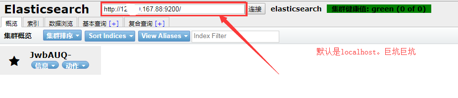

### 1.在linux上安装elasticSearch

使用`wget`命令下载/下载好上传到服务器上

```shell
wget https://artifacts.elastic.co/downloads/elasticsearch/elasticsearch-6.5.1.tar.gz (安装包链接地址)
```

使用命令解压即可

启动elasticSearch:(到解压目录)

```shell
sh ./bin/elasticsearch
```


使用ip:9200访问，返回结果即为成功


但是理想很丰满，显示很骨感，在配置启动的时候会出现很多问题

1.首先我们需要配置 elasticSearch/config/elasticseach.yml文件：

```shell
vim elasticsearch.yml
```


需要设置network.host，否则外网是无法通过9200端口访问

2.此时访问的话可能会有错误

> [1]max file descriptors [4096] for elasticsearch process is too low, increase to at least [65536]

意思是说你的进程不够用了

解决方案： 切到root 用户：进入到security目录下的limits.conf；执行命令 vim /etc/security/limits.conf 在文件的末尾添加下面的参数值：

```shell
* soft nofile 65536
* hard nofile 131072
* soft nproc 2048
* hard nproc 4096

前面的*符号必须带上，然后重新启动就可以了。
执行完成后可以使用命令 ulimit -n 查看进程数      
```


> [2]max virtual memory areas vm.max_map_count [65530] is too low, increase to at least [262144]

解决方案：切换到root用户修改配置/etc/sysctl.conf  增加配置值： vm.max_map_count=262144

执行命令 sysctl -p   这样就可以了，然后重新启动ES服务 就可以了


> [3] JavaHotSpot(TM) 64-Bit Server VM warning: INFO: error='Cannotallocate memory' (errno=12)

错误：“JavaHotSpot(TM) 64-Bit Server VM warning: INFO: error='Cannotallocate memory' (errno=12)”表示内存不足，其配置文件为config目录下的jvm.options,默认为2g，可以修改为1g。


还需记得开放9200端口号


### 2.为elasticsearch安装 head插件

1.进入github下载elasticsearch-head


2.使用`wget`命令下载master.zip

~~~shell
wget https://github.com/mobz/elasticsearch-head/archive/master.zip
~~~


3.使用`unzip master.zip`进行解压

~~~shell
unzip master.zip
~~~


4.进入 elasticsearch-head-master使用`npm install`进行相应的包下载

~~~shell
npm install
~~~

5.使用命令启动head

~~~shell
npm run start
~~~


elasticsearch与head存在跨域问题，所以需要有如下配置：

在elasticsearch的config/elasticsearch.yml文件的最后添加：


使用命令进行后台启动elasticsearch

~~~shell
./bin/elasticsearch -d
~~~

再开启head插件



**关闭elasticsearch的后台启动**

1.通过jps查看elasticsearch的端口


2.通过kill -9 端口号 杀死进程


**CORS是什么**?

wiki上的解释是 Cross-origin resource sharing (CORS) is a mechanism that allows restricted resources ，即跨域访问。

这个字段默认为false，在Elasticsearch安装集群之外的一台机上用Sense、Head等监控插件访问Elasticsearch是不允许的。这个字段最早可以追溯到1.4.x版本，而非5.x特有。

具体这个http.cors.x字段还有哪些用途和用法，见下表：

| http.cors.enabled           | 是否支持跨域，默认为false                          |
| --------------------------- | ---------------------------------------- |
| http.cors.allow-origin      | 当设置允许跨域，默认为*,表示支持所有域名，如果我们只是允许某些网站能访问，那么可以使用正则表达式。比如只允许本地地址。 /https?:\/\/localhost(:[0-9]+)?/ |
| http.cors.max-age           | 浏览器发送一个“预检”OPTIONS请求，以确定CORS设置。最大年龄定义多久的结果应该缓存。默认为1728000（20天） |
| http.cors.allow-methods     | 允许跨域的请求方式，默认OPTIONS,HEAD,GET,POST,PUT,DELETE |
| http.cors.allow-headers     | 跨域允许设置的头信息，默认为X-Requested-With,Content-Type,Content-Length |
| http.cors.allow-credentials | 是否返回设置的跨域Access-Control-Allow-Credentials头，如果设置为true,那么会返回给客户端。 |


### 3.[linux（centos 7）下安装elasticsearch - head插件(端口占用，防火墙关闭)](https://www.cnblogs.com/hts-technology/p/8556279.html)

#### 一：安装Git（如果未安装）

```
1， yum install git
2， git  --version  #查看版本
```

#### 二：安装node（如果未安装）

[node安装](http://www.cnblogs.com/hts-technology/p/8555047.html)

#### 三：安装grunt（如果未安装，head插件的启动使用grunt）

```
   npm install -g grunt-cli  #安装grunt命令行工具grunt-cli

   npm install grunt --save-dev  #安装grunt及其插件

  grunt -version   #查看安装版本情况  
```

#### 四：下载并安装elasticsearch-head

```
# 选择一个目录下执行下面命令，别把head插件clone后放到 elasticsearch的plugins目录下，否则会报错

git clone git://github.com/mobz/elasticsearch-head.git   #git下载

cd elasticsearch-head  #进入目录

npm install  # 如果npm使用很多错误，尝试使用cnpm

npm install grunt --save  #安装grunt到模块中并保存
```

#### 五：修改两处的配置

（1）：修改elasticsearch-5.5.2 安装目录下的config/elasticsearch.yml

```
 # 增加如下字段
http.cors.enabled: true
http.cors.allow-origin: "*"
```

（2）：修改elasticsearch-head下的Gruntfile.js

```
#其中增加一个
hostname: '0.0.0.0'  或者是 hostname: '*'
```


#### 六：启动elasticsearch和head插件

（1）：启动elasticsearch，进入elasticsearch的bin

```
sh elasticsearch #执行该命令
```

（2）：启动head插件，进入elasticsearch-head目录

```
grunt  server #执行该命令
```

#### 七：如果是学习环境建议关闭防火墙

```
systemctl stop firewalld.service  #停止firewall
systemctl disable firewalld.service  #禁止firewall开机启动
firewall-cmd --state #查看默认防火墙状态（关闭后显示notrunning，开启后显示running）
```

#### 八：很多时候重启会遇上9200，或者9100端口占用

```
netstat -tunlp |grep 端口号  #查看某个端口情况
kill -9 pid #杀死该占用，pid如下图，如kill -9 2411

```


索引操作

~~~shell
查询所有的索引
curl -X GET "localhost:9200/_cat/indices?v" 查询所有的索引index

创建一个customer 索引
curl -X PUT "localhost:9200/customer/_doc/1?pretty" -H'Content-Type: application/json' 
-d'{"name": "John Doe"}' 

查询id为1的文档
curl -X GET "localhost:9200/customer/_doc/1?pretty"

删除索引
curl -X DELETE "localhost:9200/customer?pretty"
~~~

API的格式

~~~shell
curl -X <HTTP Verb>/<Index>/<Type>/<ID>
~~~


文档操作


查询文档

~~~shell
curl -X GET "localhost:9200/customer/_doc/1?pretty"
~~~


添加文档

~~~shell
curl -X PUT "localhost:9200/customer/_doc/1?pretty" -H'Content-Type:application/json' 
-d'{"name":"ouYang"}'
	
注意：-H后面与-d后面不留空格
~~~

更新文档

~~~shell
修改字段的值
curl -X POST "localhost:9200/customer/_doc/1/_update?pretty" 
-H'Content-Type:application/json' -d'{"doc":{"name":"张三"}}'


更新文档是添加新的字段
curl -X POST "localhost:9200/customer/_doc/1/_update?pretty" 
-H'Content-Type:application/json' -d'{"script":"ctx._source.age += 5"}'


利用脚本进行执行
curl -X POST "localhost:9200/customer/_doc/1/_update?pretty" -H'Content-Type:application/json' 
-d'{"script":"ctx._source.age += 5"}'

~~~

删除文档

~~~shell
curl -X DELETE "localhost:9200/customer/_doc/1?pretty"
~~~

批处理

除了对单个的文档进行索引、更新和删除，Elasticsearch也提供了相关操作的批处理功能，这些批处理功能通过使用_bulk API实现。通过批处理可以非常高效的完成多个文档的操作，同时可以减少不必要的网络请求。 


全文检索和倒排索引


shard和replica的解释


## 简单的集群管理

### （1）快速检查集群的健康状况

~~~shell
GET /_cat/health?v
~~~

~~~xml
快速了解集群的健康状况：green,yellow,red?

green:每一个索引的primary shard 和 replica shard都是active状态的。
yellow:每一个索引的primary shard都是active状态的，但是部分replica shard不是active状态，处于不可用状态
red:不是所有索引的primary shard都是active状态的，部分索引有数据丢失。
~~~

### （2）快速查看集群中有哪些索引

~~~shell
GET /_cat/indices?v
~~~

### （3）简单的索引操作

~~~shell
创建索引：PUT /test_index?pretty
删除索引：DELETE /test_index?pretty
~~~


## 商品的CURD操作

### 1.新增商品：新增文档，建立索引

~~~shell
PUT /index/type/id

PUT /ecommerce/product/1
{
  "name":"gaolujie yagao",
  "desc":"gaoxiao meibai",
  "price":30,
  "producer":"gaolujie producer",
  "tags":["meibai","fangzhu"]
}

-----返回结果-----
{
  "_index" : "ecommerce",
  "_type" : "product",
  "_id" : "1",
  "_version" : 1,
  "result" : "created",
  "_shards" : {
    "total" : 2,
    "successful" : 1,
    "failed" : 0
  },
  "_seq_no" : 0,
  "_primary_term" : 1
}


PUT /ecommerce/product/2
{
  "name":"jiajieshi yagao",
  "desc":"youxiao fangzhu",
  "price":25,
  "producer":"jiajieshi producer",
  "tags":["fangzhu"]
}

PUT /ecommerce/product/3
{
  "name":"zhonghua yagao",
  "desc":"caoben zhiwu",
  "price":40,
  "producer":"zhonghua producer",
  "tags":["qingxin"]
}

es会自动建立index和type，不需要提前创建，而且es默认会对document每个field都建立倒排索引，让其可以被搜索
~~~

### 2.查询商品：检索文档

~~~shell
GET /index/type/id
GET /ecommerce/product/1

{
  "_index" : "ecommerce",
  "_type" : "product",
  "_id" : "1",
  "_version" : 1,
  "found" : true,
  "_source" : {
    "name" : "gaolujie yagao",
    "desc" : "gaoxiao meibai",
    "price" : 30,
    "producer" : "gaolujie producer",
    "tags" : [
      "meibai",
      "fangzhu"
    ]
  }
}
~~~

### 3.修改商品：替换文档

~~~shell
PUT /ecommerce/product/1
{
	"name":"jiaqiangban gaolujie yagao",
	"desc":"gaoxiao meibai",
	"price":30,
	"producer":"gaolujie producer",
	"tags":["meibai","fangzhu"]
}
---- 返回结果 -----
{
  "_index" : "ecommerce",
  "_type" : "product",
  "_id" : "1",
  "_version" : 3,
  "result" : "updated",
  "_shards" : {
    "total" : 2,
    "successful" : 1,
    "failed" : 0
  },
  "_seq_no" : 2,
  "_primary_term" : 1
}

替换方式有一个缺点：就是必须带上所有的field，才能进行信息的修改。
~~~

### 4.修改文档

~~~shell
POST /ecommerce/product/1/_update
{
  "doc": {
    "name":"jiaqiangban gaolujie yagao"
  }
}

----返回结果----
{
  "_index" : "ecommerce",
  "_type" : "product",
  "_id" : "1",
  "_version" : 5,
  "result" : "updated",
  "_shards" : {
    "total" : 2,
    "successful" : 1,
    "failed" : 0
  },
  "_seq_no" : 4,
  "_primary_term" : 1
}

~~~

### 5.删除文档

~~~shell
DELETE /ecommerce/product/1?pretty

--- 返回结果---
{
  "_index" : "ecommerce",
  "_type" : "product",
  "_id" : "1",
  "_version" : 6,
  "result" : "deleted",
  "_shards" : {
    "total" : 2,
    "successful" : 1,
    "failed" : 0
  },
  "_seq_no" : 5,
  "_primary_term" : 1
}
~~~


### 查询

query string search

搜索全部商品：GET /ecommerce./product/_search

~~~json
{
  "took" : 19,
  "timed_out" : false,
  "_shards" : {
    "total" : 5,
    "successful" : 5,
    "skipped" : 0,
    "failed" : 0
  },
  "hits" : {
    "total" : 3,
    "max_score" : 1.0,
    "hits" : [
      {
        "_index" : "ecommerce",
        "_type" : "product",
        "_id" : "2",
        "_score" : 1.0,
        "_source" : {
          "name" : "jiajieshi yagao",
          "desc" : "youxiao fangzhu",
          "price" : 25,
          "producer" : "jiajieshi producer",
          "tags" : [
            "fangzhu"
          ]
        }
      },
      {
        "_index" : "ecommerce",
        "_type" : "product",
        "_id" : "1",
        "_score" : 1.0,
        "_source" : {
          "name" : "gaolujie yagao",
          "desc" : "gaoxiao meibai",
          "price" : 30,
          "producer" : "gaolujie producer",
          "tags" : [
            "meibai",
            "fangzhu"
          ]
        }
      },
      {
        "_index" : "ecommerce",
        "_type" : "product",
        "_id" : "3",
        "_score" : 1.0,
        "_source" : {
          "name" : "zhonghua yagao",
          "desc" : "caoben zhiwu",
          "price" : 40,
          "producer" : "zhonghua producer",
          "tags" : [
            "qingxin"
          ]
        }
      }
    ]
  }
}

~~~


took:耗费了几毫秒

timed_out:是否超时，这里是没有。

_shards:查询拆成了5个分片，所以对于搜索请求，会打到所有的primary shard（或者是它的某个replica shard 也可以）

hist.total:查询结果数量，3个document、

hist.score:score的含义，就是document对于一个search的相关度的匹配分数，越相关，就越匹配，分数越高。

hits.hits:包含了匹配搜索的document的详细数据


query string search 的由来，因为search参数都是以http请求query string来附带的。

搜索商品名称中包含yagao的商品，而且按照售价降序排序：GET /ecommerce/product/_search?q=name:yagao$sort=price:desc

~~~json
{
  "took" : 52,
  "timed_out" : false,
  "_shards" : {
    "total" : 5,
    "successful" : 5,
    "skipped" : 0,
    "failed" : 0
  },
  "hits" : {
    "total" : 3,
    "max_score" : null,
    "hits" : [
      {
        "_index" : "ecommerce",
        "_type" : "product",
        "_id" : "3",
        "_score" : null,
        "_source" : {
          "name" : "zhonghua yagao",
          "desc" : "caoben zhiwu",
          "price" : 40,
          "producer" : "zhonghua producer",
          "tags" : [
            "qingxin"
          ]
        },
        "sort" : [
          40
        ]
      },
      {
        "_index" : "ecommerce",
        "_type" : "product",
        "_id" : "1",
        "_score" : null,
        "_source" : {
          "name" : "gaolujie yagao",
          "desc" : "gaoxiao meibai",
          "price" : 30,
          "producer" : "gaolujie producer",
          "tags" : [
            "meibai",
            "fangzhu"
          ]
        },
        "sort" : [
          30
        ]
      },
      {
        "_index" : "ecommerce",
        "_type" : "product",
        "_id" : "2",
        "_score" : null,
        "_source" : {
          "name" : "jiajieshi yagao",
          "desc" : "youxiao fangzhu",
          "price" : 25,
          "producer" : "jiajieshi producer",
          "tags" : [
            "fangzhu"
          ]
        },
        "sort" : [
          25
        ]
      }
    ]
  }
}

~~~


适用于临时的在命令行使用一些工具，比如curl，快速的发出请求，来检索想要的信息；但是如果查询请求很复杂，是很难去构建的，在生成环境中，几乎很少使用query string search。


Query DSL (Domain Specified Language) 特定领域的语言


