## Git笔记

#### 1.本地提交文件到本地仓库

##### 1.在github上创建一个仓库

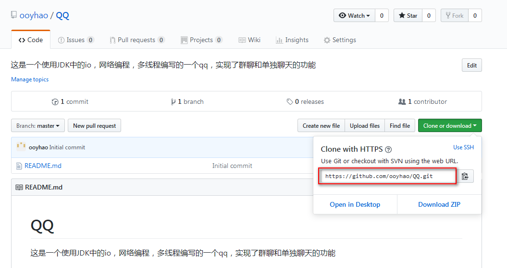

##### 2.在自己电脑的某个目录下使用clone命令

~~~xml
git clone 
~~~

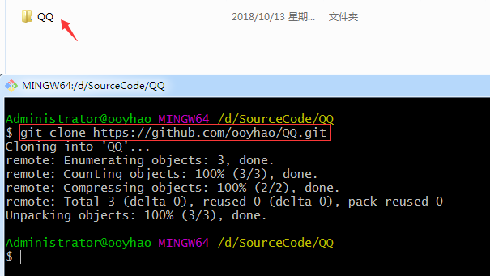

##### 3.进入该目录下可以发现项目已经clone下来了

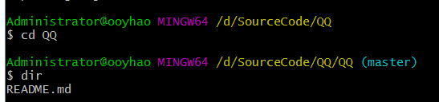

##### 4.将要提交的文件复制到该目录下 并使用git add命令添加

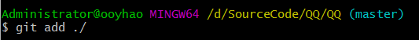

##### 5.使用commit命令提交到本地

~~~xml
git commit -m '备注'
~~~

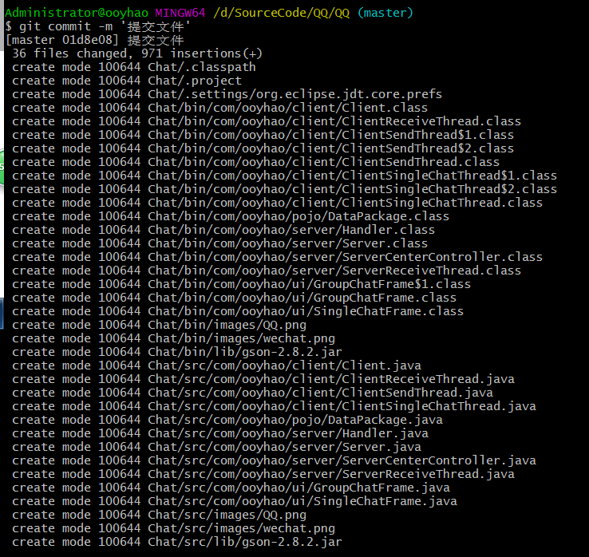

##### 6.使用git pull origin master

##### 7.使用git push命令推送到远程仓库

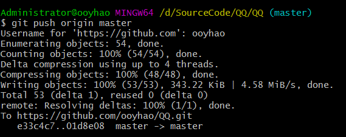

##### 8.此时可能会要你输入用户名与密码

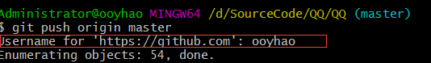

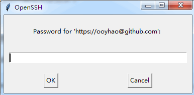

##### 9.提交成功之后可以到github官网查看结果

#### 2.提交文件异常

##### 1.报origin does not to be a git repository

~~~xml
git remote add origin git@github.com:yourusername/test.git

注意：yourusername 则是github上的名字
test则是你的仓库名字
~~~

##### 2.使用git pull提示refusing to merge unrelated histories

~~~xml
创建了一个origin，两个人分别clone

分别做完全不同的提交

第一个人git push成功

第二个人在执行git pull的时候,提示

fatal: refusing to merge unrelated histories

 
解决方法:

git pull --allow-unrelated-histories
~~~

##### 3.报Please make sure you have the correct access rightsand the repository exists 

##### 或Permission denied (publickey).

今天第一下载完 Git-2.11.1-64-bit.exe最新版本，想从Git库中克隆项目。没想到原来要进行密钥生成。就是和你https://github.com上的账号进行验证。在本机生成密钥与自己账号绑定。这样就可以从git上下项目了

（解决秘钥问题）

    打开Git输入命令
    git config –global user.name “yourname”回车
    git config –global user.email“your@email.com”回车
    
    $ ssh-keygen -t rsa -C “your@email.com”（请填你设置的邮箱地址）回车

接着出现：

~~~xml
Generating public/private rsa key pair.

Enter file in which to save the key (/Users/your_user_directory/.ssh/id_rsa):

~~~

无视这些请继续直接按下回车

    直到出现
    The key’s randomart image is:
    +—[RSA 2048]—-+
    | ==++. . |
    | . ++.o . .|
    | ..o++Oo | 

这样的

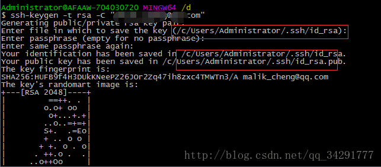

之后打开提示的目录下记事本打开id_rsa.pub，复制里面内容。

进入自己的账号<https://github.com/settings/keys>      点击 New sshKey 

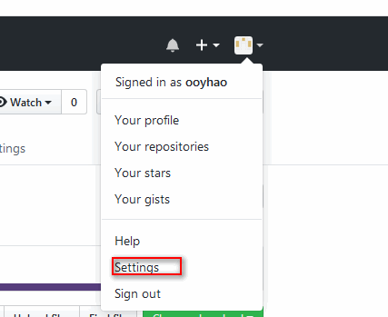

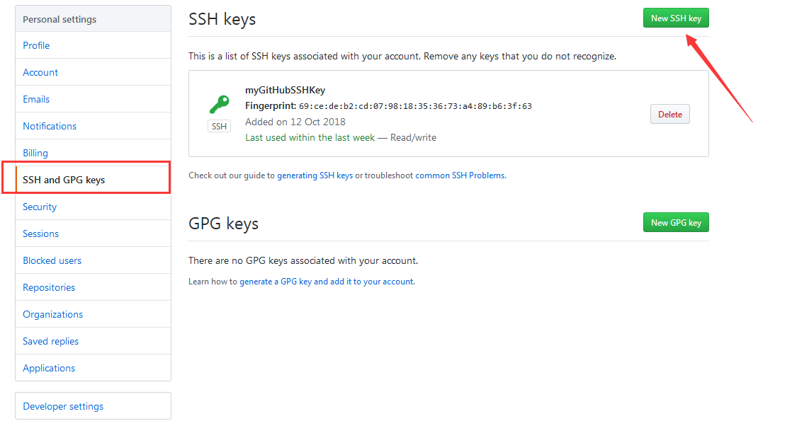

- 验证：$ ssh -T git@github.com回车 看到 

  ~~~xml
  $ ssh -T git@github.com
  ~~~

  ​

Hi ooyhao! You’ve successfully authenticated, but GitHub does not provide shell access. 

##### 4.报fatal: remote origin already exists.

~~~xml
Administrator@ooyhao MINGW64 /d/SourceCode/京东/JD_SSM (master)
$ git remote add origin git@gitee.com:ooyhao/JD_SSM.git
fatal: remote origin already exists.
~~~

最后找到解决办法如下：
1、先删除远程 Git 仓库

    $ git remote rm origin

2、再添加远程 Git 仓库

    $ git remote add origin git@github.com:FBing/java-code-generator

如果执行 git remote rm origin 报错的话，我们可以手动修改gitconfig文件的内容

    $ vi .git/config

这里写图片描述

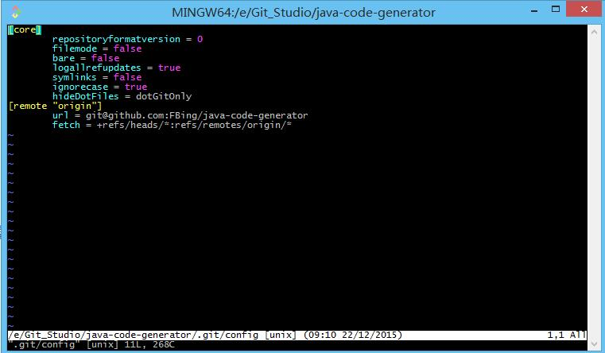

把 [remote “origin”] 那一行删掉就好了

##### 5.报warning: LF will be replaced by CRLF in springboot/SpringBoot笔记.md.The file will have its original line endings in your working directory.

执行git add是报上述警告

执行命令：

~~~xml
 git rm -r --cached .
 git config core.autocrlf false
 git add .
~~~

##### 6.RPC failed

~~~shell
5161@LRLZ5161 MINGW64 /d
$ git clone https://github.com/ooyhao/Node_Vue.git
Cloning into 'Node_Vue'...
remote: Enumerating objects: 8366, done.
remote: Counting objects: 100% (8366/8366), done.
remote: Compressing objects: 100% (5976/5976), done.
error: RPC failed; curl 18 transfer closed with outstanding read data remaining
fatal: The remote end hung up unexpectedly
fatal: early EOF
fatal: index-pack failed

这个错误是因为项目太久，tag资源文件太大

解决方式一， 网上大部分解决措施：命令终端输入 
git config --global http.postBuffer 524288000

用上面的命令有的人可以解决，我的还不行，需要如下方式命令，只clone深度为一

$ git clone /github_com/large-repository --depth 1  （只获取最后一个commit）
$ cd large-repository
$ git fetch --unshallow

中划线处填入你的git仓库的地址。。。（我用的是http方式，不是ssh）

解决方式二，一般clone http方式的容易产生此问题，改成SSH的方式也有效，即https://改为git://

遇到的问题二：

warning: templates not found /usr/local/git/share/git-core/templates

 在终端输入 
  open /usr/local/
 在打开的目录中可以看到:
如果没有 git 目录
打开下面的地址,下载 git-osx 并安装,
 http://git-scm.com/download/mac 

 如果有 git 目录
 并且相应的 share,git-core,templates 目录都有,,说明是权限的问题.

 在终端输入:
 sudo chmod -R 755 /usr/local/git/share/git-core/templates
 注意 sudo 创建目录需要输入当前 Mac 用户的密码
 最后重新 clone 项目

以上问题是我在Mac电脑用xcode自带git、sourcetree、终端三个方式clone某个项目都不能成功克隆下来。
遇到的问题，其他项目都可以。
~~~

**这个错误是因为项目太久，tag资源文件太大** 

### 3.分支操作

1.查看远程分支

~~~xml
5161@LRLZ5161 MINGW64 ~/Desktop/Notes (master)
$ git branch -a
* master
  remotes/origin/HEAD -> origin/master
  remotes/origin/master

可以看到当前我是在master分支上。
~~~

2.查看本地分支

~~~xml
5161@LRLZ5161 MINGW64 ~/Desktop/Notes (master)
$ git branch
* master

~~~

3.切换分支

~~~xml
5161@LRLZ5161 MINGW64 ~/Desktop/Notes (master)
$ git checkout -b ouYang
Switched to a new branch 'ouYang'

5161@LRLZ5161 MINGW64 ~/Desktop/Notes (ouYang)
$ git branch
  master
* ouYang

5161@LRLZ5161 MINGW64 ~/Desktop/Notes (ouYang)
$ git checkout master
Switched to branch 'master'
Your branch is up-to-date with 'origin/master'.

5161@LRLZ5161 MINGW64 ~/Desktop/Notes (master)
$ git checkout ouYang
Switched to branch 'ouYang'

------------------------------------------------------------------------------------------------

创建分支： $ git branch mybranch
切换分支： $ git checkout mybranch
创建并切换分支： $ git checkout -b mybranch

更新master主线上的东西到该分支上：$git rebase master

切换到master分支：$git checkout master

更新mybranch分支上的东西到master上：$git rebase mybranch

提交：git commit -a

对最近一次commit的进行修改：git commit -a –amend

commit之后，如果想撤销最近一次提交(即退回到上一次版本)并本地保留代码：git reset HEAD^
合并分支：(merge from) $ git checkout master
$ git merge mybranch (merge from mybranch)
删除分支： $ git branch -d mybranch
强制删除分支： $ git branch -D mybranch
列出所有分支： $ git branch
查看各个分支最后一次提交： $ git branch -v

查看哪些分支合并入当前分支： $ git branch –merged

查看哪些分支未合并入当前分支： $ git branch –no-merged

更新远程库到本地： $ git fetch origin
推送分支： $ git push origin mybranch
取远程分支合并到本地： $ git merge origin/mybranch
取远程分支并分化一个新分支： $ git checkout -b mybranch origin/mybranch
删除远程分支：　　　　　　　　　　　　　　　　　$ git push origin :mybranch

rebase: $ git checkout mybranch
$ git rebase master (rebase from master)

举例： $ git checkout server
$ git rebase –onto master server client
$ git checkout master
$ git merge client (fostforward)
$ git rebase master server (checkout sever)
$ git merge server
$ git branch -d client
$ git branch -d server
~~~

