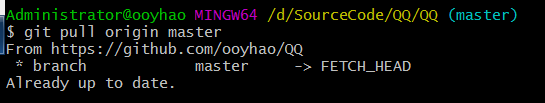

##Git笔记

#### 1.本地提交文件到本地仓库

##### 1.在github上创建一个仓库

##### 2.在自己电脑的某个目录下使用clone命令

~~~xml
git clone 
~~~

##### 3.进入该目录下可以发现项目已经clone下来了

##### 4.将要提交的文件复制到该目录下 并使用git add命令添加

##### 5.使用commit命令提交到本地

~~~xml
git commit -m '备注'
~~~

##### 6.使用git pull origin master

##### 7.使用git push命令推送到远程仓库

##### 8.此时可能会要你输入用户名与密码

##### 9.提交成功之后可以到github官网查看结果

#### 2.提交文件异常

##### 1.报origin does not to be a git repository

~~~xml
git remote add origin git@github.com:yourusername/test.git

注意：yourusername 则是github上的名字
test则是你的仓库名字
~~~

##### 2.使用git pull提示refusing to merge unrelated histories

~~~xml
创建了一个origin，两个人分别clone

分别做完全不同的提交

第一个人git push成功

第二个人在执行git pull的时候,提示

fatal: refusing to merge unrelated histories

 
解决方法:

git pull --allow-unrelated-histories
~~~

##### 3.报Please make sure you have the correct access rightsand the repository exists 

##### 或Permission denied (publickey).

今天第一下载完 Git-2.11.1-64-bit.exe最新版本，想从Git库中克隆项目。没想到原来要进行密钥生成。就是和你https://github.com上的账号进行验证。在本机生成密钥与自己账号绑定。这样就可以从git上下项目了

（解决秘钥问题）

    打开Git输入命令
    git config –global user.name “yourname”回车
    git config –global user.email“your@email.com”回车
    
    $ ssh-keygen -t rsa -C “your@email.com”（请填你设置的邮箱地址）回车

接着出现：

~~~xml
Generating public/private rsa key pair.

Enter file in which to save the key (/Users/your_user_directory/.ssh/id_rsa):

~~~

无视这些请继续直接按下回车

    直到出现
    The key’s randomart image is:
    +—[RSA 2048]—-+
    | ==++. . |
    | . ++.o . .|
    | ..o++Oo | 

这样的

之后打开提示的目录下记事本打开id_rsa.pub，复制里面内容。

进入自己的账号<https://github.com/settings/keys>      点击 New sshKey 

- 验证：$ ssh -T git@github.com回车 看到 

  ~~~xml
  $ ssh -T git@github.com
  ~~~

  ​

Hi ooyhao! You’ve successfully authenticated, but GitHub does not provide shell access. 

