# JPA

## 1.JPA 是什么

JavaPersistence API：用于对象持久化的API

JavaEE5.0 平台标准的 ORM 规范，使得应用程序以统一的方式访问持久层

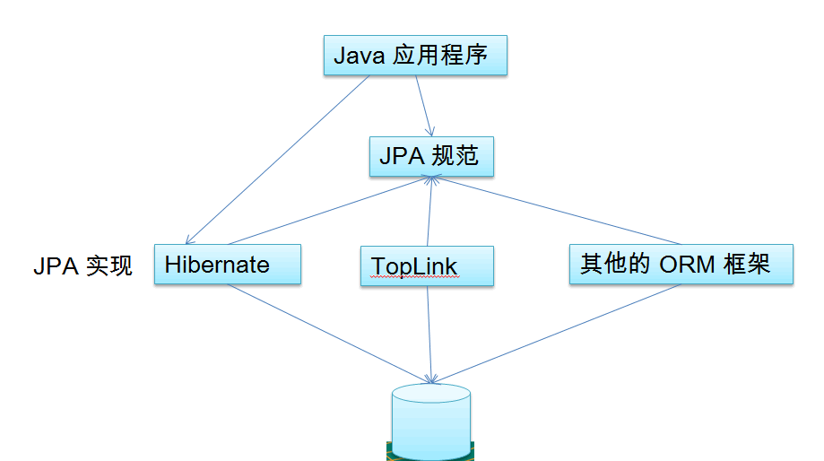

## 2.JPA和Hibernate的关系

~~~xml
1.JPA 是hibernate的一个抽象（就像JDBC和JDBC驱动的关系）：

	–JPA 是规范：JPA本质上就是一种  ORM 规范，不是ORM框架—— 因为 JPA 并未提供ORM 实现，它只是制订了一些规范，提供了一些编程的API 接口，但具体实现则由ORM厂商提供实现

	–Hibernate 是实现：Hibernate除了作为ORM 框架之外，它也是一种 JPA 实现

2.从功能上来说， JPA是Hibernate 功能的一个子集

~~~

## 3.JPA的优势

~~~xml
1.标准化:  提供相同的API，这保证了基于JPA开发的企业应用能够经过少量的修改就能够在不同的JPA框架下运行。

2.简单易用，集成方便:  JPA 的主要目标之一就是提供更加简单的编程模型，在JPA 框架下创建实体和创建Java  类一样简单，只需要使用javax.persistence.Entity进行注释；JPA的框架和接口也都非常简单，

3.可媲美JDBC的查询能力:  JPA的查询语言是面向对象的，JPA定义了独特的JPQL，而且能够支持批量更新和修改、JOIN、GROUPBY、HAVING等通常只有SQL 才能够提供的高级查询特性，甚至还能够支持子查询。

4.支持面向对象的高级特性:JPA 中能够支持面向对象的高级特性，如类之间的继承、多态和类之间的复杂关系，最大限度的使用面向对象的模型
~~~

## 4.JPA 包括3方面的技术

~~~xml
•ORM 映射元数据：JPA支持XML 和  JDK5.0 注解两种元数据的形式，元数据描述对象和表之间的映射关系，框架据此将实体对象持久化到数据库表中。  

•JPA 的API：用来操作实体对象，执行CRUD操作，框架在后台完成所有的事情，开发者从繁琐的JDBC和SQL代码中解脱出来。  

•查询语言（JPQL）：这是持久化操作中很重要的一个方面，通过面向对象而非面向数据库的查询语言查询数据，避免程序和具体的  SQL 紧密耦合。

~~~

# 2.HelloWorld

## 1.使用JPA持久化对象的步骤

~~~xml
1.创建 persistence.xml, 在这个文件中配置持久化单元
    需要指定跟哪个数据库进行交互;
    需要指定 JPA 使用哪个持久化的框架以及配置该框架的基本属性
2.创建实体类, 使用 annotation 来描述实体类跟数据库表之间的映射关系.
3.使用 JPA API 完成数据增加、删除、修改和查询操作
    创建 EntityManagerFactory (对应 Hibernate 中的 SessionFactory);
    创建 EntityManager (对应 Hibernate 中的Session);

~~~

## 2.开发JPA依赖的jar文件

~~~xml
hibernate-release-4.2.4.Final\lib\required\*.jar
hibernate-release-4.2.4.Final\lib\jpa\*.jar
数据库驱动的 jar 包
~~~

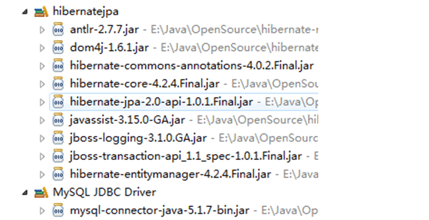

## 3.persistence.xml

~~~xml
•JPA 规范要求在类路径的META-INF目录下放置persistence.xml，文件的名称是固定的
~~~

~~~xml
<?xml version="1.0" encoding="UTF-8"?>
<persistence version="2.0"
             xmlns="http://java.sun.com/xml/ns/persistence" xmlns:xsi="http://www.w3.org/2001/XMLSchema-instance"
             xsi:schemaLocation="http://java.sun.com/xml/ns/persistence http://java.sun.com/xml/ns/persistence/persistence_2_0.xsd">
    <persistence-unit name="jpa-01" transaction-type="RESOURCE_LOCAL">

        <!--
            配置使用什么ORM产品来使用JPA的实现
            1.实际上配置的是javax.persistence.spi.PersistenceProvider接口的实现类、
            2.若JPA项目中只有一个JPA的是吸纳产品，则可以不配置该节点。
        -->
        <provider>org.hibernate.ejb.HibernatePersistence</provider>

        <!--添加持有化类-->
        <class>com.ooyhao.jpa.helloworld.Customer</class>

        <properties>
            <property name="javax.persistence.jdbc.driver" value="com.mysql.jdbc.Driver"></property>
            <property name="javax.persistence.jdbc.url" value="jdbc:mysql:///jpa"></property>
            <property name="javax.persistence.jdbc.user" value="root"></property>
            <property name="javax.persistence.jdbc.password" value="123456"></property>
            <!-- 配置 JPA 实现产品的基本属性. 配置 hibernate 的基本属性 -->
            <property name="hibernate.format_sql" value="true"/>
            <property name="hibernate.show_sql" value="true"/>
            <property name="hibernate.hbm2ddl.auto" value="update"/>

        </properties>

    </persistence-unit>
</persistence>
~~~

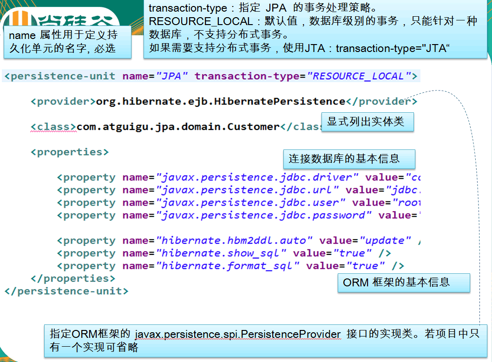

## 4.执行持久化操作

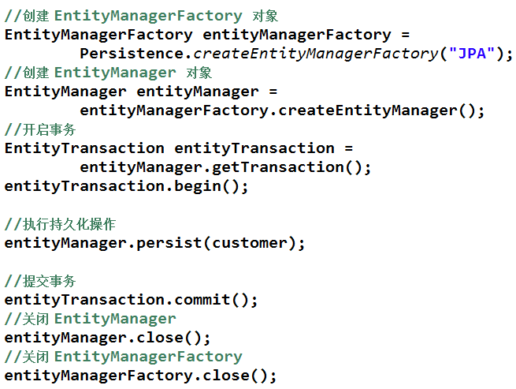

## 5.代码

Customer.java

~~~java
package com.ooyhao.jpa.helloworld;

import javax.persistence.*;
import java.io.Serializable;

/**
 * @author ooyhao
 */
@Entity
@Table(name = "jpa_customer")
public class Customer implements Serializable {

    @GeneratedValue(strategy = GenerationType.AUTO)
    @Id
    private Integer id;

    @Column(name = "last_name")
    private String lastName;

    private String email;

    private Integer age;

    public Integer getId() {
        return id;
    }

    public void setId(Integer id) {
        this.id = id;
    }

    public String getLastName() {
        return lastName;
    }

    public void setLastName(String lastName) {
        this.lastName = lastName;
    }

    public String getEmail() {
        return email;
    }

    public void setEmail(String email) {
        this.email = email;
    }

    public Integer getAge() {
        return age;
    }

    public void setAge(Integer age) {
        this.age = age;
    }

    @Override
    public String toString() {
        return "Customer{" +
                "id=" + id +
                ", lastName='" + lastName + '\'' +
                ", email='" + email + '\'' +
                ", age=" + age +
                '}';
    }
}

~~~

Test.java

~~~java
public class JPATest {

    private EntityManagerFactory entityManagerFactory= null;
    private EntityManager entityManager;
    private EntityTransaction transaction;
    @Before
    public void before(){
        entityManagerFactory = Persistence.createEntityManagerFactory("jpa-01");
        entityManager = entityManagerFactory.createEntityManager();
        transaction = entityManager.getTransaction();
        transaction.begin();
    }

    @Test
    public void test(){

        Customer customer = new Customer();
        customer.setAge(12);
        customer.setLastName("ouYang");
        customer.setEmail("625194996@qq.com");
        entityManager.persist(customer);
    }

    @After
    public void after(){
        transaction.commit();
        entityManager.close();
        entityManagerFactory.close();

    }

}

~~~

结构图：

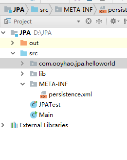

# 3.注解

## 1.@Entity

~~~xml
@Entity 标注用于实体类声明语句之前，指出该Java 类为实体类，将映射到指定的数据库表。如声明一个实体类 Customer，它将映射到数据库中的 customer 表上。
~~~

## 2.@Table

~~~xml
当实体类与其映射的数据库表名不同名时需要使用 @Table 标注说明，该标注与 @Entity 标注并列使用，置于实体类声明语句之前，可写于单独语句行，也可与声明语句同行。

@Table 标注的常用选项是 name，用于指明数据库的表名
@Table标注还有一个两个选项 catalog 和 schema 用于设置表所属的数据库目录或模式，通常为数据库名。uniqueConstraints 选项用于设置约束条件，通常不须设置。

~~~

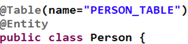

## 3.@Id

~~~xml
@Id 标注用于声明一个实体类的属性映射为数据库的主键列。该属性通常置于属性声明语句之前，可与声明语句同行，也可写在单独行上。
@Id标注也可置于属性的getter方法之前。
~~~

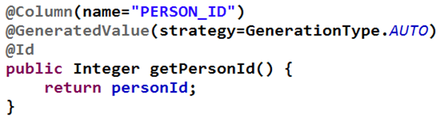

## 4.@GeneratedValue

~~~xml
@GeneratedValue  用于标注主键的生成策略，通过 strategy 属性指定。默认情况下，JPA 自动选择一个最适合	底层数据库的主键生成策略：SqlServer 对应 identity，MySQL 对应 auto increment。
在 javax.persistence.GenerationType 中定义了以下几种可供选择的策略：
    IDENTITY：采用数据库 ID自增长的方式来自增主键字段，Oracle 不支持这种方式；
    AUTO： JPA自动选择合适的策略，是默认选项；
    SEQUENCE：通过序列产生主键，通过 @SequenceGenerator 注解指定序列名，MySql 不支持这种方式
    TABLE：通过表产生主键，框架借由表模拟序列产生主键，使用该策略可以使应用更易于数据库移植。
~~~

## 5.@Basic

~~~xml
@Basic 表示一个简单的属性到数据库表的字段的映射,对于没有任何标注的 getXxxx() 方法,默认即为@Basic
fetch: 表示该属性的读取策略,有 EAGER 和 LAZY 两种,分别表示主支抓取和延迟加载,默认为 EAGER.
optional:表示该属性是否允许为null, 默认为true
~~~

## 6.@Column

~~~xml
当实体的属性与其映射的数据库表的列不同名时需要使用@Column 标注说明，该属性通常置于实体的属性声明语句之		前，还可与 @Id 标注一起使用。
@Column 标注的常用属性是 name，用于设置映射数据库表的列名。此外，该标注还包含其它多个属性，如：unique 		、nullable、length 等。
@Column 标注的 columnDefinition 属性: 表示该字段在数据库中的实际类型.通常 ORM 框架可以根据属性类型自		动判断数据库中字段的类型,但是对于Date类型仍无法确定数据库中字段类型究竟是DATE,TIME还是			TIMESTAMP.此外,String的默认映射类型为VARCHAR, 如果要将 String 类型映射到特定数据库的 BLOB 或		TEXT 字段类型.
@Column标注也可置于属性的getter方法之前

~~~

## 7.@Transient

~~~xml
表示该属性并非一个到数据库表的字段的映射,ORM框架将忽略该属性.
如果一个属性并非数据库表的字段映射,就务必将其标示为@Transient,否则,ORM框架默认其注解为@Basic
~~~

## 8.@Temporal

~~~xml
在核心的 Java API 中并没有定义 Date 类型的精度(temporal precision).  而在数据库中,表示 Date 类型的数据有 DATE, TIME, 和 TIMESTAMP 三种精度(即单纯的日期,时间,或者两者 兼备). 在进行属性映射时可使用@Temporal注解来调整精度.
~~~

~~~java

@Temporal(TemporalType.TIMESTAMP)
private Date createdTime;

@Temporal(TemporalType.DATE)
private Date birth;
~~~

# 4.JPA相关接口/类

## 1.Persistence

~~~xml
1.Persistence  类是用于获取 EntityManagerFactory 实例。该类包含一个名为 	
	createEntityManagerFactory 	的 静态方法 。
2.createEntityManagerFactory 方法有如下两个重载版本。
    带有一个参数的方法以 JPA 配置文件 persistence.xml 中的持久化单元名为参数
    带有两个参数的方法：前一个参数含义相同，后一个参数 Map类型，用于设置 JPA 的相关属性，这时将忽略其	它地方设置的属性。Map 对象的属性名必须是 JPA 实现库提供商的名字空间约定的属性名。
~~~

## 2.EntityManagerFactory

~~~xml
EntityManagerFactory 接口主要用来创建 EntityManager 实例。该接口约定了如下4个方法：
createEntityManager()：用于创建实体管理器对象实例。
createEntityManager(Map map)：用于创建实体管理器对象实例的重载方法，Map 参数用于提供 EntityManager 		的属性。
isOpen()：检查 EntityManagerFactory 是否处于打开状态。实体管理器工厂创建后一直处于打开状态，除非调用
	close()方法将其关闭。
close()：关闭 EntityManagerFactory 。 EntityManagerFactory 关闭后将释放所有资源，isOpen()方法测试		将返回 false，其它方法将不能调用，否则将导致IllegalStateException异常。

~~~

## 3.EntityManager

~~~xml
在 JPA 规范中, EntityManager 是完成持久化操作的核心对象。实体作为普通 Java 对象，只有在调用 		EntityManager 将其持久化后才会变成持久化对象。EntityManager 对象在一组实体类与底层数据源之间进行 		O/R 映射的管理。它可以用来管理和更新 Entity Bean, 根椐主键查找 Entity Bean, 还可以通过JPQL语句		查询实体。
 实体的状态:
   * 新建状态:   新创建的对象，尚未拥有持久性主键。
   * 持久化状态：已经拥有持久性主键并和持久化建立了上下文环境
   * 游离状 态：拥有持久化主键，但是没有与持久化建立上下文环境
   * 删除状态:  拥有持久化主键，已经和持久化建立上下文环境，但是从数据库中删除。

~~~

~~~java

1.find (Class<T> entityClass,Object primaryKey)：返回指定的 OID 对应的实体类对象，如果这个实体
	在于当前的持久化环境，则返回一个被缓存的对象；否则会创建一个新的 Entity, 并加载数据库中相关信息；
	若 OID 不存在于数据库中，则返回一个 null。第一个参数为被查询的实体类类型，第二个参数为待查找实体
	的主键值。
	
2.getReference (Class<T> entityClass,Object primaryKey)：与find()方法类似，不同的是：如果缓存中
	不存在指定的 Entity, EntityManager 会创建一个 Entity 类的代理，但是不会立即加载数据库中的信
	息，只		有第一次真正使用此 Entity 的属性才加载，所以如果此 OID 在数据库不存在，
	getReference() 不会返		回 null 值, 而是抛出EntityNotFoundException
3.persist (Object entity)：用于将新创建的 Entity 纳入到 EntityManager 的管理。该方法执行后，传入 			persist() 方法的 Entity 对象转换成持久化状态。
		如果传入 persist() 方法的 Entity 对象已经处于持久化状态，则 persist() 方法什么都不做。
		如果对删除状态的 Entity 进行 persist() 操作，会转换为持久化状态。
		如果对游离状态的实体执行 persist() 操作，可能会在 persist() 方法抛出 	
        EntityExistException(也有可能是在flush或事务提交后抛出)。
4.remove (Object entity)：删除实例。如果实例是被管理的，即与数据库实体记录关联，则同时会删除关联的数
	据库记录。
~~~

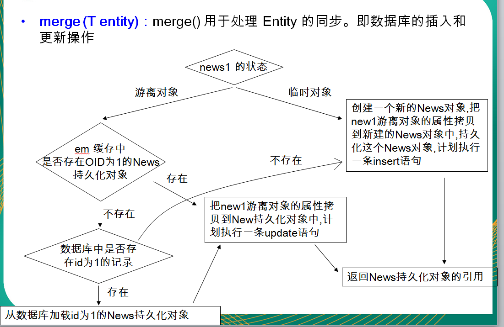

~~~xml
1.flush ()：同步持久上下文环境，即将持久上下文环境的所有未保存实体的状态信息保存到数据库中。
2.setFlushMode (FlushModeType flushMode)：设置持久上下文环境的Flush模式。参数可以取2个枚举
		FlushModeType.AUTO 为自动更新数据库实体，
		FlushModeType.COMMIT 为直到提交事务时才更新数据库记录。
3.getFlushMode ()：获取持久上下文环境的Flush模式。返回FlushModeType类的枚举值。

4.refresh (Object entity)：用数据库实体记录的值更新实体对象的状态，即更新实例的属性值。
5.clear ()：清除持久上下文环境，断开所有关联的实体。如果这时还有未提交的更新则会被撤消。
6.contains (Object entity)：判断一个实例是否属于当前持久上下文环境管理的实体。
7.isOpen ()：判断当前的实体管理器是否是打开状态。
8.getTransaction ()：返回资源层的事务对象。EntityTransaction实例可以用于开始和提交多个事务。
9.close ()：关闭实体管理器。之后若调用实体管理器实例的方法或其派生的查询对象的方法都将抛出 
		IllegalstateException 异常，除了getTransaction 和 isOpen方法(返回 false)。不过，当与实体
		管理器关联的事务处于活动状态时，调用 close 方法后持久上下文将仍处于被管理状态，直到事务完成。

~~~

~~~java
import com.ooyhao.jpa.helloworld.Customer;
import jdk.nashorn.internal.runtime.FindProperty;
import org.hibernate.dialect.CUBRIDDialect;
import org.junit.After;
import org.junit.Before;
import org.junit.Test;

import javax.persistence.EntityManager;
import javax.persistence.EntityManagerFactory;
import javax.persistence.EntityTransaction;
import javax.persistence.Persistence;
import java.util.Date;

/**
 * @author ooyhao
 */

public class JPATest {

    private EntityManagerFactory entityManagerFactory= null;
    private EntityManager entityManager;
    private EntityTransaction transaction;
    @Before
    public void before(){
        entityManagerFactory = Persistence.createEntityManagerFactory("jpa-01");
//        创建EntityManager，类似于Hibernate的SessionFactory
        entityManager = entityManagerFactory.createEntityManager();
        transaction = entityManager.getTransaction();
        transaction.begin();
    }

    @Test
    public void test(){

        Customer customer = new Customer();
        customer.setAge(12);
        customer.setLastName("ouYang");
        customer.setCreatedTime(new Date());
        customer.setBirth(new Date());
        customer.setEmail("625194996@qq.com");
        entityManager.persist(customer);
    }

    //类似Hibernate中get方法
    @Test
    public void testFind(){
        Customer customer = entityManager.find(Customer.class, 1);//在执行find方法时候就执行了sql语句
        System.out.println("----------------");
        System.out.println(customer);
    }

    //类似于hibernate中load方法
        @Test
    public void testGetReference(){
        Customer customer = entityManager.getReference(Customer.class, 1);
        System.out.println(customer.getClass().getName());//代理对象
        System.out.println("----------------");
        System.out.println(customer);
    }

    //类似于hibernate中的save方法，使对象由临时转态变为持久化状态
    //和hibernate的save方法不同之处在于：若对象由id，则不能执行insert方法，会抛出异常。
    @Test
    public void testPersist(){
        Customer customer = new Customer();
        customer.setAge(15);
        customer.setBirth(new Date());
        customer.setCreatedTime(new Date());
        customer.setEmail("bb@163.com");
        customer.setLastName("ouYang");
//        customer.setId(12);
        entityManager.persist(customer);
        System.out.println(customer.getId());//2

    }

    //类似于Hibernate中的delete方法，把对象对应的记录从数据库中移除
    //注意：该方法只能移除持久化对象，但Hibernate的delete方法实际上是可以移除游离状态的对象、
    @Test
    public void testRemove(){
//        Customer customer = new Customer();
//        customer.setId(1);
//        entityManager.remove(customer);//Removing a detached instance com.ooyhao.jpa.helloworld.Customer#12
        Customer customer = entityManager.find(Customer.class,2);
        entityManager.remove(customer);

    }

    /**
     *
     * 临时对象：没有oid
     * 游离对象：有id，没有与entityManager关联
     */

    //总的来说。类似于Hibernate session的savaOrUpdate方法
    /**
     *1，如果传入的是一个临时状态对象
     * 会创建一个新的对象，把临时对象的属性复制到新的对象中，然后对新的对象进行持久化操作，所以新的对象
     * 中有id，但是临时对象中没有id、
     */
    @Test
    public void testMerge1(){
        Customer customer = new Customer();
        customer.setAge(12);
        customer.setBirth(new Date());
        customer.setCreatedTime(new Date());
        customer.setEmail("625194996@qq.com");
        customer.setLastName("ouYang");

        Customer customer1 = entityManager.merge(customer);
        System.out.println("customer:"+customer.getId());//null
        System.out.println("customer1:"+customer1.getId());//4

    }

    /**
     * 2,若传入的是一个游离状态，即对象由oid。
         * 1.若在EntityManager缓存中没有改对象
         * 2.若在数据库中也没有对应的记录
         * 3.JPA会创建一个新的对象，把当前游离态对象的属性复制到新的对象中。
         * 4.对新创建的对象执行insert操作。
     */
    @Test
    public void testMerge2(){
        Customer customer = new Customer();
        customer.setAge(12);
        customer.setBirth(new Date());
        customer.setCreatedTime(new Date());
        customer.setEmail("625194996@qq.com");
        customer.setLastName("ouYang");
        customer.setId(100);

        Customer customer1 = entityManager.merge(customer);
        System.out.println("customer:"+customer.getId());//100
        System.out.println("customer1:"+customer1.getId());//5
    }

    /**3,若传入的是一个游离状态，即对象由oid。
         * 1.若在EntityManager缓存中没有改对象
         * 2.若在数据库中有对应的记录
         * 3.JPA会查询对应的记录，然后返回该记录对应的一个对象，再把游离对象属性复制到查询到的对象中。
         * 4.对查询到的对象执行update操作。
     */
    @Test
    public void testMerge3(){
        Customer customer = new Customer();
        customer.setAge(12);
        customer.setBirth(new Date());
        customer.setCreatedTime(new Date());
        customer.setEmail("625194996@qq.com");
        customer.setLastName("ooyhao");
        customer.setId(5);

        Customer customer1 = entityManager.merge(customer);
        System.out.println(customer == customer1);//5

    }

    /**4,若传入的是一个游离状态，即对象由oid。
     *      1.若在EntityManager缓存中有改对象
     *      2.JPA会游离对象属性复制EntityManager缓存中到的对象中。
     *      3.对EntityManager缓存中对象执行update操作。
     */
    @Test
    public void testMerge4(){
        Customer customer = new Customer();
        customer.setAge(12);
        customer.setBirth(new Date());
        customer.setCreatedTime(new Date());
        customer.setEmail("ooyhao@qq.com");
        customer.setLastName("ooyhao");
        customer.setId(5);

        Customer customer2 = entityManager.find(Customer.class, 5);

        Customer customer1 = entityManager.merge(customer);
        System.out.println(customer == customer1);//5

    }

    @After
    public void after(){
        transaction.commit();
        entityManager.close();
        entityManagerFactory.close();

    }
}
~~~

## 4.EntityTransaction

~~~xml
EntityTransaction 接口用来管理资源层实体管理器的事务操作。通过调用实体管理器的getTransaction方法 获
	得其实例。

1.begin ()
		用于启动一个事务，此后的多个数据库操作将作为整体被提交或撤消。若这时事务已启动则会抛出 
		IllegalStateException 异常。
2.commit ()
		用于提交当前事务。即将事务启动以后的所有数据库更新操作持久化至数据库中。
3.rollback ()
		撤消(回滚)当前事务。即撤消事务启动后的所有数据库更新操作，从而不对数据库产生影响。
4.setRollbackOnly ()
		使当前事务只能被撤消。
5.getRollbackOnly ()
		查看当前事务是否设置了只能撤消标志。
6.isActive ()
		查看当前事务是否是活动的。如果返回true则不能调用begin方法，否则将抛出 
		IllegalStateException 异常；如果返回 false 则不能调用 commit、rollback、setRollbackOnly
		及 getRollbackOnly 方法，否则将抛出 IllegalStateException 异常。

~~~

# 5.映射关联关系

## 1.OneToMany & ManyToOne

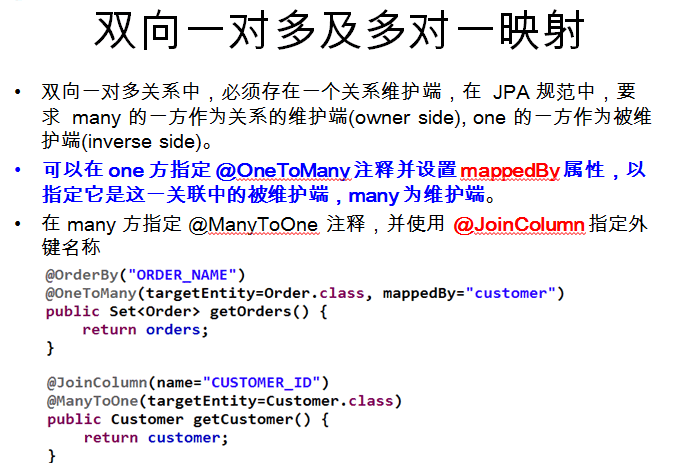

## 2.OneToOne

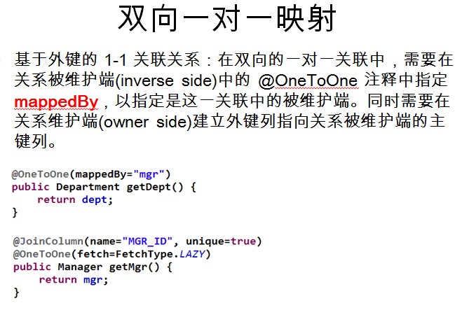

## 3.LazyLoading

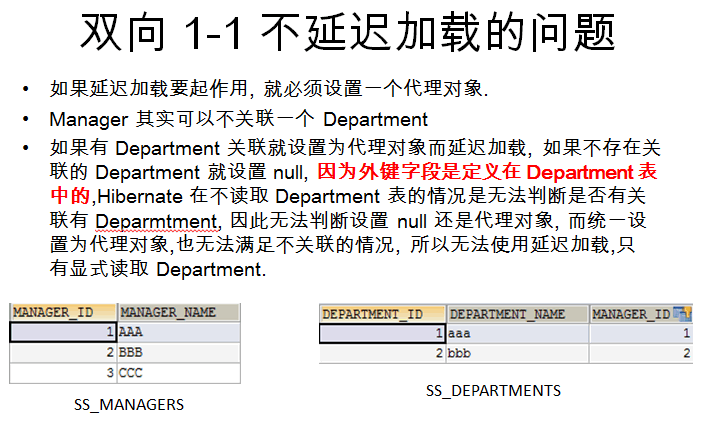

## 4.ManyToMany

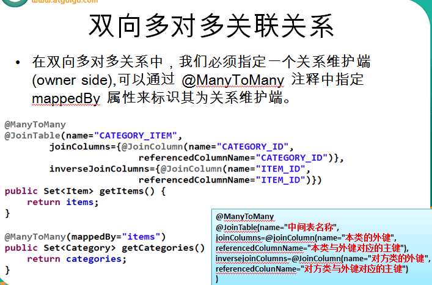

# 6.JPQL

## 1.JPQL语言

~~~xml
1.JPQL语言，即 Java Persistence Query Language 的简称。JPQL 是一种和 SQL 非常类似的中间性和对象化
	查语言，它最终会被编译成针对不同底层数据库的 SQL 查询，从而屏蔽不同数据库的差异。
2.JPQL语言的语句可以是 select 语句、update 语句或delete语句，它们都通过 Query 接口封装执行
~~~

## 2.javax.persistence.Query

~~~xml
Query接口封装了执行数据库查询的相关方法。调用 EntityManager 的 createQuery、create NamedQuery 
	及 createNativeQuery 方法可以获得查询对象，进而可调用 Query 接口的相关方法来执行查询操作。
~~~

方法

~~~java
Query接口的主要方法：
    1.*int executeUpdate()
        用于执行update或delete语句。
    2.*List getResultList()
        用于执行select语句并返回结果集实体列表。
    3.*Object getSingleResult()
    	用于执行只返回单个结果实体的select语句。
    4.*Query setFirstResult(int startPosition)
    	用于设置从哪个实体记录开始返回查询结果。
    5.*Query setMaxResults(int maxResult) 
    	用于设置返回结果实体的最大数。与setFirstResult结合使用可实现分页查询。

    6.Query setFlushMode(FlushModeType flushMode) 
    	设置查询对象的Flush模式。参数可以取2个枚举值：FlushModeType.AUTO 为自动更新数据库记录，
		FlushMode Type.COMMIT 为直到提交事务时才更新数据库记录。
	7.setHint(String hintName, Object value) 
		设置与查询对象相关的特定供应商参数或提示信息。参数名及其取值需要参考特定 JPA 实现库提供商的
		文档。如果第二个参数无效将抛出IllegalArgumentException异常。
	8.*setParameter(int position, Object value) 
		为查询语句的指定位置参数赋值。Position 指定参数序号，value 为赋给参数的值。
	9.setParameter(int position, Date d, TemporalType type) 
		为查询语句的指定位置参数赋 Date 值。Position 指定参数序号，value 为赋给参数的值，
		temporalType取 TemporalType 的枚举常量，包括 DATE、TIME 及 TIMESTAMP 三个，，用于将 Java 
		的 Date 型值临时转换为数据库支持的日期时间类型（java.sql.Date、java.sql.Time及
		java.sql.Timestamp）。	
	10.setParameter(int position, Calendar c, TemporalType type) 
		为查询语句的指定位置参数赋 Calenda r值。position 指定参数序号，value 为赋给参数的值，
		temporalType的含义及取舍同前。
	11.setParameter(String name, Object value) 
		为查询语句的指定名称参数赋值。
	12.setParameter(String name, Date d, TemporalType type) 
		为查询语句的指定名称参数赋 Date 值。用法同前。
	13.setParameter(String name, Calendar c, TemporalType type) 
		为查询语句的指定名称参数设置Calendar值。name为参数名，其它同前。该方法调用时如果参数位置或参
		数名不正确，或者所赋的参数值类型不匹配，将抛出 IllegalArgumentException 异常。

~~~

