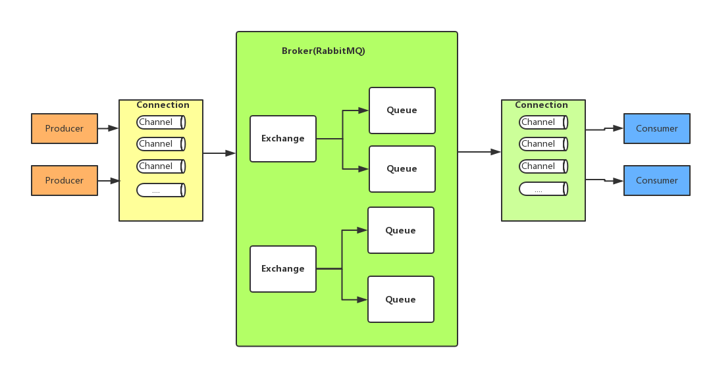
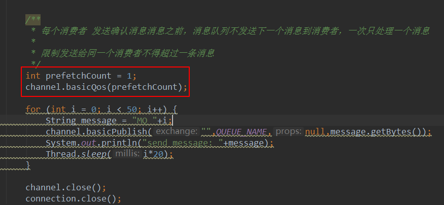
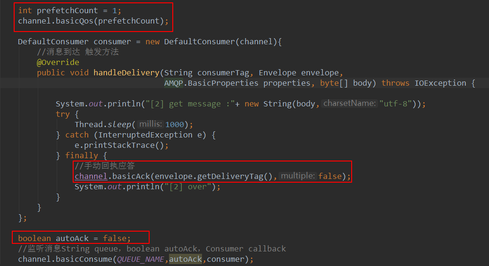
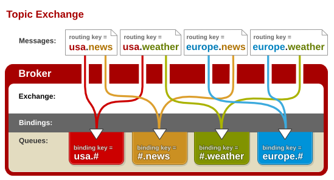
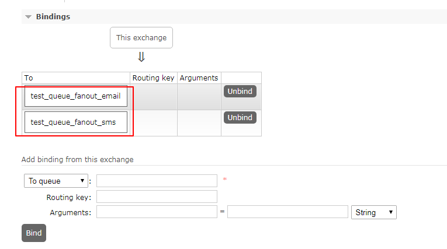
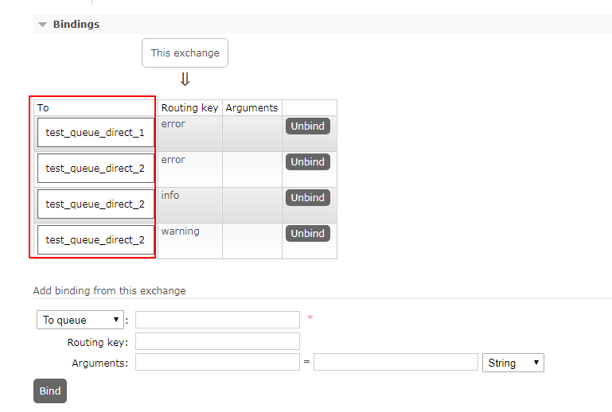

### RabbitMQ





### 2.收发信息的步骤

~~~xml

生产者：
1.创建连接工厂
ConnectionFactory factory = new ConnectionFactory();
需要设置参数：
	.setHost(String);
	.setPort(int);
	.setUsername(String);
	.setPassword(String);
	.setVirtualHost(String);
2.通过工厂对象创建连接
Connection connection = factory.newConnection();
3.通过连接对象创建通道
Channel channel = connection.createChannel();
	3.1队列声明
			/**
             * 声明队列，如果rabbit中没有此队列将自动创建
             * param1: 队列名称
             * param2: 是否持久化
             * param3: 队列是否独占此连接
             * param4: 队列不再使用时是否自动删除此队列
             * param5: 队列参数
             */
		.queueDeclare(String,boolean,boolean,boolean,Map);
	3.2消息发布
			/**
             * 消息发布方法
             * param1: Exchange的名称，如果没有指定名称，则使用 Default Exchange
             * param2: routingKey，消息的路由Key，用于Exchange（交换机）将消息转发到指定的消息队列
             * param3: 消息包含的属性
             * param4: 消息体
             */
            /**
             * 这里没有指定交换机，消息将发送给默认的交换机，每个队列也会绑定那个默认的交换机，
			*	但是不能
             * 绑定显示或是解除绑定
             * 默认的交换机，routingKey等于队列名称
             */
		.basicPublish("",QUEUE,null,message.getBytes());


消费者：
1.创建连接工厂
ConnectionFactory factory = new ConnectionFactory();
		//设置RabbitMQ所在服务器的ip和端口
        factory.setHost("127.0.0.1");
        factory.setPort(5672);
2.通过工厂对象创建连接
Connection connection = factory.newConnection();
3.通过连接对象创建通道
Channel channel = connection.createChannel();
	3.1队列声明
	3.2创建消费方法
        /**
         * 消费者接受消息调用此方法
         * @param consumerTag 消费者的标签，在channel.basicConsume()去指定
         * @param envelope    消息包的内容，可以从中获取消息id，消息的routingKey，交换机，消息
         *                      和重传标志（收到消息失败后是否需要重新发送）
         * @param properties
         * @param body
         * @throws IOException
         */
        DefaultConsumer consumer = new DefaultComsumer(channel){
			@Override
			handleDelivery();
        };
	3.3进行监听
		/**
         * 监听消息String queue，boolean autoAck，Consumer callback
         * 参数明细：
         * 1.队列名称
         * 2.是否自动回复，设置为true表示消息接收到自动向mq回复接收到了，
         *      mq接收到回复消息会删除消息，
         *      设置为false则需要手动回复
         * 3.消费消息的方法，消费者接收到消息后调用此方法
         */
        channel.basicConsume(QUEUE,true,consumer);
~~~

#### 1、发送端操作流程

- 1）创建连接
- 2）创建通道
- 3）声明队列
- 4）发送消息

#### 2、接收端

- 1）创建连接
- 2）创建通道
- 3）声明队列
- 4）监听队列
- 5）接收消息
- 6）ack回复


### 3.简单队列

#### 1.模型 
#### 


#### 2.获取连接的工具类

~~~java
public class ConnectionUtils {
    /**
     * 服务器地址
     */
    public static final String HOST = "127.0.0.1";

    /**
     * 服务器端口 AMQP
     */
    public static final Integer PORT = 5672;

    /**
     * 用户名
     */
    public static final String USERNAME = "guest";

    /**
     * 密码
     */
    public static final String PASSWORD = "guest";

    /**
     * 主机访问地址
     */
    public static final String VIRTUALHOST = "/";

    public static Connection getConnection(){
        ConnectionFactory factory = new ConnectionFactory();
        factory.setHost(HOST);
        factory.setPort(PORT);
        factory.setUsername(USERNAME);
        factory.setPassword(PASSWORD);
        factory.setVirtualHost(VIRTUALHOST);

        Connection connection = null;
        try {
            connection = factory.newConnection();
        } catch (IOException e) {
            e.printStackTrace();
        } catch (TimeoutException e) {
            e.printStackTrace();
        }
        return connection;
    }
}
~~~


#### 3.生产者生产消息

~~~java
public class Producer01 {
    //对列名称
    private static final String QUEUE = "helloworld";
    public static void main(String[] args) throws IOException, TimeoutException {
        Connection connection = null;
        Channel channel = null;
        try{
            ConnectionFactory factory = new ConnectionFactory();
            factory.setHost("localhost");
            factory.setPort(5672);
            factory.setUsername("guest");
            factory.setPassword("guest");
            //rabbitmq 默认虚拟机名称为"/"，虚拟机相当于一个独立的mq服务器
            factory.setVirtualHost("/");
            //创建与RabbitMQ服务的TCP连接
            connection = factory.newConnection();
            //创建与Exchange的通道，每个连接可以创建多个通道，每一个通道代表一个会话任务。
            channel = connection.createChannel();

            /**
             * 声明队列，如果rabbit中没有此队列将自动创建
             * param1: 队列名称
             * param2: 是否持久化
             * param3: 队列是否独占此连接
             * param4: 队列不再使用时是否自动删除此队列
             * param5: 队列参数
             */
            channel.queueDeclare(QUEUE,true,false,false,null);
            String message = "helloworld小明："+System.currentTimeMillis();
            /**
             * 消息发布方法
             * param1: Exchange的名称，如果没有指定名称，则使用 Default Exchange
             * param2: routingKey，消息的路由Key，用于Exchange（交换机）将消息转发到指定的消息队列
             * param3: 消息包含的属性
             * param4: 消息体
             */
            /**
             * 这里没有指定交换机，消息将发送给默认的交换机，每个队列也会绑定那个默认的交换机，
             *	但是不能
             * 绑定显示或是解除绑定
             * 默认的交换机，routingKey等于队列名称
             */
            channel.basicPublish("",QUEUE,null,
                    message.getBytes());
            System.out.println("Send Message is："+message);

        }catch (Exception e){
            e.printStackTrace();
        }finally {
            if (channel != null){
                channel.close();
            }
            if (connection != null){
                connection.close();
            }
        }
    }
}
~~~


#### 4.消费者消费消息

~~~java
public class Consumer01 {
    private static final String QUEUE = "helloworld";
    public static void main(String[] args) throws IOException, TimeoutException {
        ConnectionFactory factory = new ConnectionFactory();
        //设置RabbitMQ所在服务器的ip和端口
        factory.setHost("127.0.0.1");
        factory.setPort(5672);
        Connection connection = factory.newConnection();
        Channel channel = connection.createChannel();
        //声明队列
        channel.queueDeclare(QUEUE,true,false,false,null);
        //定义消费方法
        DefaultConsumer consumer = new DefaultConsumer(channel){
            /**
             * 消费者接受消息调用此方法
             * @param consumerTag 消费者的标签，在channel.basicConsume()去指定
             * @param envelope    消息包的内容，可以从中获取消息id，消息的routingKey，交换机，消息
             *                      和重传标志（收到消息失败后是否需要重新发送）
             * @param properties
             * @param body
             * @throws IOException
             */
            @Override
            public void handleDelivery(String consumerTag, Envelope envelope,
                                       AMQP.BasicProperties properties,
                                       byte[] body) throws IOException {
                //交换机
                String exchange = envelope.getExchange();
                //路由key
                String routingKey = envelope.getRoutingKey();
                //消息id
                long deliveryTag = envelope.getDeliveryTag();
                //消息内容
                String message = new String(body,"utf-8");
                //是否重传
                boolean isRedeliver = envelope.isRedeliver();
                System.out.println("exchange:"+exchange);
                System.out.println("routingKey:"+routingKey);
                System.out.println("deliveryTag:"+deliveryTag);
                System.out.println("isRedeliver:"+isRedeliver);
                System.out.println("message:"+message);
            }
        };

        /**
         * 监听消息String queue，boolean autoAck，Consumer callback
         * 参数明细：
         * 1.队列名称
         * 2.是否自动回复，设置为true表示消息接收到自动向mq回复接收到了，
         *		mq接收到回复消息会删除消息，设置为false则需要手动回复
         * 3.消费消息的方法，消费者接收到消息后调用此方法
         */
        channel.basicConsume(QUEUE,true,consumer);
    }
}
~~~

#### 5.简单队列的不足

耦合性高，生产者一一对应消费者（如何我想要有多个消费者消费队列中消息，这时候就不行了），队列名变更，这时候得同事变更。


### 4.work  queues 工作队列模式

#### 1.模型


 为什么会出现工作队列

simple队列是一一对应的，而且实际开发，生产者发送消息是毫不费力的，而消费者一般是要跟业务相结合的，消费者接受到消息之后就需要处理，可能需要花费时间，这时候队列就会积压了很多消息


#### 2.生产者

~~~java
public class Send {
    /**
     *               |-- C1
     * p -- Queue -- |
     *               |-- C2
     */
    public static final String QUEUE_NAME = "test_work_queue";
    public static void main(String[] args) throws IOException, TimeoutException, InterruptedException {
        //获取连接
        Connection connection = ConnectionUtils.getConnection();
        //获取Channel
        Channel channel = connection.createChannel();
        //声明Queue(String queueName, Boolean durable, Boolean exclusive, Boolean autoDelete, Map<String, Object> arguments)
        channel.queueDeclare(QUEUE_NAME,true,false,false,null);

        for (int i = 0; i < 50; i++) {
            String message = "MQ "+i;
            channel.basicPublish("",QUEUE_NAME,null,message.getBytes());
            System.out.println("send message: "+message);
            Thread.sleep(i*20);
        }
        channel.close();
        connection.close();
    }
}
~~~

#### 3.消费者1

~~~java
public class Receive1 {
    public static final String QUEUE_NAME = "test_work_queue";
    public static void main(String[] args) throws IOException {
        //获取连接
        Connection connection = ConnectionUtils.getConnection();
        //获取Channel
        Channel channel = connection.createChannel();
        //声明Queue
        channel.queueDeclare(QUEUE_NAME,true,false,false,null);
        DefaultConsumer consumer = new DefaultConsumer(channel){
            //消息到达 触发方法
            @Override
            public void handleDelivery(String consumerTag, Envelope envelope, AMQP.BasicProperties properties, byte[] body) throws IOException {

                System.out.println("[1] get message :"+ new String(body,"utf-8"));
                try {
                    Thread.sleep(1000*2);
                } catch (InterruptedException e) {
                    e.printStackTrace();
                } finally {
                    System.out.println("[1] over");
                }
            }
        };

        boolean autoAck = true;
        //监听消息String queue，boolean autoAck，Consumer callback
        channel.basicConsume(QUEUE_NAME,autoAck,consumer);
    }
}
~~~


#### 4.消费者2

~~~java
public class Receive2 {
    public static final String QUEUE_NAME = "test_work_queue";
    public static void main(String[] args) throws IOException {
        //获取连接
        Connection connection = ConnectionUtils.getConnection();
        //获取Channel
        Channel channel = connection.createChannel();
        //声明Queue
        channel.queueDeclare(QUEUE_NAME,true,false,false,null);
        DefaultConsumer consumer = new DefaultConsumer(channel){
            //消息到达 触发方法
            @Override
            public void handleDelivery(String consumerTag, Envelope envelope, AMQP.BasicProperties properties, byte[] body) throws IOException {

                System.out.println("[2] get message :"+ new String(body,"utf-8"));
                try {
                    Thread.sleep(1000);
                } catch (InterruptedException e) {
                    e.printStackTrace();
                } finally {
                    System.out.println("[2] over");
                }
            }
        };

        boolean autoAck = true;
        //监听消息String queue，boolean autoAck，Consumer callback
        channel.basicConsume(QUEUE_NAME,autoAck,consumer);
    }
}
~~~


#### 5.现象

消费者1和消费者2处理的消息是一样的。

消费者1：偶数

消费者2：奇数

这种方式叫做**轮询分发**（roun-robin）结果就是：不管谁忙活着谁清闲 都不会多给一个消息任务

任务消息总是平均分配。（你一个我一个）


### 5.公平分发 fair depatch

#### 1.说明

使用公平分发，必须关闭自动应答ack,改为手动

#### 2.生产者

~~~java
public class Send {
    /**
     *               |-- C1
     * p -- Queue -- |
     *               |-- C2
     */
    public static final String QUEUE_NAME = "test_work_queue";
    public static void main(String[] args) throws IOException, TimeoutException, InterruptedException {
        //获取连接
        Connection connection = ConnectionUtils.getConnection();
        //获取Channel
        Channel channel = connection.createChannel();
        //声明Queue(String queueName, Boolean durable, Boolean exclusive, Boolean autoDelete, Map<String, Object> arguments)
        channel.queueDeclare(QUEUE_NAME,true,false,false,null);
        /**
         * 每个消费者 发送确认消息消息之前，消息队列不发送下一个消息到消费者，一次只处理一个消息
         *
         * 限制发送给同一个消费者不得超过一条消息
         */
        int prefetchCount = 1;
        channel.basicQos(prefetchCount);
        for (int i = 0; i < 50; i++) {
            String message = "MQ "+i;
            channel.basicPublish("",QUEUE_NAME,null,message.getBytes());
            System.out.println("send message: "+message);
            Thread.sleep(i*20);
        }
        channel.close();
        connection.close();
    }
}
~~~

#### 3.消费者1

~~~java
public class Receive1 {
    public static final String QUEUE_NAME = "test_work_queue";
    public static void main(String[] args) throws IOException {
        //获取连接
        Connection connection = ConnectionUtils.getConnection();
        //获取Channel
        final Channel channel = connection.createChannel();
        //声明Queue
        channel.queueDeclare(QUEUE_NAME,true,false,false,null);
        int prefetchCount = 1;
        channel.basicQos(prefetchCount);
        DefaultConsumer consumer = new DefaultConsumer(channel){
            //消息到达 触发方法
            @Override
            public void handleDelivery(String consumerTag, Envelope envelope, AMQP.BasicProperties properties, byte[] body) throws IOException {

                System.out.println("[1] get message :"+ new String(body,"utf-8"));
                try {
                    Thread.sleep(1000*2);
                } catch (InterruptedException e) {
                    e.printStackTrace();
                } finally {
                    //手动回执应答
                    channel.basicAck(envelope.getDeliveryTag(),false);
                    System.out.println("[1] over");
                }
            }
        };
        boolean autoAck = false;//非自动应答
        //监听消息String queue，boolean autoAck，Consumer callback
        channel.basicConsume(QUEUE_NAME,autoAck,consumer);
    }
}
~~~

#### 4.消费者2

~~~java
public class Receive2 {
    public static final String QUEUE_NAME = "test_work_queue";
    public static void main(String[] args) throws IOException {
        //获取连接
        Connection connection = ConnectionUtils.getConnection();
        //获取Channel
        final Channel channel = connection.createChannel();
        //声明Queue
        channel.queueDeclare(QUEUE_NAME,true,false,false,null);
        int prefetchCount = 1;
        channel.basicQos(prefetchCount);
        DefaultConsumer consumer = new DefaultConsumer(channel){
            //消息到达 触发方法
            @Override
            public void handleDelivery(String consumerTag, Envelope envelope, AMQP.BasicProperties properties, byte[] body) throws IOException {

                System.out.println("[2] get message :"+ new String(body,"utf-8"));
                try {
                    Thread.sleep(1000);
                } catch (InterruptedException e) {
                    e.printStackTrace();
                } finally {
                    //手动回执应答
                    channel.basicAck(envelope.getDeliveryTag(),false);
                    System.out.println("[2] over");
                }
            }
        };
        boolean autoAck = false;
        //监听消息String queue，boolean autoAck，Consumer callback
        channel.basicConsume(QUEUE_NAME,autoAck,consumer);
    }
}
~~~

#### 5.与work queues的差别之处

##### 5.1 生产者




##### 5.2 消费者




#### 6.现象

消费者2处理的消息比消费者1多（能者多劳，公平分发）


### 6.消息应答 与 消息持久化

#### 6.1消息应答

自动确认模式：

​	RabbitMQ一旦将消息分发非消费之后，就会从内存中删除这个消息

现象：

​	这种情况下，如果杀死（kill）当前正在执行的消费者，就会丢失正在执行的消息。

```java
boolean autoAck = true;//自动应答
channel.basicConsume(QUEUE_NAME,autoAck,consumer);
```


手动确认模式：

~~~java
boolean autoAck = false;//非自动应答
//监听消息String queue，boolean autoAck，Consumer callback
channel.basicConsume(QUEUE_NAME,autoAck,consumer);
~~~

如果有一个消费者挂掉，就会交付给其他消费者。RabbitMQ支持消息应答，消费者发送一个消息应答，告诉RabbitMQ这个消息我已经处理完成，RabbitMQ可以将这个消息从**内存**中删除了。

(message acknowledgment)消息应答模式（Ack）是打开的， false。

如果RabbitMQ挂了，消息仍然会丢失。


#### 6.2消息持久化

```java
/**
 * 参数：
 *  queue:队列的名称
 *  durable:能否持久化
 *  exclusive:是否独占连接
 *  autoDelete:是否自动删除
 *  arguments:参数
 */
boolean durable = true;
channel.queueDeclare(QUEUE_NAME,durable,false,false,null);

```

我们将程序中的boolean durable = true; 改为false是不可以的，会报错。尽管代码是正确的，但是该队列应该声明定义好了，就不可以再进行修改了。（RabbitMQ不允许用不同的参数重新定义一个已经存在的队列（可以先删除再创建））

### 7.Exchange(交换机，转发器)

一方面是接收生产者的消息，另一方面是向队列推送消息。

匿名转发：“”;

#### 7.1 Fanout Exchange(不处理路由键)


只需要将生产者与exchange进行bind，就会把exchange中的信息转发到与exchange绑定的所有Queue中。

~~~xml
任何发送到Fanout Exchange的消息都会被转发到与该Exchange绑定(Binding)的所有Queue上。

1.可以理解为路由表的模式

2.这种模式不需要RouteKey

3.这种模式需要提前将Exchange与Queue进行绑定，一个Exchange可以绑定多个Queue，一个Queue可以同多个Exchange进行绑定。

4.如果接受到消息的Exchange没有与任何Queue绑定，则消息会被抛弃。
~~~


#### 7.2 Direct Exchange	 处理路径键


~~~xml
任何发送到Direct Exchange的消息都会被转发到RouteKey中指定的Queue。

1.一般情况可以使用rabbitMQ自带的Exchange：”"(该Exchange的名字为空字符串，下文称其为default Exchange)。

2.这种模式下不需要将Exchange进行任何绑定(binding)操作

3.消息传递时需要一个“RouteKey”，可以简单的理解为要发送到的队列名字。

4.如果vhost中不存在RouteKey中指定的队列名，则该消息会被抛弃。
~~~


#### 7.3	Topic Exchange 




~~~xml
任何发送到Topic Exchange的消息都会被转发到所有关心RouteKey中指定话题的Queue上

1.这种模式较为复杂，简单来说，就是每个队列都有其关心的主题，所有的消息都带有一个“标题”(RouteKey)，Exchange会将消息转发到所有关注主题能与RouteKey模糊匹配的队列。

2.这种模式需要RouteKey，也许要提前绑定Exchange与Queue。


3.在进行绑定时，要提供一个该队列关心的主题，如“#.log.#”表示该队列关心所有涉及log的消息(一个RouteKey为”MQ.log.error”的消息会被转发到该队列)。

4.“#”表示0个或若干个关键字，“*”表示一个关键字。如“log.*”能与“log.warn”匹配，无法与“log.warn.timeout”匹配；但是“log.#”能与上述两者匹配。

5.同样，如果Exchange没有发现能够与RouteKey匹配的Queue，则会抛弃此消息。
~~~


=======


**性能排序：fanout > direct >> topic。比例大约为11：10：6**


### 8.订阅模式Publish/Subscribe(fanout)

#### 1.模型


#### 2.解读

1. 一个生产者，多个消费者。
2. 每一个消费者都有自己对应的队列。
3. 生产者没有直接把消息发送到队列 而是发送到了交换机 （转发器exchange）
4. 每个队列都要绑定到交换机上
5. 生产者发送的消息经过交换机到达队列 ，就能实现一个消息就可以被多个消费者消费。

~~~xml
发布订阅模式：
1、每个消费者监听自己的队列。
2、生产者将消息发给broker，由交换机将消息转发到绑定此交换机的每个队列，每个绑定交换机的队列都将接收
到消息
~~~


注册 --> 邮件 --> 短信

#### 3.发送者

~~~java
public class Send {
    public static final String QUEUE_NAME = "test_queue_fanout";
    public static final String EXCHANGE_NAME = "test_exchange_fanout";
    public static void main(String[] args) throws IOException, TimeoutException {
        //通过工具类获取连接
        Connection connection = ConnectionUtils.getConnection();
        //创建Channel
        Channel channel = connection.createChannel();
        /**
         * 声明交换机
         * 参数：
         * exchange:exchange的名字
         * type:exchange的类型
         */
        channel.exchangeDeclare(EXCHANGE_NAME,"fanout");//分发
        //发送消息
        String message = "hello publish/subscribe";
        channel.basicPublish(EXCHANGE_NAME,"",null,message.getBytes());
        System.out.println("send message : "+message);
        channel.close();
        connection.close();
    }
}
~~~


#### 4.exchange图示


**消息去哪里了？？**丢失了，因为交换机没有存储的能力，在RabbitMQ里面只有队列有存储能力。因为此时没有把交换机和相应的队列进行绑定，所以数据就丢失了。


#### 5.发送者

~~~java
public class Send {
    public static final String EXCHANGE_NAME = "test_exchange_fanout";
    public static void main(String[] args) throws IOException, TimeoutException {

        //通过工具类获取连接
        Connection connection = ConnectionUtils.getConnection();
        //创建Channel
        Channel channel = connection.createChannel();
        //声明交换机
        /**
         * 参数：
         * exchange:exchange的名字
         * type:exchange的类型
         */
        channel.exchangeDeclare(EXCHANGE_NAME,"fanout");//分发
        //发送消息
        String message = "hello publish/subscribe";
        channel.basicPublish(EXCHANGE_NAME,"",null,message.getBytes());
        System.out.println("send message : "+message);
        channel.close();
        connection.close();
    }
}
~~~


#### 6.消费者1

~~~java
public class Receive1 {
    public static final String QUEUE_NAME = "test_queue_fanout_email";
    public static final String EXCHANGE_NAME = "test_exchange_fanout";
    public static void main(String[] args) throws IOException {
        Connection connection = ConnectionUtils.getConnection();
        final Channel channel = connection.createChannel();
        //队列声明
        channel.queueDeclare(QUEUE_NAME,true,false,false,null);
        channel.basicQos(1);
        //绑定队列到交换机
        channel.queueBind(QUEUE_NAME,EXCHANGE_NAME,"");

        DefaultConsumer consumer = new DefaultConsumer(channel){
            @Override
            public void handleDelivery(String consumerTag, Envelope envelope, AMQP.BasicProperties properties, byte[] body) throws IOException {
                System.out.println("[1] receive message:"+new String(body,"utf-8"));
                try {
                    Thread.sleep(2000);
                } catch (InterruptedException e) {
                    e.printStackTrace();
                }finally {
                    System.out.println("[1] over");
                    channel.basicAck(envelope.getDeliveryTag(),false);
                }
            }
        };

        channel.basicConsume(QUEUE_NAME,false,consumer);
    }
}
~~~

#### 7.消费者2

~~~java
public class Receive2 {
    public static final String QUEUE_NAME = "test_queue_fanout_sms";
    public static final String EXCHANGE_NAME = "test_exchange_fanout";
    public static void main(String[] args) throws IOException {
        Connection connection = ConnectionUtils.getConnection();
        final Channel channel = connection.createChannel();
        //队列声明
        channel.queueDeclare(QUEUE_NAME,true,false,false,null);
        channel.basicQos(1);
        //绑定队列到交换机
        channel.queueBind(QUEUE_NAME,EXCHANGE_NAME,"");

        DefaultConsumer consumer = new DefaultConsumer(channel){
            @Override
            public void handleDelivery(String consumerTag, Envelope envelope, AMQP.BasicProperties properties, byte[] body) throws IOException {
                System.out.println("[2] receive message:"+new String(body,"utf-8"));
                try {
                    Thread.sleep(2000);
                } catch (InterruptedException e) {
                    e.printStackTrace();
                }finally {
                    System.out.println("[2] over");
                    channel.basicAck(envelope.getDeliveryTag(),false);
                }
            }
        };
        channel.basicConsume(QUEUE_NAME,false,consumer);
    }
}
~~~


#### 8.管理界面




### 9.Routing(direct)

#### 1.路由模型


#### 2.生产者

~~~java
public class Send {
    //exchange name
    public static final String EXCHANGE_NAME = "test_exchange_direct";
    //routing key
    public static final String ROUTING_KEY = "error";
    public static void main(String[] args) throws IOException, TimeoutException {
        //获得连接
        Connection connection = ConnectionUtils.getConnection();
        //创建Channel
        Channel channel = connection.createChannel();
        //声明交换机
        channel.exchangeDeclare(EXCHANGE_NAME,"direct");
        //消息
        String message = "hello direct!"+ROUTING_KEY;
        //发布消息
        channel.basicPublish(EXCHANGE_NAME,ROUTING_KEY,null,message.getBytes());
        System.out.println("send message:"+message);
        //资源释放
        channel.close();
        connection.close();
    }
}
~~~


#### 3.消费者1

~~~java
public class Receive1 {
    //queue name
    public static final String QUEUE_NAME = "test_queue_direct_1";
    //exchange name
    public static final String EXCHANGE_NAME = "test_exchange_direct";
    //routing key
    public static final String ROUTING_KEY = "error";
    public static void main(String[] args) throws IOException, TimeoutException {
        //获得Connection
        Connection connection = ConnectionUtils.getConnection();
        //创建Channel
        final Channel channel = connection.createChannel();
        //声明Queue
        channel.queueDeclare(QUEUE_NAME,true,false,false,null);
        channel.basicQos(1);
        //绑定
        channel.queueBind(QUEUE_NAME,EXCHANGE_NAME,ROUTING_KEY);
        DefaultConsumer consumer = new MyDefaultConsumer(channel,"1");
        channel.basicConsume(QUEUE_NAME,false,consumer);
    }
}
~~~


#### 4.消费者2

~~~java
public class Receive2 {
    //queue name
    public static final String QUEUE_NAME = "test_queue_direct_2";
    //exchange name
    public static final String EXCHANGE_NAME = "test_exchange_direct";
    //routing key
    public static final String ROUTING_KEY1 = "info";
    public static final String ROUTING_KEY2 = "error";
    public static final String ROUTING_KEY3 = "warning";
    public static void main(String[] args) throws IOException, TimeoutException {
        //获得Connection
        Connection connection = ConnectionUtils.getConnection();
        //创建Channel
        final Channel channel = connection.createChannel();
        //声明Queue
        channel.queueDeclare(QUEUE_NAME,true,false,false,null);
        channel.basicQos(1);
        //绑定
        channel.queueBind(QUEUE_NAME,EXCHANGE_NAME,ROUTING_KEY1);
        channel.queueBind(QUEUE_NAME,EXCHANGE_NAME,ROUTING_KEY2);
        channel.queueBind(QUEUE_NAME,EXCHANGE_NAME,ROUTING_KEY3);
        DefaultConsumer consumer = new MyDefaultConsumer(channel,"2");
        channel.basicConsume(QUEUE_NAME,false,consumer);
    }
}
~~~


5.MyDefaultConsumer

~~~java
public class MyDefaultConsumer extends DefaultConsumer {
    private Channel channel = null;
    private String name = "";
    public MyDefaultConsumer(Channel channel,String name) {
        super(channel);
        this.channel = channel;
        this.name = name;
    }
    @Override
    public void handleDelivery(String consumerTag, Envelope envelope, AMQP.BasicProperties properties, byte[] body) throws IOException {
        System.out.println(name+" receive message: "+new String(body,"utf-8"));
        try {
            Thread.sleep(1000);
        } catch (InterruptedException e) {
            e.printStackTrace();
        }finally {
            System.out.println(name+" over");
            channel.basicAck(envelope.getDeliveryTag(),false);
        }
    }
}
~~~


#### 5.Exchanges图示




### 10.Topic(topic)

#### 1.模型


~~~xml
.“#”表示0个或若干个关键字，“”表示一个关键字。如“log.”能与“log.warn”匹配，无法与“log.warn.timeout”匹配；但是“log.#”能与上述两者匹配。

Goods.insert |
Goods.update | ==> Goods.# 
Goods.delete |

~~~


#### 2.生产者

~~~java
public class Send {
    public static final String EXCHANGE_NAME = "test_exchange_topic";
    public static void main(String[] args) throws IOException, TimeoutException {
    //获得连接
        Connection connection = ConnectionUtils.getConnection();
        //创建Channel
        Channel channel = connection.createChannel();
        //声明交换机
        channel.exchangeDeclare(EXCHANGE_NAME,"topic");
        String message = "商品。。。";
        //发布消息
        channel.basicPublish(EXCHANGE_NAME,"goods.delete",null,message.getBytes());
        System.out.println("topic send message:"+message);
        channel.close();
        connection.close();
    }
}
~~~


#### 3.消费者1

~~~java
public class Receive1 {
    //queue name
    public static final String QUEUE_NAME = "test_queue_topic_1";
    //exchange name
    public static final String EXCHANGE_NAME = "test_exchange_topic";
    //routing key
    public static final String ROUTING_KEY = "goods.add";
    public static void main(String[] args) throws IOException, TimeoutException {
        //获得Connection
        Connection connection = ConnectionUtils.getConnection();
        //创建Channel
        final Channel channel = connection.createChannel();
        //声明Queue
        channel.queueDeclare(QUEUE_NAME,true,false,false,null);
        channel.basicQos(1);
        //绑定
        channel.queueBind(QUEUE_NAME,EXCHANGE_NAME,ROUTING_KEY);
        DefaultConsumer consumer = new MyDefaultConsumer(channel,"topic1");
        channel.basicConsume(QUEUE_NAME,false,consumer);
    }
}
~~~


#### 4.消费者2

~~~java
public class Receive2 {
    //queue name
    public static final String QUEUE_NAME = "test_queue_topic_2";
    //exchange name
    public static final String EXCHANGE_NAME = "test_exchange_topic";
    //routing key
    public static final String ROUTING_KEY = "goods.#";
    public static void main(String[] args) throws IOException, TimeoutException {
        //获得Connection
        Connection connection = ConnectionUtils.getConnection();
        //创建Channel
        final Channel channel = connection.createChannel();
        //声明Queue
        channel.queueDeclare(QUEUE_NAME,true,false,false,null);
        channel.basicQos(1);
        //绑定
        channel.queueBind(QUEUE_NAME,EXCHANGE_NAME,ROUTING_KEY);
        DefaultConsumer consumer = new MyDefaultConsumer(channel,"topic2");
        channel.basicConsume(QUEUE_NAME,false,consumer);
    }
}
~~~


### 11.RabbitMQ的消息确认机制(事务+confirm)

在rabbitMQ中 我们可以通过持久化数据，解决rabbitmq服务器异常的数据丢失问题。

问题：生产者将消息发送出来之后，消息到底有没有到RabbitMQ服务器，默认的情况是不知道的。


两种方式：

​	AMQP实现了事务机制

​	Confirm模式

事务机制：

txSelect txCommit txRollback

txSelect:用户将当前channel设置成transaction模式、

txCommit:用于提交事务

txRollback：回滚事务


#### 1事务机制

##### 生产者

~~~java
public class TxSend {

    private static final String QUEUE_NAME = "test_queue_tx";

    public static void main(String[] args) throws IOException, TimeoutException {
        Connection connection = ConnectionUtils.getConnection();
        Channel channel = connection.createChannel();
        //声明queue
        channel.queueDeclare(QUEUE_NAME,false,false,false,null);
        String msgString = "hello tx message!";

        System.out.println("send message:"+msgString);
        try{
            //开始事务
            channel.txSelect();

            channel.basicPublish("",QUEUE_NAME,null,msgString.getBytes());
            int i = 1/0;
            channel.txCommit();
            //事务提交
        }catch (Exception e){
            //事务回滚
            channel.txRollback();
            System.out.println("send mesage txRollback");
        }
        channel.close();
        connection.close();
    }
}
~~~


##### 消费者

~~~java
public class TxReceive {
    private static final String QUEUE_NAME = "test_queue_tx";

    public static void main(String[] args) throws IOException, TimeoutException {

        Connection connection = ConnectionUtils.getConnection();
        Channel channel = connection.createChannel();
        //声明queue
        channel.queueDeclare(QUEUE_NAME, false, false, false, null);

        DefaultConsumer consumer = new DefaultConsumer(channel){
            @Override
            public void handleDelivery(String consumerTag, Envelope envelope, AMQP.BasicProperties properties, byte[] body) throws IOException {
                System.out.println("receive:"+new String(body,"utf-8"));
            }
        };

        channel.basicConsume(QUEUE_NAME,true,consumer);

    }
}
~~~


#### 2.Confirm模式


##### 生产者端confirm模式的实现原理

~~~
生产者将信道设置成confirm模式，一旦信道进入confirm模式，所有在该信道上面发布的消息都会指派成一个唯一的id（从1开
始），一旦消息被投递到所有匹配的队列之后，broker就会发送一个确认给生产者（包含消息的唯一ID），这就使得生产者知道消
息已经正确到达目的队列了，如果消息和队列是可持久化的，那么确认消息会将消息写入磁盘之后发出，broker回传给生产者的确认消息中deliver-tag域包含了确认消息的序列号，此外broker也可以设置basic.ack的multiple域，表示到这个序列号之前的所有消息都已经得到了处理。
~~~


Confirm模式最大的好处就在于它是异步的、

Nack；

开启confirm模式。

Channel.confirmSelect();

编程模式：

1.普通 发一条 waitForConfirms()

2.批量 发一批 waitForConfirms()

3.异步 Confirm模式：提供一个回调的方法，

生产者：

~~~java
/**
 * 批量模式
 */
public class Send2 {

    private static final String QUEUE_NAME = "test_queue_confirm1";

    public static void main(String[] args) throws IOException, InterruptedException, TimeoutException {
        Connection connection = ConnectionUtils.getConnection();
        Channel channel = connection.createChannel();

        channel.queueDeclare(QUEUE_NAME,false,false,false,null);

        //生产者调用confirmSelect模式 将channel设置为Confirm模式
        channel.confirmSelect();


        String msgString = "Hello confirm message batch";
        //批量发送消息
        for (int i = 0; i < 10; i++) {
            channel.basicPublish("",QUEUE_NAME,null,msgString.getBytes());
        }
        //确认
        if(!channel.waitForConfirms()){
            System.out.println("message send failed");
        }else{
            System.out.println("message send ok");
        }

        channel.close();
        connection.close();
    }
}
~~~


异步模式：

~~~java
Channel对象提供的confirmListener（）回调方法值包deliveryTag（当前Channel发出的消息序号），我们需要自己为每一个Channel维护一个unconfirm的消息序列集合，每publish一条数据，集合中元素加1.每回到一次handleAck方法，unconfirm集合删除相应的一条（multiple=false）或多条（multiple=true），从程序的运行效率来看，这个unconfirm集合最好采用有序集合sortedset存储结构。
~~~


##### publish-subscribe和work queues的区别

~~~java
1、publish/subscribe与work queues有什么区别。
区别：
1）work queues不用定义交换机，而publish/subscribe需要定义交换机。
2）publish/subscribe的生产方是面向交换机发送消息，work queues的生产方是面向队列发送消息(底层使用默
	认交换机)。
3）publish/subscribe需要设置队列和交换机的绑定，work queues不需要设置，实质上work queues会将队列绑
定到默认的交换机 。
相同点：
所以两者实现的发布/订阅的效果是一样的，多个消费端监听同一个队列不会重复消费消息。
 
2、实质工作用什么 publish/subscribe还是work queues。
建议使用 publish/subscribe，发布订阅模式比工作队列模式更强大，并且发布订阅模式可以指定自己专用的交换
机。
 
~~~


4.4.4思考  
1、本案例的需求使用Routing工作模式能否实现？
使用Routing模式也可以实现本案例，共设置三个 routingkey，分别是email、sms、all，email队列绑定email和
all，sms队列绑定sms和all，这样就可以实现上边案例的功能，实现过程比topics复杂。
Topic模式更多加强大，它可以实现Routing、publish/subscirbe模式的功能。


Routing 与 Topic的区别

~~~xml
使用Routing模式时，生产者生产信息是带有特殊的rountingKey,一条消息只会发送到一个Queue中，消费者通过唯
一的routingKey来监听指定的Queue

使用Topic模式时，生产者生产消息时带有通用的routingKey，一条信息可以发送到符合条件的Queue中，消费者通过配置带有#通配符的routingKey来监听满足条件的Queue。
~~~


#### 6.headers

~~~xml
Headers类型的Exchanges是不处理路由键的，而是根据发送的消息内容中的headers属性进行匹配。在绑定Queue与
Exchange时指定一组键值对；当消息发送到RabbitMQ时会取到该消息的headers与Exchange绑定时指定的键值对
进行匹配；如果完全匹配则消息会路由到该队列，否则不会路由到该队列。headers属性是一个键值对，可以是
Hashtable，键值对的值可以是任何类型，而fanout，direct，topic的路由必须都需要字符串形式的。

匹配规则x-match有下列两种类型：
x-match=all:表示所有的键值对都可匹配才可以接收到消息。
x-match=any:表示只有有键值对匹配就可以接收到到消息。
~~~


header模式与routing不同的地方在于，header模式取消routingkey，使用header中的 key/value（键值对）匹配
队列。
案例：
根据用户的通知设置去通知用户，设置接收Email的用户只接收Email，设置接收sms的用户只接收sms，设置两种
通知类型都接收的则两种通知都有效。
代码：
1）生产者
队列与交换机绑定的代码与之前不同，如下：

~~~java
Map<String, Object> headers_email = new Hashtable<String, Object>();
headers_email.put("inform_type", "email");
Map<String, Object> headers_sms = new Hashtable<String, Object>();
headers_sms.put("inform_type", "sms");
channel.queueBind(QUEUE_INFORM_EMAIL,EXCHANGE_HEADERS_INFORM,"",headers_email);
channel.queueBind(QUEUE_INFORM_SMS,EXCHANGE_HEADERS_INFORM,"",headers_sms);
~~~


通知：

~~~java
String message = "email inform to user"+i;
Map<String,Object> headers =  new Hashtable<String, Object>();
headers.put("inform_type", "email");//匹配email通知消费者绑定的header
//headers.put("inform_type", "sms");//匹配sms通知消费者绑定的header
AMQP.BasicProperties.Builder properties = new AMQP.BasicProperties.Builder();
properties.headers(headers);
//Email通知
channel.basicPublish(EXCHANGE_HEADERS_INFORM, "", properties.build(), message.getBytes());

~~~


消费者：

~~~java
channel.exchangeDeclare(EXCHANGE_HEADERS_INFORM, BuiltinExchangeType.HEADERS);
Map<String, Object> headers_email = new Hashtable<String, Object>();
headers_email.put("inform_email", "email");
//交换机和队列绑定
channel.queueBind(QUEUE_INFORM_EMAIL,EXCHANGE_HEADERS_INFORM,"",headers_email);
//指定消费队列
channel.basicConsume(QUEUE_INFORM_EMAIL, true, consumer);
 
~~~


7.RPC

RPC即客户端远程调用服务端的方法 ，使用MQ可以实现RPC的异步调用，基于Direct交换机实现，流程如下：

- 1、客户端即是生产者就是消费者，向RPC请求队列发送RPC调用消息，同时监听RPC响应队列。
- 2、服务端监听RPC请求队列的消息，收到消息后执行服务端的方法，得到方法返回的结果
- 3、服务端将RPC方法 的结果发送到RPC响应队列
- 4、客户端（RPC调用方）监听RPC响应队列，接收到RPC调用结果。


