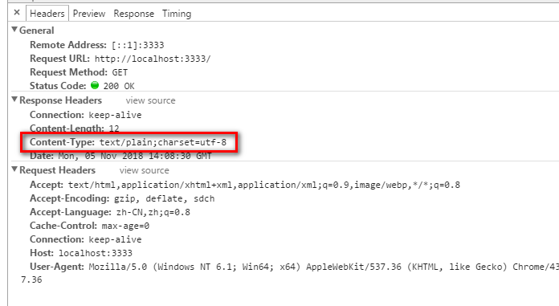
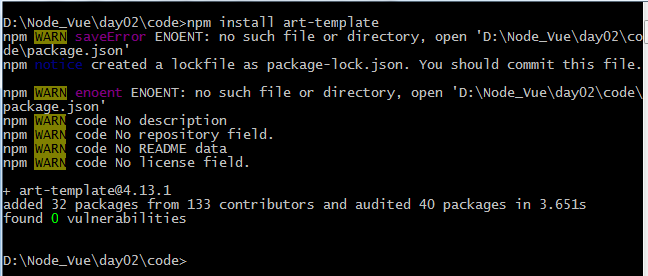
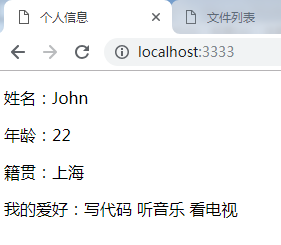
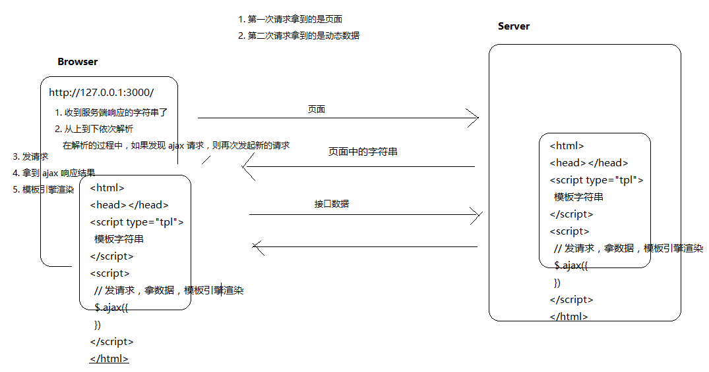
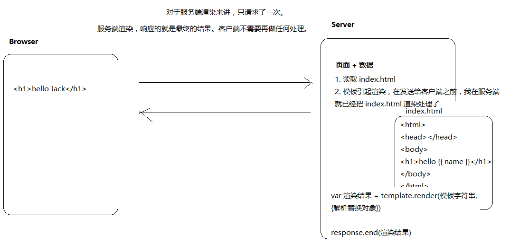

# Nodejs

## 1.说在前面的：

### 1.简介

- Node.js® is a JavaScript runtime built on [Chrome's V8 JavaScript engine](https://developers.google.com/v8/).
  - Node.js不是一门语言
  - Node.js不是库，也不是框架
  - Node.js是一个JavaScript运行环境
  - 简单点来说就是node.js可以解析和执行JavaScript代码。
  - 以前只有浏览器可以解析和执行JavaScript代码
  - 也就是说现在的JavaScript可以完全脱离浏览器运行，一切都归功于node.js
  - Event-driven 事件驱动，
  - non-blocking i/o模型 非阻塞的io模型
  - npm是世界上最大的开源库生态系统
  - 绝大多数JavaScript相关的包都存放在了npm上
  - 构建于Chrome的v8引擎之上
    - 代码只是具有特定格式的字符串而已
    - 引擎可以认识它，引擎可以帮你解析和执行
    - google chrome的v8引擎是目前公认的解析和执行JavaScript代码最快的
    - Node.js的作者把google Chrome的v8引擎移植出来，开发一个独立的JavaScript运行环境。


- 浏览器中的JavaScript
  - ecmascript
    - 基本语法
  - BOM
  - DOM
- Node.js中的JavaScript
  - 没有BOM，DOM
  - EcmaCript
  - 在node这个js执行环境中为JavaScript提供来一些服务器级别的操作API
    - 文件读写
    - 网络服务的构建
    - 网络通信
    - http服务器 

### 2.Node.js能做什么

- web 服务端后台
- 命令行工具
  - npm（node）
  - git(c 语言)
  - hexo（node）
- 对于前段工程师来讲，接触node最多的是它的命令行工具
  - 自己写的少，主要是用第三方
  - webpack
  - gulp

### 3.一些资源

- 《深入浅出Node.js》 朴灵
  - 偏理论
- 《Node.js权威指南》
  - API讲解
  - 没有实战
- Node入门：[www.nodebeginner.org/index-zh-cn.html](www.nodebeginner.org/index-zh-cn.html)

## 2.起步

### 1.安装Node

- 官网`nodejs.org`安装。一路`next`
- 使用`node --version`或`node -v`看版本，
- 如果有版本号，则表示安装成功

### 2.HelloWorld

在目录写一段示例代码：

```
var foo = 'bar'
console.log(foo);
```

进入当前目录下，使用 `node +文件名.js`运行


## 3.起步案例

### 3.1读文件

~~~js
var fs = require("fs");

//异步回调方式读取文件
fs.readFile("./data/read.txt",function (error,data) {
    if(error){
        console.log(error);
    }else{
        console.log(data.toString());
    }
});
console.log("end");

        /*
            end
            你好，nodejs
            测试nodejs读取文件
        */

//使用同步方式读取文件
var fs = require("fs");
var data = fs.readFileSync("./data/read.txt","utf-8");
console.log(data);
console.log("end");
        /*
            你好，nodejs
            测试nodejs读取文件
            end
        */
~~~

### 3.2写文件

~~~js
var fs = require("fs");
fs.writeFile("./data/write.txt","你好，我是nodejs，这是测试nodejs写文件",function (error) {
    if(error){
        console.log("写文件失败！"+error);
    }else{
        console.log("写文件成功！");
    }
});
~~~

### 3.3http请求

301 永久重定向（浏览器中会记住）

302 临时重定向

~~~js

var http = require("http");

var server = http.createServer();

server.listen("3333",function () {
    console.log("http服务器创建成功，正在监听3333端口");
});

server.on("request",function (req,res) {

    var products =[{
        name:"xiaomi2",
        price:"1999"
    },{
        name:"xiaomi5",
        price:"2999"
    },{
        name:"xiaomi8",
        price:"3999"
    }
    ];

    if(req.url === "/products"){
        res.end(JSON.stringify(products));
    }else{
        res.end("404 File Not Found!");
    }
});
~~~


## 4.事件

~~~js
Node.js 所有的异步 I/O 操作在完成时都会发送一个事件到事件队列。在开发者看来，事件由 EventEmitter 对象提供。前面提到的 fs.readFile 和 http.createServer 的回调函数都是通过 EventEmitter  来实现的。下面我们一个简单的例子说明 EventEmitter 的用法： 

//导入events模块
var events = require("events");

//使用events模块对象new出一个EventEmitter对象
var eventEmitter = new events.EventEmitter();

//使用eventEmitter绑定一个事件（监听一个事件）
eventEmitter.on("some_events",function () {
    console.log("事件执行了");
});

console.log(new Date());
//触发事件
setTimeout(function () {
    eventEmitter.emit("some_events");
    console.log(new Date());
},2000);

~~~

**可以看出**：

- 需要使用`require`将`events`核心模块引入

- 使用`eventEmitter.on();`进行事件绑定
- 使用`eventEmitter.emit();`进行事件触发


### 4.1事件方法

~~~js
var events = require("events");

var eventEmitter = new events.EventEmitter();

//定义两个用于回调的函数
var listener1 = function(){
    console.log("监听器listener1执行");
};

var listener2 = function(){
    console.log("监听器listener2执行");
};


//绑定connection事件，处理函数listener1
eventEmitter.addListener("connection",listener1);
//绑定connection事件，处理函数listener2
eventEmitter.on("connection",listener2);

var eventListeners = eventEmitter.listenerCount("connection");
console.log(eventListeners+"个监听器监听事件");

//处理connection事件

eventEmitter.emit("connection");

//移除绑定事件listener1函数
eventEmitter.removeListener("connection",listener1);
console.log("listener1不再监听");

eventEmitter.emit("connection");
eventListeners = eventEmitter.listenerCount("connection");
console.log(eventListeners+"个监听器监听事件");

console.log("程序执行完毕！");
~~~


### 4.2方法

| 序号   | 方法 & 描述                                  |
| ---- | ---------------------------------------- |
| 1    | **addListener(event, listener)**  为指定事件添加一个监听器到监听器数组的尾部。 |
| 2    | **on(event, listener)** 为指定事件注册一个监听器，接受一个字符串 event 和一个回调函数。 `server.on('connection', function (stream) {   console.log('someone connected!'); });` |
| 3    | **once(event, listener)** 为指定事件注册一个单次监听器，即 监听器最多只会触发一次，触发后立刻解除该监听器。 `server.once('connection', function (stream) {   console.log('Ah, we have our first user!'); });` |
| 4    | **removeListener(event, listener)** 移除指定事件的某个监听器，监听器必须是该事件已经注册过的监听器。它接受两个参数，第一个是事件名称，第二个是回调函数名称。 `var callback = function(stream) {   console.log('someone connected!'); }; server.on('connection', callback); // ... server.removeListener('connection', callback);` |
| 5    | **removeAllListeners([event])** 移除所有事件的所有监听器， 如果指定事件，则移除指定事件的所有监听器。 |
| 6    | **setMaxListeners(n)** 默认情况下， EventEmitters 如果你添加的监听器超过 10 个就会输出警告信息。 setMaxListeners 函数用于提高监听器的默认限制的数量。 |
| 7    | **listeners(event)** 返回指定事件的监听器数组。       |
| 8    | **emit(event, [arg1], [arg2], [...])** 按参数的顺序执行每个监听器，如果事件有注册监听返回 true，否则返回 false。 |

### 4.3类方法

| 序号   | 方法 & 描述                                  |
| ---- | ---------------------------------------- |
| 1    | **listenerCount(emitter, event)** 返回指定事件的监听器数量。 |

```
events.EventEmitter.listenerCount(emitter, eventName) //已废弃，不推荐
events.emitter.listenerCount(eventName) //推荐
```

### 4.4事件

| 序号   | 事件 & 描述                                  |
| ---- | ---------------------------------------- |
| 1    | **newListener**   **event** - 字符串，事件名称 **listener** - 处理事件函数  该事件在添加新监听器时被触发。 |
| 2    | **removeListener**   **event** - 字符串，事件名称 **listener** - 处理事件函数  从指定监听器数组中删除一个监听器。需要注意的是，此操作将会改变处于被删监听器之后的那些监听器的索引 |

### 4.5error事件

~~~xml
error 事件

EventEmitter 定义了一个特殊的事件 error，它包含了错误的语义，我们在遇到 异常的时候通常会触发 error 
事件。
当 error 被触发时，EventEmitter 规定如果没有响 应的监听器，Node.js 会把它当作异常，退出程序并输出错误信息。
我们一般要为会触发 error 事件的对象设置监听器，避免遇到错误后整个程序崩溃。例如：
~~~

```js
var events = require("events");
var eventEmitter = new events.EventEmitter();
eventEmitter.emit("error");
```

运行时会显示以下错误： 

~~~js
events.js:173
    throw err; // Unhandled 'error' event
    ^

Error [ERR_UNHANDLED_ERROR]: Unhandled error.
    at EventEmitter.emit (events.js:171:17)
    at Object.<anonymous> (D:\Node_Vue\Node\day01\events\04-error.js:4:14)
    at Module._compile (internal/modules/cjs/loader.js:707:30)
    at Object.Module._extensions..js (internal/modules/cjs/loader.js:718:10)
    at Module.load (internal/modules/cjs/loader.js:605:32)
    at tryModuleLoad (internal/modules/cjs/loader.js:544:12)
    at Function.Module._load (internal/modules/cjs/loader.js:536:3)
    at Function.Module.runMain (internal/modules/cjs/loader.js:760:12)
    at startup (internal/bootstrap/node.js:308:19)
    at bootstrapNodeJSCore (internal/bootstrap/node.js:878:3)
~~~


## 5.模块和包

### 5.1模块

####  5.1.1 什么是模块

~~~xml
 在 Node.js 中，创建一个模块非常简单，因为一个文件就是一个模块，我们要关注的问题仅仅在于如何在其他文件中获取这个模块。Node.js 提供了 exports 和 require 两个对象，其中 exports 是模块公开的接口，require 用于从外部获取一个模块的接口，即所获取模块的 exports 对象。 
~~~

module.js

~~~js
var name;

exports.setName = function (thyName) {
    name = thyName;
};

exports.sayHello = function(){
    console.log("Hello "+name);
};
~~~

getmodule.js

~~~js
var myModule = require("./module");
myModule.setName("BYVoids");
myModule.sayHello();
~~~

注意：

~~~xml
在以上示例中，module.js 通过 exports 对象把 setName 和 sayHello 作为模块的访问接口，在 getmodule.js 中通过 require('./module') 加载这个模块，然后就可以直接访问 module.js 中 exports 对象的成员函数了。
~~~

- 1.使用**exports**对象定义接口
- 2.通过**require**来加载模块

~~~xml

 注意：
	模块接口的唯一变化是使用 module.exports = Hello 代替了 exports.Hello=Hello。在外部引用该模块
时，其接口对象就是要输出的 Hello 对象本身，而不是原先的exports。
    事实上，exports 本身仅仅是一个普通的空对象，即 {}，它专门用来声明接口，本质上是通过它为模块闭包的
内部建立了一个有限的访问接口。因为它没有任何特殊的地方，所以可以用其他东西来代替，譬如我们上面例子中的 
Hello 对象。

   不可以通过对  exports 直接赋值代替对  module.exports 赋值。exports 实际上只是一个和 
module.exports 指向同一个对象的变量，它本身会在模块执行结束后释放，但  module 不会，因此只能通过指定
module.exports 来改变访问接口。

~~~

#### 5.1.2 核心模块

- 文件操纵模块fs
- http服务模块 http
- url操作模块 url
- path路径模块 path
- os操作系统模块


#### 5.1.3 第三方模块

- art-template
- 必须通过npm来下载才能使用


#### 5.1.4 CommonJs模块规范

- 加载require
- 导出exports
- exports 可以通过多次使用是这个关键字进行多次导出。将成员挂载到exports上。

~~~js
function add(a,b){
	return a + b;
}


exports.add = add;

使用：

var foo = require('./foo.js');
// var res = foo.add(1,3);
~~~

- 如果某个模块需要直接导出,而不是挂载到exports上面，可以使用module.exports

~~~js
function add(a,b){
	return a + b;
}

module.exports = add;

使用：
var add = require('./foo.js');
add(1,2);
~~~

##### 5.1.4.1加载

语法：

~~~js
var 自定义变量名称 = require('模块')；
~~~

两个作用：

- 执行被加载模块的代码
- 得到被加载模块的`exports`导出接口对象

##### 5.1.4.2 导出

- Node中是模块作用域，默认文件中所有成员只在当前导出文件模块中有效。

- 对于希望可以被其他模块访问的成员，我们就需要把这个公开的成员挂载到`exports`接口对象中就可以了。

- 导出多个成员（必须在对象中）：

  - ~~~js
    exports.a = 123;
    exports.b = 'hello';
    exports.c = function(){
    	console.log('ccc');    
    }
    exports.d = {
        foo:'bar'
    }
    ~~~

- 导出单个成员（拿到的就是变量，函数）：

  - 以下情况会覆盖，即最后只是一个函数，字符串会被覆盖了。

  - ~~~js
    module.exports = 'hello';
    拿到的就是字符串
    
    module.exports = function(x,y){
        return x + y;
    }
    ~~~

    也可以用以下方法

    ~~~js
    module.exports = {
        add : function(x,y){
            return x + y;
        }
    }
    ~~~

#### 5.1.5 Nodejs模块中的 exports 与 module.exports

**foo.js**

~~~js
//在node中，每个模块内部都要一个自己的module对象。

//该module对象中有个成员加：exports，也是一个对象(空对象)

/*
var module = {
	exports:{}
};
*/
//可以看出，其实其中有一句
// var exports = module.exports;


exports.foo = "bar";

exports.add = function(x,y){
	return x + y;
}

exports = {};

exports.foo1 = 112;

module.exports.name = 'ouYang';


// 谁来require 引用我，谁就得到module.exports接口对象。（返回的是module.exports）;
// 默认在代码的最后有一句：
// return module.exports;
~~~

main.js

~~~js
var foo = require('./foo.js'); //

//这里可以看出是，foo拿到的就是./foo.js中的module.exports对象。
console.log(foo);
~~~

结果：

~~~cmd
D:\Node_Vue\Node\day03\02-模块原理>node main.js
{ foo: 'bar', add: [Function], name: 'ouYang' }
~~~

**总结：**

~~~js
由结果可以看出，下面两条执行之后，在module.exports中并没有生效。
exports = {};
exports.foo1 = 112;
这是因为在nodejs的底层是这样实现的，即为module.export对象指定了一个新的名字。但如果执行了上面的语
句，就会把这exports = module.exports覆盖。
var module = {
	exports:{}
};
var exports = module.exports;

而nodejs底层执行的是：return module.exports;
也就是var foo = require('./foo.js');
foo 就是module.exports;

所以结果是：
D:\Node_Vue\Node\day03\02-模块原理>node main.js
{ foo: 'bar', add: [Function], name: 'ouYang' }

但如果此时在module.exports.name = 'ouYang';这后面加一条语句
如：module.exports = 'new';
则结果是：
D:\Node_Vue\Node\day03\02-模块原理>node main.js
new


结论：初始中var exports = module.exports; 只是将两个变量指向同一个地址。
	不管是给exports直接赋值，或是直接给module.exports直接赋值。都会影响结果。（如下）
{
    //该表了exports的指向
    exports = {};
    //改变了module.exports的指向
    module.exports = 'new';
}


真正使用的时候：
1·导出多个成员：
	1.exports.xxx=xxx
    2.module.exports={
		xxx:xxx,
        ...
    }
2.导出单个成员
        module.exports="hello"
~~~


### 5.2 require的加载规则

- 优先从缓存加载

  ~~~js
  
  ~~~

  


### 5.3创建包 

~~~xml
	包是在模块基础上更深一步的抽象，Node.js 的包类似于 C/C++ 的函数库或者 Java/.Net 的类库。它将某个独立的功能封装起来，用于发布、更新、依赖管理和版本控制。Node.js 根据 CommonJS 规范实现了包机制，开发了 npm来解决包的发布和获取需求。 Node.js 的包是一个目录，其中包含一个 JSON 格式的包说明文件 package.json。严格符合 CommonJS 规范的包应该具备以下特征： 
     package.json 必须在包的顶层目录下；  
     二进制文件应该在 bin 目录下；  
     JavaScript 代码应该在 lib 目录下；  
     文档应该在 doc 目录下；  
     单元测试应该在 test 目录下。 
Node.js 对包的要求并没有这么严格，只要顶层目录下有 package.json，并符合一些规范即可。当然为了提高兼容性，我们还是建议你在制作包的时候，严格遵守 CommonJS 规范。  


1. 作为文件夹的模块 
模块与文件是一一对应的。文件不仅可以是 JavaScript 代码或二进制代码，还可以是一个文件夹。最简单的包，就是一个作为文件夹的模块。下面我们来看一个例子，建立一个叫做 somepackage 的文件夹，在其中创建 index.js，内容如下： 
//somepackage/index.js 
 
exports.hello = function() { 
  console.log('Hello.'); 
}; 
然后在 somepackage 之外建立 getpackage.js，内容如下： 
//getpackage.js 
 
var somePackage = require('./somepackage'); 
 
somePackage.hello(); 
运行 node getpackage.js，控制台将输出结果 Hello.。 
我们使用这种方法可以把文件夹封装为一个模块，即所谓的包。包通常是一些模块的集
合，在模块的基础上提供了更高层的抽象，相当于提供了一些固定接口的函数库。通过定制 
package.json，我们可以创建更复杂、更完善、更符合规范的包用于发布。 

2. package.json 
在前面例子中的 somepackage 文件夹下，我们创建一个叫做 package.json 的文件，内容如下所示： 
{ 
  "main" : "./lib/interface.js" 
} 
然后将 index.js 重命名为 interface.js 并放入 lib 子文件夹下。以同样的方式再次调用这个包，依然可以正常使用。 
Node.js 在调用某个包时，会首先检查包中 package.json 文件的 main 字段，将其作为
包的接口模块，如果 package.json 或  main 字段不存在，会尝试寻找 index.js 或 index.node 作为包的接口。 
package.json 是 CommonJS 规定的用来描述包的文件，完全符合规范的 package.json 文件应该含有以下字段。 
	  name：包的名称，必须是唯一的，由小写英文字母、数字和下划线组成，不能包含空格。 
      description：包的简要说明。 
      version：符合语义化版本识别①规范的版本字符串。 
      keywords：关键字数组，通常用于搜索。 
      maintainers：维护者数组，每个元素要包含  name、email （可选）、web （可选）字段。 
      contributors：贡献者数组，格式与maintainers相同。包的作者应该是贡献者数组的第一个元素。 
      bugs：提交bug的地址，可以是网址或者电子邮件地址。 
      licenses：许可证数组，每个元素要包含  type （许可证的名称）和 url （链接到许可证文本的地址）字段。 
      repositories：仓库托管地址数组，每个元素要包含  type  （仓库的类型，如 git ）、url （仓库的地址）和 path （相对于仓库的路径，可选）字段。 
	  dependencies：包的依赖，一个关联数组，由包名称和版本号组成。	
~~~

## 6.解决编码问题

~~~js
var http = require("http");
var server = http.createServer();
server.listen("3333",function () {
    console.log("http服务器创建成功，正在监听3333端口号：");
});
server.on("request",function (req,res) {
    //在服务器默认发送的数据是utf-8，但是浏览器不知道是utf-8。
    //浏览器在不知道服务器响应内容的编码情况下，会按照当前系统的默认编码去解析，
	//中文操作系统，默认是gbk
	//解决方法：正确的告诉浏览器我给你发送的内容是什么编码。
    res.setHeader("Content-Type","text/plain;charset=utf-8");
	res.end("Hello 世界");
});
~~~

结果图：



### 6.1.Content-Type

不同的资源使用不同的类型

~~~js
//引入http核心模块
var http = require('http');
var fs = require('fs');
//通过http核心模块创建http server
var server = http.createServer();

server.listen('3333',function(){
	console.log('server is running at 3333 ....');
});

server.on('request',function(req,res){

	var url = req.url;
	if(url === '/html'){
		fs.readFile("./data/main.html", "utf-8", function(error,data){
			if(error){
				res.setHeader("Content-Type","text/plain;charset=utf-8");
				res.end("资源访问失败");
			}else{
				//通过使用text/html标识html页面
				res.setHeader("Content-Type","text/html;charset=utf-8");
				res.end(data);
			}
		});
	}else if(url === '/koala.jpg'){
		fs.readFile("./data/Koala.jpg", function(error,data){
			if(error){
				res.setHeader("Content-Type","text/plain;charset=utf-8");
				res.end("404 file not found");
			}else{
				//通过image/jpeg标识jpg图片
				res.setHeader("Content-Type","image/jpeg");
				res.end(data);
			}
		});
	}

});
~~~


| .jpg  | image/jpeg               |
| ----- | ------------------------ |
| .js   | application/x-javascript |
| .html | text/html                |
| .css  | text/css                 |

http://tool.oschina.net/commons


### 6.2.获取系统数据

~~~js
//引入os模块
//获取机器信息
var os = require("os");
//操作路径
var path = require("path");

//获取当前机器的cpu信息
console.log(os.cpus());

//获得当前机器的内存大小（字节）
console.log("memory:"+os.totalmem()/1024/1024/1024);


console.log("获取系统位置："+os.arch());
console.log("获得网卡信息：");
console.log(os.networkInterfaces());
~~~

### 6.3.路径 path
#### 6.3.1 path.extname(path)

~~~js
path <string>
返回: <string>
path.extname() 方法返回 path 的扩展名，即从 path 的最后一部分中的最后一个 .（句号）字符到字符串结束。 如果 path 的最后一部分没有 . 或 path 的文件名（见 path.basename()）的第一个字符是 .，则返回一个空字符串。

例子：

path.extname('index.html');
// 返回: '.html'

path.extname('index.coffee.md');
// 返回: '.md'

path.extname('index.');
// 返回: '.'

path.extname('index');
// 返回: ''

path.extname('.index');
// 返回: ''
如果 path 不是一个字符串，则抛出 TypeError。
~~~

#### 6.3.2 path.basename(path[, ext])#
~~~js
查看英文版参与翻译

版本历史
path <string>
ext <string> 可选的文件扩展名
返回: <string>
path.basename() 方法返回一个 path 的最后一部分，类似于 Unix 中的 basename 命令。 没有尾部文件分隔符，请查阅path.sep。

例子：

path.basename('/foo/bar/baz/asdf/quux.html');
// 返回: 'quux.html'

path.basename('/foo/bar/baz/asdf/quux.html', '.html');
// 返回: 'quux'
如果 path 不是一个字符串或提供了 ext 但不是一个字符串，则抛出 TypeError。

~~~

## 7.在Node中使用art-template模板引擎
### 7.1.安装art-template模板引擎
[官方文档](https://aui.github.io/art-template/zh-cn/docs/installation.html)

安装 `Npm`
~~~shell
    npm install art-template --save
    命令在哪里执行就会把包下载到哪里，默认会下载到node_modules目录中
    node_modules 不要改，也不能改。
~~~



### 7.2.在浏览器中使用art-template模板

~~~html
<!DOCTYPE html>
<html>
<head>
    <title>05-在浏览器中使用art-template</title>
</head>
<body>  
    <!-- 注意：在浏览器中需要引入lib/template-web.js文件
        循环写法：{{each hobbies}}{{$value}} {{/each}}

        强调：模板引擎不关心你的字符串内容，只关系自己能认识的模板标记语法；例如：{{}}
            语法被称之为mustache语法，八字胡语法
     -->
    <script type="text/javascript" src="code/node_modules/art-template/lib/template-web.js">
    </script>
    <script type="text/template" id="tpl">
        <!DOCTYPE html>
        <html>
        <head>
            <title></title>
        </head>
        <body>
            <p>姓名：{{ name }}</p>
            <p>年龄：{{ age }}</p>
            <p>籍贯：{{ province }}</p>
            <p>我的爱好：{{each hobbies}}{{ $value }} {{/each}}</p>
        </body>
        </html>
    </script>
    <script>
        var ret = template('tpl',{
            name : 'ouYang',
            age : 22,
            province:'江西省',
            hobbies:['写代码','打游戏','听音乐']

        });
        console.log(ret)
    </script>

</body>
</html>
~~~

### 7.3 node 读取文件路径
~~~js
var fs = require("fs");
//读取文件路径
fs.readdir("D:/Node_Vue/day02/www", function(error,data){
    // console.log(error);
    data.forEach(function(element,index,array){
        console.log(index+"--"+element);
    });

});
~~~

### 7.4 在Node中使用art-template模板引擎
- 模板
~~~html
<!DOCTYPE html>
<html>
    <head>
        <meta charset="UTF-8">
        <title>{{title}}</title>
    </head>
    <body>
    <p>姓名：{{ name }}</p>
    <p>年龄：{{ age }}</p>
    <p>籍贯：{{ province }}</p>
    <p>我的爱好：{{each hobbies}}{{ $value }} {{/each}}</p>
</body>
</html>
~~~

- js文件
~~~js
//引入解析模块以及模板模块
var fs = require('fs');
var http = require('http');
var template = require('art-template');


//使用http模块创建服务,并
var server = http.createServer().listen('3333',function(){
    console.log('http启动成功，正在监听3333端口');
}); 

//绑定request请求事件
server.on('request',function(req,res){

    var templatePath = './tpl.html';

    // 使用fs进行模板读取
    fs.readFile(templatePath, function (error,data) {
        //readFile读取到的数据时二进制数据。
        //所有需要将二进制转为字符串数据，使用toString()方法
        data = data.toString();
        //模板引擎接收的是字符串数据。
        var result = template.render(data,{
            // {{ title }}
            title:'个人信息',
            // {{ name }}
            name:'John',
            // {{ age }}
            age:22,
            // {{ province }}
            province:'上海',
            // {{each hobbies}} {{ $value}} {{/each}}
            // {{each 数组名}} {{ $value }} {{/each}}
            hobbies:[
                '写代码',
                '听音乐',
                '看电视'
            ]
        });
        res.end(result);
    });
});
~~~
效果图：




### 7.5 客户端渲染模板与服务端渲染模板
#### 7.5.1 客户端渲染方式


#### 7.5.2 服务端渲染方式


#### 7.5.3 客服端渲染与服务端渲染区别

- 客户端渲染不利于SEO搜索引擎优化。
- 服务端渲染是可以被爬虫抓取到的，客户端异步渲染是很难被爬虫爬取到的
- 所以会发现真正的网站不会是纯异步也不是纯服务端渲染出来

~~~xml
搜索引擎优化 （搜索优化）
	SEO（Search Engine Optimization）:汉译为搜索引擎优化。是一种方式:利用搜索引擎的规则提高网站在有
关搜索引擎内的自然排名。目的是：为网站提供生态式的自我营销解决方案，让其在行业内占据领先地位，获得品牌
收益；SEO包含站外SEO和站内SEO两方面；为了从搜索引擎中获得更多的免费流量，从网站结构、内容建设方案、用户
互动传播、页面等角度进行合理规划，还会使搜索引擎中显示的网站相关信息对用户来说更具有吸引力
~~~


### 


