## 8.Express

[TOC]

### 8.1 初始Express 

原生的http在某些方面表现的不足以应对我们的开发需求，所以我们就需要使用框架来加快我们的开发效率，框架的目的就是提高效率，让我们的代码高度统一。

在Node中有很多web开发框架，我们这里以学习express为主。

http://expressjs.com/ express官网首页。

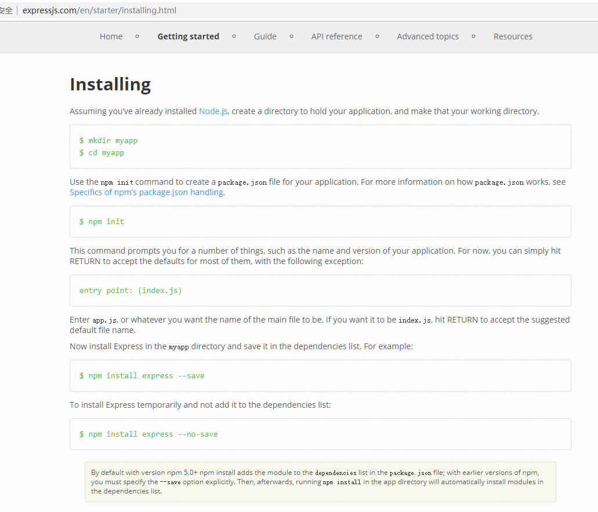

通过以下网址进行访问hello-world页面：

~~~js
http://expressjs.com/en/starter/hello-world.html
~~~

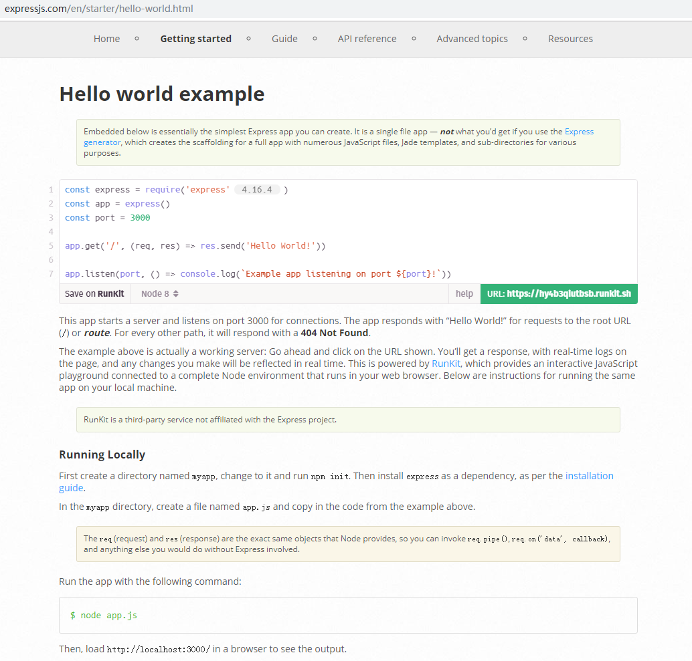

### 8.2 HelloWorld

~~~js
// 0.安装

// 1.引入包
var express = require('express');

// 2.创建服务器应用程序
// 		也就是原来的http.createServer();
// var app = express() ==> http.createServer();
var app = express();
app.get('/',function(req,res){
	res.send('Hello Express');
});

// 公开指定目录，这样就可以访问到公共的public目录了
app.use('/public/',express.static('./public/'));

//相当于server.listen();
app.listen(3333,function(){
	console.log('app is running at port 3333');
});
~~~

### 8.3 静态服务

~~~js
// 当以 /public/ 开头的时候，去 ./public/ 目录中找找对应的资源
// 这种方式更容易辨识，推荐这种方式
app.use('/public/', express.static('./public/'))

// 必须是 /a/puiblic目录中的资源具体路径 相当于（第一个参数是第二个参数路径的别名）
app.use('/abc/d/', express.static('./public/'))

// 当省略第一个参数的时候，则可以通过直接省略 /public 的方式来访问
// 这种方式的好处就是可以省略 /public/
app.use(express.static('./public/'))

~~~

### 8.4 Express中如何Get请求参数

在express内置了一个API，可以直接通过下面的方式直接获取get请求的参数。

~~~js
var paramsObj = request.query
~~~

### 8.5 Express中如何获取POST表单请求体数据

在express中没有内置获取表单请求体的API，需要结合第三方插件实现请求体数据。

- 1.安装

  ~~~shell
  npm install --save body-parser
  ~~~

- 2.导入模块

  ~~~js
  var bodyParser = require('body-parser');
  ~~~

- 3.配置中间件（专门用来解析表单post请求体）

  ~~~js
   // 配置body-parser 中间件（插件，专门用于解析post请求体）
   // 只要加入这个配置，则在req请求对象中会多出一个属性：body。
   // 也就是直接可以通过req.body来获得表单post请求体的数据了。
   app.use(bodyParser.urlencoded({extends:false}));
   app.use(bodyParser.json());
  ~~~

- 4.使用

  ~~~js
  app.post('/post',function(req,res) {
  	var comment = req.body;
  	comment.dateTime = getNow();
  	comments.unshift(comment);
  	res.redirect('/');
  });
  ~~~

  ​

### 8.6 使用Express+art-template+Bootstrap 搭建一个简易留言板

 **[官方API文档](http://expressjs.com/en/4x/api.html#req)**

-    1.创建message_board 文件夹，执行`npm init -y`或`npm init `跳过向导/不跳过创建package.json包描述文件。

-    2.通过`npm install --save express`安装 express

-    3.通过`npm install --save art-template`安装art-template

-    4.通过`npm install --save express-art-template`安装express与art-template关联包

-    5.通过`npm install --save body-parser`安装post请求解析工具

-    6.在项目根本下，public/lib/放bootstrap

-    7.编写app.js,放在项目根本下

     ~~~js
                 //引入第三方模块
                 var express = require('express');
                 var bodyParser = require('body-parser');
                 //创建app
                 var app = express();
                 //指定公开访问路径
                 app.use('/public/',express.static('./public/'));
                 //配置art-template模板引擎
                 app.engine('html',require('express-art-template'));
                 //app监听指定端口号
                 app.listen(3333,function(){
                 	console.log('app is running at port 3333');
                 });
                 /*配置body-parser中间件*/
                 app.use(bodyParser.urlencoded({extends:false}));
                 app.use(bodyParser.json()); 	

                 //定义用于数据仓库
                 var comments = [
                 	{
                 		name:'贾宝玉',
                 		message:'你好啊！',
                 		dateTime:'2018-11-01 11:11:11'
                 	},{
                 		name:'林黛玉',
                 		message:'你好啊！',
                 		dateTime:'2018-11-02 11:11:11'
                 	},{
                 		name:'薛宝钗',
                 		message:'你好啊！',
                 		dateTime:'2018-11-03 11:11:11'
                 	},{
                 		name:'袭人',
                 		message:'你好啊！',
                 		dateTime:'2018-11-04 11:11:11'
                 	},{
                 		name:'晴雯',
                 		message:'你好啊！',
                 		dateTime:'2018-11-05 11:11:11'
                 	},
                 ];
                 //配置访问路由
                 app.get('/',function(req,res){

                 	res.render('index.html',{
                 		comments:comments
                 	});
                 });

                 app.get('/post',function(req,res){
                 	res.render('post.html');
                 });

                 app.post('/post',function(req,res) {
                 	//通过req.body的方式获得post方式的表单请求数据。
                     var comment = req.body;
                 	comment.dateTime = getNow();
                 	comments.unshift(comment);
                 	res.redirect('/');
                 });
                 //获得当前时间
                 function getNow(){
                 	var date = new Date();
                 	var year = date.getFullYear();
                 	var month = (date.getMonth()+1)>9?(date.getMonth()+1):'0'+(date.getMonth()+1);
                 	var day = date.getDate()>9?date.getDate():'0'+date.getDate();
                 	var hour = date.getHours()>9?date.getHours():'0'+date.getHours();
                 	var minute = date.getMinutes()>9?date.getMinutes():'0'+date.getMinutes();
                 	var second = date.getSeconds()>9?date.getSeconds():'0'+date.getSeconds();

                 	return year+'-'+month+'-'+day+' '+hour+':'+minute+':'+second;
                 }
     ~~~

-    8.编写index.html放在项目根目录下的views文件夹下

     ~~~html
     <!DOCTYPE html>
     <html lang="en">

     <head>
       <meta charset="UTF-8">
       <title>留言本</title>
       <!-- 
         浏览器收到 HTML 响应内容之后，就要开始从上到下依次解析，
         当在解析的过程中，如果发现：
           link
           script
           img
           iframe
           video
           audio
         等带有 src 或者 href（link） 属性标签（具有外链的资源）的时候，浏览器会自动对这些资源发起新的请求。
        -->
        <!-- 
           注意：在服务端中，文件中的路径就不要去写相对路径了。
           因为这个时候所有的资源都是通过 url 标识来获取的
           我的服务器开放了 /public/ 目录
           所以这里的请求路径都写成：/public/xxx
           / 在这里就是 url 根路径的意思。
           浏览器在真正发请求的时候会最终把 http://127.0.0.1:3000 拼上

           不要再想文件路径了，把所有的路径都想象成 url 地址
         -->
       <link rel="stylesheet" href="/public/lib/bootstrap/css/bootstrap.css">
     </head>

     <body>
       

         

           <h1>首页 <small>评论</small></h1>
           <a class="btn btn-success" href="/post">发表留言</a>
         

       

       

         <ul class="list-group">
           {{each comments}}
           <li class="list-group-item">{{$value.name}}说：{{$value.message}}{{$value.dateTime}}</li>
           {{/each}}
         </ul>
       

     </body>
     </html>
     ~~~

-    9.编写post.html文件，放在项目根路径下的views文件夹下

     ~~~html
                       <!DOCTYPE html>
                       <html lang="en">

                       <head>
                         <meta charset="UTF-8">
                         <title>Document</title>
                         <link rel="stylesheet" href="/public/lib/bootstrap/css/bootstrap.css">
                       </head>

                       <body>
                         

                           

                             <h1><a href="/">首页</a> <small>发表评论</small></h1>
                           

                         

                         

                           <!-- 
                             以前表单是如何提交的？
                             表单中需要提交的表单控件元素必须具有 name 属性
                             表单提交分为：
     1. 默认的提交行为
     2. 表单异步提交

     action 就是表单提交的地址，说白了就是请求的 url 地址
     method 请求方法
         get
         post

      -->
       <form action="/post" method="post">
         

           <label for="input_name">你的大名</label>
           <input type="text" class="form-control" required minlength="2" maxlength="10" id="input_name" name="name" placeholder="请写入你的姓名">
         

         

           <label for="textarea_message">留言内容</label>
           <textarea class="form-control" name="message" id="textarea_message" cols="30" rows="10" required minlength="5" maxlength="20"></textarea>
         

         <button type="submit" class="btn btn-default">发表</button>
       </form>
     

     </html>
      
     ~~~

-    10.总结

     ~~~js
                    // 处理请求（都会自动结束响应）
                      res.redirect([status,] path) 用于重定向
                      res.render(view [, locals] [, callback])  返回视图
                      res.send([body])   返回http响应
                      
                      
                  app.engine('html',require('express-art-template')); // 配置模板引擎。
                  
                  // 配置body-parser 中间件（插件，专门用于解析post请求体）
                  app.use(bodyParser.urlencoded({extends:false}));
                  app.use(bodyParser.json());

                  //开放公共资源
                  app.use('/public/',express.static('./public/'));

                  //获得post请求中的请求体中的参数，使用req.body;req.query只能拿到get请求的参数
                  app.post('/post',function(req,res){
                    var comment = req.body;
                    comment.dateTime = getNow();
                    comments.unshift(comment);
                    res.redirect('/');
                  });
     ~~~

-    效果图：

                 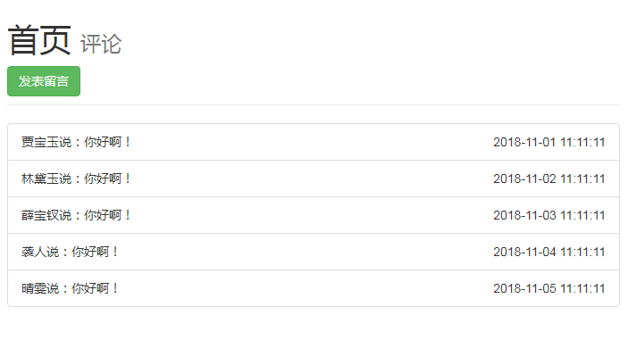

                 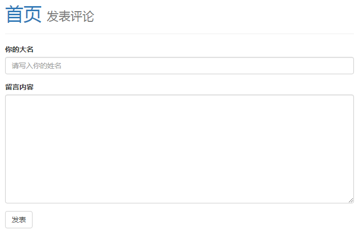

### 8.7 使用Express基于Json文件 实现CRUD

#### 8.7.1 初始化项目

~~~shell
npm init --yes / -y  跳过向导初始化package.json
~~~

#### 8.7.2 安装包

~~~shell
#安装art-template模板
npm install --save art-template
#安装express框架
npm install --save express
#安装在express中整合art-template的整合包
npm install --save express-art-template
#安装解析post请求数据的第三方插件
npm install --save body-parser
#安装bootstrap
npm install --save bootstrap
#安装jquery
npm install --save jquery
~~~

- package.json

  ~~~json
  "dependencies": {
      "art-template": "^4.13.1",
      "body-parser": "^1.18.3",
      "bootstrap": "^4.1.3",
      "express": "^4.16.4",
      "express-art-template": "^1.0.1",
      "jquery": "^3.3.1"
    }
  ~~~

#### 8.7.3 设计url访问接口

~~~js
//get请求，获取所有数据
router.get('/students',function(req,res){});

//get请求，检索数据
router.get('/student',function(req,res){});

//get请求，跳转至添加页面
router.get('/student/add',function(req,res){});

//post请求，添加数据，跳转至列表页
router.post('/student/add',function(req,res){});

//get请求，删除数据，跳转至列表页
router.get('/student/del/:id',function(req,res){});

//get请求，跳转至更新页面，并需要回显数据
router.get('/student/edit',function(req,res){});

//post请求，更新数据，跳转至列表页
router.post('/student/edit',function(req,res){});
~~~

#### 8.7.4 设计数据的操作接口

~~~js
/**
	获取学生列表
*/
exports.find = function(callback){};

/**
	根据Id获取学生信息
*/
exports.findById = function(id,callback){};

/**
	添加保存学生信息
*/
exports.save = function(student,callback){};

/**
	更新学生
*/
exports.update = function(student,callback){};

/**
	删除学生
*/
exports.deleteById = function(id,callback){};

~~~

#### 8.7.5 index.html

~~~html

<!doctype html>
<html lang="en">
  <head>
    <meta charset="utf-8">
    <meta name="viewport" content="width=device-width, initial-scale=1, shrink-to-fit=no">
    <meta name="description" content="">
    <meta name="author" content="">
    <link rel="icon" href="/public/img/favicon.ico">

    <title>Dashboard Template for Bootstrap</title>

    <!-- Bootstrap core CSS -->
    <link href="/node_modules/bootstrap/dist/css/bootstrap.min.css" rel="stylesheet">

    
  
    <link href="/public/css/dashboard.css" rel="stylesheet">
    
  </head>

  <body>
    <nav class="navbar navbar-dark sticky-top bg-dark flex-md-nowrap p-0">
      <a class="navbar-brand col-sm-3 col-md-2 mr-0" href="#">Company name</a>
      <input class="form-control form-control-dark w-100" type="text" placeholder="Search" aria-label="Search">
      <ul class="navbar-nav px-3">
        <li class="nav-item text-nowrap">
          <a class="nav-link" href="#">Sign out</a>
        </li>
      </ul>
    </nav>

    

      

        <nav class="col-md-2 d-none d-md-block bg-light sidebar">
          

            <ul class="nav flex-column">
              <li class="nav-item">
                <a class="nav-link active" href="/students">
                  
                  学生展示 (current)
                </a>
              </li>
              <li class="nav-item">
                <a class="nav-link" href="#">
                  
                  Orders
                </a>
              </li>
              <li class="nav-item">
                <a class="nav-link" href="#">
                  
                  Products
                </a>
              </li>
              <li class="nav-item">
                <a class="nav-link" href="#">
                  
                  Customers
                </a>
              </li>
              <li class="nav-item">
                <a class="nav-link" href="#">
                  
                  Reports
                </a>
              </li>
              <li class="nav-item">
                <a class="nav-link" href="#">
                  
                  Integrations
                </a>
              </li>
            </ul>

            <h6 class="sidebar-heading d-flex justify-content-between align-items-center px-3 mt-4 mb-1 text-muted">
              Saved reports
              <a class="d-flex align-items-center text-muted" href="#">
                
              </a>
            </h6>
            <ul class="nav flex-column mb-2">
              <li class="nav-item">
                <a class="nav-link" href="#">
                  
                  Current month
                </a>
              </li>
              <li class="nav-item">
                <a class="nav-link" href="#">
                  
                  Last quarter
                </a>
              </li>
              <li class="nav-item">
                <a class="nav-link" href="#">
                  
                  Social engagement
                </a>
              </li>
              <li class="nav-item">
                <a class="nav-link" href="#">
                  
                  Year-end sale
                </a>
              </li>
            </ul>
          

        </nav>

        <main role="main" class="col-md-9 ml-sm-auto col-lg-10 pt-3 px-4">
          

            <h1 class="h2">杰出青年</h1>
            

              

                <button class="btn btn-sm btn-outline-secondary">Share</button>
                <button class="btn btn-sm btn-outline-secondary">Export</button>
              

              <button class="btn btn-sm btn-outline-secondary dropdown-toggle">
                
                This week
              </button>
            

          

          
          <!-- <canvas class="my-4" id="myChart" width="900" height="380"></canvas> -->
          

            {{ each person }}
            

             <!--  
 -->
                
                
              <!-- 
 -->
              
              <h4>{{ $value.name }}</h4>
              {{$value.nickName}}
            

            {{ /each }}
          

          <h2>学生列表</h2>
        

          <form class="form-inline" action="/student">
            

              <input type="text" style="margin:5px ;width: 400px"  class="form-control" name="id" 
              placeholder="ID">
            

            

             <button type="submit" class="btn btn-primary" style="width: 100px ;margin:5px">查询</button>
            

          </form> 
          <a href="/student/add"><button class="btn btn-success">添加学生</button></a>
           
           
          

            <table class="table table-striped table-sm">
              <thead>
                <tr>
                  <th>#</th>
                  <th>姓名</th>
                  <th>性别</th>
                  <th>年龄</th>
                  <th>爱好</th>
                  <th>操作</th>
                </tr>
              </thead>
              <tbody>
                {{if student != null}}
                  <tr>
                    <td>{{student.id}}</td>
                    <td>{{student.name}}</td>
                    {{if student.gender == 0 }}
                    <td>男</td>
                    {{else}}
                    <td>女</td>
                    {{/if}}
                    <td>{{student.age}}</td>
                    <td>{{student.hobbies}}</td>
                    <td>
                        <a href="/student/edit?id={{student.id}}"><button class="btn btn-info">编辑</button></a>
                        <button class="btn btn-danger" onclick="del({{student.id}})">删除</button>
                    </td>
                  </tr>
                {{/if}}

                {{if students != null}}

                {{each students}}
                <tr>
                  <td>{{$value.id}}</td>
                  <td>{{$value.name}}</td>
                  {{if $value.gender == 0 }}
                  <td>男</td>
                  {{else}}
                  <td>女</td>
                  {{/if}}
                  <td>{{$value.age}}</td>
                  <td>{{$value.hobbies}}</td>
                  <td>
                      <a href="/student/edit?id={{$value.id}}"><button class="btn btn-info">编辑</button></a>
                      <button class="btn btn-danger" onclick="del({{$value.id}})">删除</button>
                  </td>
                </tr>
                {{/each}}
                {{/if}}
              </tbody>
            </table>
          

        </main>
      

    

    Icons
    
    

    
  </body>
</html>
~~~

#### 8.7.6 add.html

~~~html

<!doctype html>
<html lang="en">
  <head>
    <meta charset="utf-8">
    <meta name="viewport" content="width=device-width, initial-scale=1, shrink-to-fit=no">
    <meta name="description" content="">
    <meta name="author" content="">
    <link rel="icon" href="/public/img/favicon.ico">

    <title>Dashboard Template for Bootstrap</title>

    <!-- Bootstrap core CSS -->
    <link href="/node_modules/bootstrap/dist/css/bootstrap.min.css" rel="stylesheet">

    <!-- Custom styles for this template -->
    <link href="/public/css/dashboard.css" rel="stylesheet">
  </head>

  <body>
    <nav class="navbar navbar-dark sticky-top bg-dark flex-md-nowrap p-0">
      <a class="navbar-brand col-sm-3 col-md-2 mr-0" href="#">Company name</a>
      <input class="form-control form-control-dark w-100" type="text" placeholder="Search" aria-label="Search">
      <ul class="navbar-nav px-3">
        <li class="nav-item text-nowrap">
          <a class="nav-link" href="#">Sign out</a>
        </li>
      </ul>
    </nav>

    

      

        <nav class="col-md-2 d-none d-md-block bg-light sidebar">
          

            <ul class="nav flex-column">
              <li class="nav-item">
                <a class="nav-link active" href="/students">
                  
                  学生展示 (current)
                </a>
              </li>
              <li class="nav-item">
                <a class="nav-link" href="#">
                  
                  Orders
                </a>
              </li>
              <li class="nav-item">
                <a class="nav-link" href="#">
                  
                  Products
                </a>
              </li>
              <li class="nav-item">
                <a class="nav-link" href="#">
                  
                  Customers
                </a>
              </li>
              <li class="nav-item">
                <a class="nav-link" href="#">
                  
                  Reports
                </a>
              </li>
              <li class="nav-item">
                <a class="nav-link" href="#">
                  
                  Integrations
                </a>
              </li>
            </ul>

            <h6 class="sidebar-heading d-flex justify-content-between align-items-center px-3 mt-4 mb-1 text-muted">
              Saved reports
              <a class="d-flex align-items-center text-muted" href="#">
                
              </a>
            </h6>
            <ul class="nav flex-column mb-2">
              <li class="nav-item">
                <a class="nav-link" href="#">
                  
                  Current month
                </a>
              </li>
              <li class="nav-item">
                <a class="nav-link" href="#">
                  
                  Last quarter
                </a>
              </li>
              <li class="nav-item">
                <a class="nav-link" href="#">
                  
                  Social engagement
                </a>
              </li>
              <li class="nav-item">
                <a class="nav-link" href="#">
                  
                  Year-end sale
                </a>
              </li>
            </ul>
          

        </nav>

        <main role="main" class="col-md-9 ml-sm-auto col-lg-10 pt-3 px-4">
        <h1 class="h2">学生信息录入</h1>
         <form class="form-horizontal" action="/student/add" method="post">
			  

			    <label for="inputEmail3" class="col-sm-2 control-label">姓名</label>
			    

			      <input type="text" class="form-control" id="" name="name" placeholder="姓名">
			    

			  

			  

			    <label for="inputPassword3" class="col-sm-2 control-label">年龄</label>
			    

			      <input type="number" class="form-control" id="" name="age" placeholder="年龄">
			    

			  

			  

			    

			      

			      <label>性别 &nbsp;&nbsp;&nbsp;&nbsp;
			           <label class="radio-inline">
						  <input type="radio" name="gender" id="" value="0"> 男&nbsp;&nbsp;
						</label>
						<label class="radio-inline">
						  <input type="radio" name="gender" id="" value="1" checked="checked"> 女
						</label>
			        </label>
			      

			    

			  

			  

			    <label for="inputPassword3" class="col-sm-2 control-label">爱好</label>
			    

			      <input type="text" class="form-control" id="" name="hobbies" placeholder="爱好">
			    

			  

			  

			    

			      <button type="submit" class="btn btn-success">保存人物信息</button>
			    

			  

			</form>
        </main>
      

    

    
    
    
    

    <!-- Icons -->
    
    

    <!-- Graphs -->
    
    
  </body>
</html>

~~~

#### 8.7.7 edit.html

~~~html

<!doctype html>
<html lang="en">
  <head>
    <meta charset="utf-8">
    <meta name="viewport" content="width=device-width, initial-scale=1, shrink-to-fit=no">
    <meta name="description" content="">
    <meta name="author" content="">
    <link rel="icon" href="/public/img/favicon.ico">

    <title>Dashboard Template for Bootstrap</title>

    <!-- Bootstrap core CSS -->
    <link href="/node_modules/bootstrap/dist/css/bootstrap.min.css" rel="stylesheet">

    <!-- Custom styles for this template -->
    <link href="/public/css/dashboard.css" rel="stylesheet">
  </head>

  <body>
    <nav class="navbar navbar-dark sticky-top bg-dark flex-md-nowrap p-0">
      <a class="navbar-brand col-sm-3 col-md-2 mr-0" href="#">Company name</a>
      <input class="form-control form-control-dark w-100" type="text" placeholder="Search" aria-label="Search">
      <ul class="navbar-nav px-3">
        <li class="nav-item text-nowrap">
          <a class="nav-link" href="#">Sign out</a>
        </li>
      </ul>
    </nav>

    

      

        <nav class="col-md-2 d-none d-md-block bg-light sidebar">
          

            <ul class="nav flex-column">
              <li class="nav-item">
                <a class="nav-link active" href="/students">
                  
                  学生展示 (current)
                </a>
              </li>
              <li class="nav-item">
                <a class="nav-link" href="#">
                  
                  Orders
                </a>
              </li>
              <li class="nav-item">
                <a class="nav-link" href="#">
                  
                  Products
                </a>
              </li>
              <li class="nav-item">
                <a class="nav-link" href="#">
                  
                  Customers
                </a>
              </li>
              <li class="nav-item">
                <a class="nav-link" href="#">
                  
                  Reports
                </a>
              </li>
              <li class="nav-item">
                <a class="nav-link" href="#">
                  
                  Integrations
                </a>
              </li>
            </ul>

            <h6 class="sidebar-heading d-flex justify-content-between align-items-center px-3 mt-4 mb-1 text-muted">
              Saved reports
              <a class="d-flex align-items-center text-muted" href="#">
                
              </a>
            </h6>
            <ul class="nav flex-column mb-2">
              <li class="nav-item">
                <a class="nav-link" href="#">
                  
                  Current month
                </a>
              </li>
              <li class="nav-item">
                <a class="nav-link" href="#">
                  
                  Last quarter
                </a>
              </li>
              <li class="nav-item">
                <a class="nav-link" href="#">
                  
                  Social engagement
                </a>
              </li>
              <li class="nav-item">
                <a class="nav-link" href="#">
                  
                  Year-end sale
                </a>
              </li>
            </ul>
          

        </nav>

        <main role="main" class="col-md-9 ml-sm-auto col-lg-10 pt-3 px-4">
        <h1 class="h2">学生信息修改</h1>
         <form class="form-horizontal" action="/student/edit" method="post">
          <input hidden="true" type="text" class="form-control" id="" name="id" value="{{student.id}}">
			  

			    <label for="inputEmail3" class="col-sm-2 control-label">姓名</label>
			    

			      <input type="text" class="form-control" id="" name="name" value="{{student.name}}">
			    

			  

			  

			    <label for="inputPassword3" class="col-sm-2 control-label">年龄</label>
			    

			      <input type="number" class="form-control" id="" name="age" value="{{student.age}}">
			    

			  

			  

			    

			      

            {{if student.gender == 0}}
			      <label>性别 &nbsp;&nbsp;&nbsp;&nbsp;
			           <label class="radio-inline">
						      <input type="radio" name="gender" id="" value="0" checked="checked"> 男&nbsp;&nbsp;
						     </label>
  						<label class="radio-inline">
  						  <input type="radio" name="gender" id="" value="1"> 女
  						</label>
			      </label>
            {{else}}
            <label>性别 &nbsp;&nbsp;&nbsp;&nbsp;
                 <label class="radio-inline">
                  <input type="radio" name="gender" id="" value="0"> 男&nbsp;&nbsp;
                 </label>
              <label class="radio-inline">
                <input type="radio" name="gender" id="" value="1" checked="checked"> 女
              </label>
            </label>
            {{/if}}
			      

			    

			  

			  

			    <label for="inputPassword3" class="col-sm-2 control-label">爱好</label>
			    

			      <input type="text" class="form-control" id="" name="hobbies" value="{{student.hobbies}}">
			    

			  

			  

			    

			      <button type="submit" class="btn btn-success">保存修改</button>
			    

			  

			</form>
        </main>
      

    

    <!-- Icons -->
    
    

    <!-- Graphs -->
    
    
  </body>
</html>

~~~

#### 8.7.8 app.js

~~~js
//导入核心模块
var fs = require('fs');

var express = require('express');
var bodyParesr = require('body-parser');

var router = require('./router.js');

var app = express();

//开发公共资源
app.use('/public/',express.static('./public/'));
app.use('/node_modules/',express.static('./node_modules/'));

//配置bodyParser中间件（需要在app.use(router)之前）
app.use(bodyParesr.urlencoded({extended:false}));
app.use(bodyParesr.json());

//配置art-template模板引擎
app.engine('html',require('express-art-template'));

app.listen(3333,function(){
	console.log("app is running at port 3333");
});

//将路由模块挂载到app上
app.use(router);
~~~

#### 8.7.9 router.js

~~~js
//导入第三方模块
var express = require('express');
//导入核心模块
var fs = require('fs');

var student = require('./student.js');

var router = express();

router.get('/students',function(req,res){
	student.find(function(error,data){
		if(error){
			console.log(error);
			res.status(500).send('server error');
		}else{
			res.render('index.html',{
				person:person,
				students:data,
			});
		}
	});
});

/*router.get('/students',function(req,res){
    var studentsDB;
	fs.readFile('./db.json', 'utf8', function(err,data){
		studentsData = JSON.parse(data);
		studentsDB = studentsData.students;
		if(err){

		}else{
			res.render('index.html',{
				person:person,
				students:studentsDB,
			});
		}
	});
});
*/

router.get('/student',function(req,res){
	var id = req.query.id;
	// 
	if(id == null || id == '' || id.trim() == '' ){
		student.find(function(error,data){
			if(error){
				console.log(error);
				res.status(500).send('server error');
			}else{
				res.render('index.html',{
					person:person,
					students:data
				});
			}
		});
	}else{
		student.findById(parseInt(id),function(error,data){
		if(error){
			console.log(error);
			res.status(500).send('server error');
		}else{
			res.render('index.html',{
				person:person,
				student:data,
			});
		}
	});
	}
	
});

router.get('/student/add',function(req,res){
	res.render('add.html');
});

router.post('/student/add',function(req,res){

	var stu = req.body;
	student.save(stu,function(error){
		if(error){
			console.log(error);
			res.status(500).send('server error');
		}else{
			res.redirect('/students');
		}
	});
	
	
});
/*router.post('/student/add',function(req,res){
	var studentsDB;
	fs.readFile('./db.json', 'utf8', function(err,data){
		studentsData = JSON.parse(data);
		studentsDB = studentsData.students;
		if(err){

		}else{
			var student = req.body;
			student.id = 10;
			studentsDB.unshift(student);
			var stu = {};
			stu.students = studentsDB;
			fs.writeFile('./db.json',JSON.stringify(stu),'utf8',function(err){
				if(err){

				}else{

				}
			});

			res.redirect('/students');
		}
	});
});*/

router.get('/student/del/:id',function(req,res){
	var id = req.params.id;
	student.deleteById(id,function(error){
		if(error){
			console.log(error);
			res.status(500).send('server error');
			return;
		}
		res.redirect('/students');
	});
});
/*router.get('/student/del/:id',function(req,res){
	//拿到传递过来的id
	var id = req.params.id;
	console.log(id);
	var studentsDB;
	//读取json文件
	fs.readFile('./db.json', 'utf8', function(err,data){
		studentsData = JSON.parse(data);
		studentsDB = studentsData.students;
		if(err){

		}else{
			// console.log(studentsDB);
			var studentsWrite = [];
			studentsDB.forEach(function(ele,index,arr){
				if(ele.id != id){
					console.log('id:'+ele.id);
					studentsWrite.push(ele);
					
				}
			});
			var stu = {};
			stu.students = studentsWrite;
			fs.writeFile('./db.json',JSON.stringify(stu),'utf8',function(error){
				if(error){
				}else{
					res.redirect('/students');
					console.log("hahahha");
				}
			});
		}
	});
});*/

router.get('/student/edit',function(req,res){
	console.log(req.query.id);
	var id = req.query.id;
	student.findById(id,function(error,data){
		if(error){
			console.log(error);
			res.status(500).send('server error');
		}else{
			res.render('edit.html',{
				student:data
			});
		}
	});

});

router.post('/student/edit',function(req,res){
	// console.log(req.body);

	var stu = req.body;
	student.update(stu,function(error){
		if(error){
			console.log(error);
			res.status(500).send('server error');
		}else{
			res.redirect('/students');
		}
	});

});

var person = [
	{
		name:'贾宝玉',
		img:'/public/img/贾宝玉.jpg',
		nickName:'JiaBaoYu'
	},{
		name:'林黛玉',
		img:'/public/img/Lindaiyu.jpg',
		nickName:'LinDaiYu'
	},{
		name:'薛宝钗',
		img:'/public/img/薛宝钗.jpg',
		nickName:'XueBaoChai'
	}
];

module.exports = router;
~~~

#### 8.7.10 student.js

~~~js
/*
	student.js
	数据操作的模块。
	职责：操作文件中的数据，只进行数据处理，不关心具体的业务。
*/

// --------------------- 
//   封装异步API.
// ---------------------

//导入文件处理的模块
var fs = require('fs');

//文件统一路径处理
var dbPath = './db.json';

/**
	获取学生列表
*/
exports.find = function(callback){
	fs.readFile(dbPath,function(error,data){
		if(error){
			return callback(error);
		}
		callback(null,JSON.parse(data).students);
	});
};

/**
	根据Id获取学生信息
*/
exports.findById = function(id,callback){
	var student = null;
	/*利用已经写好的find函数*/
	this.find(function(error,data){
		if(error){
			return callback(error);
		}
		data.forEach(function(ele,index,arr){
			if(parseInt(ele.id) === parseInt(id)){
				student = ele;
			}
		});
		callback(null,student);
	});
};

/**
	添加保存学生信息
*/

exports.save = function(student,callback){
	this.find(function(error,data){
		if(error){
			return callback(error);
		}
		student.id = parseInt(data[0].id) + 1;
		data.unshift(student);
		var stu = {};
		stu.students = data;
		fs.writeFile(dbPath,JSON.stringify(stu),'utf8',function(error){
			if(error){
				callback(error);
			}else{
				callback(null);
			}
		});
	});
};

/**
	更新学生
*/

exports.update = function(student,callback){

	this.find(function(error,data){
		if(error){
			return callback(error);
		}

		student.id = parseInt(student.id);

		//通过es6中的find函数查找
		// https://www.cnblogs.com/kongxianghai/p/7527526.html
		var res = data.find(function(item){
			return item.id === student.id;
		});
		//遍历传递进来的对象，更新属性
		
		for(var key in student){
			res[key] = student[key];
		}

		/*var index = data.findIndex(function(item){
			return parseInt(item.id) === parseInt(student.id);
		});
		data[index] = student;*/
		// console.log(index);
		var stu = {};
		stu.students = data;
		fs.writeFile(dbPath,JSON.stringify(stu),'utf8',function(error){
			if(error){
				return callback(error);
			}
			callback(null);
		});
	});

};

/**
	删除学生
*/
exports.deleteById = function(id,callback){
	//利用find查询文件中的数据
	this.find(function(error,data){
		if(error){
			return callback(error);
		}

		//方法一
		/*var studentsDB = [];
		var stu = {};
		data.forEach(function(ele,index,arr){
			if(parseInt(ele.id) !== parseInt(id)){
				studentsDB.push(ele);
			}
		});
		stu.students = studentsDB;*/
		//方法二
		var index = data.findIndex(function(item){
			return item.id === parseInt(id);
		});
		// 从指定下标开始，删除n个。
		data.splice(index,1);//从index开始，删除1个元素
		var fileData = JSON.stringify({
			students:data
		});
		fs.writeFile(dbPath,fileData,'utf8', function(error){
			if(error){
				return callback(error);
			}
			return callback(null);
		});		
	});
};
~~~

#### 8.7.11 db.json

~~~json
{
	"students": [{
			"name": "香菱",
			"age": "18",
			"gender": "1",
			"hobbies": "吟诗赏月",
			"id": 12
		},
		{
			"name": "贾迎春",
			"age": "20",
			"gender": "1",
			"hobbies": "吟诗作画",
			"id": 11
		},
		{
			"name": "王熙凤",
			"age": "30",
			"gender": "1",
			"hobbies": "听戏",
			"id": 10
		},
		{
			"id": 1,
			"name": "贾宝玉",
			"gender": 0,
			"age": 18,
			"hobbies": "写诗"
		},
		{
			"id": 2,
			"name": "林黛玉",
			"gender": 1,
			"age": 18,
			"hobbies": "写诗"
		},
		{
			"id": 3,
			"name": "薛宝钗",
			"gender": 1,
			"age": 19,
			"hobbies": "写诗"
		},
		{
			"id": 4,
			"name": "袭人",
			"gender": 1,
			"age": 17,
			"hobbies": "写诗"
		},
		{
			"id": 5,
			"name": "晴雯",
			"gender": 1,
			"age": 17,
			"hobbies": "写诗"
		}
	]
}
~~~

#### 8.7.12 项目结构图

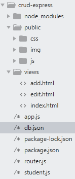

#### 8.7.13 项目效果图

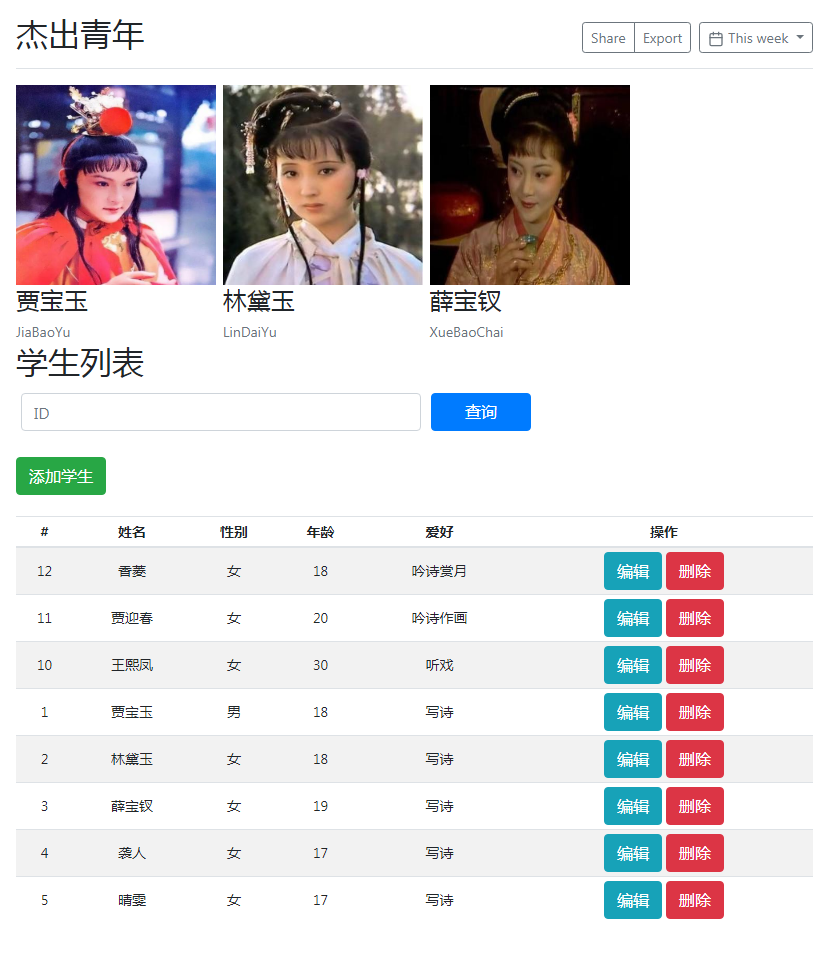

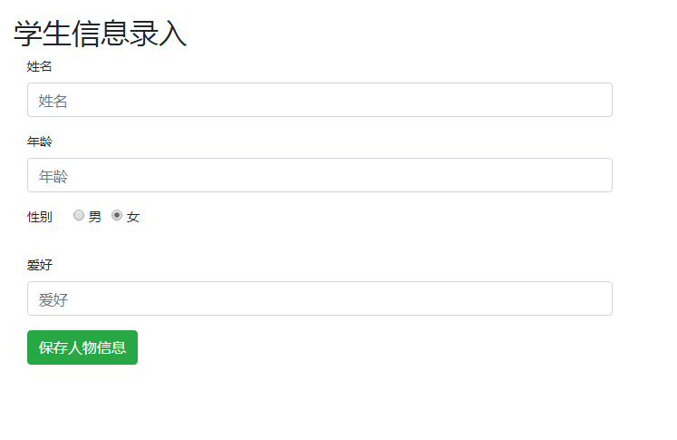

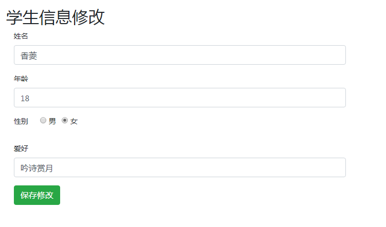

### 8.8 回调函数

~~~js
函数也是一种数据类型，可以作为参数，也可以作为返回值。
一般情况下，把函数作为参数的目的就是为了获取函数内部的异步操作结果。
目前已知的异步函数：
1.setTimeout
2.readFile
3.writeFile
4.readdir
5.ajax  往往异步函数都会有一个回调函数。
	$.get('/',function(){});
~~~

### 8.9 ES6中的find()与findIndex()

~~~js
// find 接受一个方法作为参数，方法内部返回一个条件，符合该条件的元素会作为find方法的返回值返回。
/*find会遍历所有元素，执行给定的带有条件返回值的函数。*/
// 如果遍历结束，还是没有符合条件的值，那么会返回undefined。

var users = [
	{
		id : 1, name:'张三1'
	},{
		id : 2, name:'张三2'
	},{
		id : 3, name:'张三3'
	},{
		id : 4, name:'张三4'
	},{
		id : 5, name:'张三5'
	},
];

Array.prototype.myFind = function(conditionFunc){
	for (var i = 0; i < this.length; i++) {
		if(conditionFunc(this[i],i)){
			return this[i];
		}
	}
}

var res = users.myFind(function(item,index){
	return item.id == 4;
}); 

console.log(res);
~~~

## 9 修改代码自动重启

我们这里可以使用一个第三方命令行工具，`nodemon`来帮我们解决频繁修改代码重启服务器问题。

`nodemon`是一个基于nodejs开发，我们需要独立安装。

~~~shell
npm install --global nodemon
~~~

安装完之后，使用nodemon就可以：

~~~shell
node app.js
V
nodemon app.js
~~~

只要是通过`nodemon app.js`启动服务，则它会监视我们的文件的变化，当文件发生变化的时候，会自动帮我们重启服务器。

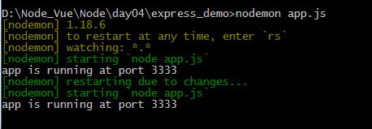

## 10 MongoDB 数据库

NoSQL 非关系型数据库，MongoDB是长得最像关系型数据库的非关系型数据库。

- 数据库 ==》数据库
- 数据表 ==》集合（数组）
- 表记录 ==》文档对象

MongoDB不需要设计表的结构。可以任意往里面存储数据，没有表结构这么一说。

### 10.1 MongoDB 感知

#### 10.1.0 参考文档

[菜鸟教程](http://www.runoob.com/mongodb/mongodb-window-install.html)

MongoDB 是由C++语言编写的，是一个基于分布式文件存储的开源数据库系统。

在高负载的情况下，添加更多的节点，可以保证服务器性能。

MongoDB 旨在为WEB应用提供可扩展的高性能数据存储解决方案。

MongoDB 将数据存储为一个文档，数据结构由键值(key=>value)对组成。MongoDB 文档类似于 JSON 对象。字段值可以包含其他文档，数组及文档数组。

#### 10.1.1 主要特点

- MongoDB 是一个面向文档存储的数据库，操作起来比较简单和容易。
- 你可以在MongoDB记录中设置任何属性的索引 (如：FirstName="Sameer",Address="8 Gandhi Road")来实现更快的排序。
- 你可以通过本地或者网络创建数据镜像，这使得MongoDB有更强的扩展性。
- 如果负载的增加（需要更多的存储空间和更强的处理能力） ，它可以分布在计算机网络中的其他节点上这就是所谓的分片。
- Mongo支持丰富的查询表达式。查询指令使用JSON形式的标记，可轻易查询文档中内嵌的对象及数组。
- MongoDb 使用update()命令可以实现替换完成的文档（数据）或者一些指定的数据字段 。
- Mongodb中的Map/reduce主要是用来对数据进行批量处理和聚合操作。
- Map和Reduce。Map函数调用emit(key,value)遍历集合中所有的记录，将key与value传给Reduce函数进行处理。
- Map函数和Reduce函数是使用Javascript编写的，并可以通过db.runCommand或mapreduce命令来执行MapReduce操作。
- GridFS是MongoDB中的一个内置功能，可以用于存放大量小文件。
- MongoDB允许在服务端执行脚本，可以用Javascript编写某个函数，直接在服务端执行，也可以把函数的定义存储在服务端，下次直接调用即可。
- MongoDB支持各种编程语言:RUBY，PYTHON，JAVA，C++，PHP，C#等多种语言。
- MongoDB安装简单。

#### 10.1.2官网下载

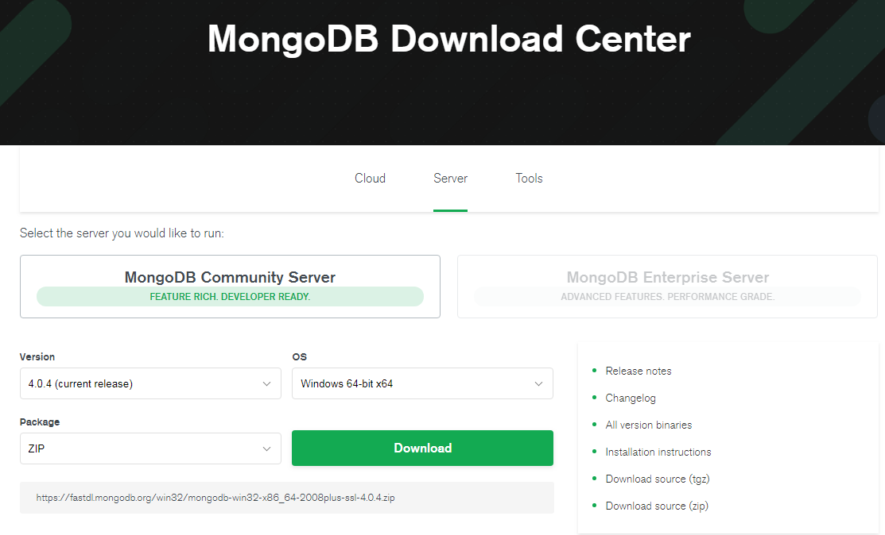

#### 10.1.3 安装

##### 10.1.3.1安装MongoDB

记住不要勾选 install MongoDB compass，否则会一直卡住。

##### 10.1.3.2 安装MongoDB的可视化工具

~~~xml
MongoBooster 
下载地址：http://mongobooster.com/downloads

MongoChef
个人免费，用于商业需要有授权
下载地址：http://3t.io/mongochef/download/platform/
~~~

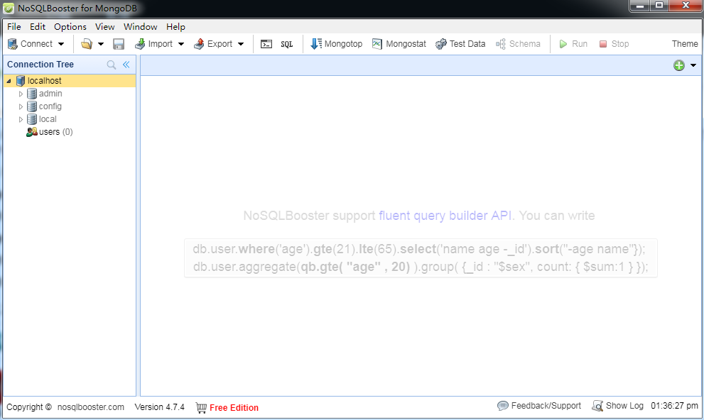

#### 10.1.4 配置环境变量

~~~shell
#在path目录下，添加mongodb的bin目录
path:  C:\Program Files\MongoDB\Server\4.0\bin
~~~

#### 10.1.5 测试是否安装成功

~~~shell
mongod --vesion
~~~

#### 10.1.6 启动和关闭MongoDB数据库

- 启动

~~~shell
# mongodb 默认使用mongod 命令所处盘符根目录下的 /data/db 作为自己数据存储的位置
# 所以在第一次执行命令之前需要自己手动在该路径下新建一个 data/db
mongod
~~~

- 如果想要修改默认的数据存储路径，可以:

~~~shell
mongod --dbpath=数据存储目录 
~~~

- 停止

~~~shell
在开启服务的控制台，直接ctrl+c即可停止。或者直接关闭开启服务的控制台也可以。
~~~

### 10.2 连接和退出数据库

- 连接 

~~~shell
# 该命令默认连接的是本地的数据库
mongo
~~~

- 退出

~~~shell
exit
~~~

### 10.3 基本命令

- `show dbs`
  - 查看显示所有数据库
- `db`
  - 查看当前操作的数据库
- `use 数据库名`
  - 切换到指定数据库（如果没有会创建出来）

### 10.4 Node中如何操作MongoDB数据库

#### 10.4.1 使用官方的MongoDB包来操作

[官方API文档](http://mongodb.github.io/node-mongodb-native/3.1/quick-start/quick-start/)不使用官方的包。

#### 10.4.2 使用第三方mongoose操作MongoDB数据库

第三方包：基于官方的MongoDB包做了再一次封装。名字叫：mongoose

网址：https://mongoosejs.com/

##### 1.MongoDB数据库的基本概念

- 数据库：可以用多个数据库（mysql中的database）

  - qq,taobao,baidu

- 集合：数组，可以有多个集合（mysql中的Table）

  - users

- 文档：一个集合中可以有多个文档（mysql中的记录），文档结构灵活，没有任何限制

  - {name:'张三',age:15}

  =》mongodb非常灵活，不需要像mysql一样，先建库，表，设计表的结构

  - 在这里只需要：当你需要插入数据的时候，只需要指定往哪个数据库的哪个集合操作就可以了
  - 一切都由mongodb来帮你自动完成建库建集合。

  ~~~json
  {
    qq:{
      users:[
        {name:'张三',age:15},
        {name:'李四',age:15},
        {name:'王五',age:15}
      ],
      products:[
        
      ]
    },
    taobao:{
      
    },
    baidu:{
      
    }
  }
  ~~~

  ​

##### 2. 起步，运行helloworld

安装：

~~~shell
npm install --save mongoose
~~~

HelloWorld:

~~~js
const mongoose = require('mongoose');
mongoose.connect('mongodb://localhost/test');

//创建一个模型，就是在设计数据库模型
// MongoDB是动态的，非常灵活，只需要在代码中设计你的数据库就可以了。
// mongoose这个包可以让你的设计编写过程变得非常简单。
const Cat = mongoose.model('Cat', { name: String });

const kitty = new Cat({ name: 'xiaoming' });
kitty.save().then(() => console.log('喵喵'));
~~~

##### 3.实现CRUD（https://mongoosejs.com/docs/api.html#model_Model.findByIdAndUpdate）

###### 3.1 设计schema，发布model 

~~~js
// 引入mongoose包
var mongoose = require('mongoose');

var Schema = mongoose.Schema;

//1.连接数据库
//指定连接的数据库不一定需要存在，当插入第一条数据的时候会自动创建出来。
mongoose.connect('mongodb://localhost/itcast');

//2.设计文档结构（表结构）
//字段名称就是表结构的属性名称
// 约束的目的就是为了保证数据的完整性，不要有脏数据。
var userSchema = new Schema({
    
	username:{
		type:String,
		required:true  //必须
	},password:{
		type:String,
		require:true,
	},email:{
		type:String,

	}

)};

//3.将文档结构，发布为模型
// mongoose.model方法就是讲一个文档结构发布为一个model
//		第一个参数：传入一个大写名词单数字符串用来表示你的数据库名称
//					mongoose会自动将大写名词的字符串生成 小写复数 的集合名称。
//   			例如：这里的User最终会变为users集合名称。
//		第二个参数：结构schema.
//		返回值：模型构造函数
var User = mongoose.model('User', userSchema);
~~~

###### 3.2 增加数据

~~~js
//4.  增加
var admin = new User({
	username:'admin',
	password:'123456',
	email:'admin@admin.com'
});

admin.save(function(error,res){
	if(error){
		console.log('保存失败');
	}else{
		console.log('保存成功');
		console.log(res);
	}
});
~~~

###### 3.3 查询数据

- 查询所有

  ~~~js
  User.find(function(error,data){
  	if(error){
  		console.log('查询失败');
  	}else{
  		console.log('查询成功');
  		console.log(data);
  	}
  });
  ~~~

- 按条件查询所有

  ~~~js
  // 按条件查询(返回的是一个数组)
  User.find({username:'zs'},function(error,data){
  	if(error){
  		console.log('查询失败');
  	}else{
  		console.log('查询成功');
  		console.log(data);
  	}
  });
  ~~~

- 查询单个（多个结果返回第一个）返回的一个对象或是null

  ~~~js
  //查询到多个返回第一个，无返回null
  User.findOne({
  	username:'zs',
  	password:'123456'
  },function(error,data){
  	if(error){
  		console.log('查询失败');
  	}else{
  		console.log('查询成功');
  		console.log(data);
  	}
  });
  ~~~

###### 3.4 删除数据

~~~js
// 删除数据
User.remove({username:'zs'},function(error,data){
	if(error){
		console.log(error);
	}else{
		console.log('删除成功');
	}
});
~~~

###### 3.5 更新数据

~~~js
// 更新数据
User.findByIdAndUpdate('5be697481e5368010c370284',{
	password:'123456789'
},function(error,data){//data是更新之前的数据
	if(error){
		console.log('更新失败');
	}else{
		console.log('更新成功');
		console.log(data);
	}
});
~~~

###### 3.6 Schema设计文档的属性类型

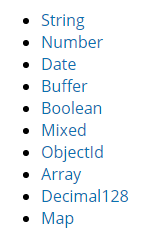

## 11 使用Node操作MySQL数据库

### 11.1 安装MySQL

~~~shell
npm install mysql --save
~~~

### 11.2 连接数据库，并进行增删改查

~~~js
//导入mysql包
var mysql = require('mysql');

//1.创建连接
var connection = mysql.createConnection({
	host:'localhost',
	user:'root',
	password:'root',
	database:'nodejs'
});

//2.连接数据库
connection.connect();

//3.执行数据库操作

//查询数据
connection.query('select * from users ', function (error, results, fields) {
  if (error) throw error;
  console.log('The solution is: ', results);
});

//新增数据
/*connection.query('insert into users (username,password) values ("贾宝玉","123456")', function (error, results, fields) {
  if (error) throw error;
  console.log('The solution is: ', results);
});*/

//修改数据
/*connection.query('update users set username = "林黛玉", password = "123456" where id = 1 ', function (error, results, fields) {
  if (error) throw error;
  console.log('The solution is: ', results);
});
*/

//删除数据
/*connection.query('delete from users where id = 1 ', function (error, results, fields) {
  if (error) throw error;
  console.log('The solution is: ', results);
});*/

//关闭数据库连接
connection.end();
~~~

## 12 promise 

### 12.1 callback hell :回调狱

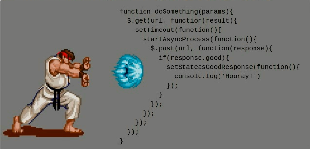

无法保证顺序的代码：

~~~js
var fs = require('fs')
 
fs.readFile('./data/a.txt','utf8',function (err, data) {
    if (err) {
        throw err
    }
    console.log(data)
})
 
fs.readFile('./data/b.txt','utf8',function (err, data) {
    if (err) {
        throw err
    }
    console.log(data)
})
 
fs.readFile('./data/c.txt','utf8',function (err, data) {
    if (err) {
        throw err
    }
    console.log(data)
})
~~~

通过回调函数来保证代码的执行顺序：

~~~js

var fs = require('fs')
 
fs.readFile('./data/a.txt','utf8',function (err, data) {
    if (err) {
        throw err
    }
    console.log(data)
    fs.readFile('./data/b.txt','utf8',function (err, data) {
        if (err) {
            throw err
        }
        console.log(data)
        fs.readFile('./data/c.txt','utf8',function (err, data) {
            if (err) {
                throw err
            }
            console.log(data)
        })
    })
 
})
~~~

为了解决上面的额问题（回调地狱嵌套），所以在es6中新增了一个API:`promise`.

### 12.2 promise 容器

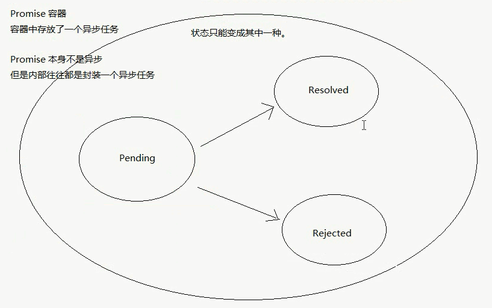

### 12.3 Promise API的基本语法

~~~js
// 在se6中 新增了一个API。
// promise是一个构造函数。

var fs = require('fs');
// 创建promise容器，
// 1.给别人一个承诺。
// Promise容器一旦创建，就开始执行里面的代码。function.
// Promise容器本身不是异步的，但是它里面的任务往往都是异步的。

// resolve 解决， reject 拒绝 
var p1 = new Promise(function(resolve,reject){
	fs.readFile('./a.txt', 'utf8', function(error,data){
		if(error){
			//失败了，promise容器中的任务失败了。
			reject(error);
			// 这里调用的reject方法实际上就是then方法里面传递的第二个function
			//把容器的Pending 状态变成 Rejected状态
		}else{
			//promise容器中的任务成功了。
			resolve(data);
			//这里调用的resolve方法实际上就是then方法传递的第一个function
			//把容器的Pending状态变成 resolved状态
		}
	});
});

//当p1成功，然后做指定的操作
//then方法接受的 function就是容器中的resolve函数。
p1.then(function(data){
	console.log(data);
},function (error) {
	console.log('文件读取失败了：'+error);
});
~~~

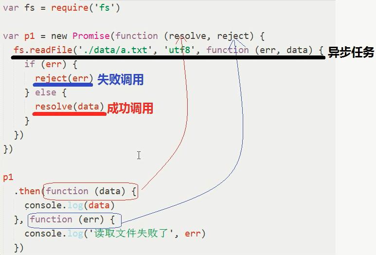

### 12.4 使用promise解决回调地狱

~~~js
// 在se6中 新增了一个API。
// promise是一个构造函数。

var fs = require('fs');
// 创建promise容器，
// 1.给别人一个承诺。
// Promise容器一旦创建，就开始执行里面的代码。function.
// Promise容器本身不是异步的，但是它里面的任务往往都是异步的。

// resolve 解决， reject 拒绝 
var p1 = new Promise(function(resolve,reject){
	fs.readFile('./a.txt', 'utf8', function(error,data){
		if(error){
			//失败了，promise容器中的任务失败了。
			reject(error);
			// 这里调用的reject方法实际上就是then方法里面传递的第二个function
			//把容器的Pending 状态变成 Rejected状态
		}else{
			//promise容器中的任务成功了。
			resolve(data);
			//这里调用的resolve方法实际上就是then方法传递的第一个function
			//把容器的Pending状态变成 resolved状态
		}
	});
});

var p2 = new Promise(function(resolve,reject){
	fs.readFile('./b.txt', 'utf8', function(error,data){
		if(error){
			reject(error);
		}else{
			resolve(data);
		}
	});
});

var p3 = new Promise(function(resolve,reject){
	fs.readFile('./c.txt', 'utf8', function(error,data){
		if(error){
			reject(error);
		}else{
			resolve(data);
		}
	});
});

//当p1成功，然后做指定的操作
//then方法接受的 function就是容器中的resolve函数。
p1.then(function(data){
	console.log(data);
	//当return一个promise对象的时候，后续的then中的第一个function会作为p2的resolve方法
	return p2;
	//当p1读取成功的时候
},function (error) {
	console.log('文件读取失败了：'+error);
})
.then(function(data){
	console.log(data);
	return p3;
},function(error){
	console.log('文件读取失败了：'+error);	
})
.then(function(data){
	console.log(data);
},function(error){
	console.log('文件读取失败了：'+error);
})
;
~~~

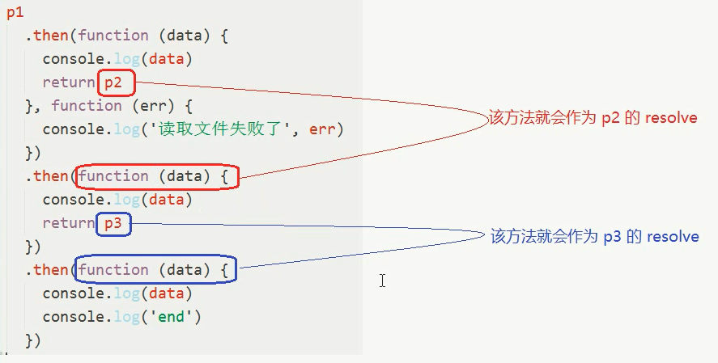

### 12.5 封装promise版本API

（promise版本的reafFile）

~~~js
var fs = require('fs');

function pReadFile(path){
	return new Promise(function(resolve,reject){
		fs.readFile(path, 'utf8', function(error,data){
			if(error){
				reject(error);
			}else{
				resolve(data);
			}
		});
	});
}

pReadFile('./a.txt')
	.then(function(data){
		console.log(data);
		return pReadFile('./b.txt')
	},function(err){
		console.log(err);
	})
	.then(function(data) {
		console.log(data);
		return pReadFile('./c.txt');
	},function(err){
		console.log(err);		
	})
	.then(function(data){
		console.log(data);
	},function(err){
		console.log(err );
	});
~~~

## 13 Path 路径操作模块

- path.basename  获取一个文件名（包含扩展名）
- path.dirname （获取一个路径中的目录部分）
- path.extname  （获取一个文件的扩展名）
- path.parse  （将路径转为一个对象（包含root，dir，base，ext，name ））
  - root 根路径
  - dir 目录
  - base 包含后缀名的文件名
  - ext 后缀名
  - name 不包含后缀名的文件名
- path.join 当需要拼接地址的时候。
- path.isAbsolute 判断一个路径是否为绝对路径

## 14 Node中的其他成员

在每个模块中，除了exports，require，等模块相关的API之外，还有两个特殊的成员。

- __dirname 可以用来动态获取当前文件模块所属目录的绝对路径。
  - D:\Node_Vue\Node\day06\code

- __filename 可以用来动态获取当前文件的绝对路径。
  - D:\Node_Vue\Node\day06\code\demo01.js

~~~js
var fs = require('fs');
// ./a.txt 相对于执行node命令所处的终端路径
// 文件操作路径中，相对路径设计的就是相对于执行node命令所处的路径。
fs.readFile('./a.txt',function(err,data){
  if(err){
    throw err;
  }
  console.log(data);
});

~~~

在文件操作中，使用相对路径是不可靠的，因为在node中，文件操作的路径被设计为相对于执行node命令所处的路径。（不是错误，人家设计是有使用场景的）

所以解决这个问题：只需要把相对路径变成绝对路径.。

那这里我们就可以使用`__filenam`或者`__dirname`来帮我们解决这个问题。

~~~js
var fs = require('fs');
fs.readFile(path.join(__dirname+'/a.txt'),function(err,data){
  if(err){
    throw err;
  }
  console.log(data);
});
~~~

在拼接路径的过程中，为了避免手动拼接带来的一些低级错误，所以推荐多使用：path.join，来辅助拼接。

所以以后在文件操作中使用的相对路径尽量统一转换为动态的绝对路径。

（补充：模块中的路径标识和这里的路径没有关系，不受影响。相对于文件模块）。

* 模块中的路径标识和文件中的相对路径标识是不一致的，模块中的路径标识就是相对于当前模块，

  不受node命令执行的所处路径影响。

## 15 Blog

### 15.1 art-template布局

header.html

~~~html
<!DOCTYPE html>
<html>
<head>
	<title></title>
</head>
<body>
	Header
</body>
</html>
~~~

footer.html

~~~html
<!DOCTYPE html>
<html>
<head>
	<title></title>
</head>
<body>
	Footer
</body>
</html>
~~~

layout.html

~~~html
<!DOCTYPE html>
<html>
<head>
	<title></title>
	<meta charset="utf-8">
	<link rel="stylesheet" type="text/css" href="/node_modules/bootstrap/dist/css/bootstrap.css">
	{{block 'head'}}

	{{/block}}
</head>
<body>
	{{include './header.html'}}
	{{ block 'content'}}

	<h1>默认内容</h1>
	{{ /block}}
	{{include './footer.html'}}

	
	

	{{block 'script'}}
	{{/block}}
</body>
</html>
~~~

index.html

~~~html
{{extend './layout.html'}}

{{block 'head'}}

{{/block}}

{{block 'content'}}
	

		<h1>覆盖内容</h1>
	

{{/block}}

{{block 'script'}}
	
{{/block}}
~~~

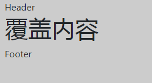

### 15.2 路由设计

| 路径        | 方法   | get参数 | post参数                  | 是否需要登录权限 | 备注     |
| --------- | ---- | ----- | ----------------------- | -------- | ------ |
| /         | get  |       |                         |          | 渲染首页   |
| /register | get  |       |                         |          | 渲染注册页面 |
| /register | post |       | email,nickname,password |          | 处理注册请求 |
| /login    | get  |       |                         |          | 渲染登录页面 |
| /login    | get  |       | email,password          |          | 处理登录请求 |
| /logout   | get  |       |                         |          | 处理退出请求 |

### 15.3 表单的同步提交与异步提交

(服务端重定向针对异步请求无效)

~~~js
表单具有默认的提交行为，默认是同步的，同步表单提交，浏览器会锁死（转圈儿）等待服务端的响应结果。
表单的同步提交之后，无论服务端响应的是什么，都会直接把响应的结果覆盖掉当前页面。
~~~

~~~js

~~~

### 15.4 Express中使用express-session

使用express-session第三方包。https://www.npmjs.com/package/express-session

- 安装

  ~~~shell
  npm install --save express-session
  ~~~

- 引入

  ~~~js
  var session = require('express-session');
  ~~~

- 配置

  ~~~js
  app.use(session({
  	//配置加密字符串，它会在原有加密基础之上和这个字符串拼起来去加密
  	//目的是为了增加安全性
  	secret:'keyboard cat',
  	resave:false,
  	//无论是否使用session，都默认直接给一个sessionId
  	saveUninitialized:true
  }));
  ~~~

- 使用

  ~~~js
  //	当把这个插件配置好之后，我们就可以通过req.session来访问和设置session的成员。
  添加session数据  req.session.foo = 'bar';
  访问session数据  var foo = req.session.foo;
  ~~~

  提示：默认session数据是内存存储的，服务器一旦重启就会丢失，一般真正的生产环境会把session进行持久化

### 15.5 模块是独立的

~~~js
在Node中没有全局作用域，它是文件模块作用域，模块是独立，不能因为a加载了fs，b就不需要了，即使a中require b，这是错误的理解，正确的做法应该是 a需要fs则a就加载fs，b需要fs则b就加载fs。
~~~

### 15.6 中间件

示例：

~~~js
var express = require('express');
var app = express();
//中间件：处理请求的，本质是一个函数
//在Express中，对中间件有几种分类。

//不关心请求路径和请求方法的中间件，
// 也就是说任何请求都会进入这个中间件 

app.use(function(req,res,next){
	console.log('2 请求进来了。');
	next();
});

app.use(function(req,res,next){
	console.log('3 请求进来了。');
});

//以/开都就可以。
app.use('/',function(req,res,next) {
	console.log('1');
	next();
})
//必须是get方式的请求，并且请求路径为/，而不是以/开头的
app.get('/',function(req,res,next) {
	console.log('1');
	next();
})

//以 /xxx开头的路径中间件
app.use('/a',function(req,res,next){
	console.log(req.url);
});

app.listen(3333,function() {

});
~~~

- 同一个请求所经过的中间件都是同一个请求对象和响应对象

  ~~~js
  //以/开都就可以。
  app.use('/',function(req,res,next) {
  	console.log('1');
  	req.username = 'ouYang';
  	next();
  })
  //以 /xxx开头的路径中间件
  app.use('/a',function(req,res,next){
  	console.log(req.username);//ouYang
  	console.log(req.url);
  });
  ~~~

- 中间件执行流程

  ~~~js
  //当请求进来，会从第一个中间件开始进行匹配
  	//如果匹配，则进来
  		//如果请求进入中间件之后，没调用next()则会停在当前中间件。
  		//如果调用了next则会继续向后找到第一个中间件。
  	//如果不匹配，则继续判断匹配下一个中间件
  ~~~

  ​

- 中间件参数解释

  ~~~js
  //中间件本身是一个方法，该方法接收三个参数，
  // 	Request 请求对象
  //  Response 响应对象 
  //  next  下一个中间件(调用下一个匹配的中间件)
  app.use(function(req,res,next){
  	console.log('1 请求进来了。');
  	//当一个请求进入一个中间件之后，如果不调用next，则会停留在当前中间件。
  	//所以next是一个方法，用来调用下一个中间件。
  	next();
  });
  ~~~

- app.get()&app.post()

  ~~~js
  // 如果没有匹配的中间件，express会默认输出can not get/post
  //严格匹配请求方法和请求路径的中间件
  /*app.get();
  app.get('',function(req,res,next){})
  app.post();*/
  ~~~

  ​

### 15.7 使用中间件进行全局错误处理

~~~js
var express = require('express');
var fs = require('fs');
var app = express();

//以/开都就可以。
app.get('/',function(req,res,next) {
	fs.readFile('./a.txt',function(err,data){
		if(err){
			// return res.status(500).send('server error');
			next();
		}
	});
})

//以/开都就可以。
app.get('/',function(req,res,next) {
	fs.readFile('./a.txt',function(err,data){
		if(err){
			// return res.status(500).send('server error');
			//如果传递了参数，则直接去后面找四个参数的中间件。
			next(err);
		}
	});
});

//以 /xxx开头的路径中间件
app.get('/',function(req,res,next){
	console.log(2);
});

//配置错误处理中间件
app.use(function (err,req,res,next) {
	console.log('保错了');
    res.status(500).send(err.message)//或是返回一个4xx或5xx页面
})

app.listen(3333,function() {

});

//结果：报错了
~~~

