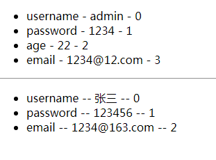

学习vue的笔记，用于复习和使用时的参考。https://cn.vuejs.org
<!--more-->


## Vue

### Vue起步

#### 安装

~~~shell
npm install --save vue

D:\Node_Vue\Vuejs\day02>npm install -save vue
npm WARN saveError ENOENT: no such file or directory, open 'D:\Node_Vue\Vuejs\da
y02\package.json'
npm notice created a lockfile as package-lock.json. You should commit this file.

npm WARN enoent ENOENT: no such file or directory, open 'D:\Node_Vue\Vuejs\day02
\package.json'
npm WARN day02 No description
npm WARN day02 No repository field.
npm WARN day02 No README data
npm WARN day02 No license field.

+ vue@2.5.17
added 1 package from 1 contributor in 6.572s
~~~

#### Demo

~~~html
<!DOCTYPE html>
<html>
<head lang="en">
    <meta charset="UTF-8">
    <title></title>
</head>
<body>
    <!--
        0.npm install vue
        1.引包
        2.new Vue 得到 Vue实例
            Vue 暂时可以理解成一个模板引擎
    -->
    <div id="app">
        <h1>{{ 1 + 1 }}</h1>
        <h1>{{ 'hello' + 'world'}}</h1>
        <h1>{{message}}</h1>
        <h1>details:{{details()}}</h1>
    </div>

    <script src="node_modules/vue/dist/vue.min.js"></script>
    <script>
        const app = new Vue({
            el:'#app',
            data:{
                message:'Hello Vue'
            },
            methods:{
                details:function(){
                    return '一个非常神奇的框架';
                }
            }
        });
    </script>
</body>
</html>
~~~


### 数据绑定

#### 文本绑定

~~~html
<div id="app">
    <h1>{{foo}}</h1>
    <p>{{foo}}</p>
</div>

<script>
    var app = new Vue({
        el:'#app',
        data:{
            foo:'Hello'
        },
        methods:{

        }
    });
</script>
~~~

#### 一次性绑定

~~~html
<div id="app">
    <!--初始化之后就不可以修改了-->
    <h1 v-once>{{foo}}</h1>
    <p>{{foo}}</p>
</div>
~~~

#### 输出HTML

~~~html
<div id="app">
    <div>
        {{rowHtml}}
    </div>
    <div v-html="rowHtml"></div>
</div>

<script>
    var app = new Vue({
        el:'#app',
        data:{
            foo:'Hello',
            /*在html字符串中不能使用vue的语法特性，{{foo}}会被处理为字符串，原样输出*/
            rowHtml:'<h1>Hello {{foo}} Vue</h1>'
        },
        methods:{

        }
    });
</script>
~~~


####  普通文本绑定与属性绑定

~~~html
<ul>
    <li v-for="item in todos">
        <!-- v-bind只能用于属性
             它的值是一个JavaScript表达式，和{{}}里面的语法一致、
             唯一的区别就是：{{}}用于标签文本绑定，v-bind用于属性文本绑定。
        -->
        <a v-bind:href="'/todos?id='+item.id">{{item.title +  'Vue'}}</a>
        <!--<a v-bind:href="'/todos?id='+item.id">{{item.title}} Vue</a>-->
    </li>
</ul>
<script>
    var app = new Vue({
        el:'#app',
        data:{
            todos:[
                {
                    id:1,
                    title:'aaa'
                },{
                    id:2,
                    title:'bbb'
                },{
                    id:3,
                    title:'ccc'
                }
            ]
        },
        methods:{
        }
    });
</script>
~~~


#### 使用JavaScript表达式

~~~html
<ul>
    <li v-for="item in todos">
        <a v-bind:href="true?123:345">{{true?123:345}}</a>
    </li>
</ul>

<！--官方示例-->
{{ number + 1 }}

{{ ok ? 'YES' : 'NO' }}

{{ message.split('').reverse().join('') }}

<div v-bind:id="'list-' + id"></div>
~~~


### 指令

#### 简介

~~~html
指令 (Directives) 是带有 v- 前缀的特殊特性。指令特性的值预期是单个 JavaScript 表达式 (v-for 是例外情况，稍后我们再讨论)。指令的职责是，当表达式的值改变时，将其产生的连带影响，响应式地作用于 DOM。回顾我们在介绍中看到的例子：

<p v-if="seen">现在你看到我了</p>
这里，v-if 指令将根据表达式 seen 的值的真假来插入/移除 <p> 元素。
  
v-i 条件渲染
v-for 列表渲染
v-on  注册事件
v-bind 属性绑定
v-once 只绑定一次
v-html 绑定输出html
~~~

#### 参数

~~~html
一些指令能够接收一个“参数”，在指令名称之后以冒号表示。例如，v-bind 指令可以用于响应式地更新 HTML 特性：

<a v-bind:href="url">...</a>
在这里 href 是参数，告知 v-bind 指令将该元素的 href 特性与表达式 url 的值绑定。

另一个例子是 v-on 指令，它用于监听 DOM 事件：

<a v-on:click="doSomething">...</a>
在这里参数是监听的事件名。我们也会更详细地讨论事件处理。
~~~

#### 修饰符

~~~html
修饰符 (Modifiers) 是以半角句号 . 指明的特殊后缀，用于指出一个指令应该以特殊方式绑定。例如，.prevent 修饰符告诉 v-on 指令对于触发的事件调用 event.preventDefault()：

<form v-on:submit.prevent="onSubmit">...</form>
在接下来对 v-on 和 v-for 等功能的探索中，你会看到修饰符的其它例子。
~~~

~~~html
<!DOCTYPE html>
<html xmlns:v-on="http://www.w3.org/1999/xhtml">
<head lang="en">
    <meta charset="UTF-8">
    <title></title>
    <script src="node_modules/vue/dist/vue.min.js"></script>

</head>
<body>
    <div id="app">
        <!--
            v-i 条件渲染
            v-for 列表渲染
            v-on  注册事件
            v-bind 属性绑定
            v-once 只绑定一次
            v-html 绑定输出html
        -->
        <p v-if="seen">你看不见我</p>
        <!--<a v-on:click="handleGoBaidu" href="http://www.baidu.com">去百度</a>-->
        <a v-on:click.prevent="handleGoBaidu" href="http://www.baidu.com">去百度</a>
    </div>
    <script>

        var app = new Vue({
            el:'#app',//css选择器
            data:{
                seen:true
            },
            methods:{
                handleGoBaidu:function(e){
                    /*
                    * 阻止默认的a标签的跳转事件。（阻止默认事件行为）
                    * 即：如果没有e.preventDefault();弹框之后，会跳转到百度。
                    * 但是使用e.preventDefault();可以阻止默认事件，即只会弹框不会进行链接跳转。
                    * 也可以使用v-on:click.prevent=""
                    * */
                    e.preventDefault();
                    window.alert('去百度');
                }
            }
        });
    </script>
</body>
</html>
~~~

#### 缩写

~~~html
v- 前缀作为一种视觉提示，用来识别模板中 Vue 特定的特性。当你在使用 Vue.js 为现有标签添加动态行为 (dynamic behavior) 时，v- 前缀很有帮助，然而，对于一些频繁用到的指令来说，就会感到使用繁琐。同时，在构建由 Vue.js 管理所有模板的单页面应用程序 (SPA - single page application) 时，v- 前缀也变得没那么重要了。因此，Vue.js 为 v-bind 和 v-on 这两个最常用的指令，提供了特定简写：

v-bind 缩写

    <!-- 完整语法 -->
    <a v-bind:href="url">...</a>
    
    <!-- 缩写 -->
    <a :href="url">...</a>

v-on 缩写

    <!-- 完整语法 -->
    <a v-on:click="doSomething">...</a>
    
    <!-- 缩写 -->
    <a @click="doSomething">...</a>

它们看起来可能与普通的 HTML 略有不同，但 : 与 @ 对于特性名来说都是合法字符，在所有支持 Vue.js 的浏览器都能被正确地解析。而且，它们不会出现在最终渲染的标记中。缩写语法是完全可选的，但随着你更深入地了解它们的作用，你会庆幸拥有它们。
~~~

### Class 与 Style 绑定

#### 绑定HTML Class

~~~html
<!DOCTYPE html>
<html xmlns:v-bind="http://www.w3.org/1999/xhtml">
<head lang="en">
    <meta charset="UTF-8">
    <title></title>
    <script src="node_modules/vue/dist/vue.min.js"></script>
    <style>
        .active {
            color: red;
        }
    </style>
</head>
<body>
    <div id="app">
        <h1 v-bind:class="{active:isActive}" v-bind:style="{backgroundColor:'yellow'}" >Hello Vue</h1>
    </div>
    <script>
        var app = new Vue({
            el:'#app',
            data:{
                isActive:true,
                bgc:'gold'
            },
            methods:{
            }
        });
    </script>
</body>
</html>
~~~

#### 绑定内联样式

~~~html
<div id="app">
	<h1 :class="{active:isActive}" :style="{backgroundColor:bgc}" >Hello Vue</h1>
</div>
<script>
    var app = new Vue({
        el:'#app',
        data:{
            isActive:true,
            bgc:'gold'
        },
        methods:{

        }
    });
</script>
~~~

注意：v-bind:class == :class

#### 数组语法

~~~html
v-bind:style 的数组语法可以将多个样式对象应用到同一个元素上：
<div v-bind:style="[baseStyles, overridingStyles]"></div>
~~~

### http-server使用教程 hs -o

~~~html
01.npm install http-server -g全局安装
02.在要打开的项目文件夹处打开命令窗口，输入 hs -o回车
03.将对应的网址复制到浏览器打开
	注意点：一次只能运行一个项目，当要运行另外一个项目时要先结束前面项目的服务在命令窗口按住ctrl+c即可，再到另外一			个项目文件运行服务
04.遇到端口被占用的情况，可以用指令：hs -o -p 新端口号，来修改端口。
~~~

### 使用browser-sync工具

#### 安装

~~~shell
npm install -g browser-sync
~~~

#### 启动

~~~shell
browser-sync start --server --files "**/*.css, **/*.html, **/*.js"
~~~

#### 启动效果


在需要使用同步刷新工具的项目或文件夹下运行，即可观察到页面与代码同步更新


### 表单输入绑定

#### 基本语法

~~~html
你可以用 v-model 指令在表单 <input>、<textarea> 及 <select> 元素上创建双向数据绑定。它会根据控件类型自动选取正确的方法来更新元素。尽管有些神奇，但 v-model 本质上不过是语法糖。它负责监听用户的输入事件以更新数据，并对一些极端场景进行一些特殊处理。
  
(v-model用于表单控件)
<!--不能这样使用-->
<h1 v-model="message"></h1>
~~~

#### 文本

```html
<div id="app">
    <!--<input type="text" v-bind:value="message"/>-->
    <input type="text" v-model="message" />{{message}}
</div>
```

#### 多行文本

~~~html
<span>Multiline message is:</span>
<p style="white-space: pre-line;">{{ message }}</p>
<br>
<textarea v-model="message" placeholder="add multiple lines"></textarea>
~~~

#### 复选框

~~~html
<!DOCTYPE html>
<html xmlns:v-bind="http://www.w3.org/1999/xhtml">
<head lang="en">
    <meta charset="UTF-8">
    <title></title>
    <script src="node_modules/vue/dist/vue.min.js"></script>
    <style>
        .box{
            width: 200px;
            height: 200px;
            background-color: yellow;
        }
    </style>
</head>
<body>
<div id="app">
    <!--复选框-->
    <input type="checkbox" v-bind:checked="checked"/><!--受数据，但不影响数据-->
    <input type="checkbox" v-model="checked"/>{{checked}}<!--双向绑定-->
  	<!--两种方式-->
    <!--<div v-bind:class="{box:checked}"></div>-->
    <div v-if="checked" class="box"></div>
</div>
<script>
    var app = new Vue({
        el:'#app',
        data:{
            checked:true
        }
    });
</script>
</body>
</html>
~~~


#### 单选按钮

~~~html
<div id="app">
    <input type="radio" id="one"  v-model="picked" value="One"/>One
    <!--<label for="one">One</label>-->
    <br/>
    <input type="radio" id="two" v-model="picked" value="Two" />Two
    <!--<label for="two">Two</label>-->
    <br/>
    <span>Picked:{{picked}}</span>
</div>
<script>
    var app = new Vue({
        el: '#app',
        data: {
            picked:''
        },
        methods: {}
    });
</script>
~~~


#### 单选下拉框

~~~html
<div id="app">
    <select v-model="selected">
        <!--disable 设置为不可选-->
        <option disabled value="">==请选择==</option>
        <option value="1">A</option>
        <option value="2">B</option>
        <option value="3">C</option>
    </select>
    <span>Selected:{{selected}}</span>
</div>
<script>
    var app = new Vue({
        el: '#app',
        data: {
            selected:''
        },
        methods: {}
    });
</script>
~~~


#### 复选下拉框

~~~html
<!--多选框-->
<select v-model="selected" multiple >
    <!--disable 设置为不可选-->
    <option disabled value="">==请选择==</option>
    <option value="1">A</option>
    <option value="2">B</option>
    <option value="3">C</option>
</select>
<span>Selected:{{selected}}</span>
~~~


### 值绑定

对于单选按钮，复选按钮及选择框的选项，`v-model`绑定的值通常是静态字符串（对于复选框也可以是布尔值）：

~~~html
<div id="app">
    <input type="radio" v-model="picked" value="a" />
    <input type="checkbox" v-model="toggle" />

    <select v-model="selected">
        <option value="abc">ABC</option>
        <option value="def">DEF</option>
    </select>
</div>
<script>
    var app = new Vue({
        el: '#app',
        data: {
            picked:'abc',
            toggle:false,
            selected:'def'
        },
        methods: {}
    });
</script>
~~~

但是有时我们可能想把值绑定到Vue实例的一个动态属性，这是可以用`v-bind`实例，并且这个属性的值可以不是字符串。

#### 复选框

~~~html
<div id="app">
    <input
            type="checkbox"
            v-model="toggle"
            true-value="yes"
            false-value="no"
            />
       toggle: {{toggle}}
</div>
<script>
    var app = new Vue({
        el: '#app',
        data: {
            toggle:''
        },
        methods: {}
    });
</script>
~~~

~~~js
// 当选中时
vm.toggle === 'yes'
// 当没有选中时
vm.toggle === 'no'
~~~


**注意：**

这里的 `true-value` 和 `false-value` 特性并不会影响输入控件的 `value` 特性，因为浏览器在提交表单时并不会包含未被选中的复选框。如果要确保表单中这两个值中的一个能够被提交，(比如“yes”或“no”)，请换用单选按钮。


#### 单选按钮

~~~html
<input type="radio" v-model="pick" v-bind:value="a"> {{pick}}/{{a}}
<script>
    var app = new Vue({
        el: '#app',
        data: {
            pick:'23',
            a:'32'
        },
        methods: {}
    });
</script>
~~~


#### 内联对象字面值

~~~html
<select v-model="selected">
    <!-- 内联对象字面量 -->
  <option v-bind:value="{ number: 123 }">123</option>
</select>


// 当选中时
typeof vm.selected // => 'object'
vm.selected.number // => 123
~~~


### 修饰符

#### .lazy

在默认情况下，`v-model` 在每次 `input` 事件触发后将输入框的值与数据进行同步 (除了[上述](https://cn.vuejs.org/v2/guide/forms.html#vmodel-ime-tip)输入法组合文字时)。你可以添加 `lazy` 修饰符，从而转变为使用 `change`事件进行同步： 

```html
<!-- 在“change”时而非“input”时更新 -->
<input v-model.lazy="msg" >
```


#### .number

如果想自动将用户的输入值转为数值类型，可以给 `v-model` 添加 `number` 修饰符： 

```html
<input v-model.number="age" type="number">
```

这通常很有用，因为即使在 `type="number"` 时，HTML 输入元素的值也总会返回字符串。如果这个值无法被 `parseFloat()` 解析，则会返回原始的值。 


#### .trim

如果要自动过滤用户输入的首尾空白字符，可以给 `v-model` 添加 `trim` 修饰符： 

~~~html
<input v-model.trim="msg">
~~~


### 条件渲染/指令

#### v-if

#### v-else

#### v-else-if

参考[官方文档条件渲染](https://cn.vuejs.org/v2/guide/conditional.html)

#### v-if VS v-show

~~~html
<div id="app">
    <div v-if="ifSeen">
        <h1>Hello v-if</h1>
    </div>
    <div v-show="showSeen" >
        <h1>Hello v-show</h1>
    </div>
</div>
<script>
    var app = new Vue({
        el: '#app',
        data: {
            ifSeen:false,
            showSeen:false
        },
        methods: {}
    });
</script>
~~~

**效果图**


**可以看出：**

v-if与v-show在为true的时候，都会进行渲染DOM进行元素的显示，但是当为false的时候，v-if不会进行DOM节点的渲染，但是v-show依旧会进行DOM元素的渲染，只是通过css的display属性来控制元素的显示与否。

**官方寄语：**

- `v-if` 是“真正”的条件渲染，因为它会确保在切换过程中条件块内的事件监听器和子组件适当地被销毁和重建。
- `v-if` 也是**惰性的**：如果在初始渲染时条件为假，则什么也不做——直到条件第一次变为真时，才会开始渲染条件块。
- 相比之下，`v-show` 就简单得多——不管初始条件是什么，元素总是会被渲染，并且只是简单地基于 CSS 进行切换。
- 一般来说，`v-if` 有更高的切换开销，而 `v-show` 有更高的初始渲染开销。因此，如果需要非常频繁地切换，则使用 `v-show` 较好；如果在运行时条件很少改变，则使用 `v-if` 较好。


#### v-if 与 v-for一起使用

**官方寄语：**

**不推荐**同时使用 `v-if` 和 `v-for`。请查阅[风格指南](https://cn.vuejs.org/v2/style-guide/#%E9%81%BF%E5%85%8D-v-if-%E5%92%8C-v-for-%E7%94%A8%E5%9C%A8%E4%B8%80%E8%B5%B7-%E5%BF%85%E8%A6%81)以获取更多信息。

当 `v-if` 与 `v-for` 一起使用时，`v-for` 具有比 `v-if` 更高的优先级。请查阅[列表渲染指南](https://cn.vuejs.org/v2/guide/list.html#v-for-with-v-if) 以获取详细信息。


#### v-pre

~~~html
<div id="app">
    <h3>不使用v-pre</h3>
    <div>{{message}}</div>
    <h3>使用v-pre</h3>
    <div v-pre>{{message}}</div>
</div>
<script>
    var app = new Vue({
        el: '#app',
        data: {
            message:'spring springboot springmvc springdata springcloud'
        },
        methods: {}
    });
</script>
~~~


#### v-text 和 v-clock

注意：使用{{}}双大括号时，可能由于加载与vue渲染速度的影响，在页面上回出现短暂的多个{{message}}。而后才被vue渲染，为了解决这个闪烁问题，可以使用`v-text`指令进行解决，`v-text`指令的作用就是在message还未被渲染的时候，页面是空白的而不是显示{{message}}。但是如下所示，如何有很多`<p v-text="message"></p>`会显得十分麻烦，可以利用`v-cloak`进行解决，先是通过display=none的方式隐藏，后面渲染后通过display=block的方式来显示，如下：

~~~html
<div id="app">
    <h2>使用{{}}</h2>
    <p>{{message}}</p>
    <p>{{message}}</p>
    <p>{{message}}</p>
    <p>{{message}}</p>
    <p>{{message}}</p>
    <p>{{message}}</p>
    <p>{{message}}</p>
    <p>{{message}}</p>
    <h2>使用v-text</h2>
    <p v-text="message"></p>
    <p v-text="message"></p>
    <p v-text="message"></p>
    <p v-text="message"></p>
    <p v-text="message"></p>
    <p v-text="message"></p>
    <p v-text="message"></p>
</div>

--------------可以使用下面的方式----------------
<div id="app" v-cloak>
    <h2>使用{{}}</h2>
    <p>{{message}}</p>
    <p>{{message}}</p>
    <p>{{message}}</p>
    <p>{{message}}</p>
    <p>{{message}}</p>
    <p>{{message}}</p>
    <p>{{message}}</p>
    <p>{{message}}</p>
</div>


~~~


### 列表渲染

~~~xml
v-for 指令根据一组数组的选项列表进行渲染。
v-for 指令需要使用 item in items 形式的特殊语法，
items 是源数据数组并且 item 是数组元素迭代的别名。
~~~


#### 遍历列表（数组）

~~~html
<h2>遍历数组</h2>
<ul>
    <!--<li v-for="(item,index) in users">-->
    <li v-for="(item,index) of users">
        {{item.name}} -- {{index}}
    </li>
</ul>

<script>
    var app = new Vue({
        el: '#app',
        data: {
            users:[
                {
                    name:'张三'
                },{
                    name:'李四'
                },{
                    name:'王五'
                }
            ]
        },
        methods: {}
    });
</script>
~~~


#### 遍历对象

~~~html
<h2>遍历对象</h2>
<ul>
    <li v-for="(value,key,index) in object">
        {{key}} -- {{value}} -- {{index}}
    </li>
</ul>

<script>
    var app = new Vue({
        el: '#app',
        data: {
            object:{
                firstName:'ouYang',
                lastName:'hao',
                age:22
            }
        },
        methods: {}
    });
</script>
~~~

#### Key

~~~xml
官方解释：

当 Vue.js 用 v-for 正在更新已渲染过的元素列表时，它默认用“就地复用”策略。
如果数据项的顺序被改变，Vue 将不会移动 DOM 元素来匹配数据项的顺序，
而是简单复用此处每个元素，并且确保它在特定索引下显示已被渲染过的每个元素。
这个类似 Vue 1.x 的 track-by="$index" 。

这个默认的模式是高效的，但是只适用于不依赖子组件状态或临时 DOM 状态 (例如：表单输入值) 的列表渲染输
出。

为了给 Vue 一个提示，以便它能跟踪每个节点的身份，
从而重用和重新排序现有元素，你需要为每项提供一个唯一 key 属性。
理想的 key 值是每项都有的唯一 id。这个特殊的属性相当于 Vue 1.x 的 track-by ，
但它的工作方式类似于一个属性，所以你需要用 v-bind 来绑定动态值 (在这里使用简写)：

<div v-for="item in items" :key="item.id">
    
建议尽可能在使用 v-for 时提供 key，除非遍历输出的 DOM 内容非常简单，或者是刻意依赖默认行为以获取性能
上的提升。

因为它是 Vue 识别节点的一个通用机制，key 并不与 v-for 特别关联，key 
还具有其他用途，我们将在后面的指南中看到其他用途。
    
<ul>
    <!--<li v-for="(item,index) in users">-->
    <li v-for="(item,index) of users" v-bind:key="item.id">
        {{item.name}} -- {{index}}
    </li>
</ul>
~~~


#### 数组更新检测

##### 变异方法

```js
Vue 包含一组观察数组的变异方法，所以它们也将会触发视图更新。这些方法如下：
- push() 从后面压入
- pop()  从后面弹出
- shift() 从前面弹出
- unshift() 从前面压入
- splice(index,count) 删除指定index开始count个元素
- sort() 排序
- reverse() 翻转
```


##### 替换数组

变异方法 (mutation method)，顾名思义，会改变被这些方法调用的原始数组。相比之下，也有非变异 (non-mutating method) 方法，例如：`filter()`, `concat()` 和 `slice()` 。这些不会改变原始数组，但**总是返回一个新数组**。当使用非变异方法时，可以用新数组替换旧数组：

```js
example1.items = example1.items.filter(function (item) {
  return item.message.match(/Foo/)
})
```


##### 注意事项

由于 JavaScript 的限制，Vue 不能检测以下变动的数组：

1. 当你利用索引直接设置一个项时，例如：`vm.items[indexOfItem] = newValue`
2. 当你修改数组的长度时，例如：`vm.items.length = newLength`

举个例子：

```js
var vm = new Vue({
  data: {
    items: ['a', 'b', 'c']
  }
})
vm.items[1] = 'x' // 不是响应性的
vm.items.length = 2 // 不是响应性的
```

为了解决第一类问题，以下两种方式都可以实现和 `vm.items[indexOfItem] = newValue` 相同的效果，同时也将触发状态更新：

```js
// Vue.set
Vue.set(vm.items, indexOfItem, newValue)
```

```js
// Array.prototype.splice
vm.items.splice(indexOfItem, 1, newValue)
```

你也可以使用 [`vm.$set`](https://vuejs.org/v2/api/#vm-set) 实例方法，该方法是全局方法 `Vue.set` 的一个别名：

```js
vm.$set(vm.items, indexOfItem, newValue)
```

为了解决第二类问题，你可以使用 `splice`：

```js
vm.items.splice(newLength)
```

**实验结果**

~~~html
<script>
    var app = new Vue({
        el: '#app',
        data: {
            items:['a','b','c']
        },
        methods: {}
    });
//    app.items[1] = 'x';//不是响应式的                                   
//    app.items.length = 2; //不是响应式的                                
    Vue.set(app.items,1,'x');//将index=1上的元素修改为x                    
    app.items.splice(1,1,'xx');//将上面已修改的x变成了xx                    
    app.$set(app.items,0,'v'); //将index=0的位置上的元素修改为v             
    app.items.splice(2);//将app.item的长度修改为2，即保留index=0与1的元素。  
                        // 页面显示index=0与index=1的元素
</script>
~~~

| 操作表达式                  | 结果           |
| --------------------------- | -------------- |
| 初始                        | ['a','b','c']  |
| app.items[1] = 'x';         | ['a','b','c']  |
| app.items.length = 2;       | ['a','b','c']  |
| Vue.set(app.items,1,'x');   | ['a','x','c']  |
| app.items.splice(1,1,'xx'); | ['a','xx','c'] |
| app.$set(app.items,0,'v');  | ['v','xx','c'] |
| app.items.splice(2);        | ['v','xx']     |


#### 对象更改检测注意事项

还是由于 JavaScript 的限制，**Vue 不能检测对象属性的添加或删除**：

```js
var vm = new Vue({
  data: {
    a: 1
  }
})
// `vm.a` 现在是响应式的

vm.b = 2
// `vm.b` 不是响应式的
```

对于已经创建的实例，Vue 不能动态添加根级别的响应式属性。但是，可以使用 `Vue.set(object, key, value)` 方法向嵌套对象添加响应式属性。例如，对于：

```js
var vm = new Vue({
  data: {
    userProfile: {
      name: 'Anika'
    }
  }
})
```

你可以添加一个新的 `age` 属性到嵌套的 `userProfile` 对象：

```js
Vue.set(vm.userProfile, 'age', 27)
```

你还可以使用 `vm.$set` 实例方法，它只是全局 `Vue.set` 的别名：

```js
vm.$set(vm.userProfile, 'age', 27)
```

有时你可能需要为已有对象赋予多个新属性，比如使用 `Object.assign()` 或 `_.extend()`。在这种情况下，你应该用两个对象的属性创建一个新的对象。所以，如果你想添加新的响应式属性，不要像这样：

```js
Object.assign(vm.userProfile, {
  age: 27,
  favoriteColor: 'Vue Green'
})
```

你应该这样做：

```js
vm.userProfile = Object.assign({}, vm.userProfile, {
  age: 27,
  favoriteColor: 'Vue Green'
})
```

实验示例：

~~~html
<div id="app">
    <!--遍历对象-->
    <ul>
        <li v-for="(value,key,index) in user" :key="value.id">
            {{key}} - {{value}} - {{index}}
        </li>
    </ul>
    <hr/>
    <ul>
        <li v-for="(value,key,index) in student" :key="value.id">
            {{key}} -- {{value}} -- {{index}}
        </li>
    </ul>

</div>
<script>
    var app = new Vue({
        el: '#app',
        data: {
            user:{
                username:'admin'
            },
            student:{
                username:'张三'
            }
        },
        methods: {}
    });
    /**给指定对象一个添加一个属性*/
    app.user.password = '1234';//添加属性password
    Vue.set(app.user,'age',22);//添加属性age
    app.$set(app.user,'email','1234@12.com');//添加email属性


    /**给指定对象一次性添加多个属性*/
    app.student = Object.assign({},app.student,{
        password:'123456',
        email:'1234@163.com'
    });
</script>
~~~



#### 显示过滤与排序结果

有时，我们想要显示一个数组的过滤或排序副本，而不实际改变或重置原始数据。在这种情况下，可以创建返回过滤或排序数组的计算属性。

例如：

```js
<li v-for="n in evenNumbers">{{ n }}</li>
```

```js
data: {
  numbers: [ 1, 2, 3, 4, 5 ]
},
computed: {
  evenNumbers: function () {
    return this.numbers.filter(function (number) {
      return number % 2 === 0
    })
  }
}
```

在计算属性不适用的情况下 (例如，在嵌套 `v-for` 循环中) 你可以使用一个 method 方法：

```js
<li v-for="n in even(numbers)">{{ n }}</li>
data: {
  numbers: [ 1, 2, 3, 4, 5 ]
},
methods: {
  even: function (numbers) {
    return numbers.filter(function (number) {
      return number % 2 === 0
    })
  }
}
```

实验示例：

~~~html
<div id="app">
    <ul>
        <li v-for="item in evenNumbers">
            {{item}}
        </li>
    </ul>
    <hr/>
    <ul>
        <li v-for="item in even(numbers)">
            {{item}}
        </li>
    </ul>
</div>
<script>
    var app = new Vue({
        el: '#app',
        data: {
            numbers:[1,2,3,4,5]
        },
        methods: {
            even:function(numbers){
                return numbers.filter(function(item){
                    return item % 2 === 0;
                });
            }
        },
        computed:{
            evenNumbers:function(){
                return this.numbers.filter(function(item){
                    return item % 2 === 0;
                });
            }
        }
    });
</script>
~~~


#### 一段取值范围的 `v-for`

`v-for`也可以去整数，在这种情况下，它将重复多次模板。

```html
<div>
  <span v-for="n in 10">{{ n }} </span>
</div>
```


#### `v-for` on  a `<template>`

类似于`v-if`,你也可以利用带有`v-for`的`<template>`渲染多个元素。

~~~html
<div id="app">
    <ul>
        <template v-for="fruit in fruits">
            <li>{{fruit}}</li>
            <li>o_o</li>
        </template>
    </ul>
</div>
<script>
    var app = new Vue({
        el: '#app',
        data: {
            fruits:['apple','orange','pear']
        },
        methods: {}
    });
</script>
~~~


#### v-for with v-if

当它们处于同一个节点，v-for的优先级比v-if更高，这意味着v-if将分别重复运行于每个v-for循环中，当想为仅有的一些项渲染节点时，这种优先级的机制十分有用，如下：

```html
<li v-for="todo in todos" v-if="!todo.isComplete">
  {{ todo }}
</li>
```

上面的代码只传递了未完成的 todos。

而如果你的目的是有条件地跳过循环的执行，那么可以将 `v-if` 置于外层元素 (或 [`)上。如：

```html
<ul v-if="todos.length">
  <li v-for="todo in todos">
    {{ todo }}
  </li>
</ul>
<p v-else>No todos left!</p>
```

**实验示例：**

~~~html
<div id="app">
    <ul>
        <li v-for="todo in todos" v-if="!todo.completed" >
            {{todo}}
        </li>
    </ul>
</div>
<script>
    var app = new Vue({
        el: '#app',
        data: {
            message:'Hello Vue',
            fruits:['apple','orange','pear'],
            todos:[
                {
                    id:1,
                    title:'吃饭',
                    completed:true
                },{
                    id:2,
                    title:'睡觉',
                    completed:false
                },{
                    id:3,
                    title:'打豆豆',
                    completed:false
                },{
                    id:4,
                    title:'写代码',
                    completed:true
                }
            ]
        },
        methods: {}
    });
</script>
~~~


### 事件处理

#### 监听事件

==>> 可以用v-on指令来监听DOM事件，并在触发是运行一些JavaScript代码。

~~~html
<div id="app">
    <!--
        可以用v-on指令来监听DOM事件，并在触发是运行一些JavaScript代码。
    -->
    点击次数：{{times}}<br>
    <button v-on:click="times++" >点击次数+1</button>
</div>
<script>
    var app = new Vue({
        el: '#app',
        data: {
            times:0
        },
        methods: {}
    });
</script>
~~~

#### 事件处理方法

==>然而许多事件处理逻辑会更为复杂，所以直接把JavaScript代码写在v-on指定是不可行的，因此v-on还可以接受一个需要调用的方法名称。

~~~html
<div id="app">
    <!--
        然而许多事件处理逻辑会更为复杂，所以直接把JavaScript代码写在v-on指定是不可行的，
        因此v-on还可以接受一个需要调用的方法名称。
    -->
    <button v-on:click="showMessage">点击显示Message</button>
</div>
<script>
    var app = new Vue({
        el: '#app',
        data: {
        },
        methods: {
            showMessage:function(){
                alert('Hello Vuejs');
            },
        }
    });
</script>
~~~

#### 内联处理器中的方法

==>除了直接绑定到一个方法，也可以在内联JavaScript语句中调用方法。

==>有时也需要在内联语句处理器中访问原始的DOM事件，可以使用特殊变量$event把它传入方法。

~~~html
<div id="app">
    <!--
        除了直接绑定到一个方法，也可以在内联JavaScript语句中调用方法。
    -->
    <button v-on:click="say('Hi')" >sayHi</button>
    <button v-on:click="say('Hello')" >sayHello</button>

    <!--
        有时也需要在内联语句处理器中访问原始的DOM事件，可以使用特殊变量$event把它传入方法。
    -->
    <button v-on:click="showMessageAndEvent('Hello Vuejs',$event)">点击</button>
</div>
<script>
    var app = new Vue({
        el: '#app',
        data: {
        },
        methods: {
            say:function(message){
                alert(message);// Hi or Hello
            },
            showMessageAndEvent:function(message,event){
                alert(message);//Hello Vuejs
                alert(event.target.tagName);//BUTTON
            }
        }
    });
</script>
~~~

#### 事件修饰符

(后面三部分来源于官网)

在事件处理程序中调用 `event.preventDefault()` 或 `event.stopPropagation()` 是非常常见的需求。尽管我们可以在方法中轻松实现这点，但更好的方式是：方法只有纯粹的数据逻辑，而不是去处理 DOM 事件细节。

为了解决这个问题，Vue.js 为 `v-on` 提供了**事件修饰符**。之前提过，修饰符是由点开头的指令后缀来表示的。

- `.stop`
- `.prevent`
- `.capture`
- `.self`
- `.once`
- `.passive`

```html
<!-- 阻止单击事件继续传播 -->
<a v-on:click.stop="doThis"></a>

<!-- 提交事件不再重载页面 -->
<form v-on:submit.prevent="onSubmit"></form>

<!-- 修饰符可以串联 -->
<a v-on:click.stop.prevent="doThat"></a>

<!-- 只有修饰符 -->
<form v-on:submit.prevent></form>

<!-- 添加事件监听器时使用事件捕获模式 -->
<!-- 即元素自身触发的事件先在此处理，然后才交由内部元素进行处理 -->
<div v-on:click.capture="doThis">...</div>

<!-- 只当在 event.target 是当前元素自身时触发处理函数 -->
<!-- 即事件不是从内部元素触发的 -->
<div v-on:click.self="doThat">...</div>
```

使用修饰符时，顺序很重要；相应的代码会以同样的顺序产生。因此，用 `v-on:click.prevent.self` 会阻止**所有的点击**，而 `v-on:click.self.prevent` 只会阻止对元素自身的点击。

> **2.1.4 新增**

```html
<!-- 点击事件将只会触发一次 -->
<a v-on:click.once="doThis"></a>
```

不像其它只能对原生的 DOM 事件起作用的修饰符，`.once` 修饰符还能被用到自定义的[组件事件](https://cn.vuejs.org/v2/guide/components-custom-events.html)上。如果你还没有阅读关于组件的文档，现在大可不必担心。

> **2.3.0 新增**

Vue 还对应 [`addEventListener` 中的 `passive` 选项](https://developer.mozilla.org/en-US/docs/Web/API/EventTarget/addEventListener#Parameters)提供了 `.passive` 修饰符。

```html
<!-- 滚动事件的默认行为 (即滚动行为) 将会立即触发 -->
<!-- 而不会等待 `onScroll` 完成  -->
<!-- 这其中包含 `event.preventDefault()` 的情况 -->
<div v-on:scroll.passive="onScroll">...</div>
```

这个 `.passive` 修饰符尤其能够提升移动端的性能。

不要把 `.passive` 和 `.prevent` 一起使用，因为 `.prevent` 将会被忽略，同时浏览器可能会向你展示一个警告。请记住，`.passive` 会告诉浏览器你*不*想阻止事件的默认行为。

#### 按键修饰符

在监听键盘事件时，我们经常需要检查常见的键值。Vue 允许为 `v-on` 在监听键盘事件时添加按键修饰符：

```html
<!-- 只有在 `keyCode` 是 13 时调用 `vm.submit()` -->
<input v-on:keyup.13="submit">
```

记住所有的 `keyCode` 比较困难，所以 Vue 为最常用的按键提供了别名：

```html
<!-- 同上 -->
<input v-on:keyup.enter="submit">

<!-- 缩写语法 -->
<input @keyup.enter="submit">
```

全部的按键别名：

- `.enter`
- `.tab`
- `.delete` (捕获“删除”和“退格”键)
- `.esc`
- `.space`
- `.up`
- `.down`
- `.left`
- `.right`

可以通过全局 `config.keyCodes` 对象[自定义按键修饰符别名](https://cn.vuejs.org/v2/api/#keyCodes)：

```html
// 可以使用 `v-on:keyup.f1`
Vue.config.keyCodes.f1 = 112
```

##### 自动匹配按键修饰符

> 2.5.0 新增

你也可直接将 [`KeyboardEvent.key`](https://developer.mozilla.org/en-US/docs/Web/API/KeyboardEvent/key/Key_Values) 暴露的任意有效按键名转换为 kebab-case 来作为修饰符：

```html
<input @keyup.page-down="onPageDown">
```

在上面的例子中，处理函数仅在 `$event.key === 'PageDown'` 时被调用。

有一些按键 (`.esc` 以及所有的方向键) 在 IE9 中有不同的 `key` 值, 如果你想支持 IE9，它们的内置别名应该是首选。

#### 系统修饰键

> 2.1.0 新增

可以用如下修饰符来实现仅在按下相应按键时才触发鼠标或键盘事件的监听器。

- `.ctrl`
- `.alt`
- `.shift`
- `.meta`

> 注意：在 Mac 系统键盘上，meta 对应 command 键 (⌘)。在 Windows 系统键盘 meta 对应 Windows 徽标键 (⊞)。在 Sun 操作系统键盘上，meta 对应实心宝石键 (◆)。在其他特定键盘上，尤其在 MIT 和 Lisp 机器的键盘、以及其后继产品，比如 Knight 键盘、space-cadet 键盘，meta 被标记为“META”。在 Symbolics 键盘上，meta 被标记为“META”或者“Meta”。

例如：

```html
<!-- Alt + C -->
<input @keyup.alt.67="clear">

<!-- Ctrl + Click -->
<div @click.ctrl="doSomething">Do something</div>
```

请注意修饰键与常规按键不同，在和 `keyup` 事件一起用时，事件触发时修饰键必须处于按下状态。换句话说，只有在按住 `ctrl` 的情况下释放其它按键，才能触发 `keyup.ctrl`。而单单释放 `ctrl` 也不会触发事件。如果你想要这样的行为，请为 `ctrl` 换用 `keyCode`：`keyup.17`。

##### `.exact` 修饰符

> 2.5.0 新增

`.exact` 修饰符允许你控制由精确的系统修饰符组合触发的事件。

```html
<!-- 即使 Alt 或 Shift 被一同按下时也会触发 -->
<button @click.ctrl="onClick">A</button>

<!-- 有且只有 Ctrl 被按下的时候才触发 -->
<button @click.ctrl.exact="onCtrlClick">A</button>

<!-- 没有任何系统修饰符被按下的时候才触发 -->
<button @click.exact="onClick">A</button>
```

##### 鼠标按钮修饰符

> 2.2.0 新增

- `.left`
- `.right`
- `.middle`

这些修饰符会限制处理函数仅响应特定的鼠标按钮。


### 计算属性与监听器
使用计算属性
1.不用让模板逻辑太重
2.解决性能问题

#### 基础例子

~~~html
<div id="app">
    原始信息：{{message}}
    <br/>
    调用翻转函数后的信息：{{reverseMessageFunc()}}
    <br/>
    计算翻转后的信息：{{reverseMessage}}
</div>
<script>
    var app = new Vue({
        el: '#app',
        data: {
            message:'Hello'
        },
        methods: {
            reverseMessageFunc:function(){
                /*
                * message.split('');[ 'h', 'e', 'l', 'l', 'o' ]
                * message.split('').reverse();[ 'o', 'l', 'l', 'e', 'h' ]
                * message.split('').reverse().join(''); olleh
                * */
                return this.message.split('').reverse().join('');
            }
        },
        computed:{
            reverseMessage:function(){
                return this.message.split('').reverse().join('');
            }
        }
    });
</script>
~~~

结果：


注意：

~~~xml
可以像绑定普通属性一样在模板中绑定计算属性。Vue 知道 vm.reversedMessage依赖于 vm.message，因此
当 vm.message 发生改变时，所有依赖 vm.reversedMessage 的绑定也会更新。而且最妙的是我们已经以声明的方
式创建了这种依赖关系：计算属性的 getter 函数是没有副作用 (side effect) 的，这使它更易于测试和理解。 
~~~


#### 计算属性缓存VS方法

~~~html
<div id="app">
    当前时间：{{now}}
    <br/>
    使用Methods获取时间:{{timeMethods()}}
    <br/>
    使用Computed获取时间:{{timeComputed}}

</div>
<script>
    var app = new Vue({
        el: '#app',
        data: {
            now:1
        },
        methods: {
            timeMethods:function(){
                return Date.now()+this.now;
            }
        },
        computed:{
            timeComputed:function(){
                return Date.now()+this.now;
            }
        }
    });
</script>
~~~

效果图：


虽然我们可以使用函数调用来实现与计算属性同样的效果，但是不同的是，**计算属性是基于它们的依赖进行缓存的**。只在相关依赖发生变化的时候它们才会重新求值，这就意味着只要 `message` 还没有发生改变，多次访问 `reversedMessage` 计算属性会立即返回之前的计算结果，而不必再次执行函数。 

这也同样意味着下面的计算属性将不再更新，因为 `Date.now()` 不是响应式依赖：

```js
computed: {
  now: function () {
    return Date.now()
  }
}
```

相比之下，每当触发重新渲染时，调用方法将**总会**再次执行函数。

**我们为什么需要缓存？**假设我们有一个性能开销比较大的计算属性 **A**，它需要遍历一个巨大的数组并做大量的计算。然后我们可能有其他的计算属性依赖于 **A** 。如果没有缓存，我们将不可避免的多次执行 **A** 的 getter！如果你不希望有缓存，请用方法来替代。


#### 计算属性VS监听属性

~~~html
<div id="app">
    姓名：{{fullName}}
    姓名：{{name}}
</div>
<script>
    var app = new Vue({
        el: '#app',
        data: {
            firstName:'zhang',
            lastName:'san',
            fullName:'zhang san'
        },
        methods: {},
        computed: {
            name:function(){
                return this.firstName + this.lastName;
            }
        },
        watch: {
            firstName:function(val){
                this.fullName = val+this.lastName;
            },
            lastName:function(val){
                this.fullName = this.firstName+val;
            }
        }
    });
</script>
~~~

从上述例子可以看出，虽然计算属性 与帧听器都可以达到相同的目标，但是造成了很多重复代码的出现。


#### 计算属性的setter

~~~html
<div id="app">
    firstName:{{firstName}}
    <br/>
    lastName:{{lastName}}
    <br/>
    fullName:{{fullName}}
</div>
<script>
    var app = new Vue({
        el: '#app',
        data: {
            firstName:'zhang',
            lastName:'san'
        },
        methods: {

        },
        computed: {
            fullName:{
                get:function(){
                    return this.firstName + ' ' + this.lastName;
                },
                set:function(full){
                    var names = full.split(' ');
                    this.firstName = names[0];
                    this.lastName = names[names.length-1];
                }
            }
        },
        watch: {}
    });
</script>
~~~

效果：

- 

- 
- 


**总结：**有上述实验结果可以看出，修改firstName或lastName的时候会影响到fullName，同时当我们改变fullName的时候，firstName和lastName也会进行相应的变化。


