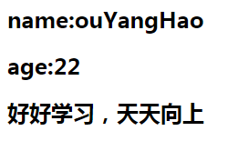

## Vuejs笔记

### 1.HelloWorld

#### 1.安装

~~~js
https://vuejs.org/js/vue.min.js  直接保存即可
~~~

#### 2.demo

~~~html
<!DOCTYPE html>
<html>
<head lang="en">
    <meta charset="UTF-8">
    
    <title></title>
</head>
<body>
    

        <h2>name:{{name}}</h2>
        <h2>age:{{age}}</h2>
        <h2>{{details()}}</h2>
    

</body>
    
</html>
~~~

#### 3.效果

  

### 2.Vue 

####  1.Vue的特点

- MVVM
- 双向数据绑定
- 组件化
- 渐进式

