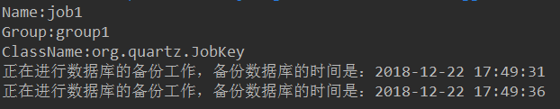
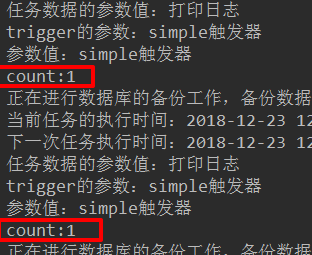

# Quartz任务调度

###### （http://www.quartz-scheduler.org/）

## 1.Quartz的概念

Quertz是openSymphony开源组织在job scheduling领域的又一个开源项目，它可以与j2EE和J2SE应用相结合，也可以单独使用。

quartz是开源切具有丰富特性的“任务调度库”，能够集成于任何的java应用，小到独立的应用，大到电子商业系统。quartz能够创建亦简单亦复杂的任务调度，亦执行上十、上百、甚至上万的任务，任务job被定义为标准的java组件，能够执行任何你想要实现的功能，quartz调度框架包含许多企业级的特性，如JTA事务，集群的支持。

简而言之，quartz就是基于java实现的任务调度框架，用于执行你想要执行的任何任务。

## 2.Quartz运行环境

- Quartz可以运行嵌入在另一个独立的应用程序
- Quartz可以在应用程序服务器（或servlet容器）内被实例化，并且参与事务
- Quartz可以作为一个独立的程序运行（其自己的java虚拟机内），可以同过RMI使用
- Quartz可以被实例化，作为一个独立的项目集群（负载平衡和故障转移功能），用于作业的执行。

## 3.Quartz设计模式

- Builder模式
- Factory模式
- 组件模式
- 链式编程

## 4.Quartz学习的核心概念

- 任务job

任务job就是你想要实现的任务类，每一个job必须实现org.quartz.job接口。且只需要实现定义的execute()方法。

- 触发器Trigger

Trigger为你执行任务的触发器，比如你想要每天定时3点发送一份统计邮件，Trigger将会设置3点进行执行该任务。

Trigger主要包含两种SimpleTrigger和CronTrigger两种。

- 调度器Scheduler

Scheduler为任务的调度器，它会将任务job及触发器Trigger整合起来，负责基于Trigger设定的时间来执行job。

## 5.Quartz的常用的几个API

以下是Quartz编程API集合重要的接口，也是Quartz的重要组件。

- Scheduler：用于与调度程序交互的主程序接口。

  scheduler：调度程序任务执行计划表，只有安排进执行计划的任务job（通过scheduler.scheduleJob方法安排进执行计划），当它预先定义的执行时间到了的时候（任务触发Trigger），该任务才会执行。

- Job：我们预先定义的希望在未来时间能被调度程序执行的任务类，我们可以自定义。

- JobDetail： 使用JobDetail来定义定时任务的实例，JobDetail实例是通过JobBuilder类创建的。

- JobDataMap ：可以包含不限量的（序列化）数据对象，在job实例执行的时候，我们可以使用其中的数据。JobDataMap是java Map接口的一个实现，额外增加了一些便于存取基本类型的数据方法。

- Trigger触发器：Trigger对象是用来触发执行job的，当调度一个job时，我们实例一个触发器然后调用它的属性来满足job执行的条件，表明任务在什么时候会执行，定义了一个已经被安排的任务将会在什么时候执行的时间条件、比如每2秒就执行一次。

- JobBuilder ：用于声明一个任务实例，也可以定义关于该任务的详情。比如任务名，组名等。这个声明的实例将会做为一个实际执行的任务。

- TriggerBuilder： 触发器创建器，用于创建触发器Trigger实例。

- JobListener，TriggerListener，SchedulerListener监听器，用于对组件的监听。

## 6.Quertz的使用

### 1.依赖

~~~xml
<dependencies>
        <!--核心包-->
        <dependency>
            <groupId>org.quartz-scheduler</groupId>
            <artifactId>quartz</artifactId>
            <version>2.2.1</version>
        </dependency>
        <!--工具-->
        <dependency>
            <groupId>org.quartz-scheduler</groupId>
            <artifactId>quartz-jobs</artifactId>
            <version>2.2.1</version>
        </dependency>
        <!--使用log4j-->
        <dependency>
            <groupId>org.slf4j</groupId>
            <artifactId>slf4j-log4j12</artifactId>
            <version>1.8.0-alpha0</version>
            <scope>test</scope>
        </dependency>
        <!-- https://mvnrepository.com/artifact/org.apache.logging.log4j/log4j-core -->
        <dependency>
            <groupId>org.apache.logging.log4j</groupId>
            <artifactId>log4j-core</artifactId>
            <version>2.8.2</version>
        </dependency>

    </dependencies>
    <build>
        <plugins>
            <plugin>
                <groupId>org.apache.maven.plugins</groupId>
                <artifactId>maven-compiler-plugin</artifactId>
                <configuration>
                    <target>1.8</target>
                    <source>1.8</source>
                </configuration>
            </plugin>
        </plugins>
    </build>
~~~

### 2.日志

~~~properties

### 设置###
log4j.rootLogger = debug,stdout,D,E

### 输出信息到控制抬 ###
log4j.appender.stdout = org.apache.log4j.ConsoleAppender
log4j.appender.stdout.Target = System.out
log4j.appender.stdout.layout = org.apache.log4j.PatternLayout
log4j.appender.stdout.layout.ConversionPattern = [%-5p] %d{yyyy-MM-dd HH:mm:ss,SSS} method:%l%n%m%n

### 输出DEBUG 级别以上的日志到=E://logs/error.log ###
log4j.appender.D = org.apache.log4j.DailyRollingFileAppender
log4j.appender.D.File = E://logs/log.log
log4j.appender.D.Append = true
log4j.appender.D.Threshold = DEBUG 
log4j.appender.D.layout = org.apache.log4j.PatternLayout
log4j.appender.D.layout.ConversionPattern = %-d{yyyy-MM-dd HH:mm:ss}  [ %t:%r ] - [ %p ]  %m%n

### 输出ERROR 级别以上的日志到=E://logs/error.log ###
log4j.appender.E = org.apache.log4j.DailyRollingFileAppender
log4j.appender.E.File =E://logs/error.log 
log4j.appender.E.Append = true
log4j.appender.E.Threshold = ERROR 
log4j.appender.E.layout = org.apache.log4j.PatternLayout
~~~

### 3.入门案例

#### 1.HelloJob

~~~java
package com.ooyhao.quartz.job;

import org.quartz.Job;
import org.quartz.JobExecutionContext;
import org.quartz.JobExecutionException;

import java.text.SimpleDateFormat;
import java.util.Date;

//任务
public class HelloJob implements Job {

    @Override
    public void execute(JobExecutionContext jobExecutionContext) throws JobExecutionException {
        //输出当前时间
        Date date = new Date();
        //工作的内容
        SimpleDateFormat simpleDateFormat = new SimpleDateFormat("yyyy-MM-dd HH:mm:ss");
        String formatString = simpleDateFormat.format(date);
        System.out.println("正在进行数据库的备份工作，备份数据库的时间是："+formatString);
    }
}
~~~

#### 2.HelloSchedulerDemo

~~~java
package com.ooyhao.quartz.main;

import com.ooyhao.quartz.job.HelloJob;
import org.quartz.*;
import org.quartz.impl.StdSchedulerFactory;

public class HelloSchedulerDemo {

    public static void main(String[] args) throws SchedulerException {

        //1.调度器（scheduler）,从工厂中获取调度的实例（默认：实例化new STDSchedulerFactory()）
        Scheduler scheduler = StdSchedulerFactory.getDefaultScheduler();
        //2.任务实例（JobDetail）
        JobDetail jobDetail = JobBuilder.newJob(HelloJob.class)//加载任务类，与HelloJob完成绑定。要求HelloJob实现Job接口
                .withIdentity("job1", "group1")//参数1：任务的名称（唯一实例）；参数2：任务组的名称。
                .build();
        //3.触发器（Trigger）
        Trigger trigger = TriggerBuilder.newTrigger()
                .withIdentity("trigger1", "group1")//参数1：触发器的名称（唯一实例）；参数2：触发器组的名称、
                .startNow()
                .withSchedule(SimpleScheduleBuilder.simpleSchedule().repeatSecondlyForever(5))
                .build();
        //让调度器去关联任务和触发器，保证按照触发器定义的条件去执行任务。
        scheduler.scheduleJob(jobDetail,trigger);

        //启动
        scheduler.start();
    }
}
~~~

#### 3.效果

####  4.Job 和JobDetail介绍

- Job：工作任务调度的接口，任务类需要实现该接口。该接口中定义了execute()方法。类似于JDK提供的TimeTask类的run方法。在里面编写任务执行的业务逻辑。

- Job实例在Quartz中的生命周期：每次调度器执行job时，它在调用execute方法前会创建一个新的job实例，当调用完成之后，关联的job对象实例会被释放，释放的实例会被垃圾回收机制回收。

  

  ​

- JobDetail：JobDetail为Job实例提供了许多设置属性，以及JobDataMap成员变量属性，它用来存储特定Job实例的状态信息，调度器需要借助jobDetail对象来添加Job实例。

  ~~~java
  //2.任务实例（JobDetail）
          JobDetail jobDetail = JobBuilder.newJob(HelloJob.class)//加载任务类，与HelloJob完成绑定。要求HelloJob实现Job接口
                  .withIdentity("job1", "group1")//参数1：任务的名称（唯一实例）；参数2：任务组的名称。
                  .build();
  ~~~

- JobDetail的重要属性：name，group，jobClass，jobDataMap

  ~~~java
  System.out.println("Name:"+jobDetail.getKey().getName());//key名必须指定
  System.out.println("Group:"+jobDetail.getKey().getGroup());//如果没有指定组名：使用DEFAULT
  System.out.println("ClassName:"+jobDetail.getKey().getClass().getName());
  ~~~

  

#### 5.JobExecutionContext介绍

- 当 Scheduler调用一个Job，就会将JobExecutionContext传递给Job的execute()方法。
- Job能通过JobExecutionContext对象访问到Quartz运行时候的环境以及job本身的明细数据。

~~~java
@Override
    public void execute(JobExecutionContext jobExecutionContext) throws JobExecutionException {
        //输出当前时间
        Date date = new Date();
        //工作的内容
        SimpleDateFormat simpleDateFormat = new SimpleDateFormat("yyyy-MM-dd HH:mm:ss");
        String formatString = simpleDateFormat.format(date);

        //获取JobDetail的内容
        JobDetail jobDetail = jobExecutionContext.getJobDetail();
        JobKey key = jobDetail.getKey();
        System.out.println("工作任务名称："+key.getName());
        System.out.println("工作任务的组："+key.getGroup());
        System.out.println("任务类的名称（带路径的）："+jobDetail.getJobClass().getName());
        System.out.println("任务类的名称："+jobDetail.getJobClass().getSimpleName());

 
        //获取Trigger的内容
        TriggerKey triggerKey = jobExecutionContext.getTrigger().getKey();
        System.out.println("triggerName:"+triggerKey.getName());
        System.out.println("triggerGroup:"+triggerKey.getGroup());
        System.out.println("triggerClassName:"+triggerKey.getClass().getName());
        System.out.println("triggerClassSimpleName:"+triggerKey.getClass().getSimpleName());

        //工作内容
        System.out.println("正在进行数据库的备份工作，备份数据库的时间是："+formatString);
    }
~~~

#### 6.JobDataMap介绍

##### 1.使用Map获取

- 在进行任务调度时，JobDataMap存储在JobExecutionContext中，非常放便获取。
- JobDataMap可以用来装载任何可序列化的数据对象，当Job实例对象被执行时这些参数对象会传递给它。
- JobDataMap实现了JDK的Map接口，并且添加了非常方便的方法用来存取基本数据类型。

~~~java
@Override
public void execute(JobExecutionContext jobExecutionContext) throws JobExecutionException {
    //输出当前时间
    Date date = new Date();
    //工作的内容
    SimpleDateFormat simpleDateFormat = new SimpleDateFormat("yyyy-MM-dd HH:mm:ss");
    String formatString = simpleDateFormat.format(date);

    //获取JobDetail的内容
    JobDetail jobDetail = jobExecutionContext.getJobDetail();
    JobKey key = jobDetail.getKey();
//-------------------------------获取JObDataMap----------------------------------------------------
    //获取jobDataMap的数据，从JobData对象中获取。
    String jobDataMessage = jobExecutionContext.getJobDetail().getJobDataMap().getString("message");
    System.out.println("任务数据的参数值："+jobDataMessage);

    //获取Trigger对象中获取JobDataMap的数据、
    String triggerMessage = jobExecutionContext.getTrigger().getJobDataMap().getString("message");
    System.out.println("trigger的参数："+triggerMessage);

    //工作内容
    System.out.println("正在进行数据库的备份工作，备份数据库的时间是："+formatString);
 	 //获取其他内容
        System.out.println("当前任务的执行时
                           间："+simpleDateFormat.format(jobExecutionContext.getFireTime()));
        System.out.println("下一次任务执行时
                           间："+simpleDateFormat.format(jobExecutionContext.getNextFireTime()));
}
~~~

##### 2.Job实现类中添加setter方法

Job实现类中添加setter方法对应JobDataMap的键值，Quartz框架默认的JobFactory实现类在初始化job实例对象时会自动地调用这些setter方法。

~~~java
private String message;

public void setMessage(String message) {
    this.message = message;
}
~~~

这里注意：如果遇到同名的key，Trigger中的.usingJobData("message","simple触发器")会覆盖JobDetail中的.usingDataMap("message","打印日志");

#### 7.有状态的Job、和无状态的Job

@PersistJobDataAfterExecution注解的使用

有状态的Job可以理解为多次Job调用期间可以持有一些状态信息，这些状态信息存储在JobDataMap中，而默认的无状态的Job每次调用时都会创建一个新的JobDataMap。

(1).修改HelloSchedulerDemo.java，添加.usingJobData("count",0)；表示计数器

~~~java
JobDetail jobDetail = JobBuilder.newJob(HelloJob.class)//加载任务类，与HelloJob完成绑定。要求HelloJob实现Job接口
      .withIdentity("job1", "group1")//参数1：任务的名称（唯一实例）；参数2：任务组的名称。
      .usingJobData("message","打印日志")
      .usingJobData("count",0)
      .build();
~~~

(2).修改HelloJob.java

添加count的setter方法、

~~~java
package com.ooyhao.quartz.job;

import org.quartz.*;

import java.text.SimpleDateFormat;
import java.util.Date;

//任务
public class HelloJob implements Job {

    private String message;

    public void setMessage(String message) {
        this.message = message;
    }

    private Integer count;

    public void setCount(Integer count) {
        this.count = count;
    }

    public HelloJob(){
//        System.out.println("初始化实例HelloJob");
    }

    @Override
    public void execute(JobExecutionContext jobExecutionContext) throws JobExecutionException {
        //输出当前时间
        Date date = new Date();
        //工作的内容
        SimpleDateFormat simpleDateFormat = new SimpleDateFormat("yyyy-MM-dd HH:mm:ss");
        String formatString = simpleDateFormat.format(date);

        //获取JobDetail的内容
        JobDetail jobDetail = jobExecutionContext.getJobDetail();
        JobKey key = jobDetail.getKey();
//        System.out.println("工作任务名称："+key.getName());
//        System.out.println("工作任务的组："+key.getGroup());
//        System.out.println("任务类的名称（带路径的）："+jobDetail.getJobClass().getName());
//        System.out.println("任务类的名称："+jobDetail.getJobClass().getSimpleName());

        //获取jobDataMap的数据，从JobData对象中获取。
        String jobDataMessage = jobExecutionContext.getJobDetail().getJobDataMap().getString("message");
        System.out.println("任务数据的参数值："+jobDataMessage);

        //获取Trigger对象中获取JobDataMap的数据、
        String triggerMessage = jobExecutionContext.getTrigger().getJobDataMap().getString("message");
        System.out.println("trigger的参数："+triggerMessage);

        //获取Trigger的内容
//        TriggerKey triggerKey = jobExecutionContext.getTrigger().getKey();
//        System.out.println("triggerName:"+triggerKey.getName());
//        System.out.println("triggerGroup:"+triggerKey.getGroup());
//        System.out.println("triggerClassName:"+triggerKey.getClass().getName());
//        System.out.println("triggerClassSimpleName:"+triggerKey.getClass().getSimpleName());
        //从setter方法中读取message的值
     
        System.out.println("参数值："+message);
     ////-----------------------count------------------------
        count++;
        jobExecutionContext.getJobDetail().getJobDataMap().put("count",count);
        System.out.println("count:"+count);

        //工作内容
        System.out.println("正在进行数据库的备份工作，备份数据库的时间是："+formatString);
        //获取其他内容
        System.out.println("当前任务的执行时间："+simpleDateFormat.format(jobExecutionContext.getFireTime()));
        System.out.println("下一次任务执行时间："+simpleDateFormat.format(jobExecutionContext.getNextFireTime()));
    }
}

~~~

3.在HelloJob类上添加注解@PersistJobDataAtferExecution

HelloJob类没有添加@PersistJobDataAfterExecution注解，每次调用都会创建一个新的JobDataMap。不会累加

HelloJob类添加@PersistJobDataAfterExecution注解，多次Job调用期间可以持有一些状态信息，既可以实现count的累加

~~~java
//任务
@PersistJobDataAfterExecution //多次调用job的时候会对Job进行持久化，即保存一个数据的信息
public class HelloJob implements Job {
~~~

#### 8.Trigger介绍

Quartz有一些不同的触发器类型，不过，用得最多的是SimpleTrigger和CronTrigger。

(1).jobKey

表示Job实例的标识，触发器被出发时，该指定的job实例会被执行。

(2).startTime

标识触发器的时间表，第一次开始被触发时间，它的数据类型是java.util.Date

(3).endTime

指定触发器终止被触发的时间，它的数据类型是java.util.date;

案例：

HelloJobTrigger.java

~~~java
public class HelloJobTrigger implements Job
    @Override
    public void execute(JobExecutionContext jobExecutionContext) throws JobExecutionException {
        //输出当前时间
        Date date = new Date();
        //工作的内容
        SimpleDateFormat simpleDateFormat = new SimpleDateFormat("yyyy-MM-dd HH:mm:ss");
        String formatString = simpleDateFormat.format(date);

        //工作内容
        System.out.println("正在进行数据库的备份工作，备份数据库的时间是："+formatString);

        //获取jobKey;
        JobKey jobKey = jobExecutionContext.getTrigger().getJobKey();
        System.out.println("jobKey.getName:"+jobKey.getName());
        System.out.println("jobKey.getGroup:"+jobKey.getGroup());
        System.out.println("jobKey.getClass().getName:"+jobKey.getClass().getName());
        System.out.println("jobKey.getClass().getSimpleName:"+jobKey.getClass().getSimpleName());
        Date startTime = jobExecutionContext.getTrigger().getStartTime();
        Date endTime = jobExecutionContext.getTrigger().getEndTime();
        System.out.println("startTime:"+simpleDateFormat.format(startTime));
        System.out.println("endTime:"+simpleDateFormat.format(endTime));
    }
}
~~~

HelloSchedulerDemoTrigger.java

~~~java
public class HelloSchedulerDemoTrigger {
    public static void main(String[] args) throws SchedulerException {

        //1.调度器（scheduler）,从工厂中获取调度的实例（默认：实例化new STDSchedulerFactory()）
        Scheduler scheduler = StdSchedulerFactory.getDefaultScheduler();

        //设置任务的开始时间
        Date startDate = new Date();
        startDate.setTime(startDate.getTime()+3000);
        //设置任务的结束时间

        Date endDate = new Date();
        endDate.setTime(endDate.getTime()+10000);

        //2.任务实例（JobDetail）
        JobDetail jobDetail = JobBuilder.newJob(HelloJobTrigger.class)//加载任务类，与HelloJob完成绑定。要求HelloJob实现Job接口
                .withIdentity("job1", "group1")//参数1：任务的名称（唯一实例）；参数2：任务组的名称。
                .usingJobData("message","打印日志")
                .build();

        //3.触发器（Trigger）
        Trigger trigger = TriggerBuilder.newTrigger()
                .withIdentity("trigger1", "group1")//参数1：触发器的名称（唯一实例）；参数2：触发器组的名称、
//                .startNow()
                .startAt(startDate)
                .endAt(endDate)
                .withSchedule(SimpleScheduleBuilder.simpleSchedule().repeatSecondlyForever(5))
                .build();
        //让调度器去关联任务和触发器，保证按照触发器定义的条件去执行任务。
        scheduler.scheduleJob(jobDetail,trigger);
        //启动
        scheduler.start();
    }
}
~~~

#### 9.SimpleTrigger触发器

SimpleTrigger对于设置和使用是最为简单的一种QuartzTrigger

它是为那种需要在特定的时间/时期启动，且以一个可能的间隔时间重复执行n次的job所涉及的。

案例一：表示在一个指定的时间段内，执行一次作业任务；

~~~java
public static void main(String[] args) throws SchedulerException {
    //1.调度器（scheduler）,从工厂中获取调度的实例（默认：实例化new STDSchedulerFactory()）
    Scheduler scheduler = StdSchedulerFactory.getDefaultScheduler();

    //设置任务的开始时间
    Date startDate = new Date();
    startDate.setTime(startDate.getTime()+3000);

    //2.任务实例（JobDetail）
    JobDetail jobDetail = JobBuilder.newJob(HelloJobTriggerSimple.class)//加载任务类，与HelloJob完成绑定。要求HelloJob实现Job接口
            .withIdentity("job1", "group1")//参数1：任务的名称（唯一实例）；参数2：任务组的名称。
            .usingJobData("message","打印日志")
            .build();

    //3.触发器（Trigger）
    Trigger trigger = TriggerBuilder.newTrigger()
            .withIdentity("trigger1", "group1")//参数1：触发器的名称（唯一实例）；参数2：触发器组的名称、
            .startAt(startDate)
            .build();
    //让调度器去关联任务和触发器，保证按照触发器定义的条件去执行任务。
    scheduler.scheduleJob(jobDetail,trigger);
    //启动
    scheduler.start();
}
~~~

案例二：或在指定的时间间隔内多次执行作业任务

~~~java
public class HelloSchedulerDemoTriggerSimple {

    public static void main(String[] args) throws SchedulerException {

        //1.调度器（scheduler）,从工厂中获取调度的实例（默认：实例化new STDSchedulerFactory()）
        Scheduler scheduler = StdSchedulerFactory.getDefaultScheduler();

        //设置任务的开始时间
        Date startDate = new Date();
        startDate.setTime(startDate.getTime());
        //2.任务实例（JobDetail）
        JobDetail jobDetail = JobBuilder.newJob(HelloJobTriggerSimple.class)//加载任务类，与HelloJob完成绑定。要求HelloJob实现Job接口
                .withIdentity("job1", "group1")//参数1：任务的名称（唯一实例）；参数2：任务组的名称。
                .usingJobData("message","打印日志")
                .build();

        //3.触发器（Trigger）
        Trigger trigger = TriggerBuilder.newTrigger()
                .withIdentity("trigger1", "group1")//参数1：触发器的名称（唯一实例）；参数2：触发器组的名称、
                .startAt(startDate)
                .withSchedule(SimpleScheduleBuilder.repeatSecondlyForever(2)
                        .withRepeatCount(2))//5秒后重复执行 N+1 3次
                .build();
        //让调度器去关联任务和触发器，保证按照触发器定义的条件去执行任务。
        scheduler.scheduleJob(jobDetail,trigger)
        //启动
        scheduler.start();
    }
}
~~~

需要注意的点：

- SimpleTrigger的属性有：开始时间，结束时间，重复次数和重复时间间隔。
- 重复次数属性的值可以为0，正整数，或常量SimpleTrigger.REPEAT_INDEFINITELY
- 重复的时间间隔属性值必须为0或是长整型的正整数，以毫秒作为时间单位，当重复的时间间隔为0时，意味着与Trigger同时触发执行。
- 如果有指定结束时间属性值，则结束时间属性优先于重复次数属性，这样的好处在于：当我们需要创建一个每间隔10秒钟触发一次直到指定的结束时间的Trigger，而无需去计算从开始到结束的所重复的次数，我们只需要简单的指定结束时间和使用REPEAT_INDEFINITELY作为重复次数的属性值即可。

#### 10.CronTrigger触发器

如果你需要像日历那样按日程来触发任务，而不是像SimpleTrigger那样每隔特定的间隔时间触发，CronTrigger通常比SimpleTrigger更有用，因为它是基于日历的作业调度器。

使用CronTrigger,你可以指定诸如：“每个周五中午”，或者“每个工作日的9:30”或者“从每个周一，周三，周五的上午9:00到上午10:00之间每隔五分钟”这样日程安排来触发。甚至，像SimpleTrigger
一样，CronTrigger也有一个startTime以指定日程从什么时候开始，也有一个（可选的）endTime以指定何时日程不再继续。

##### (1) Cron Expression -- Cron 表达式

Cron表达式被用来配置CronTrigger实例，Cron表达式是一个由7个子表达式组成的字符串。每个子表达式都描述了一个单独的日程细节，这些子表达式用空格分隔，分别表示：

~~~java
1.Seconds (秒)  ：可以用数字0－59 表示，
2.Minutes(分)   ：可以用数字0－59 表示，
3.Hours(时)     ：可以用数字0-23表示,
4.Day-of-Month(天) ：可以用数字1-31 中的任一一个值，但要注意一些特别的月份
5.Month(月)   ：可以用0-11 或用字符串  “JAN, FEB, MAR, APR, MAY, JUN, JUL, AUG, SEP, OCT, NOV and DEC” 表示
6.Day-of-Week(每周)：可以用数字1-7表示（1 ＝ 星期日）或用字符口串“SUN, MON, TUE, WED, THU, FRI and SAT”表示
7.Year（optional field）(年) 可选的域

~~~

|  字段  | 是否必填 |       允许值       |        运行的特殊字符         |
| :--: | :--: | :-------------: | :--------------------: |
|  秒   |  是   |      0-59       |       ,  -  *  /       |
|  分   |  是   |      0-59       |       ,  -  *  /       |
|  小时  |  是   |      0-23       |       ,  -  *  /       |
|  日   |  是   |      0-31       |  ,  -  *  ?  L  W  C   |
|  月   |  是   |  1-12或者JAN-DEC  |       ,  -  *  /       |
|  周   |  是   |  1-7或者SUN-SAT   | ,  -  *  /  ?  L  C  # |
|  年   |  否   | 不填写，或者1970-2099 |       ,  -  *  /       |

~~~java
（1）*：表示匹配该域的任意值。假如在Minutes域使用*, 即表示每分钟都会触发事件。

（2）?：只能用在DayofMonth和DayofWeek两个域。它也匹配域的任意值，但实际不会。因为DayofMonth和DayofWeek会相互影响。(两者相互排斥，两者只能有一个是*,一个是?)例如想在每月的20日触发调度，不管20日到底是星期几，则只能使用如下写法： 13 13 15 20 * ?, 其中最后一位只能用？，而不能使用*，如果使用*表示不管星期几都会触发，实际上并不是这样。

（3）-：表示范围。例如在Minutes域使用5-20，表示从5分到20分钟每分钟触发一次 

（4）/：表示起始时间开始触发，然后每隔固定时间触发一次。例如在Minutes域使用5/20,则意味着5分钟触发一次，而25，45等分别触发一次. 
    
（5）,：表示列出枚举值。例如：在Minutes域使用5,20，则意味着在5和20分每分钟触发一次。 

（6）L：表示最后，只能出现在DayofWeek和DayofMonth域。如果在DayofWeek域使用5L,意味着在最后的一个星期四触发。 

（7）W:表示有效工作日(周一到周五),只能出现在DayofMonth域，系统将在离指定日期的最近的有效工作日触发事件。例如：在 DayofMonth使用5W，如果5日是星期六，则将在最近的工作日：星期五，即4日触发。如果5日是星期天，则在6日(周一)触发；如果5日在星期一到星期五中的一天，则就在5日触发。另外一点，W的最近寻找不会跨过月份 。

（8）LW:这两个字符可以连用，表示在某个月最后一个工作日，即最后一个星期五。 

（9）#:用于确定每个月第几个星期几，只能出现在DayofMonth域。例如在4#2，表示某月的第二个星期三。
 

Cron表达式范例：

   常用表达式例子

　　（1）0 0 2 1 * ? *   表示在每月的1日的凌晨2点调整任务

　　（2）0 15 10 ? * MON-FRI   表示周一到周五每天上午10:15执行作业

　　（3）0 15 10 ? 6L 2002-2006   表示2002-2006年的每个月的最后一个星期五上午10:15执行作

　　（4）0 0 10,14,16 * * ?   每天上午10点，下午2点，4点 

　　（5）0 0/30 9-17 * * ?   朝九晚五工作时间内每半小时 

　　（6）0 0 12 ? * WED    表示每个星期三中午12点 

　　（7）0 0 12 * * ?   每天中午12点触发 

　　（8）0 15 10 ? * *    每天上午10:15触发 

　　（9）0 15 10 * * ?     每天上午10:15触发 

　　（10）0 15 10 * * ? *    每天上午10:15触发  

　　（11）0 15 10 * * ? 2005    2005年的每天上午10:15触发 

　　（12）0 * 14 * * ?     在每天下午2点到下午2:59期间的每1分钟触发 

　　（13）0 0/5 14 * * ?    在每天下午2点到下午2:55期间的每5分钟触发 

　　（14）0 0/5 14,18 * * ?     在每天下午2点到2:55期间和下午6点到6:55期间的每5分钟触发 

　　（15）0 0-5 14 * * ?    在每天下午2点到下午2:05期间的每1分钟触发 

　　（16）0 10,44 14 ? 3 WED    每年三月的星期三的下午2:10和2:44触发 

　　（17）0 15 10 ? * MON-FRI    周一至周五的上午10:15触发 

　　（18）0 15 10 15 * ?    每月15日上午10:15触发 

　　（19）0 15 10 L * ?    每月最后一日的上午10:15触发 

　　（20）0 15 10 ? * 6L    每月的最后一个星期五上午10:15触发 

　　（21）0 15 10 ? * 6L 2002-2005   2002年至2005年的每月的最后一个星期五上午10:15触发 

　　（22）0 15 10 ? * 6#3   每月的第三个星期五上午10:15触发
~~~

HelloJobTriggerCron.java

~~~java
public class HelloJobTriggerCron implements Job{
    @Override
    public void execute(JobExecutionContext jobExecutionContext) throws JobExecutionException {
        //输出当前时间
        Date date = new Date();
        //工作的内容
        SimpleDateFormat simpleDateFormat = new SimpleDateFormat("yyyy-MM-dd HH:mm:ss");
        String formatString = simpleDateFormat.format(date);

        //工作内容
        System.out.println("正在进行数据库的备份工作，备份数据库的时间是："+formatString);
    }
}

~~~

HelloSchedulerDemoTriggerCron.java

~~~java
public class HelloSchedulerDemoTriggerCron {
    public static void main(String[] args) throws SchedulerException {

        //1.调度器（scheduler）,从工厂中获取调度的实例（默认：实例化new STDSchedulerFactory()）
        Scheduler scheduler = StdSchedulerFactory.getDefaultScheduler();

        //设置任务的开始时间
        Date startDate = new Date();
        startDate.setTime(startDate.getTime());
        Date endTime = new Date();
        endTime.setTime(endTime.getTime()+10000);
        //2.任务实例（JobDetail）
        JobDetail jobDetail = JobBuilder.newJob(HelloJobTriggerCron.class)//加载任务类，与HelloJob完成绑定。要求HelloJob实现Job接口
                .withIdentity("job1", "group1")//参数1：任务的名称（唯一实例）；参数2：任务组的名称。
                .usingJobData("message","打印日志")
                .build();
        //3.触发器（Trigger）
        Trigger trigger = TriggerBuilder.newTrigger()
                .withIdentity("trigger1", "group1")//参数1：触发器的名称（唯一实例）；参数2：触发器组的名称、
//                .startAt(startDate)
//                .endAt(endTime)
                .startNow()
                .withSchedule(CronScheduleBuilder.cronSchedule("1/5 * * * * ?"))//日历
                .build();
        //让调度器去关联任务和触发器，保证按照触发器定义的条件去执行任务。
        scheduler.scheduleJob(jobDetail,trigger);
        //启动
        scheduler.start();
    }
}
~~~

小提示：

- ‘L’ 和 'W' 可以一起使用（企业可用在工资计算）
- '#' 可表示月中第几个周几 （企业可用在计算父亲节和母亲节）
- 周字段英文字母不区分大小写。例如MON==mon
- 利用工具，在线生成。

## Quartz任务调度2

### 1.配置，资源SchedulerFactory

 Quartz以模块方式架构，因此，要使它运行，几个组件必须很好的结合在一起，幸运的是，已经有了一些现存的助手可以完成这些工作。

**所有的Scheduler实例有SchedulerFactory创建**。

~~~java
public static Scheduler getDefaultScheduler() throws SchedulerException {
    StdSchedulerFactory fact = new StdSchedulerFactory();
    return fact.getScheduler();
}
~~~

Quartz的三个核心概念：调度器，任务，触发器三者之间的关系：

大家都知道，一个作业，比较重要的三个元素就是Scheduler，JobDetail，Trigger。而Trigger对于Job而言就好比一个驱动器；没有触发器来定时驱动作业，作业就无法运行，对于Job而言，一个job可以对应多个Trigger，但对于Trigger而言，一个Trigger只能对应一个job，所以一个Trigger只能被指派给一个job；如果你需要一个冯家复杂的触发计划，你可以创建多个Trigger并指派它们给同一个job。

Scheduler的创建方式：

（1）.StdfSchedulerFactory：

Quartz默认的SchedulerFactory

- 使用一组参数（java.util.properties）来创建和初始化Quartz调度器。
- 配置参数一般存储在quartz.properties文件中
- 调用getScheduler方法就能创建和初始化调度器对象。

~~~java
StdSchedulerFactory fact = new StdSchedulerFactory();

Scheduler scheduler = fact.getScheduler();

------------------------------------
public Scheduler getScheduler() throws SchedulerException {
      if (cfg == null) {
          initialize();
      }
      SchedulerRepository schedRep = SchedulerRepository.getInstance();
      Scheduler sched = schedRep.lookup(getSchedulerName());
      if (sched != null) {
          if (sched.isShutdown()) {
              schedRep.remove(getSchedulerName());
          } else {
              return sched;
          }
      }
      sched = instantiate();
      return sched;
  }
~~~

用法一：输出调度器开始时间

Date scheduler(JobDetail jobDetail, Trigger trigger)

~~~java
Date date = scheduler.scheduleJob(jobDetail, trigger);
SimpleDateFormat simpleDateFormat = new SimpleDateFormat("yyyy-MM-dd HH:mm:ss");
System.out.println("调度开始时间："+simpleDateFormat.format(date));
~~~

用法二：启动任务调度

void start();

~~~java
//启动
scheduler.start();
~~~

用法三：任务调度挂起，即暂停操作

void standby()

~~~java
//启动
scheduler.start();
//Scheduler执行2秒后挂起
Thread.sleep(2000);
//挂起
scheduler.standby();
//Scheduler执行5秒后重新启动
Thread.sleep(5000);
//重新启动
scheduler.start();
~~~

会把未执行完的任务重新执行

用法四：关闭任务调度

- void shutdown();
- shutdown(true);:表示等待所有正在执行的job执行完毕之后，再关闭Scheduler
- shutdown(false);:表示直接关闭Scheduler

### 2.Quartz.properties

默认路径：quartz-2.2.1中的org.quartz中的quartz.properties

  

我们也可以在项目的资源下添加Quartz.properties文件，去覆盖底层的配置文件。

组成部分

- 调度器属性

  org.quartz.scheduler.instanceName属性用来区分特定的调度器实例，可以按照功能用途来给调度器起名。

  org.quartz.scheduler.instanceId属性和前者一样，也允许任何字符串，但这个值必须在所有调度器实例中时唯一的，尤其是在一个集群中，作为集群的唯一key。假如想Quartz帮你生成这个值的话，可以设置AUTO。

- 线程池属性

threadCount

处理Job的线程个数，至少为1，但最多的话最好不要超过100，在多数机器上设置该值超过100的话就会显得相当不实用了，特别是在你的job执行时间较长的情况下。

threadPriority

线程的优先级，优先级别高的线程比级别低的线程优先得到执行，最小为1，最大为10，默认为5

org.quartz.threadPool.class

 一个实现了org.quartz.spi.ThreadPool接口的类，Quartz自带的线程池实现类是org.quartz.smpl.SimpleThreadPool

- 作业存储设置

  描述了再调度器实例的生命周期中，Job和Trigger信息是如何被存储的。

- 插件配置

  满足特定需求用到的Quartz插件的配置。

~~~java
# Default Properties file for use by StdSchedulerFactory
# to create a Quartz Scheduler Instance, if a different
# properties file is not explicitly specified.
#
# ===========================================================================
# Configure Main Scheduler Properties 调度器属性
# ===========================================================================
org.quartz.scheduler.instanceName: DefaultQuartzScheduler
org.quartz.scheduler.instanceid:AUTO
org.quartz.scheduler.rmi.export: false
org.quartz.scheduler.rmi.proxy: false
org.quartz.scheduler.wrapJobExecutionInUserTransaction: false
# ===========================================================================  
# Configure ThreadPool 线程池属性  
# ===========================================================================
#线程池的实现类（一般使用SimpleThreadPool即可满足几乎所有用户的需求）
org.quartz.threadPool.class: org.quartz.simpl.SimpleThreadPool
#指定线程数，至少为1（无默认值）(一般设置为1-100直接的整数合适)
org.quartz.threadPool.threadCount: 10
#设置线程的优先级（最大为java.lang.Thread.MAX_PRIORITY 10，最小为Thread.MIN_PRIORITY 1，默认为5）
org.quartz.threadPool.threadPriority: 5
#设置SimpleThreadPool的一些属性
#设置是否为守护线程
#org.quartz.threadpool.makethreadsdaemons = false
#org.quartz.threadPool.threadsInheritContextClassLoaderOfInitializingThread: true
#org.quartz.threadpool.threadsinheritgroupofinitializingthread=false
#线程前缀默认值是：[Scheduler Name]_Worker
#org.quartz.threadpool.threadnameprefix=swhJobThead;
# 配置全局监听(TriggerListener,JobListener) 则应用程序可以接收和执行 预定的事件通知
# ===========================================================================
# Configuring a Global TriggerListener 配置全局的Trigger监听器
# MyTriggerListenerClass 类必须有一个无参数的构造函数，和 属性的set方法，目前2.2.x只支持原始数据类型的值（包括字符串）
# ===========================================================================
#org.quartz.triggerListener.NAME.class = com.swh.MyTriggerListenerClass
#org.quartz.triggerListener.NAME.propName = propValue
#org.quartz.triggerListener.NAME.prop2Name = prop2Value
# ===========================================================================
# Configuring a Global JobListener 配置全局的Job监听器
# MyJobListenerClass 类必须有一个无参数的构造函数，和 属性的set方法，目前2.2.x只支持原始数据类型的值（包括字符串）
# ===========================================================================
#org.quartz.jobListener.NAME.class = com.swh.MyJobListenerClass
#org.quartz.jobListener.NAME.propName = propValue
#org.quartz.jobListener.NAME.prop2Name = prop2Value
# ===========================================================================  
# Configure JobStore 存储调度信息（工作，触发器和日历等）
# ===========================================================================
# 信息保存时间 默认值60秒
org.quartz.jobStore.misfireThreshold: 60000
#保存job和Trigger的状态信息到内存中的类
org.quartz.jobStore.class: org.quartz.simpl.RAMJobStore
# ===========================================================================  
# Configure SchedulerPlugins 插件属性 配置
# ===========================================================================
# 自定义插件  
#org.quartz.plugin.NAME.class = com.swh.MyPluginClass
#org.quartz.plugin.NAME.propName = propValue
#org.quartz.plugin.NAME.prop2Name = prop2Value
#配置trigger执行历史日志（可以看到类的文档和参数列表）
org.quartz.plugin.triggHistory.class = org.quartz.plugins.history.LoggingTriggerHistoryPlugin  
org.quartz.plugin.triggHistory.triggerFiredMessage = Trigger {1}.{0} fired job {6}.{5} at: {4, date, HH:mm:ss MM/dd/yyyy}  
org.quartz.plugin.triggHistory.triggerCompleteMessage = Trigger {1}.{0} completed firing job {6}.{5} at {4, date, HH:mm:ss MM/dd/yyyy} with resulting trigger instruction code: {9}  
#配置job调度插件  quartz_jobs(jobs and triggers内容)的XML文档  
#加载 Job 和 Trigger 信息的类   （1.8之前用：org.quartz.plugins.xml.JobInitializationPlugin）
org.quartz.plugin.jobInitializer.class = org.quartz.plugins.xml.XMLSchedulingDataProcessorPlugin
#指定存放调度器(Job 和 Trigger)信息的xml文件，默认是classpath下quartz_jobs.xml
org.quartz.plugin.jobInitializer.fileNames = my_quartz_job2.xml  
#org.quartz.plugin.jobInitializer.overWriteExistingJobs = false  
org.quartz.plugin.jobInitializer.failOnFileNotFound = true  
#自动扫描任务单并发现改动的时间间隔,单位为秒
org.quartz.plugin.jobInitializer.scanInterval = 10
#覆盖任务调度器中同名的jobDetail,避免只修改了CronExpression所造成的不能重新生效情况
org.quartz.plugin.jobInitializer.wrapInUserTransaction = false
# ===========================================================================  
# Sample configuration of ShutdownHookPlugin  ShutdownHookPlugin插件的配置样例
# ===========================================================================
#org.quartz.plugin.shutdownhook.class = \org.quartz.plugins.management.ShutdownHookPlugin
#org.quartz.plugin.shutdownhook.cleanShutdown = true
#
# Configure RMI Settings 远程服务调用配置
#
#如果你想quartz-scheduler出口本身通过RMI作为服务器，然后设置“出口”标志true(默认值为false)。
#org.quartz.scheduler.rmi.export = false
#主机上rmi注册表(默认值localhost)
#org.quartz.scheduler.rmi.registryhost = localhost
#注册监听端口号（默认值1099）
#org.quartz.scheduler.rmi.registryport = 1099
#创建rmi注册，false/never：如果你已经有一个在运行或不想进行创建注册
# true/as_needed:第一次尝试使用现有的注册，然后再回来进行创建
# always:先进行创建一个注册，然后再使用回来使用注册
#org.quartz.scheduler.rmi.createregistry = never
#Quartz Scheduler服务端端口，默认是随机分配RMI注册表
#org.quartz.scheduler.rmi.serverport = 1098
#true:链接远程服务调度(客户端),这个也要指定registryhost和registryport，默认为false
# 如果export和proxy同时指定为true，则export的设置将被忽略
#org.quartz.scheduler.rmi.proxy = false
~~~

3.使用类

~~~java
public class QuartzProperties {
    public static void main(String[] args) {
        //创建工厂实例
        StdSchedulerFactory factory = new StdSchedulerFactory();
        //创建配置工厂的属性对象
        Properties properties = new Properties();
        properties.put(StdSchedulerFactory.PROP_THREAD_POOL_CLASS,"org.quartz.simpl.SimpleThreadPool");//线程池的定义
//        properties.put("org.quartz.jobStore.class","org.quartz.simpl.RAMJobStore");//线程池的定义
        properties.put("org.quartz.threadPool.threadCount","5");
        try {
            //加载上面定义的属性
            factory.initialize(properties);
            Scheduler scheduler = factory.getScheduler();
            scheduler.start();
        } catch (SchedulerException e) {
            e.printStackTrace();
        }
    }
}
~~~

通过Properties设置工厂属性的缺点在于硬编码，加入需要修改例子中的线程数量，将不得不修改代码，然后重新编译，这里我们不推荐使用。

### 3.Quartz监听器

#### 1.概念

Quartz的监听器用于当任务调度中你所关注事件发生时，能够及时获取这一事件的通知。类似于任务执行过程中的邮件，短信类的提醒。Quartz监听器主要有JobListener,TriggerListener,SchedulerListener三种，顾名思义，分别表示任务，触发器，调度器对应的监听器。三者的使用方法类似，在开始介绍三种监听器之前，需要明确两个概念：全局监听器和非全局监听器，二者的区别在于：

全局监听器能够接收到所有的Job/Trigger的时间通知。

而非全局监听器只能接收到在其上注册的Job或Trigger的事件，不在其上注册的Job或Trigger则不会进行监听。

#### 2.JobListener

任务调度过程中，与任务Job相关的时间包括：job开始要执行的提示，job执行完成的提示灯。

