## SQL笔记

### 基本SQL操作

#### 1.操作数据库

```sql
-- 查询数据库
show databases;
-- 创建数据库
create database newDatabase;
-- 删除数据库
drop database newDatabase;
```

#### 2.操作数据表

```SQL
-- 选择指定数据库
use testDB;	
-- 查询当前数据库下的全部数据表
show tables;
-- 创建表
create table tb_user(
	id int(11) not null auto_increment primary key,
	name varchar(255) not null,
	age int(11)
);
-- 创建表，存在则不会创建
create table if not exists tb_user2(
	id int(11) not null auto_increment primary key,
	name varchar(255) not null,
	age int(11)
);

-- 使用旧表创建新表(只复制表的结构，不复制表的数据)
create table newTable like tb_user;
-- 使用旧表（部分列）创建新的表(既复制表的结构又复制表的数据)
create table newTables as select id,name,age,matching from tb_user;
-- 使用就表创建新表（全部列，既复制表的结构又复制表的数据）
create table newTable1 as select * from tb_user;

-- 查询表的结构
desc testAlter;
show columns from testAlter;

-- 将A表的查询结果插入到B表中。
insert into tb_new_user select * from tb_user;

-- 清除表中的数据
-- 注意：删除表的所有行，但表的结构、列、约束、索引等不会被删除；不能用于有外建约束引用的表
truncate table tb_new_user;

-- 删除表如果存在
drop table if exists tb_new_user2;

-- 对数据表的列进行操作
-- 对表的重命名
alter table tb_user1 rename [TO] tb_new_user1;

-- 增加列
alter table tb_user add new_column varchar(255) comment '这是新增列';
alter table tb_user add column new_column varchar(255) comment '这是新增列';
alter table tb_user add column new_column varchar(255) not null comment '这是新增的非空列';
alter table tb_user add column new_column int(11) not null default 0 comment '这是新增非空默认为0的列';

-- 删除列
alter table tb_user drop column newColumn;
alter table tb_user drop newColumn;

-- 修改列
alter table tb_user change column new_column newColumn varchar(256) not null ;
alter table tb_user change column new_column newColumn int(11) not null default 0 comment '修改列名';

```

#### 3.select语句

##### 1.普通查询

```SQL
-- 查询整张表的所有列
select * from tb_user;

-- 查询指定列
select id, name from tb_user;
```

##### 2.distinct

```SQL
-- 使用 distinict语句 (获得不同的值)（查询结果的所有列与别的记录）
select distinct name,age from tb_user;
select distinct name from tb_user;
```

##### 3.where

```SQL
-- where 子句  筛选
select * from tb_user where id = 1;
```

##### 4.order by 

```SQL
-- 按id降序
select * from tb_user order by id desc;
-- 按id升序
select * from tb_user order by id asc;
-- 多条件排序
select * from tb_user order by name,age asc;
```

##### 5.and , or 

```SQL
-- and 子句
select * from tb_user where name = 'yanghao' and age = 21;
-- or 子句
select * from tb_user where name = 'yanghao1' or age = 21;
```

##### 6.like

```SQL
-- like 子句 模糊查询
select * from tb_user where name like '%hao';
select * from tb_user where name like 'yang%';
select * from tb_user where name like '%yang%';

-- ％ - 百分号表示零个，一个或多个字符
-- _ - 下划线表示单个字符
select * from tb_user where name like 'yanghao_';
```

##### 7.between and

```SQL
-- BETWEEN运算符是包含性的：包括开始和结束值。
-- between and
select * from tb_user where id between 1 and 2;
select * from tb_user where id not between 1 and 2;
```

##### 8.null

```SQL
-- is null ，is not null 
select * from tb_user where matching is null;
select * from tb_user where matching is not null;
```

##### 9.limit

```SQL
-- limit 
select * from tb_user limit 2;
-- 去下标为1的开始，2条。注意与between and 进行区分
select * from tb_user limit 1,2;
```

##### 10.in

```SQL
--  IN 运算符
select * from tb_user where id in (1,2,3);
select * from tb_user where name in ('yanghao', 'lisi');

-- 利用子查询的结果作为in的元素
SELECT
	* 
FROM
	tb_user 
WHERE
	NAME IN ( SELECT NAME FROM tb_user WHERE id IN ( 2, 3 ) );
	
select * from tb_user;
```

##### 11.case 

```SQL
-- switch（case） 语句 
SELECT
	id,
	NAME,
	age,
	(CASE matching WHEN 0 THEN '零' WHEN 1 THEN '壹' WHEN 2 THEN '贰' end)  AS number
FROM
	tb_user;
```

##### 12.if

```SQL
select if(true,'yes','no') as status;

-- if 函数
select id,name,age,matching , if(sex = 'w','女','男') as '姓别' from tb_user;
```

##### 12.group by

```SQL
-- group by
select sex, count(sex) count from tb_user group by sex;
select name, count(*) count from tb_user group by name;

select name,age,count(*) count from tb_user group by name,age;
```

##### 13.union

```SQL
-- 并集，将多个结果连接起来
select * from tb_user where name like '%hao%'
union
select * from tb_user where age = 18;
```


#### 4.insert语句

```SQL
-- insert插入语句
-- (两种，一种是插入全部字段，则可以简化为如下)
insert into tb_user values(6,'zhangsan',18,1,1);
insert into tb_user (name,age,matching, newColumn) values( 'zhangsan',20,1,1);
```

#### 5.update语句

```SQL
-- update 更新语句
update  tb_user set name = 'lisi' where id = 4;
```

#### 6.delete语句

```SQL
-- delete 删除语句
delete from tb_user where id = 5;
```

#### 7.函数

```SQL
-- 个数
select count(*) as totalCount from tb_user;
-- 总和
select sum(age) as totalAge from tb_user;
-- 平均值
select avg(age) as avgAge from tb_user;
-- 最大
select max(age) as maxAge from tb_user;
-- 最小
select min(age) as minAge from tb_user;
```

#### 8.事务

```SQL
create table runoob_transaction_test ( id int(5)) engine = innodb; # 创建数据库

select * from runoob_transaction_test;

begin;
insert into runoob_transaction_test (id) values (5);

insert into runoob_transaction_test (id) values (6);

commit;

select * from runoob_transaction_test;

begin;
insert into runoob_transaction_test (id) values (7);
rollback;
select * from runoob_transaction_test;
commit;
```


### SQL 连接(JOIN)

```
    INNER JOIN：如果表中有至少一个匹配，则返回行
    LEFT JOIN：即使右表中没有匹配，也从左表返回所有的行
    RIGHT JOIN：即使左表中没有匹配，也从右表返回所有的行
    FULL JOIN：只要其中一个表中存在匹配，则返回行
```

#### 0.Sql 之 笛卡尔积

**注释：INNER JOIN 与 JOIN 是相同的。**

数据库表：

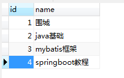

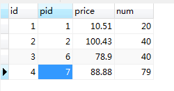

首先，我们需要先明白一个概念——笛卡尔积：

```xml
笛卡尔积是指在数学中，两个集合X和Y的笛卡尓积（Cartesian product），又称直积，表示为X × Y，第一个对象是X的成员而第二个对象是Y的所有可能有序对的其中一个成员。
例子：
假设集合A={a, b}，集合B={0, 1, 2}，则两个集合的笛卡尔积为
{
(a, 0),
(a, 1), 
(a, 2), 
(b, 0), 
(b, 1), 
(b, 2)
}。
```

现在来观察上面两个表形成的笛卡尔积：

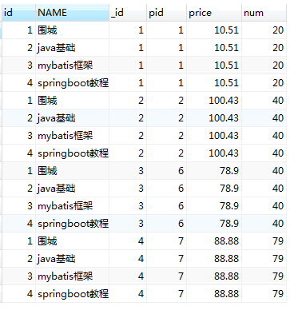

#### 1.Sql 之  inner join

**注释：INNER JOIN 与 JOIN 是相同的。**（相当于取交集）

**注释：INNER JOIN 关键字在表中存在至少一个匹配时返回行。**

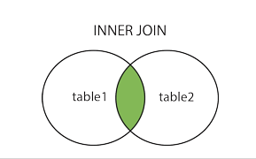

SQL  join 用于把来自两个或多个表的行结合起来。

最简单的就是内连接，inner join. 

```sql
-- 使用where连接
SELECT
	p.id,
	p.NAME,
	pd.id AS _id,
	pd.pid,
	pd.price,
	pd.num 
FROM
	product p,
	product_detail pd 
WHERE
	p.id = pd.pid;	
```

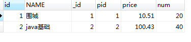

```sql
-- 	inner join or join
	
	SELECT
	p.id,
	p.NAME,
	pd.id AS _id,
	pd.pid,
	pd.price,
	pd.num 
	from product p
	INNER join product_detail pd
	on p.id = pd.pid;
```


以上两种方式查询的结果是一样的。（两个都相当于内连接）

总结：内连接inner join是将两个或两个以上的表连接起来，用on来连接，只用当on所限制的条件满足的时候，笛卡尔积组成的结果行才会返回。

如下图：(只有on后面的条件，p.id = pd.pid成立的时候)

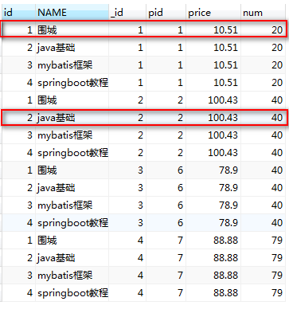

#### 2.Sql 之  left join  | left outer join 

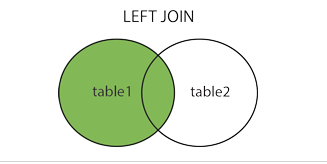

**注释：LEFT JOIN 关键字从左表（Websites）返回所有的行，即使右表（access_log）中没有匹配。**


```sql
-- left join or left outer join
	
SELECT
	p.id,
	p.NAME,
	pd.id AS _id,
	pd.pid,
	pd.price,
	pd.num 
	from product p
	left join product_detail pd
	on p.id = pd.pid;
	
```

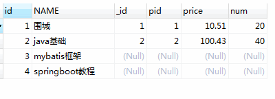

在左连接的基础上加上过滤条件

```sql
SELECT
	p.id,
	p.NAME,
	pd.id AS _id,
	pd.pid,
	pd.price,
	pd.num 
	from product p
	left join product_detail pd
	on p.id = pd.pid and p.id = 1
```

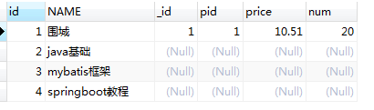

使用where进行过滤的

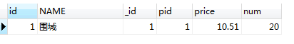


**注意：**在使用 left jion 时，**on** 和 **where** 条件的区别如下：

- 1、 **on** 条件是在生成临时表时使用的条件，它不管 **on** 中的条件是否为真，都会返回左边表中的记录。
- 2、**where** 条件是在临时表生成好后，再对临时表进行过滤的条件。这时已经没有 left join 的含义（必须返回左边表的记录）了，条件不为真的就全部过滤掉。


#### 3.Sql 之  right join |  right outer join 

**注释：RIGHT JOIN 关键字从右表（table2）返回所有的行，即使左表（table1）中没有匹配。如果左表中没有匹配，则结果为 NULL。**

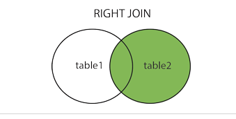

```sql
select 
p.id,
p.name,
pd.id as _id,
pd.pid,
pd.price,
pd.num
from product p
right join product_detail pd
on p.id = pd.pid
```

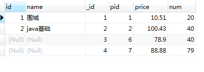

加入过滤条件的有连接 on 后面接and进行过滤

```sql
select 
p.id,
p.name,
pd.id as _id,
pd.pid,
pd.price,
pd.num
from product p
right join product_detail pd
on p.id = pd.pid
and pd.pid = 1
```

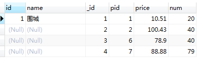

```sql
select 
p.id,
p.name,
pd.id as _id,
pd.pid,
pd.price,
pd.num
from product p
right join product_detail pd
on p.id = pd.pid
-- and pd.pid = 1
where pd.pid = 1
```

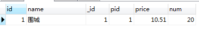

使用on过滤和where过滤跟上面的左连接是一样的。

#### **4.Sql 之  full join** | full outer join

**注释：FULL OUTER JOIN 关键字返回左表（Websites）和右表（access_log）中所有的行**

（使用方式如上面两种那样，但是mysql不支持全连接）

#### **5.Sql 之  union and union all**

但是可以使用union关键字来实现所谓的全连接

```sql

SELECT
	p.id,
	p.NAME,
	pd.id AS _id,
	pd.pid,
	pd.price,
	pd.num 
FROM
	product as p
	left JOIN product_detail pd
	ON p.id = pd.pid
	
UNION
 
 SELECT 
 p.id,
	p.NAME,
	pd.id AS _id,
	pd.pid,
	pd.price,
	pd.num 
FROM
 product p
 right join product_detail pd
 on p.id = pd.pid;
```

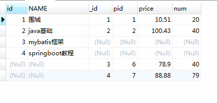

上面是使用的是union，不显示重复行，但是如果把union换成union all 那么就会把重复行显示出来，

效果如下图：（union all）

​	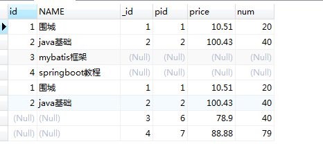

#### 6.Sql 之  natural join 

```sql
SELECT
	* 
FROM
	product
	NATURAL JOIN product_detail
```

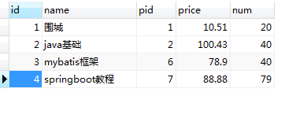

**注释：**自然连接默认是匹配两个表列名相同的，然后不重复显示。

如下图，将数据库表设计改变：（改变第一个表的id名为pid）

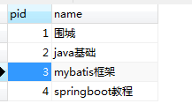

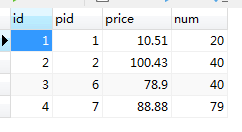

结果如下：

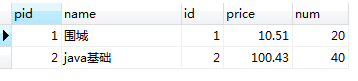

