## SQL笔记

### SQL 连接(JOIN)

```
    INNER JOIN：如果表中有至少一个匹配，则返回行
    LEFT JOIN：即使右表中没有匹配，也从左表返回所有的行
    RIGHT JOIN：即使左表中没有匹配，也从右表返回所有的行
    FULL JOIN：只要其中一个表中存在匹配，则返回行
```

#### 0.Sql 之 笛卡尔积

**注释：INNER JOIN 与 JOIN 是相同的。**

数据库表：

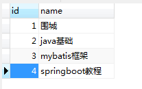

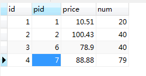

首先，我们需要先明白一个概念——笛卡尔积：

```xml
笛卡尔积是指在数学中，两个集合X和Y的笛卡尓积（Cartesian product），又称直积，表示为X × Y，第一个对象是X的成员而第二个对象是Y的所有可能有序对的其中一个成员。
例子：
假设集合A={a, b}，集合B={0, 1, 2}，则两个集合的笛卡尔积为
{
(a, 0),
(a, 1), 
(a, 2), 
(b, 0), 
(b, 1), 
(b, 2)
}。
```

现在来观察上面两个表形成的笛卡尔积：

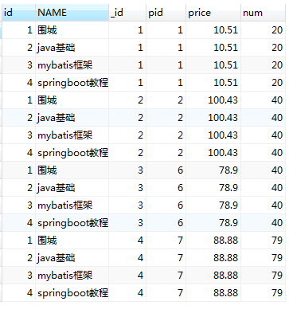

#### 1.Sql 之  inner join

**注释：INNER JOIN 与 JOIN 是相同的。**（相当于取交集）

**注释：INNER JOIN 关键字在表中存在至少一个匹配时返回行。**

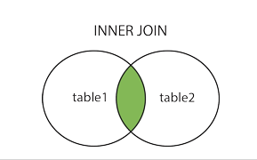

SQL  join 用于把来自两个或多个表的行结合起来。

最简单的就是内连接，inner join. 

```sql
-- 使用where连接
SELECT
	p.id,
	p.NAME,
	pd.id AS _id,
	pd.pid,
	pd.price,
	pd.num 
FROM
	product p,
	product_detail pd 
WHERE
	p.id = pd.pid;	
```

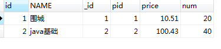

```sql
-- 	inner join or join
	
	SELECT
	p.id,
	p.NAME,
	pd.id AS _id,
	pd.pid,
	pd.price,
	pd.num 
	from product p
	INNER join product_detail pd
	on p.id = pd.pid;
```


以上两种方式查询的结果是一样的。（两个都相当于内连接）

总结：内连接inner join是将两个或两个以上的表连接起来，用on来连接，只用当on所限制的条件满足的时候，笛卡尔积组成的结果行才会返回。

如下图：(只有on后面的条件，p.id = pd.pid成立的时候)

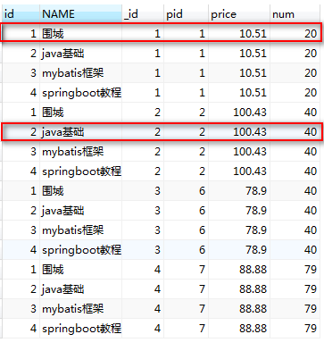

#### 2.Sql 之  left join  | left outer join 

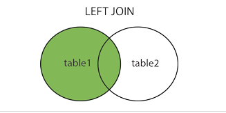

**注释：LEFT JOIN 关键字从左表（Websites）返回所有的行，即使右表（access_log）中没有匹配。**


```sql
-- left join or left outer join
	
SELECT
	p.id,
	p.NAME,
	pd.id AS _id,
	pd.pid,
	pd.price,
	pd.num 
	from product p
	left join product_detail pd
	on p.id = pd.pid;
	
```

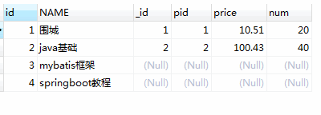

在左连接的基础上加上过滤条件

```sql
SELECT
	p.id,
	p.NAME,
	pd.id AS _id,
	pd.pid,
	pd.price,
	pd.num 
	from product p
	left join product_detail pd
	on p.id = pd.pid and p.id = 1
```

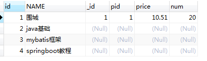

使用where进行过滤的

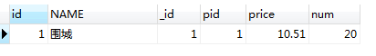


**注意：**在使用 left jion 时，**on** 和 **where** 条件的区别如下：

- 1、 **on** 条件是在生成临时表时使用的条件，它不管 **on** 中的条件是否为真，都会返回左边表中的记录。
- 2、**where** 条件是在临时表生成好后，再对临时表进行过滤的条件。这时已经没有 left join 的含义（必须返回左边表的记录）了，条件不为真的就全部过滤掉。


#### 3.Sql 之  right join |  right outer join 

**注释：RIGHT JOIN 关键字从右表（table2）返回所有的行，即使左表（table1）中没有匹配。如果左表中没有匹配，则结果为 NULL。**

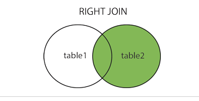

```sql
select 
p.id,
p.name,
pd.id as _id,
pd.pid,
pd.price,
pd.num
from product p
right join product_detail pd
on p.id = pd.pid
```

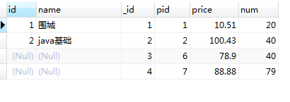

加入过滤条件的有连接 on 后面接and进行过滤

```sql
select 
p.id,
p.name,
pd.id as _id,
pd.pid,
pd.price,
pd.num
from product p
right join product_detail pd
on p.id = pd.pid
and pd.pid = 1
```

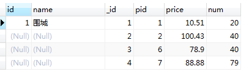

```sql
select 
p.id,
p.name,
pd.id as _id,
pd.pid,
pd.price,
pd.num
from product p
right join product_detail pd
on p.id = pd.pid
-- and pd.pid = 1
where pd.pid = 1
```

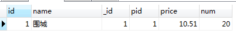

使用on过滤和where过滤跟上面的左连接是一样的。

#### **4.Sql 之  full join** | full outer join

**注释：FULL OUTER JOIN 关键字返回左表（Websites）和右表（access_log）中所有的行**

（使用方式如上面两种那样，但是mysql不支持全连接）

#### **5.Sql 之  union and union all**

但是可以使用union关键字来实现所谓的全连接

```sql

SELECT
	p.id,
	p.NAME,
	pd.id AS _id,
	pd.pid,
	pd.price,
	pd.num 
FROM
	product as p
	left JOIN product_detail pd
	ON p.id = pd.pid
	
UNION
 
 SELECT 
 p.id,
	p.NAME,
	pd.id AS _id,
	pd.pid,
	pd.price,
	pd.num 
FROM
 product p
 right join product_detail pd
 on p.id = pd.pid;
```

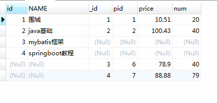

上面是使用的是union，不显示重复行，但是如果把union换成union all 那么就会把重复行显示出来，

效果如下图：（union all）

​	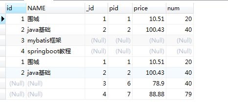

#### 6.Sql 之  natural join 

```sql
SELECT
	* 
FROM
	product
	NATURAL JOIN product_detail
```

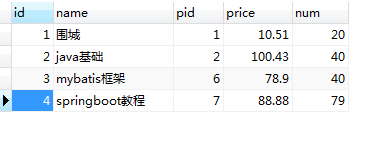

**注释：**自然连接默认是匹配两个表列名相同的，然后不重复显示。

如下图，将数据库表设计改变：（改变第一个表的id名为pid）

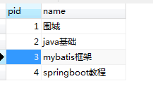

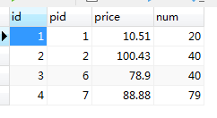

结果如下：

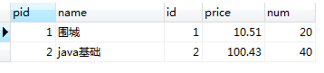

