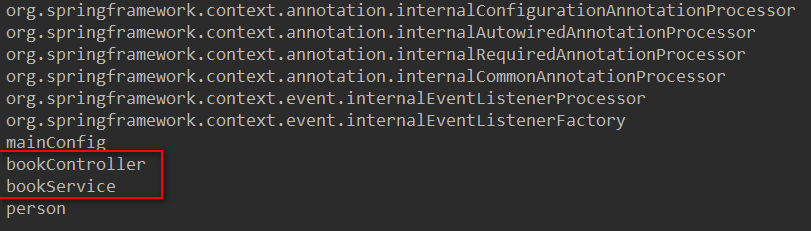

#  Spring

## 1.@Configuration&@Bean

~~~xml
使用@Configuration指定一个配置类 ==> xml文件
使用@Bean类注入一个bean ==><bean></bean>
~~~

### 第一种：使用XML的方式注入Bean

Person.java

~~~java
package com.ooyhao.bean;

import java.io.Serializable;

/**
 * @author ooyhao
 */
public class Person implements Serializable {

    private String name;

    private Integer age;

    public Person() {

    }

    public Person(String name, Integer age) {
        this.name = name;
        this.age = age;
    }
//省略Getter/Setter/toString()
}

~~~

beans.xml

~~~xml
<?xml version="1.0" encoding="UTF-8"?>
<beans xmlns="http://www.springframework.org/schema/beans"
       xmlns:xsi="http://www.w3.org/2001/XMLSchema-instance"
       xsi:schemaLocation="http://www.springframework.org/schema/beans http://www.springframework.org/schema/beans/spring-beans.xsd">
    
    <bean id="person" class="com.ooyhao.bean.Person">
        <property name="name" value="张三"></property>
        <property name="age" value="18"></property>
    </bean>
</beans>
~~~

测试文件：

~~~java
@Test
public void TestXML() {
    ClassPathXmlApplicationContext context = new ClassPathXmlApplicationContext("beans.xml");
    Person person = (Person) context.getBean("person");
    System.out.println(person);
}
~~~


### 第二种：使用注解与配置类的方式

Config.java

~~~java
package com.ooyhao.config;

import com.ooyhao.bean.Person;
import org.springframework.context.annotation.Bean;
import org.springframework.context.annotation.Configuration;

/**
 * @author ooyhao
 */
//配置类==配置文件
@Configuration //告诉Spring这是一个配置类
public class MainConfig {

    // 给容器中注册一个Bean，类型就是返回值的类型，id默认是用方法名作为id、
    @Bean("person")
    public Person person01(){
        return new Person("李四",20);
    }
}

~~~

测试文件：

~~~java
@Test
public void testConfig(){
    AnnotationConfigApplicationContext context = new AnnotationConfigApplicationContext(MainConfig.class);
    Person person = context.getBean(Person.class);
    System.out.println(person);
    String[] names = context.getBeanNamesForType(Person.class);
    System.out.println(Arrays.toString(names));
}
~~~


### 总结：

~~~java
1.MainConfig.java.相当于beans.xml。（需要使用@Configuration注解指明）
2.@Bean所标注的方法，相当于<bean></bean>.方法返回值的类型就是Bean的类型。方法名默认就是bean的id名。
	但是可以在@Bean注解的value或name属性进行修改。修改后id名就变为@Bean标注的了。
	 String[] names = context.getBeanNamesForType(Person.class);
     System.out.println(Arrays.toString(names));//结果如上：person。而不是person01

注意：不同的spring版本的@Bean可使用的属性不同。这里的4.3.12有name和value。而后面的只有name.


@Target({ElementType.METHOD, ElementType.ANNOTATION_TYPE})
@Retention(RetentionPolicy.RUNTIME)
@Documented
public @interface Bean {
    @AliasFor("name")
    String[] value() default {};

    @AliasFor("value")
    String[] name() default {};

    Autowire autowire() default Autowire.NO;

    String initMethod() default "";

    String destroyMethod() default "(inferred)";
} 
    
~~~


## 2.@ComponentScan

### 1.使用xml配置包扫描的方式

~~~xml
<!--包扫描，只要标注了@Controller/@Service/@Repository/@Component就可以被扫描到-->
<context:component-scan base-package="com.ooyhao"></context:component-scan>
~~~


定义相应的Controller，service，dao层，并用相应的注解进行标注。

### 2.使用注解方式进行包扫描

~~~java
//配置类==配置文件
@ComponentScan(value = {"com.ooyhao"})//可以定义多个。
@Configuration //告诉Spring这是一个配置类
public class MainConfig {

    // 给容器中注册一个Bean，类型就是返回值的类型，id默认是用方法名作为id、
    @Bean("person")
    public Person person01(){
        return new Person("李四",20);
    }
}
~~~

注意：

~~~xml
	xml方式，<context:component-scan></context:component-scan>是配置在beans.xml文件中的，所以只需要在MainConfig类上用@ComponentScan(value/basePackages="")来进行扫描。（value与basePackages作用一致）。
~~~

可以定义多个：（部分源码）

~~~java
@Retention(RetentionPolicy.RUNTIME)
@Target(ElementType.TYPE)
@Documented
@Repeatable(ComponentScans.class)
public @interface ComponentScan {

	/**
	 * Alias for {@link #basePackages}.
	 * <p>Allows for more concise annotation declarations if no other attributes
	 * are needed &mdash; for example, {@code @ComponentScan("org.my.pkg")}
	 * instead of {@code @ComponentScan(basePackages = "org.my.pkg")}.
	 */
	@AliasFor("basePackages")
	String[] value() default {};

	/**
	 * Base packages to scan for annotated components.
	 * <p>{@link #value} is an alias for (and mutually exclusive with) this
	 * attribute.
	 * <p>Use {@link #basePackageClasses} for a type-safe alternative to
	 * String-based package names.
	 */
	@AliasFor("value")
	String[] basePackages() default {};

	/**
	 * Type-safe alternative to {@link #basePackages} for specifying the packages
	 * to scan for annotated components. The package of each class specified will be scanned.
	 * <p>Consider creating a special no-op marker class or interface in each package
	 * that serves no purpose other than being referenced by this attribute.
	 */
	Class<?>[] basePackageClasses() default {};
~~~

测试代码：

~~~java
@Test
public void testComponent(){
    AnnotationConfigApplicationContext context = new 
        AnnotationConfigApplicationContext(MainConfig.class);
    String[] names = context.getBeanDefinitionNames();
    for(String name:names){
        System.out.println(name);
    }
}
~~~

结果：


### 3.@Component的扫描规则

#### 1.FilterType的源码（取值）：

~~~java
public enum FilterType {
	ANNOTATION,			//按照注解的方式
	ASSIGNABLE_TYPE,	//按照给定的类型
	ASPECTJ,			//按照ASPECTJ表达式
	REGEX,				//按照正则表达式
	CUSTOM				//自定义
}
~~~

#### 2.@Componenet的源码

~~~java
@Retention(RetentionPolicy.RUNTIME)
@Target(ElementType.TYPE)
@Documented
@Repeatable(ComponentScans.class)  //可以重复，说明可以写多个ComponentScan
public @interface ComponentScan {

	@AliasFor("basePackages")
	String[] value() default {};

	@AliasFor("value")
	String[] basePackages() default {};

	Class<?>[] basePackageClasses() default {};

	Class<? extends BeanNameGenerator> nameGenerator() default BeanNameGenerator.class;

	Class<? extends ScopeMetadataResolver> scopeResolver() default AnnotationScopeMetadataResolver.class;

	ScopedProxyMode scopedProxy() default ScopedProxyMode.DEFAULT;

	String resourcePattern() default ClassPathScanningCandidateComponentProvider.DEFAULT_RESOURCE_PATTERN;

	boolean useDefaultFilters() default true;

	Filter[] includeFilters() default {};

	Filter[] excludeFilters() default {};

	boolean lazyInit() default false;

	@Retention(RetentionPolicy.RUNTIME)
	@Target({})
	@interface Filter {

		FilterType type() default FilterType.ANNOTATION;

		@AliasFor("classes")
		Class<?>[] value() default {};

		@AliasFor("value")
		Class<?>[] classes() default {};

		String[] pattern() default {};

	}

}

~~~


#### 3.MainConfig.java（排除）

~~~java
//配置类==配置文件
@ComponentScan(value = {"com.ooyhao"},excludeFilters = {
        @Filter(type = FilterType.ANNOTATION,value = {Controller.class}),
        @Filter(type = FilterType.ASSIGNABLE_TYPE,value = {BookService.class})
})
@Configuration //告诉Spring这是一个配置类
public class MainConfig {

    // 给容器中注册一个Bean，类型就是返回值的类型，id默认是用方法名作为id、
    @Bean("person")
    public Person person01(){
        return new Person("李四",20);
    }

}
~~~

（排除了@Controller标注的，以及BookService类型的）


#### 4.MainConfig.java（包含）

xml方式：

~~~xml
<!--包扫描，只要标注了@Controller/@Service/@Repository/@Component就可以被扫描到-->
<context:component-scan base-package="com.ooyhao" use-default-filters="false"></context:component-scan>
<!--需要使用use-default-filters来禁用默认的扫描规则-->
~~~

注解方式：

~~~java
//配置类==配置文件
/*@ComponentScan(value = {"com.ooyhao"},excludeFilters = {
        @Filter(type = FilterType.ANNOTATION,value = {Controller.class}),
        @Filter(type = FilterType.ASSIGNABLE_TYPE,value = {BookService.class})
})*/
@ComponentScan(basePackages = "com.ooyhao",includeFilters = {
        @Filter(type = FilterType.ANNOTATION,value = {Controller.class})
},useDefaultFilters = false)
@Configuration //告诉Spring这是一个配置类
public class MainConfig {
~~~

(只包含@Controller标注的)


~~~java
@Retention(RetentionPolicy.RUNTIME)
@Target(ElementType.TYPE)
@Documented
@Repeatable(ComponentScans.class)  //可以重复，说明可以写多个ComponentScan
public @interface ComponentScan {
~~~

可同时写多个@ComponentScan(JDK1.8)。也可以使用@ComponentScans();

~~~java
@Retention(RetentionPolicy.RUNTIME)
@Target(ElementType.TYPE)
@Documented
public @interface ComponentScans {
	ComponentScan[] value();
}
~~~

(配置多个@ComponentScan)

~~~java
@ComponentScan(basePackages = "com.ooyhao",includeFilters = {
        @Filter(type = FilterType.ANNOTATION,value = {Controller.class})//（按照注解）
},useDefaultFilters = false)
@ComponentScan(basePackages = "com.ooyhao",includeFilters = {
        @Filter(type = FilterType.ANNOTATION,value = {Service.class})//包括子类（按照指定类型）
},useDefaultFilters = false)
@Configuration //告诉Spring这是一个配置类
public class MainConfig {
~~~



#### 5.自定义扫描规则

~~~java
通过实现TypeFilter接口来自定义扫描规则的Filter

public interface TypeFilter {

	/**
	 * @param metadataReader ：当前正在扫描的类的信息
	 * @param metadataReaderFactory ：可以获取到其他类的信息
	 */
	boolean match(MetadataReader metadataReader, MetadataReaderFactory metadataReaderFactory)
			throws IOException;
}

~~~

自定义扫描过滤器

~~~java
public class MyTypeFilter implements TypeFilter{

    /**
     * @param metadataReader ：当前正在扫描的类的信息
     * @param metadataReaderFactory ：可以获取到其他类的信息
     */
    @Override
    public boolean match(MetadataReader metadataReader, MetadataReaderFactory metadataReaderFactory) throws IOException {
        //获得当前类注解信息
        AnnotationMetadata annotationMetadata = metadataReader.getAnnotationMetadata();
        //获取当前正在扫描的类的类信息
        ClassMetadata classMetadata = metadataReader.getClassMetadata();
        //获得当前类资源信息（类的路径等）
        Resource resource = metadataReader.getResource();
//        String className = classMetadata.getClassName();
        System.out.println(annotationMetadata.getAnnotationTypes());//获得注解类型
        System.out.println(resource.getURL());//获得资源路径
        System.out.println(classMetadata.getClassName());//获得类名

        if(classMetadata.getClassName().contains("er")) {
            return true;
        }
        return false;
    }
}

~~~

在Config.java上配置

~~~java
@ComponentScan(basePackages = "com.ooyhao",includeFilters = {
        /*@Filter(type = FilterType.ANNOTATION,value = {Controller.class}),*/
        @Filter(type = FilterType.CUSTOM,value = {MyTypeFilter.class})
},useDefaultFilters = false)
@Configuration //告诉Spring这是一个配置类
public class MainConfig {
~~~


总结：

为什么myTypeFilter会被扫描到：

​	由于我们扫描的基本包是com.ooyhao，所有在这个基本包下面的所有的类都会被扫描到进行过滤，而只有上述结果中的三个是包含"er"的，所有就会被扫描到。


## 3.@Scope作用域

### 1.@Scope的源码

~~~java
@Target({ElementType.TYPE, ElementType.METHOD})
@Retention(RetentionPolicy.RUNTIME)
@Documented
public @interface Scope {

	@AliasFor("scopeName")
	String value() default "";

	/**
	 * prototype 多实例
	 * singleton 单实例
	 * request 	同一个请求创建一个实例（一般不用）  
	 * session  同一个session会话创建一个实例（一般不用）
	 * 如果是web环境我们一般将对象存至request域&Session域
	 */
	@AliasFor("value")
	String scopeName() default "";
    
	ScopedProxyMode proxyMode() default ScopedProxyMode.DEFAULT;

}
~~~

MainConfig.java

~~~java

@Configuration
public class MainConfig2 {
    
    @Scope(scopeName = "prototype")
    @Bean
    public Person person(){
        return new Person("李四",25);
    }
}
~~~

测试：

~~~java
@Test
    public void testScope(){
        AnnotationConfigApplicationContext context = new AnnotationConfigApplicationContext(MainConfig2.class);
        String[] names = context.getBeanDefinitionNames();
        for(String name:names){
            System.out.println(name);
        }
        Person person1 = (Person) context.getBean("person");
        Person person2 = (Person) context.getBean("person");
        System.out.println(person1 == person2);
    }
~~~


### **2.singleton:**

​	Bean组件在单实例（默认）的情况下，ioc容器在创建后就会调用方法把对象放到ioc容器中。以后每次获取就是直接从容器（类似map.get()）中拿，而不会再次创建，所有person1 == person2 为true。

### **3.prototype:**

​	Bean组件在多实例的情况下，ioc容器创建时不会直接调用方法将对象创建出来，而是在每一次获取对象的时候，ioc容器都会创建一个新的对象返回，即每次获取的对象都是不同的。所有person1 == person2 为false；


## 4.@Lazy懒加载

懒加载：

​	单实例bean，默认是在容器启动的时候创建对象。

​	使用懒加载时，将对象的创建推迟到第一次获取的时候。

### 1.@Lazy源码

~~~java
@Target({ElementType.TYPE, ElementType.METHOD, ElementType.CONSTRUCTOR, ElementType.PARAMETER, ElementType.FIELD})
@Retention(RetentionPolicy.RUNTIME)
@Documented
public @interface Lazy {

	/**
	 * Whether lazy initialization should occur.
	 */
	boolean value() default true;
}

~~~

### 2.不使用懒加载：

~~~java
@Configuration
public class MainConfig2 {
    //@Lazy
    @Scope(scopeName = "singleton")
    @Bean
    public Person person(){
        System.out.println("创建person对象");
        return new Person("李四",25);
    }
}
~~~

测试文件：

~~~java
@Test
public void testLazy(){
    AnnotationConfigApplicationContext context = new AnnotationConfigApplicationContext(MainConfig2.class);
    System.out.println("ioc容器创建完成");
}
~~~

 

### 3.使用懒加载：

MainConfig.java把@Lazy注解释放

测试文件：

~~~java
@Test
public void testLazy(){
    AnnotationConfigApplicationContext context = new AnnotationConfigApplicationContext(MainConfig2.class);
    System.out.println("ioc容器创建完成");
    System.out.println("获取person对象");
    context.getBean("person");
}
~~~


总结：

​	可以看出，不使用lazy懒加载时，容器创建时就创建了person对象。而使用了lazy时，就推迟到获取person

的时候创建的。


## 5.@Conditional

### 1.@Conditional的源码：

~~~java
@Target({ElementType.TYPE, ElementType.METHOD})
@Retention(RetentionPolicy.RUNTIME)
@Documented
public @interface Conditional {
	Class<? extends Condition>[] value();
}

~~~

### 2.Condition的源码：

```java
public interface Condition {

   /**
    * Determine if the condition matches.
    * @param context the condition context
    * @param metadata metadata of the {@link org.springframework.core.type.AnnotationMetadata class}
    * or {@link org.springframework.core.type.MethodMetadata method} being checked.
    * @return {@code true} if the condition matches and the component can be registered
    * or {@code false} to veto registration.
    */
   boolean matches(ConditionContext context, AnnotatedTypeMetadata metadata);

}
```

如果我们要自定义条件，可以通过实现Condition接口，同时matchs的返回值来控制条件、

### 3.自定义Condition

**MainConfig.java配置类**

~~~java
@Configuration
public class MainConfig2 {

    @Lazy
    @Scope(scopeName = "singleton")
    @Bean
    public Person person(){
        System.out.println("创建person对象");
        return new Person("李四",25);
    }

    /**
     * @Conditional({Condition}) 按照一定的条件进行判断，满足条件给容器中注册Bean。
     *
     * 如果系统是Windows，给容器中注册("bill")
     * 如果系统是Linux，给容器中添加（"linus"）
     */

    @Conditional({WindowsCondition.class})
    @Bean("bill")
    public Person person01(){
        return new Person("Bill Gates",62);
    }

    @Conditional({LinuxCondition.class})
    @Bean("linus")
    public Person person02(){
        return new Person("Linus",48);
    }
}

~~~

WindowsCondition.java

~~~java
/**
 * 判断系统是否为Windows
 */
public class WindowsCondition implements Condition {

    /**
     *
     * @param context  判断条件能使用的上下文条件
     * @param metadata 注释信息
     * @return
     */
    @Override
    public boolean matches(ConditionContext context, AnnotatedTypeMetadata metadata) {
        //判断是否为Windows系统
        String osName = context.getEnvironment().getProperty("os.name");
        if(osName.contains("Windows")){
            return true;
        }
        return false;
    }
}

~~~

LinuxCondition.java

~~~java
/**
 * 判断系统是否为Linux。
 */
public class LinuxCondition implements Condition {
    @Override
    public boolean matches(ConditionContext context, AnnotatedTypeMetadata metadata) {
        //判断是否为Linux系统

        //1.能获得到ioc使用的beanFactory
        ConfigurableListableBeanFactory beanFactory = context.getBeanFactory();
        //2.能获得类加载器
        ClassLoader classLoader = context.getClassLoader();
        //3.获得当前环境信息
        Environment environment = context.getEnvironment();
        //4.获得到Bean定义的注册类
        BeanDefinitionRegistry registry = context.getRegistry();

        String osName = context.getEnvironment().getProperty("os.name");
        if(osName.contains("Linux")){
            return true;
        }
        return false;
    }
}
~~~

测试方法：

```java
@Test
public void testConditional(){
    AnnotationConfigApplicationContext applicationContext = new AnnotationConfigApplicationContext(MainConfig2.class);
    String[] names = applicationContext.getBeanNamesForType(Person.class);
    for(String name : names){
        System.out.println(name);
    }
    Map<String, Person> beansOfType = applicationContext.getBeansOfType(Person.class);
    System.out.println(beansOfType);
    String osName = applicationContext.getEnvironment().getProperty("os.name");
    System.out.println(osName);

}
```

系统默认结果：


将我们的运行环境更改一下：


结果：


总结：

- 通过根据运行环境来判断哪一个Bean应该进行添加到容器中。

- @Target({ElementType.TYPE, ElementType.METHOD}) 可以放到类/接口上。也可以放在方法上、

  ​

## 6.给容器中导入组件

### 0.导入组件的几种方法：

~~~java
/**
 *  给容器中注册组件：
 *  1) 包扫描+组件标注注解（@Controller,@Service,@Repository,@Component）[自己写的类]
 *  2) @Bean [导入的第三方包里面的组件，由于其可能没有标注上述注解，我们就可以使用@Bean添加到容器中去]
 *  3) @Import [快速的给容器中导入组件]
 *      1，@Import({要导入组件的class})
 *      2，@Import({ImportSelector.class})
 *      3，@Import({ImportBeanDefinitionRegistrar.class})
 *  4) 使用Spring提供的FactoryBean（工厂Bean）
 *    
 */
~~~


### 1.@Import源码：

~~~java
@Target(ElementType.TYPE)
@Retention(RetentionPolicy.RUNTIME)
@Documented
public @interface Import {

	/**
	 * {@link Configuration}, {@link ImportSelector}, {@link ImportBeanDefinitionRegistrar}
	 * or regular component classes to import.
	 */
	Class<?>[] value();
}
~~~

### 2.ImportSelector的源码

~~~java
public interface ImportSelector {

	/**
	 * Select and return the names of which class(es) should be imported based on
	 * the {@link AnnotationMetadata} of the importing @{@link Configuration} class.
	 */
	String[] selectImports(AnnotationMetadata importingClassMetadata);
}
~~~


### 3.ImportBeanDefinitionRegistrar源码

~~~java
public interface ImportBeanDefinitionRegistrar {

	/**
	 * Register bean definitions as necessary based on the given annotation metadata of
	 * the importing {@code @Configuration} class.
	 * <p>Note that {@link BeanDefinitionRegistryPostProcessor} types may <em>not</em> be
	 * registered here, due to lifecycle constraints related to {@code @Configuration}
	 * class processing.
	 * @param importingClassMetadata annotation metadata of the importing class
	 * @param registry current bean definition registry
	 */
	public void registerBeanDefinitions(
			AnnotationMetadata importingClassMetadata, BeanDefinitionRegistry registry);

}

~~~


### 4.使用自定义ImportSelector进行组件导入


~~~java
@Configuration
@Import({Color.class, Red.class, MyImportSelector.class}) //可以导入多个
//@Import导入组件，id默认是组件的全类名
public class MainConfig2 {

    @Lazy
    @Scope(scopeName = "singleton")
    @Bean
    public Person person(){
        System.out.println("创建person对象");
        return new Person("李四",25);
    }

    /**
     * @Conditional({Condition}) 按照一定的条件进行判断，满足条件给容器中注册Bean。
     *
     * 如果系统是Windows，给容器中注册("bill")
     * 如果系统是Linux，给容器中添加（"linus"）
     */

    @Conditional({WindowsCondition.class})
    @Bean("bill")
    public Person person01(){
        return new Person("Bill Gates",62);
    }

    @Conditional({LinuxCondition.class})
    @Bean("linus")
    public Person person02(){
        return new Person("Linus",48);
    }
}

~~~

自定义ImportSelector类

~~~java
public class MyImportSelector implements ImportSelector {

    /**
     *
     * @param importingClassMetadata  ：当前标注@Import注解类的所有注解信息
     * @return 返回值就是导入到容器中的组件的全类名。
     */
    @Override
    public String[] selectImports(AnnotationMetadata importingClassMetadata) {

        return new String[]{Blue.class.getName(), Yellow.class.getName()};
    }
}

~~~


测试类：

~~~java

@Test
public void testImport(){
    AnnotationConfigApplicationContext applicationContext = new AnnotationConfigApplicationContext(MainConfig2.class);
    String[] names = applicationContext.getBeanDefinitionNames();
    for(String name : names){
        System.out.println(name);
    }
}
~~~

结果图：


### 5.使用自定义ImportBeanDefinitionRegistrar进行组件导入


#### 1.自定义ImportBeanDefinitionRegistrar

~~~java
public class MyImportBeanDefinitionRegistrar implements ImportBeanDefinitionRegistrar {

    /**
     *
     * @param importingClassMetadata 当前类的注解信息
     * @param registry  BeanDefinition注册类。
     *                     把所有需要添加到容器中的bean，
     *                     调用 BeanDefinitionRegistry.registerBeanDefinition手工注册进来
     */
    @Override
    public void registerBeanDefinitions(AnnotationMetadata importingClassMetadata, BeanDefinitionRegistry registry) {

        boolean definition1 = registry.containsBeanDefinition(Red.class.getName());
        boolean definition2 = registry.containsBeanDefinition(Blue.class.getName());
        if(definition1 && definition2){
            //指定Bean的定义信息，（Bean的Scope等）
            BeanDefinition beanDefinition = new RootBeanDefinition(RainBow.class);
            registry.registerBeanDefinition("rainBow",beanDefinition);
        }

    }
}

~~~

#### 2.MainConfig.java的@Import进行引入

~~~java
@Configuration
@Import({Color.class, Red.class, MyImportSelector.class, MyImportBeanDefinitionRegistrar.class}) //可以导入多个
//@Import导入组件，id默认是组件的全类名
public class MainConfig2 {

    @Lazy
    @Scope(scopeName = "singleton")
    @Bean
    public Person person(){
        System.out.println("创建person对象");
        return new Person("李四",25);
    }

    /**
     * @Conditional({Condition}) 按照一定的条件进行判断，满足条件给容器中注册Bean。
     *
     * 如果系统是Windows，给容器中注册("bill")
     * 如果系统是Linux，给容器中添加（"linus"）
     */

    @Conditional({WindowsCondition.class})
    @Bean("bill")
    public Person person01(){
        return new Person("Bill Gates",62);
    }

    @Conditional({LinuxCondition.class})
    @Bean("linus")
    public Person person02(){
        return new Person("Linus",48);
    }
}

~~~

#### 3.测试结果：


### 6.FactoryBean

#### 1.FactoryBean的源码

~~~java
package org.springframework.beans.factory;

public interface FactoryBean<T> {
    T getObject() throws Exception;

    Class<?> getObjectType();

    boolean isSingleton();
}
~~~

#### 2.自定义FactoryBean

~~~java
public class ColorFactoryBean implements FactoryBean<Color> {


    //返回一个Color对象，这个对象会添加到容器中
    @Override
    public Color getObject() throws Exception {
        System.out.println("ColorFactoryBean...");
        return new Color();
    }

    @Override
    public Class<?> getObjectType() {
        return Color.class;
    }

    //设置是否为单例

    /***
     * @return true:单例 false:多例
     */
    @Override
    public boolean isSingleton() {
        return false;
    }
}

~~~

#### 3.在MainConfig.java中注册Bean

~~~java
@Bean
public ColorFactoryBean colorFactoryBean(){
    return new ColorFactoryBean();
}
~~~

#### 4.测试：

```java
@Test
public void testImport(){
    AnnotationConfigApplicationContext applicationContext = new AnnotationConfigApplicationContext(MainConfig2.class);
    String[] names = applicationContext.getBeanDefinitionNames();
    for(String name : names){
        System.out.println(name);
    }
    //工厂Bean获取的是调用getObject创建的对象。
    Object bean1 = applicationContext.getBean("colorFactoryBean");
    Object bean2 = applicationContext.getBean("colorFactoryBean");
    System.out.println(bean1.getClass());
//        System.out.println("设置的是单实例："+ (bean1 == bean2));//设置的是单实例：true
    System.out.println("设置的是多实例："+ (bean1 == bean2));//设置的是多实例：false


}
```

#### 5.结果：

**(Singleton)**


**(Prototype)**


**如果需要获得工厂类本身**

~~~java
Object bean = applicationContext.getBean("&colorFactoryBean");
~~~

### 7.总 结：

```java
/**
 *  给容器中注册组件：
 *  1) 包扫描+组件标注注解（@Controller,@Service,@Repository,@Component）[自己写的类]
 *  2) @Bean [导入的第三方包里面的组件，由于其可能没有标注上述注解，我们就可以使用@Bean添加到容器中去]
 *  3) @Import [快速的给容器中导入组件]
 *      1，@Import({要导入组件的class}):容器中就会自动注入这个组件，id默认是全类名。
 *      2，@Import({ImportSelector.class}):返回需要导入的组件的全类名数组。
 *      3，@Import({ImportBeanDefinitionRegistrar.class})：手动注册Bean到容器中
 *  4) 使用Spring提供的FactoryBean（工厂Bean）
 *      1)默认获取到的工厂bean调用getObject创建的对象。
 *      2）如果要获得的是工厂Bean本身，我们需要在id前面加一个&
 *          $colorFactoryBean
 */
```


## 7.@Bean bean的声明周期

~~~java
/**
 * bean的生命周期：
 * 		bean创建---初始化----销毁的过程
 * 容器管理bean的生命周期；
 * 我们可以自定义初始化和销毁方法；容器在bean进行到当前生命周期的时候来调用我们自定义的初始化和销毁方法
 * 
 * 构造（对象创建）
 * 		单实例：在容器启动的时候创建对象
 * 		多实例：在每次获取的时候创建对象
 * 
 * BeanPostProcessor.postProcessBeforeInitialization
 * 初始化：
 * 		对象创建完成，并赋值好，调用初始化方法。。。
 * BeanPostProcessor.postProcessAfterInitialization
 * 销毁：
 * 		单实例：容器关闭的时候
 * 		多实例：容器不会管理这个bean；容器不会调用销毁方法；
 * 
 * 
 * 遍历得到容器中所有的BeanPostProcessor；挨个执行beforeInitialization，
 * 一但返回null，跳出for循环，不会执行后面的BeanPostProcessor.postProcessorsBeforeInitialization
 * 
 * BeanPostProcessor原理
 * populateBean(beanName, mbd, instanceWrapper);给bean进行属性赋值
 * initializeBean
 * {
 * 		applyBeanPostProcessorsBeforeInitialization(wrappedBean, beanName);
 * 		invokeInitMethods(beanName, wrappedBean, mbd);执行自定义初始化
 * 		applyBeanPostProcessorsAfterInitialization(wrappedBean, beanName);
 *}
 * 
 * 
 * 
 * 1）、指定初始化和销毁方法；
 * 		通过@Bean指定init-method和destroy-method；
 * 2）、通过让Bean实现InitializingBean（定义初始化逻辑），
 * 				DisposableBean（定义销毁逻辑）;
 * 3）、可以使用JSR250；
 * 		@PostConstruct：在bean创建完成并且属性赋值完成；来执行初始化方法
 * 		@PreDestroy：在容器销毁bean之前通知我们进行清理工作
 * 4）、BeanPostProcessor【interface】：bean的后置处理器；
 * 		在bean初始化前后进行一些处理工作；
 * 		postProcessBeforeInitialization:在初始化之前工作
 * 		postProcessAfterInitialization:在初始化之后工作
 * 
 * Spring底层对 BeanPostProcessor 的使用；
 * 		bean赋值，注入其他组件，@Autowired，生命周期注解功能，@Async,xxx BeanPostProcessor;
 * 
 *
 *
 */
~~~

### 一，通过指定初始化和销毁方法。

#### 1.在一个需要声明为Bean的类中自定义一个初始化和一个销毁方法。

~~~java

public class Car {

    public Car(){
        System.out.println("car construct...");
    }

    public void init(){
        System.out.println("car init...");
    }

    public void destroy(){
        System.out.println("car destroy...");
    }
}
~~~

#### 2.在主配置类中使用@Bean注解注册一个Bean实例，并通过initMethod属性和destroyMethod方法指定其初始化方法和销毁方法。

~~~java
@Configuration
public class MainConfig {

    @Scope("singleton")
    @Bean(initMethod = "init",destroyMethod = "destroy")
    public Car car(){
        return new Car();
    }
}
~~~

**此时@Scope设置为singleton**

结果：


**将@Scope设置为prototype**

测试文件如下：

~~~java
@Test
public void testImport(){

    AnnotationConfigApplicationContext context =
            new AnnotationConfigApplicationContext(MainConfig.class);
    String[] names = context.getBeanDefinitionNames();
    for(String name: names){
        System.out.println(name);
    }
    //-------prototype新增的一句获取语句-------
    Object bean = context.getBean("car");
    context.close();
}
~~~

结果：


#### 3.总结：

~~~xml
	如果使用的是通过自己指定初始化方法和销毁方法的话，那么我们需要在该类中自己定义相应的两个方法，在主配置类中通过@Bean注解进行注册到ioc容器中。同时通过@Bean注解的initMethod属性和destroyMethod属性分别对初始化方法和销毁方法进行指定。例如：
	@Scope("prototype")
    @Bean(initMethod = "init",destroyMethod = "destroy")
    public Car car(){
        return new Car();
    }
并且可以看出，单例模式下，ioc容器创建时就会创建bean放入其中。并能控制其生命周期，即可以控制bean的创建，				初始化，和销毁方法。
			多例模式下，ioc容器创建时不会创建bean instancec.只有当调用它的时候，才会进行创建和初始				化。
由上面两图可以看出。
~~~

### 二，通过让Bean实现InitializingBean（定义初始化逻辑），DisposableBean（定义销毁逻辑）;

#### 1.cat类如下：

~~~java
@Component
public class Cat implements InitializingBean,DisposableBean {

    public Cat(){
        System.out.println("cat construct...");
    }

    public void afterPropertiesSet() throws Exception {
        System.out.println("cat afterPropertiesSet...");
    }

    public void destroy() throws Exception {
        System.out.println("cat destroy...");
    }
}
~~~

#### 2.MainConfig.java主配置类

~~~java
@Configuration
@ComponentScan("com.ooyhao") //通过宝扫描的方式
public class MainConfig {
}
~~~

#### 3.结果


#### 4.总结：

~~~xml
	通过让Bean实现InitializingBean与DisposableBean两个接口，并重写其未实现的方法。然后将这个组件注册到ioc容器中去，当bean初始化和销毁的时机到了，就会调用这两个接口中的两个方法，进行初始化和销毁。
~~~


### 三.使用JSR250中@PostConstruct和@PreDestroy注解指定创建销毁


~~~xml
@PostConstruct：在bean创建完成并且属性赋值完成；来执行初始化方法
@PreDestroy：在容器销毁bean之前通知我们进行清理工作
~~~

Dog.java Bean

~~~java
@Component
public class Dog  {

    public Dog(){
        System.out.println("Dog construct...");
    }
    @PostConstruct
    public void init(){
        System.out.println("Dog @PostConstruct...");
    }
    @PreDestroy
    public void destroy(){
        System.out.println("Dog @PreDestroy...");
    }

}

~~~

使用@ComponentScan进行包扫描，

结果：


总结：

~~~xml
由上图可以知道，使用@PostConstrut和@PreDestroy注解，也可以实现指定方法作为bean的初始化和销毁方法。
使用JSR250；
     @PostConstruct：在bean创建完成并且属性赋值完成；来执行初始化方法
     @PreDestroy：在容器销毁bean之前通知我们进行清理工作
~~~


### 四，通过实现BeanPostProcessor接口

**MyBeanPostProcessor.java**

~~~java
@Component
public class MyBeanPostProcessor implements BeanPostProcessor {

    public MyBeanPostProcessor(){
        System.out.println("MyBeanPostProcessor construct...");
    }

    //初始化之前
    public Object postProcessBeforeInitialization(Object bean, String beanName) throws BeansException {
        System.out.println("postProcessBeforeInitialization ... "+beanName+"-->"+bean);
        return bean;
    }

    //初始化之后
    public Object postProcessAfterInitialization(Object bean, String beanName) throws BeansException {
        System.out.println("postProcessAfterInitialization ... "+beanName+"-->"+bean);
        return bean;
    }

}

~~~

**结果：**


**总结：**

~~~xml
BeanPostProcessor【interface】：bean的后置处理器；
 * 		在bean初始化前后进行一些处理工作；
 * 		postProcessBeforeInitialization:在初始化之前工作
 * 		postProcessAfterInitialization:在初始化之后工作

这个接口并不是控制自身的生命周期，而是通过这个bean实现这个接口后，所有bean在初始化之前都会调用postProcessBeforesInitialization方法，而bean初始化完成之后会执行postProcessAfterInitialization方法 
~~~

## 8.@Value&@PropertySource

### @value的源码：

~~~java
@Target({ElementType.FIELD, ElementType.METHOD, ElementType.PARAMETER, ElementType.ANNOTATION_TYPE})
@Retention(RetentionPolicy.RUNTIME)
@Documented
public @interface Value {
    String value();
}
~~~


### Person.java

~~~java
public class Person implements Serializable {


    //可以使用@Value注解
    /**
     * 1.可以使用基本数值
     * 2.可以使用SpEL表达，#{}
     * 3.可以写${},取出配置文件中的值。（在运行环境变量里面取）
     */
    @Value("张三")
    private String name;

    @Value("#{20 - 2}")
    private Integer age;

    @Value("${person.nickName}")
    private String nickName;

   //省getter/setter/toString
}

~~~

### properties文件

~~~properties
person.nickName=小张三
~~~

### 配置类：

~~~java
@Configuration
//使用PropertySource读取外部配置文件中的k/v保存到运行环境中。加载完外部配置文件以后使用${}取出配置文件中的值
@PropertySource(value = {"classpath:/person.properties"})
public class MainConfigOfPropertyValues {

    @Bean
    public Person person(){
        return new Person();
    }
}
~~~

以上使用@PerpertySource引入配置文件，相当于之前在xml文件中写的如下一句

~~~xml
<!--引入配置文件-->
<context:property-placeholder location="classpath:person.properties">
</context:property-placeholder>
~~~


### 测试类：

~~~java
@Test
public void test(){
    printBean();
    Person person = (Person) applicationContext.getBean("person");
    System.out.println(person);

    ConfigurableEnvironment environment = applicationContext.getEnvironment();
    String property = environment.getProperty("person.nickName");
    System.out.println(property);
}
~~~

### 结果：


### 总结：

~~~java
可以看出，其实配置文件中的信息是被加载到环境变量中去了，从而可以使用environment.getProperty("person.nickName")获取到
而使用@Value注解可以使用以下三种方式进行取值：
	//可以使用@Value注解
    /**
     * 1.可以使用基本数值
     * 2.可以使用SpEL表达，#{}
     * 3.可以写${},取出配置文件中的值。（在运行环境变量里面取）
     */
~~~

## 9.@Autowired和@Primary和@Qualifier（spring）

BookDao.java

~~~java
@Repository
public class BookDao {

    private String lable = "2";

    public String getLable() {
        return lable;
    }

    public void setLable(String lable) {
        this.lable = lable;
    }

    @Override
    public String toString() {
        return "BookDao{" +
                "lable='" + lable + '\'' +
                '}';
    }
}

~~~

BookService.java

```java
@Service
public class BookService {


    @Qualifier("bookDao")
    @Autowired
    private BookDao bookDao;

    public BookDao getBookDao() {
        return bookDao;
    }

    public void setBookDao(BookDao bookDao) {
        this.bookDao = bookDao;
    }

}
```

Config.java类

~~~java
@Configuration
@ComponentScan(basePackages = {"com.ooyhao.service","com.ooyhao.controller","com.ooyhao.dao"})
public class MainConfigOfAutowired {
//    @Primary
    @Bean
    public BookDao bookDao(){
        BookDao bookDao = new BookDao();
        bookDao.setLable("1");
        return bookDao;
    }
}

~~~

测试类

~~~java
@Test
public void testAutowired(){
    BookService bookService = (BookService) applicationContext.getBean(BookService.class);
    System.out.println("注入："+bookService.getBookDao());
    BookDao bookDao = (BookDao) applicationContext.getBean(BookDao.class);
    System.out.println("ioc容器取出:"+bookDao);
    applicationContext.close();
}
~~~

#### **Attention：**

注意：在我自己测试的时候，发现使用@Bean注入和@Repository注册Bean的时候。即使是同一个类型又是同一个名字，但是没有报错。

~~~java
@Service
public class BookService {
    @Autowired
    private BookDao bookDao;

    public BookDao getBookDao() {
        return bookDao;
    }

    public void setBookDao(BookDao bookDao) {
        this.bookDao = bookDao;
    }
}


@Configuration
@ComponentScan(basePackages = {"com.ooyhao.service","com.ooyhao.controller","com.ooyhao.dao"})
public class MainConfigOfAutowired {
    @Bean
    public BookDao bookDao1(){
        BookDao bookDao = new BookDao();
        bookDao.setLable("1");
        return bookDao;
    }
}
~~~


而当我上面这样写的时候，却抛出了一个异常，并没有测试出总结处解释的那样的结果，表示很无解：

~~~xml
org.springframework.context.annotation.AnnotationConfigApplicationContext prepareRefresh
信息: Refreshing org.springframework.context.annotation.AnnotationConfigApplicationContext@2ff5659e: startup date [Sat Oct 27 17:51:07 CST 2018]; root of context hierarchy
注入：BookDao{lable='2'}

org.springframework.beans.factory.NoUniqueBeanDefinitionException: No qualifying bean of type 'com.ooyhao.dao.BookDao' available: expected single matching bean but found 2: bookDao,bookDao1


~~~

#### **总结：**

~~~java
/**
 * 自动装配：
 *      Spring利用依赖注入（DI），完成IOC容器中各个组件的依赖关系赋值。
 *
 * 1) Autowired: 自动注入
 *      1，默认是按照类型去容器中找对应的组件：applicationContext.getBean(BookDao.class);
 *      2. 如果找到多个相同类型的组件，再将属性的名称作为组件的id去容器中查找 applicationContext.getBean("bookDao");
 *      3.@Qualifier("bookDao"):使用@Qualifier指定需要装配的组件的id，而不是使用属性名
 *      4.自动装配默认一定要将属性赋值好，没有就会报错。可以使用@Autowired(required=false)；
 *      5.@Primary：让Spring进行自动装配的时候，默认使用首选的Bean，也可以继续使用@Qualifier指定装配的Bean的名字。
 *
 */
~~~

扩展：

~~~java
public Boss(@Autowired Car car){
        System.out.println("boss 有参构造器");
        System.out.println(car);
        this.car = car;
    }

@Autowired
public void setCar(Car car) {

    this.car = car;
}
~~~


~~~java
3) @Autowired：构造器，参数，方法，属性、
 *      1.标注在方法位置：@Bean+方法参数，参数从容器中获取，默认不写@Autowired效果是一样的。都能自动装配。
 	@Bean
    public Color color(@Autowired Car car){
        return new Color();
    }
 *      2.标注在构造器位置 如果组件只有一个有参数的构造器，这个有参构造器的@Autowired可以省略，参数位置的组件还是可以从容器中获取的。
 *      3.标注在参数的位置  public Boss(@Autowired Car car){} / public void setCar(@Autowired Car car) {}
 *      4.标注在属性位置
~~~


## 10.@Resource（JSR250）和@Inject（JSR330）（java）


还是一样，并没有测试出总结出说的那样的效果。

总结：

~~~java
 	  @Resource:
 *      可以和@Autowired一样实现自动装配功能，默认是按照组建名称进行装配的，
 *      没有能支持@Primary功能没有支持@Autowired(required=false);
 *    @Inject: 需要导入javax.inject的包，和Autowired功能一样，但是没有required=false的功能;
~~~

## 11，Aware注入Spring底层组件

**Aware接口的实现图：**


通过实现相应的接口，可以把Spring底层的组件注入到自定义bean中。

~~~java
@Component
public class Red implements ApplicationContextAware,BeanNameAware,EmbeddedValueResolverAware{

    private ApplicationContext applicationContext;

    private String name;

    private StringValueResolver stringValueResolver;

    @Override
    public void setApplicationContext(ApplicationContext applicationContext) throws BeansException {
        this.applicationContext = applicationContext;
        System.out.println("传入的ioc容器："+applicationContext);
    }


    @Override
    public void setBeanName(String name) {
        this.name = name;
        System.out.println("当前Bean的名字："+name);
    }

    @Override
    public void setEmbeddedValueResolver(StringValueResolver stringValueResolver) {
        this.stringValueResolver = stringValueResolver;
        String stringValue = stringValueResolver.resolveStringValue("你好${os.name}, 我是#{20*18}");
        System.out.println("stringValueResolver:"+stringValue);
    }
}

~~~

结果：


总结：

~~~xml
 自定义组件想要使用spring容器底层的一些组件，（ApplicationContext,BeanFactory,XXX）
 *      自定义组件实现XxxAware,在创建对象的时候，会调用接口规定的方法注入相关的组件。
 *     把Spring底层一些组件注入到自定义Bean中
 *      xxxAware:功能使用xxxProcessor。
 *          ApplicationContextAware==>ApplicationContextAwareProcessor。
~~~


## 12基于注解版的AOP

Aop术语：

```xml
AOP常用术语：
连接点(Joinpoint)
  增强程序执行的某个特定位置(要在哪个地方做增强操作)。Spring仅支持方法的连接点，既仅能在方法调用前，方法调用后，方法抛出异常时等这些程序执行点进行织入增强。

切点（Pointcut）
  切点是一组连接点的集合。AOP通过“切点”定位特定的连接点。通过数据库查询的概念来理解切点和连接点的关系再适合不过了：连接点相当于数据库中的记录，而切点相当于查询条件。

增强（Advice）
  增强是织入到目标类连接点上的一段程序代码。表示要在连接点上做的操作。

切面（Aspect）
  切面由切点和增强（引介）组成(可以包含多个切点和多个增强)，它既包括了横切逻辑的定义，也包括了连接点的定义，SpringAOP就是负责实施切面的框架，它将切面所定义的横切逻辑织入到切面所指定的链接点中。
```


通知的五种类型：

```xml
spring aop通知(advice)分成五类： 
前置通知[Before advice]：在连接点前面执行，前置通知不会影响连接点的执行，除非此处抛出异常。 

正常返回通知[After returning advice]：在连接点正常执行完成后执行，如果连接点抛出异常，则不会执行。 

异常返回通知[After throwing advice]：在连接点抛出异常后执行。 

返回通知[After (finally) advice]：在连接点执行完成后执行，不管是正常执行完成，还是抛出异常，都会执行返回通知中的内容。 

环绕通知[Around advice]：环绕通知围绕在连接点前后，比如一个方法调用的前后。这是最强大的通知类型，能在方法调用前后自定义一些操作。

环绕通知还需要负责决定是继续处理join point(调用ProceedingJoinPoint的proceed方法)还是中断执行。
```

可以参考[博客](https://www.cnblogs.com/programmer1/p/7994031.html)

```xml
常用的@AspectJ形式Pointcut表达式的标志符：
execution：
  Spring AOP仅支持方法执行类型的Joinpoint 所以execution将会是我们用的最多的标志符，用它来帮我们匹配拥有指定方法前面的Joinpoint。匹配规则如下：
execution(modifiers-pattern? return-type-pattern declaring-type-pattern? name-pattern(param-pattern) throws-pattern)

modifiers-pattern 修饰符 比如public private这种（可以指定可以不指定）
return-type-pattern 返回值类型（必须指定）
declaring-type-pattern 类型（可以是含包名的全路径类型 可以指定可以不指定）
name-pattern 方法名（必须指定）
param-pattern 参数类型（必须指定）
方法的返回类型 方法名及参数部分的匹配模式是必须指定的 其他部分可以省略。
我们还可以在表达式中使用两种通配符：*和..
  第一：*可以用于任何部分的匹配模式中，匹配相邻的多个字符，即一个Work 。如果放在了方法参数的位置标示参数是任何类型的。
例如：execution(* *(String))
  第二：..通配符可以在两个位置使用 一个是declaring-type-pattern的位置，一个是在方法参数匹配模式的位置。
如果是放在了方法类型的位置，可以指定多个层次的类型声明。例如：
execution(void cn.spring.*.doSomething(*)) 指定到cn.spring下的所有类型。
如果是放在了方法参数的匹配位置，则表示该方法可以有0到多个参数。例如：
execution(void *.doSomething(..))
```


目标类：

```java
public class MathCaculator {

    public int div(int a, int b){
        System.out.println("div is running...");
        int res = a/b;
        return res;
    }

}
```

切面：

```java
//切面类
@Aspect
public class MathAspect {


    @Pointcut("execution(public int com.ooyhao.aop.MathCaculator.*(..))")
    public void pointCut(){}

    @Before("pointCut()")
    public void logBefore(JoinPoint joinPoint){
        String methodName = joinPoint.getSignature().getName();
        System.out.println(methodName+"方法前执行");
    }

    @After("pointCut()")
    public void logAfter(JoinPoint joinPoint){
        String methodName = joinPoint.getSignature().getName();
        System.out.println(methodName+"方法后执行");
    }

    @AfterReturning(value = "com.ooyhao.aop.MathAspect.pointCut()",returning ="result" )
    public void logReturning(JoinPoint joinPoint,Object result){
        String methodName = joinPoint.getSignature().getName();
        System.out.println(methodName+"方法返回后执行:"+result);
    }

    @AfterThrowing(value = "pointCut()",throwing = "e")
    public void logException(JoinPoint joinPoint,Exception e){
        String methodName = joinPoint.getSignature().getName();
        System.out.println(methodName+"方法出现异常时执行"+e);
    }

    @Around("pointCut()")
    public int logAround(ProceedingJoinPoint pjp) throws Throwable {

        System.out.println(pjp.getSignature().getName()+"环绕方法执行");
        return (Integer) pjp.proceed();
    }

}
```

配置类：

```java
@EnableAspectJAutoProxy
@Configuration
public class AopConfig {

    @Bean
    public MathCaculator mathCaculator(){
        return new MathCaculator();
    }


    @Bean
    public MathAspect mathAspect(){
        return new MathAspect();
    }

}
```

测试：

```java
@Test
public void test(){
    AnnotationConfigApplicationContext applicationContext = new
            AnnotationConfigApplicationContext(AopConfig.class);
    MathCaculator caculator = applicationContext.getBean(MathCaculator.class);
    caculator.div(1,1);
}
```

总结：

```xml
 * AOP：【动态代理】
 * 		指在程序运行期间动态的将某段代码切入到指定方法指定位置进行运行的编程方式；
 * 
 * 1、导入aop模块；Spring AOP：(spring-aspects)
 * 2、定义一个业务逻辑类（MathCalculator）；在业务逻辑运行的时候将日志进行打印（方法之前、方法运行结束、方法出现异常，xxx）
 * 3、定义一个日志切面类（LogAspects）：切面类里面的方法需要动态感知MathCalculator.div运行到哪里然后执行；
 * 		通知方法：
 * 			前置通知(@Before)：logStart：在目标方法(div)运行之前运行
 * 			后置通知(@After)：logEnd：在目标方法(div)运行结束之后运行（无论方法正常结束还是异常结束）
 * 			返回通知(@AfterReturning)：logReturn：在目标方法(div)正常返回之后运行
 * 			异常通知(@AfterThrowing)：logException：在目标方法(div)出现异常以后运行
 * 			环绕通知(@Around)：动态代理，手动推进目标方法运行（joinPoint.procced()）
 * 4、给切面类的目标方法标注何时何地运行（通知注解）；
 * 5、将切面类和业务逻辑类（目标方法所在类）都加入到容器中;
 * 6、必须告诉Spring哪个类是切面类(给切面类上加一个注解：@Aspect)
 * [7]、给配置类中加 @EnableAspectJAutoProxy 【开启基于注解的aop模式】
 * 		在Spring中很多的 @EnableXXX;


 * 三步：
 * 	1）、将业务逻辑组件和切面类都加入到容器中；告诉Spring哪个是切面类（@Aspect）
 * 	2）、在切面类上的每一个通知方法上标注通知注解，告诉Spring何时何地运行（切入点表达式）
 *  3）、开启基于注解的aop模式；@EnableAspectJAutoProxy
```

http://blog.didispace.com/categories/Spring-Boot/


