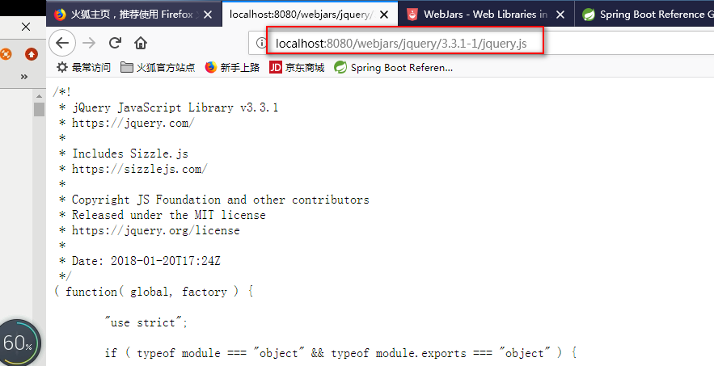
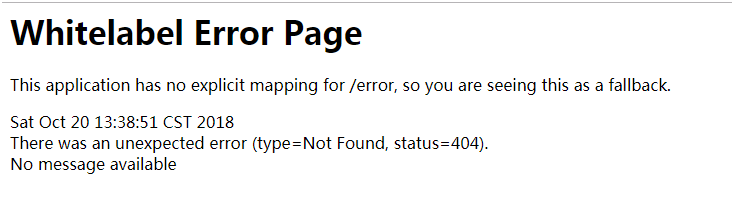

# SpringBoot基础

[TOC]


## 1.@Configuration，@ComponentScan，@Bean

实习类对象

```java
package com.ooyhao.springboot.javaconfig;

/**
 * @author ooyhao
 */
public class User {

    private String username;

    private String password;

    private Integer age;

    public String getUsername() {
        return username;
    }

    public void setUsername(String username) {
        this.username = username;
    }

    public String getPassword() {
        return password;
    }

    public void setPassword(String password) {
        this.password = password;
    }

    public Integer getAge() {
        return age;
    }

    public void setAge(Integer age) {
        this.age = age;
    }

}
```

模拟连接数据库取数据的DAO对象

```java
package com.ooyhao.springboot.javaconfig;

import java.util.ArrayList;
import java.util.List;

/**
 * @author ooyhao
 */
public class UserDAO {

    public List<User> queryUserList(){
        List<User> result = new ArrayList<User>();
        // 模拟数据库的查询
        for (int i = 0; i < 10; i++) {
            User user = new User();
            user.setUsername("username_" + i);
            user.setPassword("password_" + i);
            user.setAge(i + 1);
            result.add(user);
        }
        return result;
    }

}
```

Service对象

```java
package com.ooyhao.springboot.javaconfig;

import org.springframework.beans.factory.annotation.Autowired;
import org.springframework.stereotype.Service;

import java.util.List;

/**
 * @author ooyhao
 */
@Service
public class UserService {

    @Autowired // 注入Spring容器中的bean对象
    private UserDAO userDAO;

    public List<User> queryUserList() {
        // 调用userDAO中的方法进行查询
        return this.userDAO.queryUserList();
    }
}
```

SpringConfig

```java
package com.ooyhao.springboot.javaconfig;

import org.springframework.context.annotation.Bean;
import org.springframework.context.annotation.ComponentScan;
import org.springframework.context.annotation.Configuration;

/**
 * @author ooyhao
 */
@Configuration //通过该注解来表明该类是一个Spring的配置，相当于一个xml文件
@ComponentScan(basePackages = "com.ooyhao.springboot.javaconfig") //配置扫描包
public class SpringConfig {

    @Bean // 通过该注解来表明是一个Bean对象，相当于xml中的<bean>
    public UserDAO getUserDAO(){
        return new UserDAO(); // 直接new对象做演示
    }

}
```

注意：

SpringConfig.class原本是一个普通的class,但是加上@Configuration之后，相当于是之前spring的一个xml文件。

加上@ComponentScan之后，就相当于在spring xml文件配置了报扫描。而通过@Bean则相当于在xml文件中配置了一个Bean元素。所以springboot可以通过java程序来代替配置文件。

测试文件

```java
package com.ooyhao.springboot.javaconfig;

import org.springframework.context.annotation.AnnotationConfigApplicationContext;

import java.util.List;

/**
 * @author ooyhao
 */
public class Test {

    public static void main(String[] args) {
        // 通过Java配置来实例化Spring容器
        AnnotationConfigApplicationContext context = new AnnotationConfigApplicationContext(SpringConfig.class);

        // 在Spring容器中获取Bean对象
        UserService userService = context.getBean(UserService.class);

        // 调用对象中的方法
        List<User> list = userService.queryUserList();
        for (User user : list) {
            System.out.println(user.getUsername() + ", " + user.getPassword() + ", " + user.getPassword());
        }

        // 销毁该容器
        context.destroy();
    }
}
```

注意：之前使用spring是使用ClassPathXmlApplitionContext对象来读取xml文件的。现在是使用AnnotationConfigApplicationContext来读取配置类的。注解配置。


## 2.@PropertySource读取配置文件

```java
/**
 * @author ooyhao
 */
@Configuration //通过该注解来表明该类是一个Spring的配置，相当于一个xml文件
@ComponentScan(basePackages = "com.ooyhao.springboot.javaconfig") //配置扫描包
@PropertySource(value={"classpath:db.properties"},ignoreResourceNotFound = true)
public class SpringConfig {

    @Value("${jdbc.url}")
    private String url;

    @Bean // 通过该注解来表明是一个Bean对象，相当于xml中的<bean>
    public UserDAO getUserDAO(){
        return new UserDAO(); // 直接new对象做演示
    }

}
```

注意：使用注解，@PropertySource进行关联配置文件，如何需要配置多个配置文件的话，那就这样写，value={"classpath:db.properties","abc.properties"}，如果配置文件不存在时，我们可以使用ignoreResourceNotFound属性进行配置，获取值就跟spring是一个样的，使用@Value注解获得值

## 3.通过使用注解配置的方式配置数据源

jdbc.properties文件

```properties
jdbc.driverClassName=com.mysql.jdbc.Driver
jdbc.url=jdbc:mysql://127.0.0.1:3306/springboot?useUnicode=true&characterEncoding=utf8&autoReconnect=true&allowMultiQueries=true
jdbc.username=root
jdbc.password=123456
```

SpringConfig文件

```java
package com.ooyhao.springboot.javaconfig;

import com.jolbox.bonecp.BoneCPDataSource;
import org.springframework.beans.factory.annotation.Value;
import org.springframework.context.annotation.Bean;
import org.springframework.context.annotation.ComponentScan;
import org.springframework.context.annotation.Configuration;
import org.springframework.context.annotation.PropertySource;

import javax.sql.DataSource;

/**
 * @author ooyhao
 */
@Configuration //通过该注解来表明该类是一个Spring的配置，相当于一个xml文件
@ComponentScan(basePackages = "com.ooyhao.springboot.javaconfig") //配置扫描包
@PropertySource(value={"classpath:db.properties"},ignoreResourceNotFound = true)
public class SpringConfig {

    @Value("${jdbc.driverClassName")
    private String driverClassName;

    @Value("${jdbc.url}")
    private String url;

    @Value("${jdbc.username}")
    private String username;

    @Value("${jdbc.password}")
    private String password;

    @Bean // 通过该注解来表明是一个Bean对象，相当于xml中的<bean>
    public UserDAO getUserDAO(){
        return new UserDAO(); // 直接new对象做演示
    }

    @Bean(destroyMethod = "close")
    public DataSource dataSource() {
        BoneCPDataSource boneCPDataSource = new BoneCPDataSource();
        // 数据库驱动
        boneCPDataSource.setDriverClass(driverClassName);
        // 相应驱动的jdbcUrl
        boneCPDataSource.setJdbcUrl(url);
        // 数据库的用户名
        boneCPDataSource.setUsername(username);
        // 数据库的密码
        boneCPDataSource.setPassword(password);
        // 检查数据库连接池中空闲连接的间隔时间，单位是分，默认值：240，如果要取消则设置为0
        boneCPDataSource.setIdleConnectionTestPeriodInMinutes(60);
        // 连接池中未使用的链接最大存活时间，单位是分，默认值：60，如果要永远存活设置为0
        boneCPDataSource.setIdleMaxAgeInMinutes(30);
        // 每个分区最大的连接数
        boneCPDataSource.setMaxConnectionsPerPartition(100);
        // 每个分区最小的连接数
        boneCPDataSource.setMinConnectionsPerPartition(5);
        return boneCPDataSource;
    }


}
```

测试文件

```java
@Test
public void test2(){
    AnnotationConfigApplicationContext applicationContext = new 
        AnnotationConfigApplicationContext(SpringConfig.class);
    DataSource bean = applicationContext.getBean(DataSource.class);
    System.out.println(bean);

}
```

小结：这里不用过多的解释，首先通过@Value注解读取properties文件中的值。然后通过在@Bean对象的方法中构建一个对象，通过对应的set方法将相应的参数设置进去即可。测试跟在xml文件中Bean标签和property标签一直。通过类的class文件获得。

## 4.Springboot第一个程序

springboot不是一个新的技术，只是在spring的基础之上集成后了很多开发技术，使得我们开发起来更加的轻松。

pom文件中需要添加

```xml
<parent>
    <groupId>org.springframework.boot</groupId>
    <artifactId>spring-boot-starter-parent</artifactId>
    <version>1.5.2.RELEASE</version>
</parent>

<dependency>
      <groupId>org.springframework.boot</groupId>
      <artifactId>spring-boot-starter-web</artifactId>
    <!--不需要写版本号，在parent中已经有了定义-->
</dependency>

<!--启动插件-->
 <plugin>
    <groupId>org.springframework.boot</groupId>
    <artifactId>spring-boot-maven-plugin</artifactId>
  </plugin>
```

HelloApplication文件

```java
package com.ooyhao.springboot.demo;

import org.springframework.boot.SpringApplication;
import org.springframework.boot.autoconfigure.SpringBootApplication;
import org.springframework.context.annotation.Configuration;
import org.springframework.stereotype.Controller;
import org.springframework.web.bind.annotation.RequestMapping;
import org.springframework.web.bind.annotation.ResponseBody;

/**
 * @author ooyhao
 */
@Controller              //springmvc中的Controller
@SpringBootApplication   //Springboot的应用
@Configuration
public class HelloApplication {//作为SpringBoot的入口类

    @RequestMapping("hello")  //路由路径
    @ResponseBody //消息转发器，输出结果
    public String hello(){
        return "hello world！";
    }

    //入口方法。
    public static void main(String[] args) {
        SpringApplication.run(HelloApplication.class, args);
    }

}
```

说明：

1.@SpringBootApplication:springboot项目的核心注解，主要目的是开启自动配置。

2.@Configuration：这是一个spring的配置类

3.@Controller：标明这是一个springmvc的controller控制器

4.main方法:在main方法中启动一个应用，即：这个应用的入口。

效果图：


自定义banner

​	只需要在resources文件夹下新建一个banner.txt文件，再将自己喜欢的banner复制进去，重启程序即可看到效果。

**取消Banner显示**

```java
//入口方法。
    public static void main(String[] args) {
//        SpringApplication.run(HelloApplication.class, args);
        //关闭Banner
        SpringApplication springApplication = new SpringApplication(HelloApplication.class);
        springApplication.setBannerMode(Banner.Mode.OFF);
        springApplication.run(args);

    }
```


## 5.springboot HelloWorld

###1.创建一个maven工程

###2.添加springboot的依赖

~~~xml
<parent>
        <groupId>org.springframework.boot</groupId>
        <artifactId>spring-boot-starter-parent</artifactId>
        <version>1.5.9.RELEASE</version>
    </parent>

    <dependencies>
        <dependency>
            <groupId>org.springframework.boot</groupId>
            <artifactId>spring-boot-starter-web</artifactId><!--不需要写版本号，在parent中已经有了定义-->
        </dependency>
    </dependencies>

~~~

###3.编写一个主程序

~~~java
@SpringBootApplication //标注一个主程序，说明这是一个spring boot应用
public class HelloWorldMainApplication {

    public static void main(String[] args) {
        SpringApplication.run(HelloWorldMainApplication.class,args);
    }

}
~~~

###4.编写一个controller

~~~java
@Controller
public class HelloController {

    @RequestMapping(value = "/hello")
    @ResponseBody
    public String hello(){
        return "hello world";
    }
}
~~~

###5.运行主程序测试

###6.简化部署

(导入maven插件)

~~~xml
<!--可以将应用打包成jar包-->
<build>
    <plugins>
        <plugin>
            <groupId>org.springframework.boot</groupId>
            <artifactId>spring-boot-maven-plugin</artifactId>
        </plugin>
    </plugins>
</build>
~~~

将这个应用打成jar包，直接使用java -jar的命令进行执行。

##6.Hello world探究

### 1.pom文件

####1.导入的依赖

~~~xml
 <parent>
    <groupId>org.springframework.boot</groupId>
    <artifactId>spring-boot-starter-parent</artifactId>
    <version>1.5.2.RELEASE</version>
</parent>

它的父项目是：
<parent>
    <groupId>org.springframework.boot</groupId>
    <artifactId>spring-boot-dependencies</artifactId>
    <version>1.5.2.RELEASE</version>
    <relativePath>../../spring-boot-dependencies</relativePath>
</parent>
它来真正管理spring boot应用里面的所有依赖版本。

~~~

Spring boot的版本仲裁中心。以后我们导入依赖默认是不需要写版本。（没有在dependencies里面管理的依赖自然需要声明版本号）

####2.启动器

```xml
<dependencies>
    <dependency>
        <groupId>org.springframework.boot</groupId>
        <artifactId>spring-boot-starter-web</artifactId>
        <!--不需要写版本号，在parent中已经有了定义-->
    </dependency>
</dependencies>
```

**spring-boot-starter**   **web**

spring-boot-starter:spring-boot场景启动器 。帮我们导入了web模块正常运行所依赖的组件。


spring boot 将所有的功能场景都抽取出来，做成一个个starter（启动器），只需要在项目里面引入这些starter相关场景的所有依赖都会导入进来。要用什么功能就导入什么场景的启动器。

2.主程序类，主入口类

**@SpringBootApplication**: Spring Boot应用，标注在某个类上，说明这个类是springboot的主配置类，springboot就应该运行这个类的main方法类启动springboot应用。

~~~java
@Target(ElementType.TYPE)
@Retention(RetentionPolicy.RUNTIME)
@Documented
@Inherited
@SpringBootConfiguration
@EnableAutoConfiguration
@ComponentScan(excludeFilters = {
		@Filter(type = FilterType.CUSTOM, classes = TypeExcludeFilter.class),
		@Filter(type = FilterType.CUSTOM, classes = AutoConfigurationExcludeFilter.class) })
public @interface SpringBootApplication {
~~~

**@SpringBootConfiguration**：sprintboot的配置类。

​		标注在某个类上，表示这是一个springboot的配置类。

​		**@Configuration**: 配置类上类标注这个注解；

​			配置类------- 配置文件。

  **@EnableAutoConfiguration**：开启自动配置功能；

​		以前我们需要配置的东西，springboot帮我们自动配置；**@EnableAutoConfiguration**告诉springboot开启自动配置功能。这样自动配置才能生效。

```java
@AutoConfigurationPackage
@Import(EnableAutoConfigurationImportSelector.class)
public @interface EnableAutoConfiguration {
```

**@AutoConfigurationPackage**：自动配置包

​	@Import(AutoConfigurationPackages.Registrar.class) ；	spring的底层注解，给容器中导入一个组件。导入的组件由AutoConfigurationPackages.Registrar.class

​	将主配置类，（@SpringBootApplication标注的类）的所在包及其子包里面的所有组件扫描到spring容器；

# 2.配置文件

注意：默认都是先读取application.properties文件中的配置的。（即如果application.properties文件中有相对应的配置的话，就直接读取其中的。别的文件不会进行读取覆盖）

## 2.1 配置文件值注入

### 1.使用@ConfigurationProperties方式获取

配置文件

~~~yaml
person:
    lastName: zhangsan
    age: 18
    boss: false
    birth: 2017/12/12
    maps: {k1: v1, k2: 12}
    lists:
        - lisi
        - zhaoliu
    Dog:
      name: 小狗
      age: 2

~~~

JavaBean

~~~java
/**
 * 将配置文件中配置的属性的值映射到组件中
 * @ConfigurationProperties 告诉SpringBoot将本类中的所有属性和配置文件中相
 * 关的配置进行绑定
 * prefix 配置文件中哪个下面的所有属性进行一一映射
 *
 * 只有这个组件是容器中的组件，才能使用容器提供的@ConfigurationProperties功能。
 */
@ConfigurationProperties(prefix = "person")
@Component
public class Person {


    private String lastName;
    private Integer age;
    private Boolean boss;
    private Date birth;

    private Map<String,Object> maps;
    private List<Object> lists;
    private Dog dog;

    public Person() {
    }

    public Person(String lastName, Integer age, Boolean boss, Date birth, Map<String, Object> maps, List<Object> lists, Dog dog) {
        this.lastName = lastName;
        this.age = age;
        this.boss = boss;
        this.birth = birth;
        this.maps = maps;
        this.lists = lists;
        this.dog = dog;
    }

    public String getLastName() {
        return lastName;
    }

    public void setLastName(String lastName) {
        this.lastName = lastName;
    }

    public Integer getAge() {
        return age;
    }

    public void setAge(Integer age) {
        this.age = age;
    }

    public Boolean getBoss() {
        return boss;
    }

    public void setBoss(Boolean boss) {
        this.boss = boss;
    }

    public Date getBirth() {
        return birth;
    }

    public void setBirth(Date birth) {
        this.birth = birth;
    }

    public Map<String, Object> getMaps() {
        return maps;
    }

    public void setMaps(Map<String, Object> maps) {
        this.maps = maps;
    }

    public List<Object> getLists() {
        return lists;
    }

    public void setLists(List<Object> lists) {
        this.lists = lists;
    }

    public Dog getDog() {
        return dog;
    }

    public void setDog(Dog dog) {
        this.dog = dog;
    }

    @Override
    public String toString() {
        return "Person{" +
                "lastName='" + lastName + '\'' +
                ", age=" + age +
                ", boss=" + boss +
                ", birth=" + birth +
                ", maps=" + maps +
                ", lists=" + lists +
                ", dog=" + dog +
                '}';
    }
}

~~~

我们可以导入配置文件处理器，以后编写配置文件就有提示了

~~~xml
<dependency>
    <groupId>org.springframework.boot</groupId>
    <artifactId>spring-boot-configuration-processor</artifactId>
    <optional>true</optional>
</dependency>
~~~


读取properties文件中获取中文时，如果出现了中文乱码，则需要进行相应的设置


### 2.只用@Value进行获取

|             | @ConfigurationProperties | @Value |
| ----------- | ------------------------ | ------ |
| 功能          | 批量注入配置文件中的属性             | 一个个指定  |
| 松散绑定        | 支持（lastName与last-name）   | 不支持    |
| SpEL        | 不支持                      | 支持     |
| JSR303数据校验  | 支持                       | 不支持    |
| 复制类似封装（map） | 支持                       | 不支持    |

复杂类型封装不支持map但是支持list

配置文件yml与properties文件它们都能获得到值；

---------------------------------------------------

如果说：我们只是在某个业务逻辑中需要获得以下配置文件中的某项值，使用@Value

如果说：我们专门编写了一个javabean来和配置文件进行映射，我们就直接使用@ConfigurationProperties

### 3.配置文件数据校验

~~~java
/**
 * 将配置文件中配置的属性的值映射到组件中
 * @ConfigurationProperties 告诉SpringBoot将本类中的所有属性和配置文件中相
 * 关的配置进行绑定
 * prefix 配置文件中哪个下面的所有属性进行一一映射
 *
 * 只有这个组件是容器中的组件，才能使用容器提供的@ConfigurationProperties功能。
 */
//@ConfigurationProperties(prefix = "person")
@Component
@Validated
public class Person {

    /**
     * <bean class="Person>
     *
     *       <perperty name="lastName" value="字面量/${key}/#{SpEL}"></perperty>
     * </bean>
     *
     *
     */
//    @Value("${person.last-name}")
//    @Email
    private String lastName;
//    @Value("#{10*2}")
    private Integer age;
//    @Value("false")
    private Boolean boss;
    private Date birth;

    private Map<String,Object> maps;
    private List<Object> lists;
    private Dog dog;

    public Person() {
    }

~~~

##### 4.@PropertySource&@ImportResource

**@PropertySource**：加载指定的配置文件；

~~~properties
person.last-name=李四
person.age=12
person.boss=false
person.birth=2018/12/12
person.maps.k1=v1
person.maps.k2=14
person.lists=a,b,c
person.dog.name=小狗
person.dog.age=12
~~~

person

~~~java
@ConfigurationProperties(prefix = "person")
@PropertySource(value = {"classpath:person.properties"})
@Component
public class Person {
    private String lastName;
    private Integer age;
    private Boolean boss;
    private Date birth;

    private Map<String,Object> maps;
    private List<Object> lists;
    private Dog dog;

    public Person() {
    }
~~~

通过使用@PropertySource注解来指定配置文件，通过@ConfigurationProperties的prefix属性来指定前缀

**@ImportResource**：导入Spring的配置文件，让配置文件里面的内容生效

SpringBoot里面没有spring的配置文件，我们自己编写的配置文件，也不能自动识别；

想让Spring的配置文件生效，加载进来，@ImportResource标注在一个配置类上。

~~~java
@ImportResource(locations = {"classpath:beans.xml"})//导入Spring的配置文件
@SpringBootApplication
public class SpringBoot02ConfigApplication {

	public static void main(String[] args) {
		SpringApplication.run(SpringBoot02ConfigApplication.class, args);

	}
}
~~~

但是SpringBoot不推荐这样使用。

~~~xml
    <bean id="helloService" class="com.ooyao.springboot.service.HelloService">
    </bean>

~~~


SpringBoot推荐给容器添加组件的方式：推荐使用全注解的方式

1.配置类===配置文件

2.使用@Bean给容器添加组件

使用@Configuration注解来标注一个配置类。用@Bean注解来标志一个组件。

~~~java
@Configuration
public class MyAppConfig {

//将方法的返回值添加到容器中；容器中的组件默认的id就是方法名
    @Bean
    public HelloService helloService(){
        return new HelloService();
    }

}

~~~

## 2.2 配置文件占位符

##### 1.随机数

~~~properties
${random.value}
${random.int}
${random.long}
${random.int(10)}
${random.int[1024,65536)}
~~~

##### 2.占位符

~~~properties
person.last-name=张三${random.uuid}
person.age=${random.int}
person.boss=false
person.birth=2018/12/12
person.maps.k1=v1
person.maps.k2=14
person.lists=a,b,c
person.dog.name=${person.name:hi}_dog

~~~

## 2.3 Profile

Profile是Spring对不同环境提供不同配置功能的支持，可以通过激活，指定参数等方式快速切换环境。

### 1.多profile文件形式，

​	格式：**application-{profile}.properties/yml**:application-dev.properties,application-prod.properties

### 2.多profile文档块模式

~~~yaml
server:
  port: 8081
spring:
  profiles:
    active: dev


---
server:
  port: 8088
spring:
  profiles: dev

---
server:
  port: 8089
spring:
  profiles: prod
~~~

上面最终监听的端口号是8088

使用spring.profiles来指定文档块的属性，使用spring.profiles.active指定读取哪个文档块

### 3.激活方式

​	-**命令行**：--spring.profiles.active=prod


​	

-**配置文件** spring.profiles.active=dev

~~~properties
spring.profiles.active=dev/prod
~~~

-**jvm参数** -Dspring.profiles.active=dev


## 2.4配置文件加载位置

springboot启动会扫描以下位置的application.properties/yml文件作为springboot的默认配置文件

~~~xml
-file:./config/   当前项目的文件路径的config目录下				[1]
-file:./			当前项目的文件路径下						 [2]
-classpath:./config/	当前项目的类路径下的config目录下			 [3]
-classpath:./   			当前项目类路径下					[4]
~~~

以上是按照**优先级从高到低**的顺序，所有位置的文件都会被加载，**高优先级配置**内容会覆盖**低优先级配置**内容

**互补配置**

如下图示


--我们也可以通过配置spring.config.location来改变默认配置

~~~xml
在项目启动的时候可以指定配置文件的路径。
使用下列命令。
java -jar *.jar --spring.config.location=G:/application.properties
~~~


项目打包好之后，我们可以使用命令行参数的形式，启动项目的时候来指定配置文件的新位置，指定配置文件和默认加载的这些配置文件会共同起作用，形成互补配置。

## 2.5外部配置加载顺序

**1.命令行参数**

所有的配置都可以在命令行上进行指定

```xml
java -jar spring-boot-02-config-02-0.0.1-SNAPSHOT.jar --server.port=8087  --server.context-path=/abc
```

多个配置用空格分开； --配置项=值

2.来自java:comp/env的JNDI属性

3.Java系统属性（System.getProperties()）

4.操作系统环境变量

5.RandomValuePropertySource配置的random.*属性值

==**由jar包外向jar包内进行寻找；**==


==**优先加载带profile**==

**6.jar包外部的application-{profile}.properties或application.yml(带spring.profile)配置文件**

**7.jar包内部的application-{profile}.properties或application.yml(带spring.profile)配置文件**

==**再来加载不带profile**==

**8.jar包外部的application.properties或application.yml(不带spring.profile)配置文件**

**9.jar包内部的application.properties或application.yml(不带spring.profile)配置文件**

10.@Configuration注解类上的@PropertySource

11.通过SpringApplication.setDefaultProperties指定的默认属性

所有支持的配置加载来源；

[参考官方文档](https://docs.spring.io/spring-boot/docs/1.5.9.RELEASE/reference/htmlsingle/#boot-features-external-config)

# 3.自动配置原理

[配置文件可以配置的属性参照](https://docs.spring.io/spring-boot/docs/2.0.5.RELEASE/reference/htmlsingle/#common-application-properties)

## 1.自动配置原理

1）SpringBoot启动时加载主配置类，开启了自动配置功能**@EnableAutoConfiguration**

2）@EnableAutoConfiguration作用：

- 利用AutoConfigurationImportSelector给容器中导入一些组件？

- 可以查看selectImports(AnnotationMetadata annotationMetadata)方法的内容；

- List<String> configurations = getCandidateConfigurations(annotationMetadata,attributes)；获取候选的配置

  - ```java
    SpringFactoriesLoader.loadFactoryNames(
          getSpringFactoriesLoaderFactoryClass(), getBeanClassLoader());
    //扫描所有jar包类路径下 META-INF/spring.factories
    //把扫描到的这些文件的内容包装成properties对象
    //从properties中获得到EnableAutoConfiguration.class类（类名）对应的值，把他们添加到容器中。

    ---------------------源码-----------------------------
    protected Class<?> getSpringFactoriesLoaderFactoryClass() {
        return EnableAutoConfiguration.class;
    }
        
        public static List<String> loadFactoryNames(Class<?> factoryClass, @Nullable ClassLoader classLoader) {
    		String factoryClassName = factoryClass.getName();
    		return loadSpringFactories(classLoader).getOrDefault(factoryClassName, Collections.emptyList());
    	}

    	private static Map<String, List<String>> loadSpringFactories(@Nullable ClassLoader classLoader) {
    		MultiValueMap<String, String> result = cache.get(classLoader);
    		if (result != null) {
    			return result;
    		}

    		try {
    			Enumeration<URL> urls = (classLoader != null ?
    					classLoader.getResources(FACTORIES_RESOURCE_LOCATION) :
    					ClassLoader.getSystemResources(FACTORIES_RESOURCE_LOCATION));
    			result = new LinkedMultiValueMap<>();
    			while (urls.hasMoreElements()) {
    				URL url = urls.nextElement();
    				UrlResource resource = new UrlResource(url);
    				Properties properties = PropertiesLoaderUtils.loadProperties(resource);
    				for (Map.Entry<?, ?> entry : properties.entrySet()) {
    					List<String> factoryClassNames = Arrays.asList(
    							StringUtils.commaDelimitedListToStringArray((String) entry.getValue()));
    					result.addAll((String) entry.getKey(), factoryClassNames);
    				}
    			}
    			cache.put(classLoader, result);
    			return result;
    		}
    		catch (IOException ex) {
    			throw new IllegalArgumentException("Unable to load factories from location [" +
    					FACTORIES_RESOURCE_LOCATION + "]", ex);
    		}
    	}
    ```

将 类路径下 META-INF/spring.factories里面的所有EnableAutoConfiguration的值加入到了容器中。


~~~properties
# Auto Configure
org.springframework.boot.autoconfigure.EnableAutoConfiguration=\
org.springframework.boot.autoconfigure.admin.SpringApplicationAdminJmxAutoConfiguration,\
org.springframework.boot.autoconfigure.aop.AopAutoConfiguration,\
org.springframework.boot.autoconfigure.amqp.RabbitAutoConfiguration,\
org.springframework.boot.autoconfigure.batch.BatchAutoConfiguration,\
org.springframework.boot.autoconfigure.cache.CacheAutoConfiguration,\
org.springframework.boot.autoconfigure.cassandra.CassandraAutoConfiguration,\
org.springframework.boot.autoconfigure.cloud.CloudAutoConfiguration,\
org.springframework.boot.autoconfigure.context.ConfigurationPropertiesAutoConfiguration,\
org.springframework.boot.autoconfigure.context.MessageSourceAutoConfiguration,\
org.springframework.boot.autoconfigure.context.PropertyPlaceholderAutoConfiguration,\
org.springframework.boot.autoconfigure.couchbase.CouchbaseAutoConfiguration,\
org.springframework.boot.autoconfigure.dao.PersistenceExceptionTranslationAutoConfiguration,\
org.springframework.boot.autoconfigure.data.cassandra.CassandraDataAutoConfiguration,\
org.springframework.boot.autoconfigure.data.cassandra.CassandraReactiveDataAutoConfiguration,\
org.springframework.boot.autoconfigure.data.cassandra.CassandraReactiveRepositoriesAutoConfiguration,\
org.springframework.boot.autoconfigure.data.cassandra.CassandraRepositoriesAutoConfiguration,\
org.springframework.boot.autoconfigure.data.couchbase.CouchbaseDataAutoConfiguration,\
org.springframework.boot.autoconfigure.data.couchbase.CouchbaseReactiveDataAutoConfiguration,\
org.springframework.boot.autoconfigure.data.couchbase.CouchbaseReactiveRepositoriesAutoConfiguration,\
org.springframework.boot.autoconfigure.data.couchbase.CouchbaseRepositoriesAutoConfiguration,\
org.springframework.boot.autoconfigure.data.elasticsearch.ElasticsearchAutoConfiguration,\
org.springframework.boot.autoconfigure.data.elasticsearch.ElasticsearchDataAutoConfiguration,\
org.springframework.boot.autoconfigure.data.elasticsearch.ElasticsearchRepositoriesAutoConfiguration,\
org.springframework.boot.autoconfigure.data.jpa.JpaRepositoriesAutoConfiguration,\
org.springframework.boot.autoconfigure.data.ldap.LdapDataAutoConfiguration,\
org.springframework.boot.autoconfigure.data.ldap.LdapRepositoriesAutoConfiguration,\
org.springframework.boot.autoconfigure.data.mongo.MongoDataAutoConfiguration,\
org.springframework.boot.autoconfigure.data.mongo.MongoReactiveDataAutoConfiguration,\
org.springframework.boot.autoconfigure.data.mongo.MongoReactiveRepositoriesAutoConfiguration,\
org.springframework.boot.autoconfigure.data.mongo.MongoRepositoriesAutoConfiguration,\
org.springframework.boot.autoconfigure.data.neo4j.Neo4jDataAutoConfiguration,\
org.springframework.boot.autoconfigure.data.neo4j.Neo4jRepositoriesAutoConfiguration,\
org.springframework.boot.autoconfigure.data.solr.SolrRepositoriesAutoConfiguration,\
org.springframework.boot.autoconfigure.data.redis.RedisAutoConfiguration,\
org.springframework.boot.autoconfigure.data.redis.RedisReactiveAutoConfiguration,\
org.springframework.boot.autoconfigure.data.redis.RedisRepositoriesAutoConfiguration,\
org.springframework.boot.autoconfigure.data.rest.RepositoryRestMvcAutoConfiguration,\
org.springframework.boot.autoconfigure.data.web.SpringDataWebAutoConfiguration,\
org.springframework.boot.autoconfigure.elasticsearch.jest.JestAutoConfiguration,\
org.springframework.boot.autoconfigure.flyway.FlywayAutoConfiguration,\
org.springframework.boot.autoconfigure.freemarker.FreeMarkerAutoConfiguration,\
org.springframework.boot.autoconfigure.gson.GsonAutoConfiguration,\
org.springframework.boot.autoconfigure.h2.H2ConsoleAutoConfiguration,\
org.springframework.boot.autoconfigure.hateoas.HypermediaAutoConfiguration,\
org.springframework.boot.autoconfigure.hazelcast.HazelcastAutoConfiguration,\
org.springframework.boot.autoconfigure.hazelcast.HazelcastJpaDependencyAutoConfiguration,\
org.springframework.boot.autoconfigure.http.HttpMessageConvertersAutoConfiguration,\
org.springframework.boot.autoconfigure.http.codec.CodecsAutoConfiguration,\
org.springframework.boot.autoconfigure.influx.InfluxDbAutoConfiguration,\
org.springframework.boot.autoconfigure.info.ProjectInfoAutoConfiguration,\
org.springframework.boot.autoconfigure.integration.IntegrationAutoConfiguration,\
org.springframework.boot.autoconfigure.jackson.JacksonAutoConfiguration,\
org.springframework.boot.autoconfigure.jdbc.DataSourceAutoConfiguration,\
org.springframework.boot.autoconfigure.jdbc.JdbcTemplateAutoConfiguration,\
org.springframework.boot.autoconfigure.jdbc.JndiDataSourceAutoConfiguration,\
org.springframework.boot.autoconfigure.jdbc.XADataSourceAutoConfiguration,\
org.springframework.boot.autoconfigure.jdbc.DataSourceTransactionManagerAutoConfiguration,\
org.springframework.boot.autoconfigure.jms.JmsAutoConfiguration,\
org.springframework.boot.autoconfigure.jmx.JmxAutoConfiguration,\
org.springframework.boot.autoconfigure.jms.JndiConnectionFactoryAutoConfiguration,\
org.springframework.boot.autoconfigure.jms.activemq.ActiveMQAutoConfiguration,\
org.springframework.boot.autoconfigure.jms.artemis.ArtemisAutoConfiguration,\
org.springframework.boot.autoconfigure.groovy.template.GroovyTemplateAutoConfiguration,\
org.springframework.boot.autoconfigure.jersey.JerseyAutoConfiguration,\
org.springframework.boot.autoconfigure.jooq.JooqAutoConfiguration,\
org.springframework.boot.autoconfigure.jsonb.JsonbAutoConfiguration,\
org.springframework.boot.autoconfigure.kafka.KafkaAutoConfiguration,\
org.springframework.boot.autoconfigure.ldap.embedded.EmbeddedLdapAutoConfiguration,\
org.springframework.boot.autoconfigure.ldap.LdapAutoConfiguration,\
org.springframework.boot.autoconfigure.liquibase.LiquibaseAutoConfiguration,\
org.springframework.boot.autoconfigure.mail.MailSenderAutoConfiguration,\
org.springframework.boot.autoconfigure.mail.MailSenderValidatorAutoConfiguration,\
org.springframework.boot.autoconfigure.mongo.embedded.EmbeddedMongoAutoConfiguration,\
org.springframework.boot.autoconfigure.mongo.MongoAutoConfiguration,\
org.springframework.boot.autoconfigure.mongo.MongoReactiveAutoConfiguration,\
org.springframework.boot.autoconfigure.mustache.MustacheAutoConfiguration,\
org.springframework.boot.autoconfigure.orm.jpa.HibernateJpaAutoConfiguration,\
org.springframework.boot.autoconfigure.quartz.QuartzAutoConfiguration,\
org.springframework.boot.autoconfigure.reactor.core.ReactorCoreAutoConfiguration,\
org.springframework.boot.autoconfigure.security.servlet.SecurityAutoConfiguration,\
org.springframework.boot.autoconfigure.security.servlet.SecurityRequestMatcherProviderAutoConfiguration,\
org.springframework.boot.autoconfigure.security.servlet.UserDetailsServiceAutoConfiguration,\
org.springframework.boot.autoconfigure.security.servlet.SecurityFilterAutoConfiguration,\
org.springframework.boot.autoconfigure.security.reactive.ReactiveSecurityAutoConfiguration,\
org.springframework.boot.autoconfigure.security.reactive.ReactiveUserDetailsServiceAutoConfiguration,\
org.springframework.boot.autoconfigure.sendgrid.SendGridAutoConfiguration,\
org.springframework.boot.autoconfigure.session.SessionAutoConfiguration,\
org.springframework.boot.autoconfigure.security.oauth2.client.OAuth2ClientAutoConfiguration,\
org.springframework.boot.autoconfigure.solr.SolrAutoConfiguration,\
org.springframework.boot.autoconfigure.thymeleaf.ThymeleafAutoConfiguration,\
org.springframework.boot.autoconfigure.transaction.TransactionAutoConfiguration,\
org.springframework.boot.autoconfigure.transaction.jta.JtaAutoConfiguration,\
org.springframework.boot.autoconfigure.validation.ValidationAutoConfiguration,\
org.springframework.boot.autoconfigure.web.client.RestTemplateAutoConfiguration,\
org.springframework.boot.autoconfigure.web.embedded.EmbeddedWebServerFactoryCustomizerAutoConfiguration,\
org.springframework.boot.autoconfigure.web.reactive.HttpHandlerAutoConfiguration,\
org.springframework.boot.autoconfigure.web.reactive.ReactiveWebServerFactoryAutoConfiguration,\
org.springframework.boot.autoconfigure.web.reactive.WebFluxAutoConfiguration,\
org.springframework.boot.autoconfigure.web.reactive.error.ErrorWebFluxAutoConfiguration,\
org.springframework.boot.autoconfigure.web.reactive.function.client.WebClientAutoConfiguration,\
org.springframework.boot.autoconfigure.web.servlet.DispatcherServletAutoConfiguration,\
org.springframework.boot.autoconfigure.web.servlet.ServletWebServerFactoryAutoConfiguration,\
org.springframework.boot.autoconfigure.web.servlet.error.ErrorMvcAutoConfiguration,\
org.springframework.boot.autoconfigure.web.servlet.HttpEncodingAutoConfiguration,\
org.springframework.boot.autoconfigure.web.servlet.MultipartAutoConfiguration,\
org.springframework.boot.autoconfigure.web.servlet.WebMvcAutoConfiguration,\
org.springframework.boot.autoconfigure.websocket.reactive.WebSocketReactiveAutoConfiguration,\
org.springframework.boot.autoconfigure.websocket.servlet.WebSocketServletAutoConfiguration,\
org.springframework.boot.autoconfigure.websocket.servlet.WebSocketMessagingAutoConfiguration,\
org.springframework.boot.autoconfigure.webservices.WebServicesAutoConfiguration
~~~

每一个这样的  *AutoCondfiguration类都是容器中的一个组件。都加入到容器中，用他们来做自动配置。

3）每一个自动配置类进行自动配置功能

4）以HttpEncodingAutoConfiguration（Http编码自动配置）为例解释自动配置原理。

~~~java
@Configuration //表示这是一个配置类，以前编写的配置文件一样，也可以给容器中添加组件。
@EnableConfigurationProperties(HttpEncodingProperties.class) //启用指定类的ConfigurationProperties功能；将配置文件中对应的值和HttpEncodingProperties绑定起来，并把HttpEncodingProperties加入到ioc容器中
@ConditionalOnWebApplication(type = ConditionalOnWebApplication.Type.SERVLET)//spring底层@Conditional注解，根据不同的条件，如果满足指定的条件，整个配置类里面的配置就会生效。（判断当前应用是否是web应用，如果是，当前配置类生效）
@ConditionalOnClass(CharacterEncodingFilter.class)//判断当前项目是否有这个类，
//CharacterEncodingFilter springmvc中进行乱码解决的过滤器。
@ConditionalOnProperty(prefix = "spring.http.encoding", value = "enabled", matchIfMissing = true)//判断配置文件中是否存在某个配置，spring.http.encoding.enabled;如果不存在，判断也是成立
//即使我们配置文件中不配置spring.http.encoding.enabled=true，也是默认生效的。
public class HttpEncodingAutoConfiguration {
    
    //它已经和SpringBoot的配置文件映射了。
    private final HttpEncodingProperties properties;
    
    //只有一个有参数的构造器，参数的值就会从容器中获取
    public HttpEncodingAutoConfiguration(HttpEncodingProperties properties) {
		this.properties = properties;
	}

    
    @Bean  //给容器中添加一个组件，这个组件的某些值需要从properties中获取
	@ConditionalOnMissingBean
	public CharacterEncodingFilter characterEncodingFilter() {
		CharacterEncodingFilter filter = new OrderedCharacterEncodingFilter();
		filter.setEncoding(this.properties.getCharset().name());
		filter.setForceRequestEncoding(this.properties.shouldForce(Type.REQUEST));
		filter.setForceResponseEncoding(this.properties.shouldForce(Type.RESPONSE));
		return filter;
	}

~~~

根据当前不同的条件判断，决定这个配置类是否生效。

一旦这个配置类生效，这个配置类就会给容器中添加各种组件，这些组件的属性是从对应的properties类中获取的，而这些类中的每一个属性又是和配置文件绑定的。


5）所有在配置文件中能配置的属性都是在XXXProperties类中封装的，配置文件能配置什么就可以参照某个功能对应的属性。

~~~java
@ConfigurationProperties(prefix = "spring.http.encoding")//从配置文件中获取指定的值和bean的属性进行绑定。
public class HttpEncodingProperties {
	public static final Charset DEFAULT_CHARSET = StandardCharsets.UTF_8;
~~~


**精髓：**

**1）SpringBoot启动会加载大量的自动配置类。**

**2）我们看我们需要的功能有没有SpringBoot默认写好的自动配置类。**

**3）我们再来看这个自动配置类到底配置了哪些组件，（如果我们要用的组件有，我们就不需要再来配置了）**

**4）给容器中自动配置类添加组件的时候，会从properties类中获取属性，我们就可以在配置文件中指定这些属性的值。**

*AutoConfiguration：自动配置类。

给容器中添加组件

*Properties：封装配置文件中相关的属性，


## 2.细节

1.**@Conditional派生注解**

作用：必须是@Conditional指定的条件成立，才给容器添加该组件，配置类里面的所有内容才生效。

| @Conditional扩展注解                | 作用（判断是否满足当前指定条件）               |
| ------------------------------- | ------------------------------ |
| @ConditionalOnJava              | 系统的java版本是否符合要求                |
| @ConditionalOnBean              | 容器中存在指定Bean；                   |
| @ConditionalOnMissingBean       | 容器中不存在指定Bean；                  |
| @ConditionalOnExpression        | 满足SpEL表达式指定                    |
| @ConditionalOnClass             | 系统中有指定的类                       |
| @ConditionalOnMissingClass      | 系统中没有指定的类                      |
| @ConditionalOnSingleCandidate   | 容器中只有一个指定的Bean，或者这个Bean是首选Bean |
| @ConditionalOnProperty          | 系统中指定的属性是否有指定的值                |
| @ConditionalOnResource          | 类路径下是否存在指定资源文件                 |
| @ConditionalOnWebApplication    | 当前是web环境                       |
| @ConditionalOnNotWebApplication | 当前不是web环境                      |
| @ConditionalOnJndi              | JNDI存在指定项                      |

**自动配置类必须在一定的条件下才能生效；**

我们怎么知道哪些自动配置类生效了

我们可以在application.Properties中通过debug=true属性，来让控制台打印自动配置报告，这样我们就可以很方便的知道哪些自动配置类生效。

~~~java
============================
CONDITIONS EVALUATION REPORT
============================


Positive matches:
-----------------

   CodecsAutoConfiguration matched:
      - @ConditionalOnClass found required class 'org.springframework.http.codec.CodecConfigurer'; @ConditionalOnMissingClass did not find unwanted class (OnClassCondition)

   CodecsAutoConfiguration.JacksonCodecConfiguration matched:
      - @ConditionalOnClass found required class 'com.fasterxml.jackson.databind.ObjectMapper'; @ConditionalOnMissingClass did not find unwanted class (OnClassCondition)
    ......


Negative matches:
-----------------

   ActiveMQAutoConfiguration:
      Did not match:
         - @ConditionalOnClass did not find required classes 'javax.jms.ConnectionFactory', 'org.apache.activemq.ActiveMQConnectionFactory' (OnClassCondition)

   AopAutoConfiguration:
      Did not match:
         - @ConditionalOnClass did not find required classes 'org.aspectj.lang.annotation.Aspect', 'org.aspectj.lang.reflect.Advice', 'org.aspectj.weaver.AnnotatedElement' (OnClassCondition)

   ......


Exclusions:
-----------

    None


Unconditional classes:
----------------------

    org.springframework.boot.autoconfigure.context.ConfigurationPropertiesAutoConfiguration

    org.springframework.boot.autoconfigure.context.PropertyPlaceholderAutoConfiguration

    org.springframework.boot.autoconfigure.info.ProjectInfoAutoConfiguration

~~~

# 4.SoringBoot与日志

## 1、日志框架

 小张；开发一个大型系统；

​		1、System.out.println("")；将关键数据打印在控制台；去掉？写在一个文件？

​		2、框架来记录系统的一些运行时信息；日志框架 ；  zhanglogging.jar；

​		3、高大上的几个功能？异步模式？自动归档？xxxx？  zhanglogging-good.jar？

​		4、将以前框架卸下来？换上新的框架，重新修改之前相关的API；zhanglogging-prefect.jar；

​		5、JDBC---数据库驱动；

​			写了一个统一的接口层；日志门面（日志的一个抽象层）；logging-abstract.jar；

​			给项目中导入具体的日志实现就行了；我们之前的日志框架都是实现的抽象层；


**市面上的日志框架；**

JUL、JCL、Jboss-logging、logback、log4j、log4j2、slf4j....

| 日志门面  （日志的抽象层）                           | 日志实现                                     |
| ---------------------------------------- | ---------------------------------------- |
| ~~JCL（Jakarta  Commons Logging）~~    SLF4j（Simple  Logging Facade for Java）    **~~jboss-logging~~** | Log4j  JUL（java.util.logging）  Log4j2  **Logback** |

左边选一个门面（抽象层）、右边来选一个实现；

日志门面：  SLF4J；

日志实现：Logback；


SpringBoot：底层是Spring框架，Spring框架默认是用JCL；‘

​	**==SpringBoot选用 SLF4j和logback；==**

## 2、SLF4j使用

### 1.如何在体统中使用slf4j

以后再开发的时候，日志记录的方法；不应该直接调用日志的实现类，而是调用日志抽象层里面的方法。

应该给系统里面导入slf4j和logback的实现jar。

~~~java
import org.slf4j.Logger;
import org.slf4j.LoggerFactory;

public class HelloWorld {
  public static void main(String[] args) {
    Logger logger = LoggerFactory.getLogger(HelloWorld.class);
    logger.info("Hello World");
  }
}
~~~

图示：


每一个日志的实现框架，都有自己的配置文件，使用slf4j以后，**配置文件还是做成日日志实现框架自己本身的配置文件**。

### 2.遗留问题

a（slf4j+logback）: Spring（commons-logging）、Hibernate（jboss-logging）、MyBatis、xxxx

统一日志记录，即使是别的框架和我一起统一使用slf4j进行输出？


**如何让系统中所有的日志都统一到slf4j：**

1.将系统中其他日志框架排除出去

2.用中间包替换原有的日志框架

3.使用slf4j其他的实现

## 3.SpringBoot日志关系

```xml
<dependency>
  <groupId>org.springframework.boot</groupId>
  <artifactId>spring-boot-starter</artifactId>
  <version>2.0.5.RELEASE</version>
  <scope>compile</scope>
</dependency>
```

SpringBoot使用它来做日志功能：

~~~xml
<dependency>
  <groupId>org.springframework.boot</groupId>
  <artifactId>spring-boot-starter-logging</artifactId>
  <version>2.0.5.RELEASE</version>
  <scope>compile</scope>
</dependency>
~~~

SpringBoot日志底层依赖关系：


总结：

1）SpringBoot底层也是使用slf4j+logback的方式记录日志

2）SpringBoot也把其它日志都替换成了slf4j。

3）中间的替换包


4)如果我们要引入其它的框架，一定需要把这个 框架的默认日志依赖移除。

​	spring框架用的是commons-logging,

~~~xml
<dependency>
  <groupId>org.apache.commons</groupId>
  <artifactId>commons-dbcp2</artifactId>
  <version>2.2.0</version>
  <scope>compile</scope>
  <exclusions>
    <exclusion>
      <artifactId>commons-logging</artifactId>
      <groupId>commons-logging</groupId>
    </exclusion>
  </exclusions>
  <optional>true</optional>
</dependency>
~~~

SpringBoot能自动适配所有日志，而且底层使用slf4j+logback的方式记录日志，引入其它框架的时候，只需要把这个框架依赖的日志框架排除掉；

## 4.日志使用

### 1.默认配置

SpringBoot默认帮我们配置好了日志。

~~~java
@RunWith(SpringRunner.class)
@SpringBootTest
public class SpringBoot03LoggingApplicationTests {

	//日志记录器
	Logger logger = LoggerFactory.getLogger(SpringBoot03LoggingApplicationTests.class);

	@Test
	public void contextLoads() {
		//日志的级别。
		//由低到高 trace<debug<info<warn<error
		//可以调整出入日志的级别，日志就只会在这个级别之后的高级别生效。
		logger.trace("这是trace日志...");
		logger.debug("这是debug日志...");
		//springboot默认使用的是info级别。没有指定级别的就用SpringBoot默认的日志级别：root级别
		logger.info("这是info日志");
		logger.warn("这是warn日志");
		logger.error("这是error日志");

	}

}
~~~

~~~xml
<root level="INFO">
    <appender-ref ref="CONSOLE" />
    <appender-ref ref="FILE" />
</root>
~~~


```
    日志输出格式：
		%d表示日期时间，
		%thread表示线程名，
		%-5level：级别从左显示5个字符宽度
		%logger{50} 表示logger名字最长50个字符，否则按照句点分割。 
		%msg：日志消息，
		%n是换行符
    -->
    %d{yyyy-MM-dd HH:mm:ss.SSS} [%thread] %-5level %logger{50} - %msg%n

```

SpringBoot修改日志的默认配置

```properties
logging.level.com.atguigu=trace


#logging.path=
# 不指定路径在当前项目下生成springboot.log日志
# 可以指定完整的路径；
#logging.file=G:/springboot.log

# 在当前磁盘的根路径下创建spring文件夹和里面的log文件夹；使用 spring.log 作为默认文件
logging.path=/spring/log

#  在控制台输出的日志的格式
logging.pattern.console=%d{yyyy-MM-dd} [%thread] %-5level %logger{50} - %msg%n
# 指定文件中日志输出的格式
logging.pattern.file=%d{yyyy-MM-dd} === [%thread] === %-5level === %logger{50} ==== %msg%n
```

| logging.file | logging.path | Example  | Description             |
| ------------ | ------------ | -------- | ----------------------- |
| (none)       | (none)       |          | 只在控制台输出                 |
| 指定文件名        | (none)       | my.log   | 输出日志到my.log文件           |
| (none)       | 指定目录         | /var/log | 输出到指定目录的 spring.log 文件中 |

### 2.指定配置

给类路径下放上每个日志框架自己的配置文件即可；SpringBoot就不使用他默认配置的了


| Logging System          | Customization                            |
| ----------------------- | ---------------------------------------- |
| Logback                 | `logback-spring.xml`, `logback-spring.groovy`, `logback.xml` or `logback.groovy` |
| Log4j2                  | `log4j2-spring.xml` or `log4j2.xml`      |
| JDK (Java Util Logging) | `logging.properties`                     |

logback.xml：直接就被日志框架识别了；

**logback-spring.xml**：日志框架就不直接加载日志的配置项，由SpringBoot解析日志配置，可以使用SpringBoot的高级Profile功能

```xml
<springProfile name="staging">
    <!-- configuration to be enabled when the "staging" profile is active -->
  	可以指定某段配置只在某个环境下生效
</springProfile>

```

如：

```xml
<appender name="stdout" class="ch.qos.logback.core.ConsoleAppender">
        <!--
        日志输出格式：
			%d表示日期时间，
			%thread表示线程名，
			%-5level：级别从左显示5个字符宽度
			%logger{50} 表示logger名字最长50个字符，否则按照句点分割。 
			%msg：日志消息，
			%n是换行符
        -->
        <layout class="ch.qos.logback.classic.PatternLayout">
            <springProfile name="dev">
                <pattern>%d{yyyy-MM-dd HH:mm:ss.SSS} ----> [%thread] ---> %-5level %logger{50} - %msg%n</pattern>
            </springProfile>
            <springProfile name="!dev">
                <pattern>%d{yyyy-MM-dd HH:mm:ss.SSS} ==== [%thread] ==== %-5level %logger{50} - %msg%n</pattern>
            </springProfile>
        </layout>
    </appender>
```

~~~properties
# 激活环境。
spring.profiles.active=dev
~~~


如果使用logback.xml作为日志配置文件，还要使用profile功能，会有以下错误

 `no applicable action for [springProfile]`

## 5、切换日志框架

可以按照slf4j的日志适配图，进行相关的切换；

slf4j+log4j的方式；

```xml
<dependency>
  <groupId>org.springframework.boot</groupId>
  <artifactId>spring-boot-starter-web</artifactId>
  <exclusions>
    <exclusion>
      <artifactId>logback-classic</artifactId>
      <groupId>ch.qos.logback</groupId>
    </exclusion>
    <exclusion>
      <artifactId>log4j-over-slf4j</artifactId>
      <groupId>org.slf4j</groupId>
    </exclusion>
  </exclusions>
</dependency>

<dependency>
  <groupId>org.slf4j</groupId>
  <artifactId>slf4j-log4j12</artifactId>
</dependency>

```


切换为log4j2

```xml
   <dependency>
            <groupId>org.springframework.boot</groupId>
            <artifactId>spring-boot-starter-web</artifactId>
            <exclusions>
                <exclusion>
                    <artifactId>spring-boot-starter-logging</artifactId>
                    <groupId>org.springframework.boot</groupId>
                </exclusion>
            </exclusions>
        </dependency>

<dependency>
  <groupId>org.springframework.boot</groupId>
  <artifactId>spring-boot-starter-log4j2</artifactId>
</dependency>
```

# 5.Web开发

## 1.简介

使用SpringBoot：

**1）创建SpringBoot应用，选择我们需要的模块开发**

**2）SpringBoot已经将这些场景配置好了。只需要在配置文件中配置少量配置就可以运行起来了**

**3）编写业务代码**

自动配置需要理解：

这个场景SpringBoot帮我们配置了什么？能不能修改？能修改哪些配置，能不能扩展？？

~~~xml
xxxxAutoConfiguration：帮我们给容器中自动配置组件；
xxxxProperties:配置类来封装配置文件的内容；
~~~

## 2.SpringBoot对静态资源的映射规则

~~~java
@ConfigurationProperties(prefix = "spring.resources", ignoreUnknownFields = false)
public class ResourceProperties {

	
~~~


```java
@Override
public void addResourceHandlers(ResourceHandlerRegistry registry) {
   if (!this.resourceProperties.isAddMappings()) {
      logger.debug("Default resource handling disabled");
      return;
   }
   Duration cachePeriod = this.resourceProperties.getCache().getPeriod();
   CacheControl cacheControl = this.resourceProperties.getCache()
         .getCachecontrol().toHttpCacheControl();
   if (!registry.hasMappingForPattern("/webjars/**")) {
      customizeResourceHandlerRegistration(registry
            .addResourceHandler("/webjars/**")
            .addResourceLocations("classpath:/META-INF/resources/webjars/")
            .setCachePeriod(getSeconds(cachePeriod))
            .setCacheControl(cacheControl));
   }
   String staticPathPattern = this.mvcProperties.getStaticPathPattern();
   if (!registry.hasMappingForPattern(staticPathPattern)) {
      customizeResourceHandlerRegistration(
            registry.addResourceHandler(staticPathPattern)
                  .addResourceLocations(getResourceLocations(
                        this.resourceProperties.getStaticLocations()))
                  .setCachePeriod(getSeconds(cachePeriod))
                  .setCacheControl(cacheControl));
   }
}


//配置欢迎页
@Bean
public WelcomePageHandlerMapping welcomePageHandlerMapping(
        ApplicationContext applicationContext) {
    return new WelcomePageHandlerMapping(
            new TemplateAvailabilityProviders(applicationContext),
            applicationContext, getWelcomePage(),
            this.mvcProperties.getStaticPathPattern());
}


//配置图标
@Configuration
@ConditionalOnProperty(value = "spring.mvc.favicon.enabled", matchIfMissing = true)
public static class FaviconConfiguration implements ResourceLoaderAware {

    private final ResourceProperties resourceProperties;

    private ResourceLoader resourceLoader;

    public FaviconConfiguration(ResourceProperties resourceProperties) {
        this.resourceProperties = resourceProperties;
    }

    @Override
    public void setResourceLoader(ResourceLoader resourceLoader) {
        this.resourceLoader = resourceLoader;
    }

    @Bean
    public SimpleUrlHandlerMapping faviconHandlerMapping() {
        SimpleUrlHandlerMapping mapping = new SimpleUrlHandlerMapping();
        mapping.setOrder(Ordered.HIGHEST_PRECEDENCE + 1);
        //   所有 **/favicon.ico
        mapping.setUrlMap(Collections.singletonMap("**/favicon.ico",
                faviconRequestHandler()));
        return mapping;
    }

    @Bean
    public ResourceHttpRequestHandler faviconRequestHandler() {
        ResourceHttpRequestHandler requestHandler = new ResourceHttpRequestHandler();
        requestHandler.setLocations(resolveFaviconLocations());
        return requestHandler;
    }

    private List<Resource> resolveFaviconLocations() {
        String[] staticLocations = getResourceLocations(
                this.resourceProperties.getStaticLocations());
        List<Resource> locations = new ArrayList<>(staticLocations.length + 1);
        Arrays.stream(staticLocations).map(this.resourceLoader::getResource)
                .forEach(locations::add);
        locations.add(new ClassPathResource("/"));
        return Collections.unmodifiableList(locations);
    }

}
```

1）所有/webjars/**，都去 classpath:/META-INF/resources/webjars/找资源

​	webjars：以jar包的方式引入静态资源  https://www.webjars.org/


localhost:8080/webjars/jquery/3.3.1-1/jquery.js




~~~xml
<!--jQuery-->
<dependency>
    <groupId>org.webjars</groupId>
    <artifactId>jquery</artifactId>
    <version>3.3.1-1</version>
</dependency>
~~~


2) "/**" 访问当前项目的任何资源（静态资源的文件夹）resources就是类路径下的根目录 

~~~java

"classpath:/META-INF/resources/",    :resources/META-INF/resources/
"classpath:/resources/",			:resources/resources/
"classpath:/static/", 				:resources/static/
"classpath:/public/" 				:resources/public/
"/" 当前项目的根路径

~~~

localhost:8080/jquery.js== 去静态文件夹下的jquery.js

3）欢迎页，静态资源文件夹下的所有index.html；被"/**"映射

localhost:8080

4）所有的**/favicon.ico 都是在静态资源文件夹下找

依然可以在application.properties文件夹下进行自动指定

~~~properties
spring.resources.static-locations=classpath:/ooyhao/,
但是自己指定了的话，原有的静态文件路径就不在生效了、
~~~

## 3.模板引擎

JSP、Velocity、Freemarker、Thymeleaf


SpringBoot推荐的Thymeleaf；

语法更简单，功能更强大；


### 1、引入thymeleaf；

```xml
<dependency>
    <groupId>org.springframework.boot</groupId>
    <artifactId>spring-boot-starter-thymeleaf</artifactId>
    3.0.9
</dependency>
切换thymeleaf版本 (可以切换，但是现在已经是最新的版本了)
<properties>
		<thymeleaf.version>3.0.9.RELEASE</thymeleaf.version>
		<!-- 布局功能的支持程序  thymeleaf3主程序  layout2以上版本 -->
		<!-- thymeleaf2   layout1-->
		<thymeleaf-layout-dialect.version>2.2.2</thymeleaf-layout-dialect.version>
  </properties>
```


### 2、Thymeleaf使用

```java
@ConfigurationProperties(prefix = "spring.thymeleaf")
public class ThymeleafProperties {

	private static final Charset DEFAULT_ENCODING = StandardCharsets.UTF_8;

	public static final String DEFAULT_PREFIX = "classpath:/templates/";

	public static final String DEFAULT_SUFFIX = ".html";
    //前后缀，只要把html页面放在classpath:/templates/，thymeleaf就能自动渲染了、
```

只要我们把HTML页面放在classpath:/templates/，thymeleaf就能自动渲染；

使用：

1、导入thymeleaf的名称空间

```xml
<html lang="en" xmlns:th="http://www.thymeleaf.org">
```

2、使用thymeleaf语法；

```html
<!DOCTYPE html>
<html lang="en" xmlns:th="http://www.thymeleaf.org">
<head>
    <meta charset="UTF-8">
    <title>Title</title>
</head>
<body>
    <h1>成功！</h1>
    <!--th:text 将div里面的文本内容设置为 -->
    <div th:text="${hello}">这是显示欢迎信息</div>
</body>
</html>
```

### 3、语法规则

1）、th:text；改变当前元素里面的文本内容；

​	th：任意html属性；来替换原生属性的值


~~~xml
<h1>你好</h1> 
使用th:text 输出：<h1>你好</h1>
使用th:utext输出：你好（加粗）
~~~


2）、表达式？

```properties
Simple expressions:（表达式语法）
    Variable Expressions: ${...}：获取变量值；OGNL；
    		1）、获取对象的属性、调用方法
    		2）、使用内置的基本对象：
    			#ctx : the context object.
    			#vars: the context variables.
                #locale : the context locale.
                #request : (only in Web Contexts) the HttpServletRequest object.
                #response : (only in Web Contexts) the HttpServletResponse object.
                #session : (only in Web Contexts) the HttpSession object.
                #servletContext : (only in Web Contexts) the ServletContext object.
                
                ${session.foo}
            3）、内置的一些工具对象：
#execInfo : information about the template being processed.
#messages : methods for obtaining externalized messages inside variables expressions, in the same way as they would be obtained using #{…} syntax.
#uris : methods for escaping parts of URLs/URIs
#conversions : methods for executing the configured conversion service (if any).
#dates : methods for java.util.Date objects: formatting, component extraction, etc.
#calendars : analogous to #dates , but for java.util.Calendar objects.
#numbers : methods for formatting numeric objects.
#strings : methods for String objects: contains, startsWith, prepending/appending, etc.
#objects : methods for objects in general.
#bools : methods for boolean evaluation.
#arrays : methods for arrays.
#lists : methods for lists.
#sets : methods for sets.
#maps : methods for maps.
#aggregates : methods for creating aggregates on arrays or collections.
#ids : methods for dealing with id attributes that might be repeated (for example, as a result of an iteration).

    Selection Variable Expressions: *{...}：选择表达式：和${}在功能上是一样；
    	补充：配合 th:object="${session.user}：
   <div th:object="${session.user}">
        <p>Name: <span th:text="*{firstName}">Sebastian</span>.</p>
        <p>Surname: <span th:text="*{lastName}">Pepper</span>.</p>
        <p>Nationality: <span th:text="*{nationality}">Saturn</span>.</p>
    </div>
    
    Message Expressions: #{...}：获取国际化内容
    Link URL Expressions: @{...}：定义URL；
    		@{/order/process(execId=${execId},execType='FAST')}
    Fragment Expressions: ~{...}：片段引用表达式
    		<div th:insert="~{commons :: main}">...</div>
    		
Literals（字面量）
      Text literals: 'one text' , 'Another one!' ,…
      Number literals: 0 , 34 , 3.0 , 12.3 ,…
      Boolean literals: true , false
      Null literal: null
      Literal tokens: one , sometext , main ,…
Text operations:（文本操作）
    String concatenation: +
    Literal substitutions: |The name is ${name}|
Arithmetic operations:（数学运算）
    Binary operators: + , - , * , / , %
    Minus sign (unary operator): -
Boolean operations:（布尔运算）
    Binary operators: and , or
    Boolean negation (unary operator): ! , not
Comparisons and equality:（比较运算）
    Comparators: > , < , >= , <= ( gt , lt , ge , le )
    Equality operators: == , != ( eq , ne )
Conditional operators:条件运算（三元运算符）
    If-then: (if) ? (then)
    If-then-else: (if) ? (then) : (else)
    Default: (value) ?: (defaultvalue)
Special tokens:
    No-Operation: _ 
```

示例：

html文件：

~~~html
<!DOCTYPE html>
<html lang="en" xmlns:th="http://www.thymeleaf.org">
<head>
    <meta charset="UTF-8">
    <title>首页</title>
</head>
<body>
<!--th:text 将div里面的文本内容设置为传递过来的-->
<div th:text="${hello}">这是显示欢迎信息</div>
<div th:utext="${hello}">这是显示欢迎信息</div>
<!--th:each每次遍历都会生成当前这个标签：3个h4-->
<h4 th:text="${user}" th:each="user:${users}"></h4>
<hr/>

<h4>
    <span th:each="user:${users}">[[${user}]]</span>
</h4>
<hr/>
</body>
</html>
~~~

controller文件：

```java
@Controller
public class HelloController {

    @GetMapping("/hello")
    public String hello(Map<String,Object> map){
        map.put("hello","<h1>你好</h1>");
        map.put("users", Arrays.asList("张三","李四","王五"));
        return "message";
    }

}
```

效果图：


## 4、Springmvc自动配置

https://docs.spring.io/spring-boot/docs/2.0.5.RELEASE/reference/htmlsingle/#boot-features-spring-mvc

####  1.Spring MVC Auto-configuration

**SpringBoot自动配置好了SpringMVC**

以下是SpringBoot对SpringMVC的默认配置：

Spring Boot provides auto-configuration for Spring MVC that works well with mostapplications.

The auto-configuration adds the following features on top of Spring’s defaults:

- Inclusion of `ContentNegotiatingViewResolver` and `BeanNameViewResolver` beans.

  - 自动配置了ViewResolver（视图解析器：根据方法的返回值得到视图对象（View），视图对象决定如何渲染，是请求转发，还是重定向）
  - ContentNegotiatingViewResolver：组合所有的视图解析器的
  - 如何定制：我们可以自己给容器添加一个视图解析器；自动的将其组合进来、

- Support for serving static resources, including support for WebJars (covered[later in this document](https://docs.spring.io/spring-boot/docs/2.0.5.RELEASE/reference/htmlsingle/#boot-features-spring-mvc-static-content))).

  - 静态资源文件jar与webjars

- Automatic registration of `Converter`, `GenericConverter`, and `Formatter` beans.

  - 自动注册了`Converter`, `GenericConverter`, and `Formatter` 

  - Converter：转换器；public String hello(User user):类型转换组件

  - Formatter：格式化器：2017-12-17 ==> Date

  - 自己添加格式化器，我们只需要放到容器中即可、

    ~~~java
    If you need to add or customize converters, you can use Spring Boot’s HttpMessageConverters class, as shown in the following listing:

    import org.springframework.boot.autoconfigure.web.HttpMessageConverters;
    import org.springframework.context.annotation.*;
    import org.springframework.http.converter.*;

    @Configuration
    public class MyConfiguration {

    	@Bean
    	public HttpMessageConverters customConverters() {
    		HttpMessageConverter<?> additional = ...
    		HttpMessageConverter<?> another = ...
    		return new HttpMessageConverters(additional, another);
    	}
    }
    ~~~

    ​

- Support for `HttpMessageConverters` (covered[later in this document](https://docs.spring.io/spring-boot/docs/2.0.5.RELEASE/reference/htmlsingle/#boot-features-spring-mvc-message-converters)).

  - HttpMessageConverters：SpringMVC用来装换http请求和相应的；User--Json

  - HttpMessageConverters是从容器中确定的，获得所有的HttpMessageConverter；

    自己给容器中添加，只需要将自己的组件注册到容器中（@Bean, @Component）

- Automatic registration of `MessageCodesResolver` (covered[later in this document](https://docs.spring.io/spring-boot/docs/2.0.5.RELEASE/reference/htmlsingle/#boot-features-spring-message-codes)). 定义错误代码生成规则。

- Static `index.html` support. 静态资源首页

- Custom `Favicon` support (covered [later in thisdocument](https://docs.spring.io/spring-boot/docs/2.0.5.RELEASE/reference/htmlsingle/#boot-features-spring-mvc-favicon)).  图标

- Automatic use of a `ConfigurableWebBindingInitializer` bean (covered[later in this document](https://docs.spring.io/spring-boot/docs/2.0.5.RELEASE/reference/htmlsingle/#boot-features-spring-mvc-web-binding-initializer)).

  我们自己可以配置一个ConfigurableWebBindingInitializer来替换默认的；（添加到容器中）

  初始化web数据绑定器WebDataBinder

  请求数据 == > JavaBean

  org.springframework.boot.autoconfigure.web ：web的所有自动配置场景。

If you want to keep Spring Boot MVC features and you want to add additional[MVC configuration](https://docs.spring.io/spring/docs/5.0.9.RELEASE/spring-framework-reference/web.html#mvc) (interceptors, formatters, viewcontrollers, and other features), you can add your own `@Configuration` class of type`WebMvcConfigurer` but **without** `@EnableWebMvc`. If you wish to provide custominstances of `RequestMappingHandlerMapping`, `RequestMappingHandlerAdapter`, or`ExceptionHandlerExceptionResolver`, you can declare a `WebMvcRegistrationsAdapter`instance to provide such components.

If you want to take complete control of Spring MVC, you can add your own `@Configuration`annotated with `@EnableWebMvc`.

#### 2.扩展SpringMVC

```xml
<mvc:view-controller path="/hello" view-name="success"/>
<mvc:interceptors>
    <mvc:interceptor>
        <mvc:mapping path="/hello"/>
        <bean></bean>
    </mvc:interceptor>
</mvc:interceptors>
```
**编写一个配置类（@Configuration）是WebMvcConfigurer类型，不能标注@EnableWebMvc**

既保留了所有的自动配置，也能用我们扩展的配置。

```java
@Configuration
public class MyMvcConfig implements WebMvcConfigurer{

    @Override
    public void addViewControllers(ViewControllerRegistry registry){
        //浏览器发送 /hello请求，来到message页面
        registry.addViewController("/ooyhao").setViewName("message");
    }
}
```

原理：

1）WebMvcAutoConfiguration是springmvc的自动配置类

2）新版本使用的是WebMvcConfigurer，而不是WebMvcConfigurerAdapter，

~~~java
@Configuration
public static class EnableWebMvcConfiguration extends DelegatingWebMvcConfiguration {
    
    
@Configuration
public class DelegatingWebMvcConfiguration extends WebMvcConfigurationSupport {

    private final WebMvcConfigurerComposite configurers = new WebMvcConfigurerComposite();

	//从容器中获取所有的WebMvcConfigurer
    @Autowired(required = false)
    public void setConfigurers(List<WebMvcConfigurer> configurers) {
        if (!CollectionUtils.isEmpty(configurers)) {
            this.configurers.addWebMvcConfigurers(configurers);
            //一个参考实现,将所有的WebMvcConfigurer相关的配置都一起调用起来
        	//@Override
		 //public void addViewControllers(ViewControllerRegistry registry) {
			//for (WebMvcConfigurer delegate : this.delegates) {
				//delegate.addViewControllers(registry);
			//}
			//}
        }
    }
}
~~~

3）容器中所有的WebMvcConfigurer都会一起起作用

4）我们的配置类也会被调用。

效果：springmvc的自动配置和我们的扩展配置都会起作用

#### 3.全面接管SpringMvc

SpringBoot对SpringMVC的自动配置不需要了。所有的配置都是我们自己配置。所有的SpringMVC自动配置都失效了。

**我们需要在配置类上添加@EnableWebMvc即可**

```java
/**
 * @author ooyhao
 */
@EnableWebMvc
@Configuration
public class MyMvcConfig implements WebMvcConfigurer{

    @Override
    public void addViewControllers(ViewControllerRegistry registry){
        //浏览器发送 /hello请求，来到message页面
        registry.addViewController("/ooyhao").setViewName("message");
    }
}
```

原理：

1）

```java
@Import(DelegatingWebMvcConfiguration.class)
public @interface EnableWebMvc {
}
```

2）

```java
@Configuration
public class DelegatingWebMvcConfiguration extends WebMvcConfigurationSupport {
```

3）

```java
@Configuration
@ConditionalOnWebApplication(type = Type.SERVLET)
@ConditionalOnClass({ Servlet.class, DispatcherServlet.class, WebMvcConfigurer.class })
//容器中没有这个组件的时候，这个自动配置类才生效
@ConditionalOnMissingBean(WebMvcConfigurationSupport.class)
@AutoConfigureOrder(Ordered.HIGHEST_PRECEDENCE + 10)
@AutoConfigureAfter({ DispatcherServletAutoConfiguration.class,
      ValidationAutoConfiguration.class })
public class WebMvcAutoConfiguration {
```

4）@EnableWebMvc将WebMvcConfigurationSupport组件导入进来，

5）导入的WebMvcConfigurationSupport只是SpringMVC最基本的功能


## 5.如何修改SpringBoot的默认配置

模式：

1）SpringBoot在自动配置很多组件的时候，先看容器中有没有用户自己配置的（@Bean,@Component)如果有就用用户配置的，如果没有，才自动配置，如果有些组件可以有多个（例如：ViewResolver）将用户配置的和默认的组合起来

2）在SpringBoot中会有非常多的*Configuration帮助我们扩展配置。

3）在springboot中也会用很多的xxxCustomizer帮助我们进行定制配置

## 6.RestfulCRUD


## 1.默认访问首页

```java
//所有的webMvcConfigurer组件都会一起起作用
@Bean
public WebMvcConfigurer webMvcConfigurer(){
    return new WebMvcConfigurer(){
        @Override
        public void addViewControllers(ViewControllerRegistry registry) {
            //注意：urlPath=RequestMapping(value)
            //     viewName=return "";(原handler中返回的视图名)
            registry.addViewController("/").setViewName("login");
            registry.addViewController("/index").setViewName("login");
            registry.addViewController("/index.html").setViewName("login");
        }
    };
}


或者是
//    @RequestMapping(value = {"/","/index.html"})
//    public String index(){
//        return "index";
//    }
```

## 2.国际化

**1）编写国际化配置文件**

2）使用ResourceBundleMessageSource管理国际化资源文件

3）在页面使用fmt:message取出国际化内容

以前使用需要1,2,3.现在使用SpringBoot，

**步骤：**

### 1）编写国际化配置文件，抽取页面需要显示的国际化消息


### 2)SpringBoot自动配置好了管理国际化资源文件的组件

```java
@Configuration
@ConditionalOnMissingBean(value = MessageSource.class, search = SearchStrategy.CURRENT)
@AutoConfigureOrder(Ordered.HIGHEST_PRECEDENCE)
@Conditional(ResourceBundleCondition.class)
@EnableConfigurationProperties
public class MessageSourceAutoConfiguration {

   private static final Resource[] NO_RESOURCES = {};

   @Bean
   @ConfigurationProperties(prefix = "spring.messages")
   public MessageSourceProperties messageSourceProperties() {
      return new MessageSourceProperties();
   }

   @Bean
   public MessageSource messageSource() {
      MessageSourceProperties properties = messageSourceProperties();
      ResourceBundleMessageSource messageSource = new ResourceBundleMessageSource();
      if (StringUtils.hasText(properties.getBasename())) {
         messageSource.setBasenames(StringUtils.commaDelimitedListToStringArray(
               StringUtils.trimAllWhitespace(properties.getBasename())));
      }
      if (properties.getEncoding() != null) {
         messageSource.setDefaultEncoding(properties.getEncoding().name());
      }
      messageSource.setFallbackToSystemLocale(properties.isFallbackToSystemLocale());
      Duration cacheDuration = properties.getCacheDuration();
      if (cacheDuration != null) {
         messageSource.setCacheMillis(cacheDuration.toMillis());
      }
      messageSource.setAlwaysUseMessageFormat(properties.isAlwaysUseMessageFormat());
      messageSource.setUseCodeAsDefaultMessage(properties.isUseCodeAsDefaultMessage());
      return messageSource;
   }
```


```java
public class MessageSourceProperties {

   /**
    * Comma-separated list of basenames (essentially a fully-qualified classpath
    * location), each following the ResourceBundle convention with relaxed support for
    * slash based locations. If it doesn't contain a package qualifier (such as
    * "org.mypackage"), it will be resolved from the classpath root.
    */
   private String basename = "messages";
    //我们的配置文件可以直接放在类路径下叫message.properties;
```


### 3)去页面获取国际化的值

解决中文乱码，file-->other setting-->default setting 


实现了国际化效果

~~~properties
spring.messages.basename=i18n.login
~~~

html

~~~html
<body class="text-center">
		<form class="form-signin" action="dashboard.html">
			
			<h1 class="h3 mb-3 font-weight-normal" th:text="#{login.tip}">Please sign in</h1>
			<label class="sr-only" th:text="#{login.username}">Username</label>
			<input type="text" class="form-control" placeholder="Username" th:placeholder="#{login.username}" required="" autofocus="">
			<label class="sr-only" th:text="#{login.password}">Password</label>
			<input type="password" class="form-control" th:placeholder="#{login.password}" placeholder="Password" required="">
			<div class="checkbox mb-3">
				<label>
          <input type="checkbox" value="remember-me">[[#{login.remember}]]
        </label>
			</div>
			<button class="btn btn-lg btn-primary btn-block" type="submit" th:text="#{login.btn}">Sign in</button>
			<p class="mt-5 mb-3 text-muted">© 2017-2018</p>
			<a class="btn btn-sm">中文</a>
			<a class="btn btn-sm">English</a>
		</form>

	</body>
~~~

效果：根据浏览器语言设置的信息切换国际化；


原理：

​	国际化locale（区域信息对象）；LocaleResolver（获取区域信息对象）

~~~java
@Bean
@ConditionalOnMissingBean
@ConditionalOnProperty(prefix = "spring.mvc", name = "locale")
public LocaleResolver localeResolver() {
    if (this.mvcProperties
            .getLocaleResolver() == WebMvcProperties.LocaleResolver.FIXED) {
        return new FixedLocaleResolver(this.mvcProperties.getLocale());
    }
    AcceptHeaderLocaleResolver localeResolver = new AcceptHeaderLocaleResolver();
    localeResolver.setDefaultLocale(this.mvcProperties.getLocale());
    return localeResolver;
}

默认的就是根据请求头带来的区域信息获取Locale进行国际化

~~~

### 4) 点击链接切换国际化

~~~java

/**
 * 可以在连接上携带区域信息
 */

public class MyLocaleResolver implements LocaleResolver{

    @Override
    public Locale resolveLocale(HttpServletRequest request) {
        //解析区域信息
        String l = request.getParameter("l");
        Locale locale = Locale.getDefault();
        if(!StringUtils.isEmpty(l)){
            String[] strings = l.split("_");
            locale = new Locale(strings[0],strings[1]);
        }
        return locale;
    }

    @Override
    public void setLocale(HttpServletRequest request, HttpServletResponse response, Locale locale) {

    }
}

~~~

加入到SpringBoot容器中

~~~java
 //添加组件
@Bean
public LocaleResolver localeResolver(){
    return new MyLocaleResolver();
}
~~~

## 3.登录

在开发期间，模板引擎页面修改以后， 要实时生效：

1）禁用模板引擎的缓存

~~~properties
#禁用缓存
spring.thymeleaf.cache=false 
~~~

2）页面修改完成以后ctrl+f9，重新编译


登录错误消息显示

~~~html
<!--判断-->
<p style="color:red;" th:text="${msg}" th:if="${not #strings.isEmpty(msg)}"></p>
~~~


## 4)拦截器进行登录检查

~~~JAVA
/**
 * 登录检查
 */
public class LoginHandlerInterceptor implements HandlerInterceptor {

    /**
     * 目标方法执行之前
     * @param request
     * @param response
     * @param handler
     * @return
     */
    @Override
    public boolean preHandle(HttpServletRequest request, HttpServletResponse response, Object handler) throws ServletException, IOException {

        String loginUser = (String) request.getSession().getAttribute("loginUser");
        if(loginUser != null){
            return true;
        }
        request.setAttribute("msg","没有权限，请登录");
        request.getRequestDispatcher("/index.html").forward(request,response);
        return false;
    }
}

~~~

如何添加拦截器：

​	1.编写一个自定义拦截器类并实现HandlerInterceptor接口；编写相应的逻辑

​	2.在webmvc配置类中配置配置注册拦截器

~~~java
//@EnableWebMvc  //不要完全接管SpringMVC的功能
@Configuration
public class MyMvcConfig implements WebMvcConfigurer{

    @Override
    public void addViewControllers(ViewControllerRegistry registry){
        //浏览器发送 /hello请求，来到message页面
        registry.addViewController("/ooyhao").setViewName("message");
    }


    //所有的webMvcConfigurer组件都会一起起作用
    @Bean
    public WebMvcConfigurer webMvcConfigurer(){
        return new WebMvcConfigurer(){
            @Override
            public void addViewControllers(ViewControllerRegistry registry) {
                //注意：urlPath=RequestMapping(value)
                //     viewName=return "";(原handler中返回的视图名)
                registry.addViewController("/").setViewName("login");
                registry.addViewController("/index").setViewName("login");
                registry.addViewController("/index.html").setViewName("login");
                registry.addViewController("/main.html").setViewName("dashboard");
            }

            //添加拦截器
            @Override
            public void addInterceptors(InterceptorRegistry registry) {

                registry.addInterceptor(new LoginHandlerInterceptor())
                        .addPathPatterns("/**") //拦截任意请求
                        .excludePathPatterns("/index.html","/","index","/user/login","/webjars/**","/asserts/**") //排除拦截请求
                //静态资源不用排序，SpringBoot已经做好了静态资源映射，拦截器处理是可以不用考虑静态资源
                ;

            }
        };


    }

    //添加组件国际化
    @Bean
    public LocaleResolver localeResolver(){
        return new MyLocaleResolver();
    }


}

~~~

## 5）CRUD员工列表

### 1）RestfulCRUD：CRUD满足Rest风格；

URI：/资源名称/资源标识 HTTP请求方式区分对资源CRUD操作

|      | 普通CRUD                | RestfulCRUD      |
| ---- | --------------------- | ---------------- |
| 查询   | getEmp                | emp--GET         |
| 添加   | addEmp?xxx            | emp--POST        |
| 修改   | update?id=xxx&xxx=xxx | emp/{id}--PUT    |
| 删除   | deleteEmp?id=1        | emp/{id}--DELETE |

### 2)、实验的请求架构

|                  | 请求的URI | 请求方式   |
| ---------------- | ------ | ------ |
| 查询所有员工           | emps   | GET    |
| 查询某个员工           | emp/1  | GET    |
| 来到添加页面           | emp    | GET    |
| 添加员工             | emp    | POST   |
| 来到修改页面（查询员工信息回显） | emp/1  | GET    |
| 修改员工             | emp    | PUT    |
| 删除员工             | emp/1  | DELETE |

### 3)员工列表

#### **1.thymeleaf公共页面元素抽取**

~~~html
1.抽取公共片段，利用th:fragment
<div th:fragment="copy">
  &copy; 2011 The Good Thymes Virtual Grocery
</div>

2.引入公共片段
  <div th:insert="~{footer :: copy}"></div>
~{templatename::selector}:模板名::选择器
	<div th:replace="~{dashboard::topbar}"></div>
~{templatename::fragmentname}:模板名::片段名
	<div th:replace="~{dashboard::#sidebar}"></div>
3.默认效果
insert的动能片段在di标签中
如果使用th:insert等属性进行引入，可以不用写~{}:
行内写法可以加上：[[~{}]],[(~{})]
~~~

三种引入功能片段的th属性：

1.th:insert：将公共片段整个插入到整个声明引入的元素中

2.replace：将声明引入的元素替换成公共片段

3.include：被引入的片段的内容包含进这个标签中

~~~html
<footer th:fragment="copy">
  &copy; 2011 The Good Thymes Virtual Grocery
</footer>

引入方式
<body>
  ...
  <div th:insert="footer :: copy"></div>
  <div th:replace="footer :: copy"></div>
  <div th:include="footer :: copy"></div>
  
</body>

效果：
  <div>
    <footer>
      &copy; 2011 The Good Thymes Virtual Grocery
    </footer>
  </div>

  <footer>
    &copy; 2011 The Good Thymes Virtual Grocery
  </footer>

  <div>
    &copy; 2011 The Good Thymes Virtual Grocery
  </div>
  
~~~

再引入片段的时候传入参数：

在抽取的部分进行定义判断th:class="${activeUri == 'emps'?'nav-link active':'nav-link'}"

~~~html
<a class="nav-link active" href="#"
   th:class="${activeUri == 'emps'?'nav-link active':'nav-link'}"
   th:href="@{/emps}">
    <svg xmlns="http://www.w3.org/2000/svg" width="24" height="24" viewBox="0 0 24 24" fill="none" stroke="currentColor" stroke-width="2" stroke-linecap="round" stroke-linejoin="round" class="feather feather-users">
        <path d="M17 21v-2a4 4 0 0 0-4-4H5a4 4 0 0 0-4 4v2"></path>
        <circle cx="9" cy="7" r="4"></circle>
        <path d="M23 21v-2a4 4 0 0 0-3-3.87"></path>
        <path d="M16 3.13a4 4 0 0 1 0 7.75"></path>
    </svg>
    员工管理
</a>
~~~

在引入的地方进行变量赋值

~~~html
<div th:replace="~{commons/bar::#sidebar(activeUri='emps')}"></div>
~~~


#### **2.添加页面**

~~~html
<form>
    <div class="form-group">
        <label>LastName</label>
        <input type="text" class="form-control" placeholder="zhangsan">
    </div>
    <div class="form-group">
        <label>Email</label>
        <input type="email" class="form-control" placeholder="zhangsan@atguigu.com">
    </div>
    <div class="form-group">
        <label>Gender</label><br/>
        <div class="form-check form-check-inline">
            <input class="form-check-input" type="radio" name="gender"  value="1">
            <label class="form-check-label">男</label>
        </div>
        <div class="form-check form-check-inline">
            <input class="form-check-input" type="radio" name="gender"  value="0">
            <label class="form-check-label">女</label>
        </div>
    </div>
    <div class="form-group">
        <label>department</label>
        <select class="form-control">
            <option>1</option>
            <option>2</option>
            <option>3</option>
            <option>4</option>
            <option>5</option>
        </select>
    </div>
    <div class="form-group">
        <label>Birth</label>
        <input type="text" class="form-control" placeholder="zhangsan">
    </div>
    <button type="submit" class="btn btn-primary">添加</button>
</form>
~~~

员工添加提交的数据格式不对：生日---日期

2017-12-12；2017/12/12；2017.12.12

日期的格式化：SpringMVC将页面提交的值需要转换为指定的类型

2017-12-12->Date；类型转换，格式化

默认日期是按照斜线/方式；

在配置文件中自定义时间格式

~~~properties
#自定义时间格式
spring.mvc.date-format=yyyy-MM-dd
~~~


#### **3.更新与修改的页面复用，以及如何提交PUT请求**

请求除get，post请求之外的请求，使用一个隐藏域，name="_method".value="put"

~~~html
<!--需要区分是员工修改还是员工添加-->
					<!--
						1.springmvc中配置HiddenHttpMethodFilter
						2.页面创建一个post变单
						3.创建一个input项，name必须是_method
					-->
					<form th:action="@{/emp}" th:method="post" method="post">
						<input type="hidden" name="_mathod" value="put" th:if="${emp!=null}" >
						<input type="hidden" name="id" th:value="${emp!= null}?${emp.id}">
						<div class="form-group">
							<label>LastName</label>
							<input name="lastName" type="text" class="form-control" placeholder="zhangsan" th:value="${emp!=null}?${emp.lastName}">
						</div>
						<div class="form-group">
							<label>Email</label>
							<input name="email" type="email" class="form-control" placeholder="zhangsan@atguigu.com" th:value="${emp!=null}?${emp.email}">
						</div>
						<div class="form-group">
							<label>Gender</label><br/>
							<div class="form-check form-check-inline">
								<input class="form-check-input" type="radio" name="gender"  value="1" th:checked="${emp!=null}?${emp.gender  == 1}">
								<label class="form-check-label">男</label>
							</div>
							<div class="form-check form-check-inline">
								<input class="form-check-input" type="radio" name="gender"  value="0" th:checked="${emp!=null}?${emp.gender == 0} ">
								<label class="form-check-label">女</label>
							</div>
						</div>
						<div class="form-group">
							<label>department</label>
							<select class="form-control" name="department.id" >
								<!--提交的是部门id-->
								<option th:each="dept:${depts}" th:text="${dept.departmentName}" th:value="${dept.id}" th:selected="${emp!=null}?${emp.department.id} == ${dept.id}"></option>
							</select>
						</div>
						<div class="form-group">
							<label>Birth</label>
							<input type="text" class="form-control" name="birth" placeholder="zhangsan" th:value="${emp!=null}?${#dates.format(emp.birth, 'yyyy-MM-dd HH:mm')}">
						</div>
						<button type="submit" class="btn btn-primary" th:text="${emp!=null}?'修改':'添加'">添加</button>
					</form>
~~~

#### **4.删除员工**

删除按钮如果使用delete方式进行提交？

~~~html
<script>
    $(".deleteBtn").click(function () {
        $("#deleteEmpForm").attr("action",$(this).attr("del_uri")).submit();
        return false;
    });
</script>

<td>
        <a  class="btn btn-sm btn-primary"  href="#" th:href="@{/emp/}+${emp.id}">编辑</a>
        <button type="submit" th:attr="del_uri=@{/emp/}+${emp.id}"  class="btn btn-sm btn-danger deleteBtn">删除</button>
</td>

~~~

# 7.错误处理机制

## 1）Springboot默认处理机制

默认效果：

​	1），浏览器返回一个默认的错误页面



浏览器发送请求的请求头：


​	2）如果是其他客户端，默认响应的是json数据

~~~json
{
    "timestamp": "2018-10-20T05:41:43.307+0000",
    "status": 404,
    "error": "Not Found",
    "message": "No message available",
    "path": "/emps/abcd"
}
~~~


原理：

​	可以参照ErrorMvcAutoConfiguration错误处理的自动配置

给容器中添加了以下组件：

1.DefaultErrorAttributes

~~~java
帮我们在页面共享信息；
@Override
	public Map<String, Object> getErrorAttributes(WebRequest webRequest,
			boolean includeStackTrace) {
		Map<String, Object> errorAttributes = new LinkedHashMap<>();
		errorAttributes.put("timestamp", new Date())
		addStatus(errorAttributes, webRequest);
		addErrorDetails(errorAttributes, webRequest, includeStackTrace);
		addPath(errorAttributes, webRequest);
		return errorAttributes;
	}
~~~


2.BasicErrorController

```java

@Controller
@RequestMapping("${server.error.path:${error.path:/error}}")
public class BasicErrorController extends AbstractErrorController {
}

@RequestMapping(produces = "text/html")//产生html数据.浏览器发送请求来到这个方法处理
	public ModelAndView errorHtml(HttpServletRequest request,
			HttpServletResponse response) {
		HttpStatus status = getStatus(request);
		Map<String, Object> model = Collections.unmodifiableMap(getErrorAttributes(
				request, isIncludeStackTrace(request, MediaType.TEXT_HTML)));
		response.setStatus(status.value());
        
        //去哪个页面作为错误处理页面，包含页面地址和页面内容
		ModelAndView modelAndView = resolveErrorView(request, response, status, model);
		return (modelAndView != null) ? modelAndView : new ModelAndView("error", model);
	}

	@RequestMapping
	@ResponseBody  //产生Json数据，其他客户端来到这个方法处理
	public ResponseEntity<Map<String, Object>> error(HttpServletRequest request) {
		Map<String, Object> body = getErrorAttributes(request,
				isIncludeStackTrace(request, MediaType.ALL));
		HttpStatus status = getStatus(request);
		return new ResponseEntity<>(body, status);
	}

```

3.ErrorPageCustomizer

~~~java
	@Value("${error.path:/error}")
	private String path = "/error";//系统出现错误之后，来到error请求进行处理，(web.xml注册的错误页面)
~~~


4.DefaultErrorViewResolver

~~~java
@Override
	public ModelAndView resolveErrorView(HttpServletRequest request, HttpStatus status,
			Map<String, Object> model) {
		ModelAndView modelAndView = resolve(String.valueOf(status), model);
		if (modelAndView == null && SERIES_VIEWS.containsKey(status.series())) {
			modelAndView = resolve(SERIES_VIEWS.get(status.series()), model);
		}
		return modelAndView;
	}

	private ModelAndView resolve(String viewName, Map<String, Object> model) {
        //默认springboot可以去找到一个页面，error/404
		String errorViewName = "error/" + viewName;
        //模板引擎可以解析这个页面地址就用模板引擎解析
		TemplateAvailabilityProvider provider = this.templateAvailabilityProviders
				.getProvider(errorViewName, this.applicationContext);
		if (provider != null) {
            //模板引擎可用的情况下返回到errorViewName指定的视图地址。
			return new ModelAndView(errorViewName, model);
		}
        //如果模板引擎不可以，就在静态资源文件夹下找errorViewName对应的页面，error/404
		return resolveResource(errorViewName, model);
	}
~~~


​	一旦系统出现4xx或是5xx之类的错误。ErrorPageCustomizer就会生效，（定错误的响应规则）

就会来到/error请求，就会被BasicErrorController处理；

​	1）响应页面；去哪个页面是由DefaultErrorViewResolver解析得到的

~~~java
protected ModelAndView resolveErrorView(HttpServletRequest request,
			HttpServletResponse response, HttpStatus status, Map<String, Object> model) {
    //所有的ErrorViewResolver得到ModelAndView
		for (ErrorViewResolver resolver : this.errorViewResolvers) {
			ModelAndView modelAndView = resolver.resolveErrorView(request, status, model);
			if (modelAndView != null) {
				return modelAndView;
			}
		}
		return null;
	}

~~~


## 2）如何定制错误响应

### 	1）如何定制错误的页面

​		1)如果有模板引擎的情况下，error/状态码.html【将错误页面命名为  错误码.html  放在模板引擎文件夹下的error文件夹下】，发送此状态码的错误就会来到对应的错误页面

​			我们可以使用4xx与5xx作为错误页面的文件名来匹配这种类型的所有错误，精确匹配优先。

​		页面能获取的信息：

​			timestamp时间戳

​			status状态码

​			error：错误提示

​			exception异常对象

​			message异常消息

​			errors：JSR303数据校验的错误

​			trace：跟踪信息stackTrace

​			path：访问路径


​		2）没有模板引【模板引擎找不到】，就到静态文件夹下去找

​		3）前两者都没有的话，就是默认来到springboot的异常页面、

### 	2）如何定制错误的数据

1）自定义异常处理&返回定制Json数据

~~~java
/**
 * @author ooyhao
 */
@ControllerAdvice
public class MyExceptionHandler {

    //浏览器客户端返回的都是json数据
    @ResponseBody
    @ExceptionHandler(UserNotExistException.class)
    public Map<String,Object> handleException(Exception e){
        Map<String,Object> map = new HashMap<>();
        map.put("code","user.notexist");
        map.put("message",e.getMessage());
        return map;
    }
}

//没有自适应


~~~

2.转发/error进行自适应响应结果处理

~~~java
 @ExceptionHandler(UserNotExistException.class)
    public String handleException(Exception e){
        Map<String,Object> map = new HashMap<>();
        map.put("code","user.notexist");
        map.put("message",e.getMessage());
        return "forward:/error";
    }

默认处理页面

 @ExceptionHandler(UserNotExistException.class)
    public String handleException(Exception e, HttpServletRequest request){
        Map<String,Object> map = new HashMap<>();
        //传入我们自己的错误状态码。
        request.setAttribute("javax.servlet.error.status_code",500);//要想进行自适应需要设置状态码
        map.put("code","user.notexist");
        map.put("message",e.getMessage());
        return "forward:/error";
    }
自定义处理页面

~~~

3）将我们的定制数据携带出去：

出现错误以后，会来到/error请求，会被BasicErrorController处理；响应出去可以获得的数据是由getErrorAttributes得到的（是在AbstractErrorController（ErrorController）规定的方法）

​	1）完全类编写一个errorcontroller的实现类，或继承AbstractErrorController，放在容器中

​	2）页面上能用的数据，或者是json返回能用的数据，都是errorAttributes.getErrorAttributes获得的。

​		容器中DefaultErrorAttributes.getErrorAttributes默认进行数据处理的，

自定义ErrorAttribute

~~~java
/**
 * @author ooyhao
 */
@Component
public class MyErrorAttributes extends DefaultErrorAttributes {

    @Override
    public Map<String, Object> getErrorAttributes(WebRequest webRequest, boolean includeStackTrace) {
        Map<String, Object> errorAttributes = super.getErrorAttributes(webRequest, includeStackTrace);
        errorAttributes.put("author","ouYang");
        return errorAttributes;
    }
}
~~~

最终的效果：响应是自适应的，可以通过定制ErrorAttributes改变需要返回的内容。

~~~java
/**
 * @author ooyhao
 */
@ControllerAdvice
public class MyExceptionHandler {
    @ExceptionHandler(UserNotExistException.class)
    public String handleException(Exception e, HttpServletRequest request){
        Map<String,Object> map = new HashMap<>();
        //传入我们自己的错误状态码。
        request.setAttribute("javax.servlet.error.status_code",500);
        map.put("code","user.notexist");
        map.put("message",e.getMessage());
        request.setAttribute("ext",map);
        return "forward:/error";
    }

}

/**
 * @author ooyhao
 */
@Component
public class MyErrorAttributes extends DefaultErrorAttributes {

    @Override
    public Map<String, Object> getErrorAttributes(WebRequest webRequest, boolean includeStackTrace) {
        Map<String, Object> errorAttributes = super.getErrorAttributes(webRequest, includeStackTrace);
        errorAttributes.put("author","ouYang");
        Map<String, Object> ext = (Map<String, Object>) webRequest.getAttribute("ext",0);
        errorAttributes.put("ext",ext);
        return errorAttributes;
    }
}


~~~

# 8.配置嵌入式Servlert容器

SpringBoot默认是使用Tomcat作为嵌入式的Servlet容器（Tomcat）


## 1） 如何定制和修改servelt容器的相关配置；

### 	1）修改和server有关的配置

~~~properties
#配置
server.port=8080

//通用的servlet容器设置
server.xxx
//Tomcat的设置
server.tomcat.xxx
#配置tomcat
server.tomcat.uri-encoding=UTF-8

~~~

### 	2)编写一个EmbeddedServletContainerCustomizer：嵌入式的Servlet容器的定制器，来修改Servlet容器的配置

~~~java

    /**
     * Spring Boot2.0以上版本EmbeddedServletContainerCustomizer被WebServerFactoryCustomizer替代
     * @return
     */
    @Bean
    public WebServerFactoryCustomizer<ConfigurableWebServerFactory> webServerFactoryCustomizer(){
        return new WebServerFactoryCustomizer<ConfigurableWebServerFactory>() {
            //定制嵌入式的Servlet容器相关的规则
            @Override
            public void customize(ConfigurableWebServerFactory factory) {
                factory.setPort(8083);
            }

        };
    }
~~~

注册Servlet，Filter，Listener


## 2注册三大组件

由于SpringBoot是以jar包的方式启动嵌入式的Servlet容器来启动SpringBoot的web应用，没有web.xml文件。

注册三大组件的方式：

ServletRegistrationBean

~~~java
/**
 * @author ooyhao
 */

public class MyServlet extends HttpServlet {

    @Override
    protected void doGet(HttpServletRequest req, HttpServletResponse resp) throws ServletException, IOException {
        doPost(req,resp);
    }

    @Override
    protected void doPost(HttpServletRequest req, HttpServletResponse resp) throws ServletException, IOException {
        resp.getWriter().write("Hello MyServlet");
    }
}

//注册Servlet
@Bean
public ServletRegistrationBean servletRegistrationBean(){
   ServletRegistrationBean servletRegistrationBean = new ServletRegistrationBean(new MyServlet(),"/MyServlet");
   return  servletRegistrationBean;
}


~~~


FilterRegistrationBean

~~~java
/**
 * @author ooyhao
 */
public class MyFilter implements Filter{

    @Override
    public void init(FilterConfig filterConfig) throws ServletException {
        //初始化
    }

    @Override
    public void doFilter(ServletRequest servletRequest, ServletResponse servletResponse, FilterChain filterChain) throws IOException, ServletException {
        //过滤
        System.out.println("MyFilter process");
        filterChain.doFilter(servletRequest,servletResponse);//请求放行。
    }

    @Override
    public void destroy() {
        //销毁
    }
}

//注册Filter、
@Bean
public FilterRegistrationBean filterRegistrationBean(){
    FilterRegistrationBean filterRegistrationBean = new FilterRegistrationBean();
    filterRegistrationBean.setFilter(new MyFilter());
    filterRegistrationBean.setUrlPatterns(Arrays.asList("/hello","/myServlet"));
    return filterRegistrationBean;
}
~~~


ServletListenerRegistrationBean

```java
/**
 * @author ooyhao
 */
public class MyListener implements ServletContextListener{

    @Override
    public void contextInitialized(ServletContextEvent servletContextEvent) {
        System.out.println("contextInitialized...web应用启动");
    }

    @Override
    public void contextDestroyed(ServletContextEvent servletContextEvent) {
        System.out.println("contextInitialized...当前web项目销毁");
    }
}

//注册Listener
@Bean
public ServletListenerRegistrationBean listenerRegistrationBean(){
    ServletListenerRegistrationBean servletListenerRegistrationBean = new ServletListenerRegistrationBean();
    servletListenerRegistrationBean.setListener(new MyListener());
    return servletListenerRegistrationBean;
}


```

SpringBoot帮我们自动配置springmvc的时候，自动的注册springmvc的前端控制器，DispatcherServlet；

~~~java
@Bean(name = DEFAULT_DISPATCHER_SERVLET_REGISTRATION_BEAN_NAME)
@ConditionalOnBean(value = DispatcherServlet.class, name = DEFAULT_DISPATCHER_SERVLET_BEAN_NAME)
public DispatcherServletRegistrationBean dispatcherServletRegistration(
        DispatcherServlet dispatcherServlet) {
    DispatcherServletRegistrationBean registration = new DispatcherServletRegistrationBean(
            dispatcherServlet, this.serverProperties.getServlet().getPath())
        //默认拦截/  所有请求，包括静态资源，但是不拦截jsp请求 /*会拦截jsp
        //可以通过server.servletPath来修改springmvc前端控制器的拦截请求路径
    registration.setName(DEFAULT_DISPATCHER_SERVLET_BEAN_NAME);
    registration.setLoadOnStartup(
            this.webMvcProperties.getServlet().getLoadOnStartup());
    if (this.multipartConfig != null) {
        registration.setMultipartConfig(this.multipartConfig);
    }
    return registration;
}
~~~

## 3）替换为替他嵌入式servlet容器


默认支持：

tomcat：（默认使用）

~~~xml
<dependency>
    <groupId>org.springframework.boot</groupId>
    <artifactId>spring-boot-starter-web</artifactId>
  引入web模块的时候默认就是使用嵌入式的tomcat作为servlet容器的
</dependency>
~~~


Jetty：切换成Jetty

~~~xml
1.在spring-boot-starter-web依赖中排除spring-boot-started-tomcat
<!--引入web模块-->
<dependency>
    <groupId>org.springframework.boot</groupId>
    <artifactId>spring-boot-starter-web</artifactId>
    <exclusions>
        <exclusion>
            <artifactId>spring-boot-starter-tomcat</artifactId>
            <groupId>org.springframework.boot</groupId>
        </exclusion>
    </exclusions>
</dependency>

2.再引入jetty的starter
<dependency>
    <groupId>org.springframework.boot</groupId>
    <artifactId>spring-boot-starter-jetty</artifactId>
</dependency>
~~~


undertow：切换为undertow

```xml
<!--引入web模块-->
<dependency>
   <groupId>org.springframework.boot</groupId>
   <artifactId>spring-boot-starter-web</artifactId>
   <exclusions>
      <exclusion>
         <artifactId>spring-boot-starter-tomcat</artifactId>
         <groupId>org.springframework.boot</groupId>
      </exclusion>
   </exclusions>
</dependency>
<!--引入其它的servlet容器-->
<dependency>
   <groupId>org.springframework.boot</groupId>
   <artifactId>spring-boot-starter-undertow</artifactId>
</dependency>
```


## 4)嵌入式Servlet容器自动配置原理

EmbeddedWebServerFactoryCustomizerAutoConfiguration：嵌入式的Servlet容器自动配置

~~~java
@Configuration
@ConditionalOnWebApplication
@EnableConfigurationProperties(ServerProperties.class)
public class EmbeddedWebServerFactoryCustomizerAutoConfiguration {

	/**
	 * Nested configuration if Tomcat is being used.
	 */
	@Configuration
	@ConditionalOnClass({ Tomcat.class, UpgradeProtocol.class })
	public static class TomcatWebServerFactoryCustomizerConfiguration {

		@Bean
		public TomcatWebServerFactoryCustomizer tomcatWebServerFactoryCustomizer(
				Environment environment, ServerProperties serverProperties) {
			return new TomcatWebServerFactoryCustomizer(environment, serverProperties);
		}

	}

	/**
	 * Nested configuration if Jetty is being used.
	 */
	@Configuration
	@ConditionalOnClass({ Server.class, Loader.class, WebAppContext.class })
	public static class JettyWebServerFactoryCustomizerConfiguration {

		@Bean
		public JettyWebServerFactoryCustomizer jettyWebServerFactoryCustomizer(
				Environment environment, ServerProperties serverProperties) {
			return new JettyWebServerFactoryCustomizer(environment, serverProperties);
		}

	}

	/**
	 * Nested configuration if Undertow is being used.
	 */
	@Configuration
	@ConditionalOnClass({ Undertow.class, SslClientAuthMode.class })
	public static class UndertowWebServerFactoryCustomizerConfiguration {

		@Bean
		public UndertowWebServerFactoryCustomizer undertowWebServerFactoryCustomizer(
				Environment environment, ServerProperties serverProperties) {
			return new UndertowWebServerFactoryCustomizer(environment, serverProperties);
		}

	}

}

~~~

5）嵌入式Servlet启动原理

# 9.使用外置的Servlet容器

嵌入式的Servlet容器：jar

​	优点：简单，便捷

​	缺点：，默认不支持jsp，优化定制比较复杂（使用定制器【ServletProperties，自定义WebServerFactoryCustomizer，自已编写嵌入式Servlet容器的创建工厂）

外置的Servlet容器：外部安装tomcat--应用以war包的方式打包


步骤：

1.首先必须创建一个war项目（利用Idea创建好目录结构）


2.将 嵌入式的Tomcat设置为Provided

~~~java
<dependency>
    <groupId>org.springframework.boot</groupId>
    <artifactId>spring-boot-starter-tomcat</artifactId>
    <scope>provided</scope>
</dependency>
~~~

3.必须编写一个SpringBootServletInitializer的子类，并调用configure方法

~~~java
public class ServletInitializer extends SpringBootServletInitializer {

	@Override
	protected SpringApplicationBuilder configure(SpringApplicationBuilder application) {
        //传入SpringBoot应用的主程序
		return application.sources(SpringBoot04WebJspApplication.class);
	}

}

~~~

4.启动服务器就可以使用了


原理

jar包：执行SpringBoot主类的run方法，启动ioc容器。创建嵌入式servlet容器

war包：启动服务器，服务器启动SpringBoot应用【SpringBootServletInitializer】，启动ioc容器。

Servlet3.0有一个规范

 8.2.4 Shared libraries / runtimes pluggability

规则：

1），服务器启动（web应用启动）会创建当前web应用里面每一个jar包里面ServletContainerInitializer实例。

2）ServletContainerInitializer的实现放在jar包的META-INF/services文件夹下，有一个名为javax.servlet.ServletContainerInitializer的文件，内容就是ServletContainerInitializer的实现类的全类名

3）还可以使用@HandlerTypes,在应用启动的时候加载我们感兴趣的类；


流程：

1）启动tomcat

2）org\springframework\spring-web\5.0.10.RELEASE\spring-web-5.0.10.RELEASE.jar!\META-INF\services\javax.servlet.ServletContainerInitializer，spring的web模块里面有这个文件：**org.springframework.web.SpringServletContainerInitializer**

3）SpringServletContainerInitializer将@HandlerTypes（WebApplicationInitializer.class）标注的所有这个类型的类都传入到onStartup方法的Set<Class<?>>，为这些WebApplicationInitializer类型的类创建实例。

4）每一个WebApplicationInitializer都调用自己的onStartup方法。


5）相当于我们的SpringBootServletInitializer的类会创建实例，并执行onStartup方法	

6）SpringBootServletInitializer实例执行onStartup方法的时候会执行createRootApplicationContext；创建容器

~~~java
protected WebApplicationContext createRootApplicationContext(
        ServletContext servletContext) {
    //SpringApplicationBuilder
    SpringApplicationBuilder builder = createSpringApplicationBuilder();
    builder.main(getClass());
    ApplicationContext parent = getExistingRootWebApplicationContext(servletContext);
    if (parent != null) {
        this.logger.info("Root context already created (using as parent).");
        servletContext.setAttribute(
                WebApplicationContext.ROOT_WEB_APPLICATION_CONTEXT_ATTRIBUTE, null);
        builder.initializers(new ParentContextApplicationContextInitializer(parent));
    }
    builder.initializers(
            new ServletContextApplicationContextInitializer(servletContext));
    builder.contextClass(AnnotationConfigServletWebServerApplicationContext.class);
    //子类重写了这个方法，实际调用的是我们的SpringBoot主程序类
    builder = configure(builder);
    //使用builder创建一个SpringBoot应用，
    builder.listeners(new WebEnvironmentPropertySourceInitializer(servletContext));
    SpringApplication application = builder.build();
    if (application.getAllSources().isEmpty() && AnnotationUtils
            .findAnnotation(getClass(), Configuration.class) != null) {
        application.addPrimarySources(Collections.singleton(getClass()));
    }
    Assert.state(!application.getAllSources().isEmpty(),
            "No SpringApplication sources have been defined. Either override the "
                    + "configure method or add an @Configuration annotation");
    // Ensure error pages are registered
    if (this.registerErrorPageFilter) {
        application.addPrimarySources(
                Collections.singleton(ErrorPageFilterConfiguration.class));
    }
    //启动springboot、
   
    return run(application);
}
~~~

7）spring的应用就启动了，并且创建一个IOC容器。

~~~java
/**
	 * Run the Spring application, creating and refreshing a new
	 * {@link ApplicationContext}.
	 * @param args the application arguments (usually passed from a Java main method)
	 * @return a running {@link ApplicationContext}
	 */
	public ConfigurableApplicationContext run(String... args) {
		StopWatch stopWatch = new StopWatch();
		stopWatch.start();
		ConfigurableApplicationContext context = null;
		Collection<SpringBootExceptionReporter> exceptionReporters = new ArrayList<>();
		configureHeadlessProperty();
		SpringApplicationRunListeners listeners = getRunListeners(args);
		listeners.starting();
		try {
			ApplicationArguments applicationArguments = new DefaultApplicationArguments(
					args);
			ConfigurableEnvironment environment = prepareEnvironment(listeners,
					applicationArguments);
			configureIgnoreBeanInfo(environment);
			Banner printedBanner = printBanner(environment);
			context = createApplicationContext();
			exceptionReporters = getSpringFactoriesInstances(
					SpringBootExceptionReporter.class,
					new Class[] { ConfigurableApplicationContext.class }, context);
			prepareContext(context, environment, listeners, applicationArguments,
					printedBanner);
            //创新ioc容器
			refreshContext(context);
			afterRefresh(context, applicationArguments);
			stopWatch.stop();
			if (this.logStartupInfo) {
				new StartupInfoLogger(this.mainApplicationClass)
						.logStarted(getApplicationLog(), stopWatch);
			}
			listeners.started(context);
			callRunners(context, applicationArguments);
		}
		catch (Throwable ex) {
			handleRunFailure(context, ex, exceptionReporters, listeners);
			throw new IllegalStateException(ex);
		}

		try {
			listeners.running(context);
		}
		catch (Throwable ex) {
			handleRunFailure(context, ex, exceptionReporters, null);
			throw new IllegalStateException(ex);
		}
		return context;
	}
~~~

# 10、Docker

## 1、简介

**Docker**是一个开源的应用容器引擎；是一个轻量级容器技术；

Docker支持将软件编译成一个镜像；然后在镜像中各种软件做好配置，将镜像发布出去，其他使用者可以直接使用这个镜像；

运行中的这个镜像称为容器，容器启动是非常快速的。


## 2、核心概念

docker主机(Host)：安装了Docker程序的机器（Docker直接安装在操作系统之上）；

docker客户端(Client)：连接docker主机进行操作；

docker仓库(Registry)：用来保存各种打包好的软件镜像；

docker镜像(Images)：软件打包好的镜像；放在docker仓库中；

docker容器(Container)：镜像启动后的实例称为一个容器；容器是独立运行的一个或一组应用


使用Docker的步骤：

1）、安装Docker

2）、去Docker仓库找到这个软件对应的镜像；

3）、使用Docker运行这个镜像，这个镜像就会生成一个Docker容器；

4）、对容器的启动停止就是对软件的启动停止；

## 3、安装Docker

#### 1）、安装linux虚拟机

​	1）、VMWare、VirtualBox（安装）；

​	2）、导入虚拟机文件centos7-atguigu.ova；

​	3）、双击启动linux虚拟机;使用  root/ 123456登陆

​	4）、使用客户端连接linux服务器进行命令操作；

​	5）、设置虚拟机网络；

​		桥接网络===选好网卡====接入网线；

​	6）、设置好网络以后使用命令重启虚拟机的网络

```shell
service network restart
```

​	7）、查看linux的ip地址

```shell
ip addr
```

​	8）、使用客户端连接linux；

#### 2）、在linux虚拟机上安装docker

步骤：使用 yum update升级内核版本

```shell
1、检查内核版本，必须是3.10及以上
uname -r
2、安装docker
yum install docker
3、输入y确认安装
4、启动docker
[root@localhost ~]# systemctl start docker
[root@localhost ~]# docker -v
Docker version 1.12.6, build 3e8e77d/1.12.6
5、开机启动docker
[root@localhost ~]# systemctl enable docker
Created symlink from /etc/systemd/system/multi-user.target.wants/docker.service to /usr/lib/systemd/system/docker.service.
6、停止docker
systemctl stop docker
```

## 4、Docker常用命令&操作

### 1）、镜像操作

| 操作   | 命令                                       | 说明                                  |
| ---- | ---------------------------------------- | ----------------------------------- |
| 检索   | docker  search 关键字  eg：docker  search redis | 我们经常去docker  hub上检索镜像的详细信息，如镜像的TAG。 |
| 拉取   | docker pull 镜像名:tag                      | :tag是可选的，tag表示标签，多为软件的版本，默认是latest  |
| 列表   | docker images                            | 查看所有本地镜像                            |
| 删除   | docker rmi image-id                      | 删除指定的本地镜像                           |

https://hub.docker.com/

### 2）、容器操作

软件镜像（QQ安装程序）----运行镜像----产生一个容器（正在运行的软件，运行的QQ）；

步骤：

```shell
1、搜索镜像
[root@localhost ~]# docker search tomcat
2、拉取镜像
[root@localhost ~]# docker pull tomcat
3、根据镜像启动容器
docker run --name mytomcat -d tomcat:latest
4、docker ps  
查看运行中的容器
5、 停止运行中的容器
docker stop  容器的id
6、查看所有的容器
docker ps -a
7、启动容器
docker start 容器id
8、删除一个容器
 docker rm 容器id
9、启动一个做了端口映射的tomcat
[root@localhost ~]# docker run -d -p 8888:8080 tomcat
-d：后台运行
-p: 将主机的端口映射到容器的一个端口    主机端口:容器内部的端口

10、为了演示简单关闭了linux的防火墙
service firewalld status ；查看防火墙状态
service firewalld stop：关闭防火墙
11、查看容器的日志
docker logs container-name/container-id

更多命令参看
https://docs.docker.com/engine/reference/commandline/docker/
可以参考每一个镜像的文档

```


### 3）、安装MySQL示例

```shell
docker pull mysql
```


错误的启动

```shell
[root@localhost ~]# docker run --name mysql01 -d mysql
42f09819908bb72dd99ae19e792e0a5d03c48638421fa64cce5f8ba0f40f5846

mysql退出了
[root@localhost ~]# docker ps -a
CONTAINER ID        IMAGE               COMMAND                  CREATED             STATUS                           PORTS               NAMES
42f09819908b        mysql               "docker-entrypoint.sh"   34 seconds ago      Exited (1) 33 seconds ago                            mysql01
538bde63e500        tomcat              "catalina.sh run"        About an hour ago   Exited (143) About an hour ago                       compassionate_
goldstine
c4f1ac60b3fc        tomcat              "catalina.sh run"        About an hour ago   Exited (143) About an hour ago                       lonely_fermi
81ec743a5271        tomcat              "catalina.sh run"        About an hour ago   Exited (143) About an hour ago                       sick_ramanujan


//错误日志
[root@localhost ~]# docker logs 42f09819908b
error: database is uninitialized and password option is not specified 
  You need to specify one of MYSQL_ROOT_PASSWORD, MYSQL_ALLOW_EMPTY_PASSWORD and MYSQL_RANDOM_ROOT_PASSWORD；这个三个参数必须指定一个
```

正确的启动

```shell
[root@localhost ~]# docker run --name mysql01 -e MYSQL_ROOT_PASSWORD=123456 -d mysql
b874c56bec49fb43024b3805ab51e9097da779f2f572c22c695305dedd684c5f
[root@localhost ~]# docker ps
CONTAINER ID        IMAGE               COMMAND                  CREATED             STATUS              PORTS               NAMES
b874c56bec49        mysql               "docker-entrypoint.sh"   4 seconds ago       Up 3 seconds        3306/tcp            mysql01
```

做了端口映射

```shell
[root@localhost ~]# docker run -p 3306:3306 --name mysql02 -e MYSQL_ROOT_PASSWORD=123456 -d mysql
ad10e4bc5c6a0f61cbad43898de71d366117d120e39db651844c0e73863b9434
[root@localhost ~]# docker ps
CONTAINER ID        IMAGE               COMMAND                  CREATED             STATUS              PORTS                    NAMES
ad10e4bc5c6a        mysql               "docker-entrypoint.sh"   4 seconds ago       Up 2 seconds        0.0.0.0:3306->3306/tcp   mysql02
```


几个其他的高级操作

```
docker run --name mysql03 -v /conf/mysql:/etc/mysql/conf.d -e MYSQL_ROOT_PASSWORD=my-secret-pw -d mysql:tag
把主机的/conf/mysql文件夹挂载到 mysqldocker容器的/etc/mysql/conf.d文件夹里面
改mysql的配置文件就只需要把mysql配置文件放在自定义的文件夹下（/conf/mysql）

docker run --name some-mysql -e MYSQL_ROOT_PASSWORD=my-secret-pw -d mysql:tag --character-set-server=utf8mb4 --collation-server=utf8mb4_unicode_ci
指定mysql的一些配置参数

```


# 11.SpringBoot与数据访问

## 1，JDBC

~~~xml
<dependency>
    <groupId>org.springframework.boot</groupId>
    <artifactId>spring-boot-starter-jdbc</artifactId>
</dependency>
<dependency>
    <groupId>mysql</groupId>
    <artifactId>mysql-connector-java</artifactId>
    <scope>runtime</scope>
</dependency>
~~~

配置

```yml
spring:
  datasource:
    driver-class-name: com.mysql.jdbc.Driver
    username: root
    password: root
    url: jdbc:mysql://120.79.167.88:3306/jdbc
```

效果：

​	默认使用class com.zaxxer.hikari.HikariDataSource作为数据源

​	数据源的相关配置都在DataSourceProperties里面

自动配置原理：

​	org.springframework.boot.autoconfigure.jdbc；

1.参考DataSourceConfiguration，根据配置创建数据源，可以使用spring.datasource.type指定自定义的数据源类型、

2.SpringBoot默认可以支持

~~~xml
org.apache.tomcat.jdbc.pool.DataSource
com.zaxxer.hikari.HikariDataSource
org.apache.commons.dbcp2.BasicDataSource
~~~


3.自定义数据源类型

~~~java
/**
 * Generic DataSource configuration.
 */
@ConditionalOnMissingBean(DataSource.class)
@ConditionalOnProperty(name = "spring.datasource.type")
static class Generic {

    @Bean
    //使用DataSourceBuilder创建数据源，利用反射创建相应type的数据源，并且绑定相关属性
    public DataSource dataSource(DataSourceProperties properties) {
        return properties.initializeDataSourceBuilder().build();
    }
}
~~~

4.DataSourceInitializer

默认只需要将文件命名为

~~~xml
schema-*.sql,data-*.sql
默认：schema.sql,schema-all.sql;
~~~


~~~yaml
spring:
  datasource:
    driver-class-name: com.mysql.jdbc.Driver
    username: root
    password: root
    url: jdbc:mysql://120.79.167.88:3306/jdbc
    schema:
      - classpath:department.sql
     # 在SpringBoot2.0版本之后需要加上这句，就可以根据sql文件自动创建表结构 
    initialization-mode: always
~~~

5.SpringBoot默认自动配置JdbcTemplate操作数据库


## 2.切换默认的数据源：（使用Druid）

引入依赖：

~~~xml

<!-- https://mvnrepository.com/artifact/com.alibaba/druid -->
<dependency>
    <groupId>com.alibaba</groupId>
    <artifactId>druid</artifactId>
    <version>1.1.8</version>
</dependency>

~~~

配置

~~~yaml
spring:
  datasource:
    driver-class-name: com.mysql.jdbc.Driver
    username: root
    password: root
    url: jdbc:mysql://120.79.167.88:3306/jdbc
    type: com.alibaba.druid.pool.DruidDataSource
~~~

## 3.MyBatis

~~~xml
<dependency>
    <groupId>org.mybatis.spring.boot</groupId>
    <artifactId>mybatis-spring-boot-starter</artifactId>
    <version>1.3.2</version>
</dependency>
~~~


整合Mybatis

步骤：

​	1）、配置数据源相关属性（见上一节Druid）

​	2）、给数据库建表

​	3）、创建JavaBean

### 4）注解版

~~~java
/**
 * @author ooyhao
 */
//指定这是一个操作数据库的mapper
@Mapper
public interface DepartmentMapper {

    @Select("select * from department where id = #{id}")
    public Department getDeptById(Integer id);

    @Delete("delete from department where id = #{id} ")
    public int deleteDeptById(Integer id);

    @Options(useGeneratedKeys = true, keyProperty = "id")
    @Insert("insert into department (departmentName) values (#{departmentName}) ")
    public int insertDept(Department department);

    @Update("update department set departmentName = #{departmentName} where id = #{id} ")
    
}
~~~

问题：

1.自定义MyBatis的配置规则

~~~java
/**
 * @author ooyhao
 */

@Configuration
public class MyBatisConfig {

    @Bean
    public ConfigurationCustomizer configurationCustomizer(){
        return new ConfigurationCustomizer() {
            @Override
            public void customize(org.apache.ibatis.session.Configuration configuration) {
                //设置驼峰命名法生效（数据表列名与javaBean属性名不一致的时候）
                configuration.setMapUnderscoreToCamelCase(true);
            }
        };
    }
}
~~~

2.如果我们的mapper文件很多，可以不用在每一个mapper文件上加上@mapper注解。

可以在主类上加上一个注解@MapperScan(basePackage="")

~~~java
@SpringBootApplication
@MapperScan(basePackages = "com.ooyhao.springboot.mapper")//批量扫描mapper包
public class SpringBoot06DataMybatisApplication {

	public static void main(String[] args) {
		SpringApplication.run(SpringBoot06DataMybatisApplication.class, args);
	}
}

~~~


### 5）配置版

#### 1.springboot全局配置文件

~~~yaml
spring:
  datasource:
    driver-class-name: com.mysql.jdbc.Driver
    username: root
    password: root
    url: jdbc:mysql://120.79.167.88:3306/mybatis
    type: com.alibaba.druid.pool.DruidDataSource


mybatis:
  config-location: classpath:mybatis/mybatis-config.xml
  mapper-locations: classpath:mybatis/mapper/*.xml
#    initialization-mode: always
#    schema:
#      - classpath:sql/department.sql
#      - classpath:sql/employee.sql

~~~


#### 2.Mybatis-config.xml核心配置文件

~~~xml
<?xml version="1.0" encoding="UTF-8" ?>
<!DOCTYPE configuration
        PUBLIC "-//mybatis.org//DTD Config 3.0//EN"
        "http://mybatis.org/dtd/mybatis-3-config.dtd">
<configuration>
    <settings>
        配置驼峰命名法生效
        <setting name="mapUnderscoreToCamelCase" value="true"/>
    </settings>
</configuration>
~~~

#### 3.Mapper文件

~~~xml
<?xml version="1.0" encoding="UTF-8" ?>
<!DOCTYPE mapper PUBLIC "-//mybatis.org//DTD Mapper 3.0//EN"
                "http://mybatis.org/dtd/mybatis-3-mapper.dtd">
<mapper namespace="com.ooyhao.springboot.mapper.EmpolyeeMapper">

    <select id="getEmpById" resultType="com.ooyhao.springboot.bean.Employee">
        select * from employee where id = #{id}
    </select>

    <insert id="insertEmp" parameterType="com.ooyhao.springboot.bean.Employee">
        insert into employee (lastName, gender, email,dId) values
          (#{lastnName},#{gender},#{email},#{dId})
    </insert>


</mapper>
~~~

#### 4.Mapper.java

~~~java
package com.ooyhao.springboot.mapper;

import com.ooyhao.springboot.bean.Employee;

/**
 * @author ooyhao
 */
//@Mappe或者是@MapperScan将接口扫描到容器中
public interface EmpolyeeMapper {

    public Employee getEmpById(Integer id);

    public void insertEmp(Employee employee);

}

~~~


## 4、整合SpringData JPA

### 1）、SpringData简介


### 2）、整合SpringData JPA

JPA:ORM（Object Relational Mapping）；

#### 1）、编写一个实体类（bean）和数据表进行映射，并且配置好映射关系；

~~~java
/**
 * @author ooyhao
 */
@JsonIgnoreProperties({"hibernateLazyInitializer","handler"})
@Entity
@Table(name = "tbl_user")  //@Table指定与哪个数据表对应，如果不写，默认表明就是类名
public class User {

    @Id
    @GeneratedValue(strategy = GenerationType.IDENTITY)
    private Integer id;

    @Column(name = "last_name", length = 50)
    private String lastName;
    @Column(name = "email", length = 50)
    private String email;

    public Integer getId() {
        return id;
    }

    public void setId(Integer id) {
        this.id = id;
    }

    public String getLastName() {
        return lastName;
    }

    public void setLastName(String lastName) {
        this.lastName = lastName;
    }

    public String getEmail() {
        return email;
    }

    public void setEmail(String email) {
        this.email = email;
    }

    @Override
    public String toString() {
        return "User{" +
                "id=" + id +
                ", lastName='" + lastName + '\'' +
                ", email='" + email + '\'' +
                '}';
    }
}

~~~

#### 2)编写一个Dao接口来操作实体类对应的数据表（Repository）

~~~java
package com.ooyhao.springboot.repository;

import com.ooyhao.springboot.entity.User;
import org.springframework.data.jpa.repository.JpaRepository;

/**
 * @author ooyhao
 */
//继承JpaRepository来完成对数据库的操作
public interface UserRepository extends JpaRepository<User,Integer>{


}

~~~

#### 3）基本配置

~~~yaml
spring:
  datasource:
    driver-class-name: com.mysql.jdbc.Driver
    username: root
    password: root
    url: jdbc:mysql://120.79.167.88:3306/jdbc
#spring.jpa的基本配置   
  jpa:
    hibernate:
    #更新或者创建数据表结构
      ddl-auto: update
#      控制台显示SQL
    show-sql: true

#可以查看
@ConfigurationProperties(prefix = "spring.jpa")
public class JpaProperties {

~~~

运行时会报一个异常，需要在javabean上添加这个注解

```
@JsonIgnoreProperties({"hibernateLazyInitializer","handler"})
```

~~~java
2018-10-21 17:50:17.241 ERROR 1008 --- [nio-8080-exec-1] o.a.c.c.C.[.[.[/].[dispatcherServlet]    : Servlet.service() for servlet [dispatcherServlet] in context with path [] threw exception [Request processing failed; nested exception is org.springframework.http.converter.HttpMessageConversionException: Type definition error: [simple type, class org.hibernate.proxy.pojo.javassist.JavassistLazyInitializer]; nested exception is com.fasterxml.jackson.databind.exc.InvalidDefinitionException: No serializer found for class org.hibernate.proxy.pojo.javassist.JavassistLazyInitializer and no properties discovered to create BeanSerializer (to avoid exception, disable SerializationFeature.FAIL_ON_EMPTY_BEANS) (through reference chain: com.ooyhao.springboot.entity.User_$$_jvstf16_0["handler"])] with root cause

com.fasterxml.jackson.databind.exc.InvalidDefinitionException: No serializer found for class org.hibernate.proxy.pojo.javassist.JavassistLazyInitializer and no properties discovered to create BeanSerializer (to avoid exception, disable SerializationFeature.FAIL_ON_EMPTY_BEANS) (through reference chain: com.ooyhao.springboot.entity.User_$$_jvstf16_0["handler"])
	at com.fasterxml.jackson.databind.exc.InvalidDefinitionException.from(InvalidDefinitionException.java:77) ~[jackson-databind-2.9.7.jar:2.9.7]
	at com.fasterxml.jackson.databind.SerializerProvider.reportBadDefinition(SerializerProvider.java:1191) ~[jackson-databind-2.9.7.jar:2.9.7]
	at com.fasterxml.jackson.databind.DatabindContext.reportBadDefinition(DatabindContext.java:313) ~[jackson-databind-2.9.7.jar:2.9.7]
	at com.fasterxml.jackson.databind.ser.impl.UnknownSerializer.failForEmpty(UnknownSerializer.java:71) ~[jackson-databind-2.9.7.jar:2.9.7]
	at com.fasterxml.jackson.databind.ser.impl.UnknownSerializer.serialize(UnknownSerializer.java:33) ~[jackson-databind-2.9.7.jar:2.9.7]
	at com.fasterxml.jackson.databind.ser.BeanPropertyWriter.serializeAsField(BeanPropertyWriter.java:727) ~[jackson-databind-2.9.7.jar:2.9.7]
	at com.fasterxml.jackson.databind.ser.std.BeanSerializerBase.serializeFields(BeanSerializerBase.java:719) ~[jackson-databind-2.9.7.jar:2.9.7]
	at com.fasterxml.jackson.databind.ser.BeanSerializer.serialize(BeanSerializer.java:155) ~[jackson-databind-2.9.7.jar:2.9.7]
	at com.fasterxml.jackson.databind.ser.DefaultSerializerProvider._serialize(DefaultSerializerProvider.java:480) ~[jackson-databind-2.9.7.jar:2.9.7]
	at com.fasterxml.jackson.databind.ser.DefaultSerializerProvider.serializeValue(DefaultSerializerProvider.java:319) ~[jackson-databind-2.9.7.jar:2.9.7]
	at com.fasterxml.jackson.databind.ObjectWriter$Prefetch.serialize(ObjectWriter.java:1396) ~[jackson-databind-2.9.7.jar:2.9.7]
	at com.fasterxml.jackson.databind.ObjectWriter.writeValue(ObjectWriter.java:913) ~[jackson-databind-2.9.7.jar:2.9.7]
	at org.springframework.http.converter.json.AbstractJackson2HttpMessageConverter.writeInternal(AbstractJackson2HttpMessageConverter.java:285) ~[spring-web-5.0.10.RELEASE.jar:5.0.10.RELEASE]
	at org.springframework.http.converter.AbstractGenericHttpMessageConverter.write(AbstractGenericHttpMessageConverter.java:102) ~[spring-web-5.0.10.RELEASE.jar:5.0.10.RELEASE]
	at ...

~~~


# 12、启动配置原理

几个重要的事件回调机制

配置在META-INF/spring.factories

**ApplicationContextInitializer**

**SpringApplicationRunListener**


只需要放在ioc容器中

**ApplicationRunner**

**CommandLineRunner**

启动流程：

# 13、自定义starter

starter：

​	1、这个场景需要使用到的依赖是什么？

​	2、如何编写自动配置

```java
@Configuration  //指定这个类是一个配置类
@ConditionalOnXXX  //在指定条件成立的情况下自动配置类生效
@AutoConfigureAfter  //指定自动配置类的顺序
@Bean  //给容器中添加组件

@ConfigurationProperties结合相关xxxProperties类来绑定相关的配置
@EnableConfigurationProperties //让xxxProperties生效加入到容器中

自动配置类要能加载
将需要启动就加载的自动配置类，配置在META-INF/spring.factories
org.springframework.boot.autoconfigure.EnableAutoConfiguration=\
org.springframework.boot.autoconfigure.admin.SpringApplicationAdminJmxAutoConfiguration,\
org.springframework.boot.autoconfigure.aop.AopAutoConfiguration,\
```

​	3、模式：

启动器只用来做依赖导入；

专门来写一个自动配置模块；

启动器依赖自动配置；别人只需要引入启动器（starter）

mybatis-spring-boot-starter；自定义启动器名-spring-boot-starter


步骤：

1）、启动器模块

```xml
<?xml version="1.0" encoding="UTF-8"?>
<project xmlns="http://maven.apache.org/POM/4.0.0"
         xmlns:xsi="http://www.w3.org/2001/XMLSchema-instance"
         xsi:schemaLocation="http://maven.apache.org/POM/4.0.0 http://maven.apache.org/xsd/maven-4.0.0.xsd">
    <modelVersion>4.0.0</modelVersion>

    <groupId>com.atguigu.starter</groupId>
    <artifactId>atguigu-spring-boot-starter</artifactId>
    <version>1.0-SNAPSHOT</version>

    <!--启动器-->
    <dependencies>

        <!--引入自动配置模块-->
        <dependency>
            <groupId>com.atguigu.starter</groupId>
            <artifactId>atguigu-spring-boot-starter-autoconfigurer</artifactId>
            <version>0.0.1-SNAPSHOT</version>
        </dependency>
    </dependencies>

</project>
```

2）、自动配置模块

```xml
<?xml version="1.0" encoding="UTF-8"?>
<project xmlns="http://maven.apache.org/POM/4.0.0" xmlns:xsi="http://www.w3.org/2001/XMLSchema-instance"
   xsi:schemaLocation="http://maven.apache.org/POM/4.0.0 http://maven.apache.org/xsd/maven-4.0.0.xsd">
   <modelVersion>4.0.0</modelVersion>

   <groupId>com.atguigu.starter</groupId>
   <artifactId>atguigu-spring-boot-starter-autoconfigurer</artifactId>
   <version>0.0.1-SNAPSHOT</version>
   <packaging>jar</packaging>

   <name>atguigu-spring-boot-starter-autoconfigurer</name>
   <description>Demo project for Spring Boot</description>

   <parent>
      <groupId>org.springframework.boot</groupId>
      <artifactId>spring-boot-starter-parent</artifactId>
      <version>1.5.10.RELEASE</version>
      <relativePath/> <!-- lookup parent from repository -->
   </parent>

   <properties>
      <project.build.sourceEncoding>UTF-8</project.build.sourceEncoding>
      <project.reporting.outputEncoding>UTF-8</project.reporting.outputEncoding>
      <java.version>1.8</java.version>
   </properties>

   <dependencies>

      <!--引入spring-boot-starter；所有starter的基本配置-->
      <dependency>
         <groupId>org.springframework.boot</groupId>
         <artifactId>spring-boot-starter</artifactId>
      </dependency>

   </dependencies>


</project>

```


```java
package com.atguigu.starter;

import org.springframework.boot.context.properties.ConfigurationProperties;

@ConfigurationProperties(prefix = "atguigu.hello")
public class HelloProperties {

    private String prefix;
    private String suffix;

    public String getPrefix() {
        return prefix;
    }

    public void setPrefix(String prefix) {
        this.prefix = prefix;
    }

    public String getSuffix() {
        return suffix;
    }

    public void setSuffix(String suffix) {
        this.suffix = suffix;
    }
}

```

```java
package com.atguigu.starter;

public class HelloService {

    HelloProperties helloProperties;

    public HelloProperties getHelloProperties() {
        return helloProperties;
    }

    public void setHelloProperties(HelloProperties helloProperties) {
        this.helloProperties = helloProperties;
    }

    public String sayHellAtguigu(String name){
        return helloProperties.getPrefix()+"-" +name + helloProperties.getSuffix();
    }
}

```

```java
package com.atguigu.starter;

import org.springframework.beans.factory.annotation.Autowired;
import org.springframework.boot.autoconfigure.condition.ConditionalOnWebApplication;
import org.springframework.boot.context.properties.EnableConfigurationProperties;
import org.springframework.context.annotation.Bean;
import org.springframework.context.annotation.Configuration;

@Configuration
@ConditionalOnWebApplication //web应用才生效
@EnableConfigurationProperties(HelloProperties.class)
public class HelloServiceAutoConfiguration {

    @Autowired
    HelloProperties helloProperties;
    @Bean
    public HelloService helloService(){
        HelloService service = new HelloService();
        service.setHelloProperties(helloProperties);
        return service;
    }
}

```

### 更多SpringBoot整合示例

https://github.com/spring-projects/spring-boot/tree/master/spring-boot-samples


# 14.SpringBoot+MyBatis+Swagger2实现Restful接口

1.pom文件

~~~xml
<?xml version="1.0" encoding="UTF-8"?>
<project xmlns="http://maven.apache.org/POM/4.0.0" xmlns:xsi="http://www.w3.org/2001/XMLSchema-instance"
         xsi:schemaLocation="http://maven.apache.org/POM/4.0.0 http://maven.apache.org/xsd/maven-4.0.0.xsd">
    <modelVersion>4.0.0</modelVersion>

    <groupId>com.ooyhao</groupId>
    <artifactId>spring-boot-restful</artifactId>
    <version>0.0.1-SNAPSHOT</version>
    <packaging>jar</packaging>

    <name>spring-boot-restful</name>
    <description>Demo project for Spring Boot</description>

    <parent>
        <groupId>org.springframework.boot</groupId>
        <artifactId>spring-boot-starter-parent</artifactId>
        <version>2.0.6.RELEASE</version>
        <relativePath/> <!-- lookup parent from repository -->
    </parent>

    <properties>
        <project.build.sourceEncoding>UTF-8</project.build.sourceEncoding>
        <project.reporting.outputEncoding>UTF-8</project.reporting.outputEncoding>
        <java.version>1.8</java.version>
    </properties>

    <dependencies>
        <dependency>
            <groupId>org.springframework.boot</groupId>
            <artifactId>spring-boot-starter-web</artifactId>
        </dependency>

        <dependency>
            <groupId>org.mybatis.spring.boot</groupId>
            <artifactId>mybatis-spring-boot-starter</artifactId>
            <version>1.3.2</version>
        </dependency>

        <dependency>
            <groupId>org.mybatis.spring.boot</groupId>
            <artifactId>spring-boot-starter-jdbc</artifactId>
        </dependency>


        <dependency>
            <groupId>com.alibaba</groupId>
            <artifactId>druid</artifactId>
            <version>1.0.26</version>
        </dependency>

        <!-- mysql connector -->
        <dependency>
            <groupId>mysql</groupId>
            <artifactId>mysql-connector-java</artifactId>
            <scope>runtime</scope>
        </dependency>


        <dependency>
            <groupId>io.springfox</groupId>
            <artifactId>springfox-swagger2</artifactId>
            <version>2.2.2</version>
        </dependency>
        <dependency>
            <groupId>io.springfox</groupId>
            <artifactId>springfox-swagger-ui</artifactId>
            <version>2.2.2</version>
        </dependency>

        <dependency>
            <groupId>org.springframework.boot</groupId>
            <artifactId>spring-boot-starter-test</artifactId>
            <scope>test</scope>
        </dependency>
    </dependencies>

    <build>
        <plugins>
            <plugin>
                <groupId>org.springframework.boot</groupId>
                <artifactId>spring-boot-maven-plugin</artifactId>
            </plugin>
        </plugins>
    </build>


</project>
~~~

application.yaml

~~~yaml
spring:
  datasource:
    driver-class-name: com.mysql.jdbc.Driver
    username: root
    password: root
    url: jdbc:mysql://120.79.167.88:3306/springbootdb?useUnicode=true&amp;amp&amp;characterEncoding=utf-8
  jackson:
    date-format: yyyy-MM-dd HH:mm:ss
    time-zone: GMT+8

~~~


Swagger2配置类

~~~java
@Configuration
@EnableSwagger2
public class Swagger2 {


    public Docket createRestApi(){
        return new Docket(DocumentationType.SWAGGER_2)
                .apiInfo(apiInfo())
                .select()
                .apis(RequestHandlerSelectors.
                        basePackage("com.ooyhao.springbootrestful"))
                .paths(PathSelectors.any())
                .build();
    }


    private ApiInfo apiInfo(){
        return new ApiInfoBuilder()
                .title("Spring boot中使用Swagger2构造RESTFUL APIS")
                .description("更多资源获取，请关注 程序yuan")
                .termsOfServiceUrl("http://www.ooyhao.top/jd")
                .contact("ouYang")
                .version("V1.0")
                .build();
    }

}
~~~

springbootApplication.java

~~~java
@SpringBootApplication
@MapperScan("com.ooyhao.springbootrestful.mapper")
public class SpringBootRestfulApplication {

    public static void main(String[] args) {
        SpringApplication.run(SpringBootRestfulApplication.class, args);
    }
}
~~~

实体类：

```java
public class Student {

    private Integer id;
    private String stuno;
    private String name;
    private String major;
    private Date birthday;


    public Integer getId() {
        return id;
    }

    public void setId(Integer id) {
        this.id = id;
    }

    public String getStuno() {
        return stuno;
    }

    public void setStuno(String stuno) {
        this.stuno = stuno;
    }

    public String getName() {
        return name;
    }

    public void setName(String name) {
        this.name = name;
    }

    public String getMajor() {
        return major;
    }

    public void setMajor(String major) {
        this.major = major;
    }

    public Date getBirthday() {
        return birthday;
    }

    public void setBirthday(Date birthday) {
        this.birthday = birthday;
    }

    @Override
    public String toString() {
        return "Student{" +
                "id=" + id +
                ", stuno='" + stuno + '\'' +
                ", name='" + name + '\'' +
                ", major='" + major + '\'' +
                ", birthday=" + birthday +
                '}';
    }
}
```

Mapper.java

~~~java
public interface StudentMapper {

    //查询所有Student
    @Select("select * from studentinfo")
    public List<Student> findAll();

    //根据id查询Student
    @Select("select * from studentinfo where id = #{id} ")
    public Student findStudentById(Integer id);

    //根据id删除Student
    @Delete("delete from studentinfo where id = #{id} ")
    public void deleteStudentById(Integer id);

    //添加Student
    @Insert("insert into studentinfo (stuno,name,major,birthday) " +
            "values (#{stuno},#{name},#{major},#{birthday}) ")
    public void insertStudent(Student student);

    //更新Student
    @Update("update studentinfo set stuno = #{stuno}, " +
            " name = #{name}," +
            " major = #{major}," +
            " birthday = #{birthday} where id = #{id} ")
    public void updateStudent(Student student);


}
~~~


Service.java

~~~java
@Service
public class StudentService {

    @Autowired
    private StudentMapper studentMapper;

    public List<Student> findAllStudent(){
        return studentMapper.findAll();
    }

    public Student findStudentById(Integer id){
        return studentMapper.findStudentById(id);
    }

    @Transactional
    public void deleteStudentById(Integer id){
        studentMapper.deleteStudentById(id);
    }

    @Transactional
    public void insertStudent(Student student){
        studentMapper.insertStudent(student);
    }

    @Transactional
    public void updateStudent(Student student){
        studentMapper.updateStudent(student);
    }

}
~~~

Controller.java

~~~java
@RestController
public class StudentController {

    @Autowired
    private StudentMapper studentMapper;

//    @RequestMapping("/stu")
    @ApiOperation(value = "获取所有学生列表",notes = "")
    @GetMapping("/stu")
    public List<Student> findAllStudent(){
        return studentMapper.findAll();
    }


//    @RequestMapping("/stu/{id}")
    @ApiOperation(value = "获取单个学生",notes = "根据指定id获得指定学生")
    @ApiImplicitParam(name = "id",value = "学生id",
            required = true, dataType = "Integer", paramType = "path")
    @GetMapping("/stu/{id}")
    public Student findStudentById(@PathVariable("id") Integer id){
        return studentMapper.findStudentById(id);
    }

//    @RequestMapping("/stu/{id}")
    @ApiOperation(value = "删除学生",notes = "根据指定id删除指定学生")
    @ApiImplicitParam(name = "id", value = "学生id",
            required = true, dataType = "Integer",paramType = "path")
    @DeleteMapping("/stu/{id}")
    public String deleteStudentById(@PathVariable("id") Integer id){
        studentMapper.deleteStudentById(id);
        return "success";
    }

    @PutMapping("/stu")
    @ApiOperation(value = "更新学生信息",notes = "根据学生对象来更新")
    @ApiImplicitParam(name = "student",value = "学生对象",
            required = true,dataType = "Student")
    public String updateStudent(@RequestBody Student student){
        studentMapper.updateStudent(student);
        return "success";
    }

    @PostMapping("/stu")
    @ApiOperation(value = "添加学生",notes = "根据学生对象添加学生")
    @ApiImplicitParam(name = "student", value = "学生对象",
            required = true, dataType = "Student")
    public Student insertStudent(@RequestBody Student student){
        System.out.println(student);
        studentMapper.insertStudent(student);
        return student;
    }
}
~~~


源码：[Github仓库](https://github.com/ooyhao/SpringBoot_Restful_Swagger2)

# 