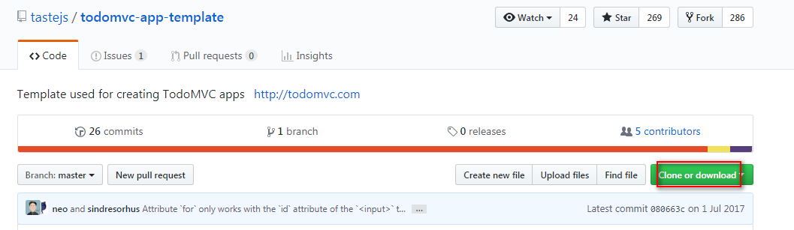

学习vue的案例，用于复习和使用时的参考。

## TodoMVC

### 1.下载TodoMVC模板

~~~shell
git clone https://github.com/tastejs/todomvc-app-template.
~~~

### 2.使用`npm`下载相关依赖

~~~shell
npm install
~~~

### 3.使用`npm`安装vue

~~~shell
npm install vue
~~~

### 4.知识点

#### 1.计算属性

~~~js
computed:{
    /**
     * 在模板中放入太多的逻辑会让模板过重且难以维护。
     * 使用计算属性：
     *      1.使用方法可以把这种复杂逻辑封装起来
     *          每使用一次就调用一次，重复适应效率不高。
     *      2.使用计算属性
     *          1.不让模板逻辑太重
     *          2.解决性能问题
     * */
     //该成员就是一个方法，但是在使用的时候当成一个属性来使用。
    remainingCount:{
        get:function(){
            return this.todos.filter(function(todo){
                return !todo.completed;
            }).length;
        }
    },
    toggleAllState:{
        /**取值*/
        get:function(){
            /**
             * 表示所有的todo都为true，多选框才为true
             *
             * 计算属性知道它依赖了todos
             * 当todos发生变化，计算属性会重新计算
             * */
            return this.todos.every(function(todo){
                return todo.completed;
            });
        },
        /**赋值*/
        set:function(){
            /**
             *
             * 表单控件checkbox双向绑定了toggleAllState，
             * 所以checkbox的变化会调用set()方法，
             * 在set方法中我们要做的是：
             *  1.得到当前checkbox的选中状态
             *  2.把所有的todo的任务项都设置为toggle-all的选中状态
             * */
            /**在自己的set方法中访问自己就是调用自己的get方法*/
            //获得多选框切换后的状态
            // true ==> false
            // false ==> true
            var checked = !this.toggleAllState;
            this.todos.forEach(function(item){
                item.completed=checked;
            });

        }
    },
    filterTodos:function(){
        var text = this.filterText;
        switch (text){
            case 'active':
                return this.todos.filter(function(todo){
                    return !todo.completed;
                });
            break;
            case 'completed':
                return this.todos.filter(function(todo){
                    return todo.completed;
                });
                break;
            default:
                return this.todos;
                break;
        }
    }
},
~~~

#### 2.侦听器

~~~js
watch:{
    /**
     * 监视todos的改变，当todos发生变化的时候做业务定制处理。
     * 引用类型只能监视一层，无法监视内部成员的子成员的改变、
     * */
    todos:{
        /**
         * 当监视到todos改变的时候会自动调用handler方法、
         * */
        deep:true,//进行深度监视
        //immediate:true,//无论变化与否，初始化立即就会加载一起。
        handler:function(newValue,oldValue){
            var objStr = JSON.stringify(newValue);
            /**监视到todos变化，把todos存储到本地*/
            window.localStorage.setItem('todos',objStr);
        }
    }
}
~~~

#### 3.hash（锚点）触发事件

~~~js
window.onhashchange=handleFilterTodos;

function handleFilterTodos(){
    app.filterText = window.location.hash.substring(2);
}
~~~

#### 4.localstorage的数据存取

~~~js
var objStr = JSON.stringify(newValue);
/**监视到todos变化，把todos存储到本地*/
window.localStorage.setItem('todos',objStr)

JSON.parse(window.localStorage.getItem('todos')||'[]'),
~~~

#### 5.锚点设置方式

~~~html
<ul class="filters">
    <li>
        <a :class="{selected:filterText === '' }" href="#/">All</a>
    </li>
    <li>
        <a :class="{selected:filterText === 'active' }" href="#/active">Active</a>
    </li>
    <li>
        <a :class="{selected:filterText === 'completed' }" href="#/completed">Completed</a>
    </li>
</ul>
~~~

### 5.功能

#### 1.新增TODO

~~~html
<input
    v-on:keydown.enter="handleNewTodoKeyDown"
    class="new-todo"
    placeholder="What needs to be done?" autofocus>
~~~

~~~js
/**新增todo*/
handleNewTodoKeyDown:function(e){
    var target = e.target;
    var value = target.value;
    if(!value.trim().length){
        return;
    }
    var todos = this.todos;
    var id = todos[todos.length-1]?todos[todos.length-1].id+1:1;
    var todo = {
        id:id,
        title:value,
        completed:false
    };
    this.todos.push(todo);
    target.value = '';
},
~~~

#### 2.删除TODO

~~~html
<button
    @click="handleRemoveTodoClick(index)"
    class="destroy"></button>
~~~

~~~js
/**删除todo*/
handleRemoveTodoClick:function(index){
    this.todos.splice(index,1);
},
~~~

#### 3.修改TODO

~~~html
<!--v-bind:value="item.title"
    还有一个取消编辑不保存的功能，所以我们就不使用双向数据绑定。
-->
<input
        class="edit"
        @keydown.esc="handleCancelEditEsc"
        @keydown.enter="handleSaveTodo(item,index,$event)"
        @blur="handleSaveTodo(item,index,$event)"
        :value="item.title"
        >
~~~

~~~js
/**编辑任务，敲回车或失去焦点保存编辑*/
handleSaveTodo:function(todo,index,e){
    var value = e.target.value;
    /**数据被编辑为空，则直接删除*/
//	if(value.trim()==''){
    if(!value.length){
        return this.todos.splice(index,1);
    }
    todo.title = value;
    this.currentEditing = null;
},
~~~

#### 4.遍历TODO

~~~html
<ul class="todo-list">
    <!-- These are here just to show the structure of the list items -->
    <!-- List items should get the class `editing` when editing and `completed` when marked as completed -->
    <!--
        任务项有三种样式状态：
            未完成：无样式
            已完成：completed
            编辑：editing
        双击时：就把currentEditing = 当前双击的任务项
    -->
    <li
        v-bind:class="{
            completed:item.completed,
            editing:currentEditing === item
        }"
        v-for="(item,index) in filterTodos" >
    </li>
</ul>
~~~

（计算属性）

~~~js

filterTodos:function(){
    var text = this.filterText;
    switch (text){
        case 'active':
            return this.todos.filter(function(todo){
                return !todo.completed;
            });
        break;
        case 'completed':
            return this.todos.filter(function(todo){
                return todo.completed;
            });
            break;
        default:
            return this.todos;
            break;
    }
}
~~~

#### 5.切换全选与全部选

~~~html
<!--
    这里的复选框双向绑定了toggleAllState计算属性
    无论是普通属性还是计算属性都要取值和赋值
    这里我们绑定的属性比较特殊，所以访问toggleAllState时，
    会调用计算属性的get()方法，当你为toggleAllState重新赋值的时候
    就会调用set()方法.我们的表单控制具有双向绑定。
-->
<input
        v-model="toggleAllState"
        id="toggle-all"
        class="toggle-all"
        type="checkbox">
~~~

(计算属性)

~~~js
toggleAllState:{
    /**取值*/
    get:function(){
        /**
         * 表示所有的todo都为true，多选框才为true
         *
         * 计算属性知道它依赖了todos
         * 当todos发生变化，计算属性会重新计算
         * */
        return this.todos.every(function(todo){
            return todo.completed;
        });
    },
    /**赋值*/
    set:function(){
        /**
         *
         * 表单控件checkbox双向绑定了toggleAllState，
         * 所以checkbox的变化会调用set()方法，
         * 在set方法中我们要做的是：
         *  1.得到当前checkbox的选中状态
         *  2.把所有的todo的任务项都设置为toggle-all的选中状态
         * */
        /**在自己的set方法中访问自己就是调用自己的get方法*/
        //获得多选框切换后的状态
        // true ==> false
        // false ==> true
        var checked = !this.toggleAllState;
        this.todos.forEach(function(item){
            item.completed=checked;
        });

    }
},
~~~

#### 6.清空已完成TODO

~~~html
<!--
    some.只要有一个为true，则为true。
    every.全部为true，则为true。
-->
<button
        class="clear-completed"
        v-if="todos.some(item => item.completed)"
        @click="handleClearCompletedClick"
        >Clear completed</button>
~~~

~~~js
handleClearCompletedClick:function(){
    /**不要在forEach循环遍历中删除数组元素，会导致索引错乱*/
    for(var i = 0; i < this.todos.length; i++){
        if(this.todos[i].completed){
            this.todos.splice(i,1);
            i--;
        }
    }
    /**也可以使用过滤方法*/
//	this.todos = this.todos.filter(item => !item.completed );
}

~~~

#### 7.计算剩余未完成数

~~~html
<strong>{{remainingCount}}</strong> item left
~~~

（计算属性）

~~~js
 //该成员就是一个方法，但是在使用的时候当成一个属性来使用。
remainingCount:{
    get:function(){
        return this.todos.filter(function(todo){
            return !todo.completed;
        }).length;
    }
},
~~~

#### 8.路由切换

~~~html
<ul class="filters">
    <li>
        <a :class="{selected:filterText === '' }" href="#/">All</a>
    </li>
    <li>
        <a :class="{selected:filterText === 'active' }" href="#/active">Active</a>
    </li>
    <li>
        <a :class="{selected:filterText === 'completed' }" href="#/completed">Completed</a>
    </li>
</ul>
~~~

#### 9.ESC取消编辑

~~~html
<input
    class="edit"
    @keydown.esc="handleCancelEditEsc"
    @keydown.enter="handleSaveTodo(item,index,$event)"
    @blur="handleSaveTodo(item,index,$event)"
    :value="item.title"
    >
~~~

~~~js
handleCancelEditEsc:function(){
    /**去除编辑样式*/
    this.currentEditing = null;
},
~~~

#### 10.TODOS的本地数据持久化

(侦听器)

~~~js
watch:{
    /**
     * 监视todos的改变，当todos发生变化的时候做业务定制处理。
     * 引用类型只能监视一层，无法监视内部成员的子成员的改变、
     * */
    todos:{
        /**
         * 当监视到todos改变的时候会自动调用handler方法、
         * */
        deep:true,//进行深度监视
        //immediate:true,//无论变化与否，初始化立即就会加载一起。
        handler:function(newValue,oldValue){
            var objStr = JSON.stringify(newValue);
            /**监视到todos变化，把todos存储到本地*/
            window.localStorage.setItem('todos',objStr);
        }
    }
}
~~~

#### 11.输入框聚焦

~~~html
<input
    v-on:keydown.enter="handleNewTodoKeyDown"
    class="new-todo"
    placeholder="What needs to be done?"
    v-focus
    >
~~~

~~~js
/**聚焦比较特殊，不能写在bind中*/
directives:{
    focus:{
        inserted:function(el){
            el.focus();
        }
    }
},
~~~

#### 12.编辑框聚焦

~~~html
<input
    v-todo-focus="currentEditing === item"
    class="edit"
    @keydown.esc="handleCancelEditEsc"
    @keydown.enter="handleSaveTodo(item,index,$event)"
    @blur="handleSaveTodo(item,index,$event)"
    :value="item.title"
    >
~~~

~~~js
Vue.directive('todo-focus',{
    update:function(el,binding){
        //多个focus只有第一个生效。所以可以直接使用el.focus();但是不严谨
        //可以通过传递进行判断。
        if(binding.value){
            el.focus();
        }
    }
});
~~~

### 6.效果图

