学习vue的笔记，用于复习和使用时的参考。https://cn.vuejs.org
<!--more-->


## Vue

### Vue起步

#### 安装

~~~shell
npm install --save vue

D:\Node_Vue\Vuejs\day02>npm install -save vue
npm WARN saveError ENOENT: no such file or directory, open 'D:\Node_Vue\Vuejs\da
y02\package.json'
npm notice created a lockfile as package-lock.json. You should commit this file.

npm WARN enoent ENOENT: no such file or directory, open 'D:\Node_Vue\Vuejs\day02
\package.json'
npm WARN day02 No description
npm WARN day02 No repository field.
npm WARN day02 No README data
npm WARN day02 No license field.

+ vue@2.5.17
added 1 package from 1 contributor in 6.572s
~~~

#### Demo

~~~html
<!DOCTYPE html>
<html>
<head lang="en">
    <meta charset="UTF-8">
    <title></title>
</head>
<body>
    <!--
        0.npm install vue
        1.引包
        2.new Vue 得到 Vue实例
            Vue 暂时可以理解成一个模板引擎
    -->
    <div id="app">
        <h1>{{ 1 + 1 }}</h1>
        <h1>{{ 'hello' + 'world'}}</h1>
        <h1>{{message}}</h1>
        <h1>details:{{details()}}</h1>
    </div>

    <script src="node_modules/vue/dist/vue.min.js"></script>
    <script>
        const app = new Vue({
            el:'#app',
            data:{
                message:'Hello Vue'
            },
            methods:{
                details:function(){
                    return '一个非常神奇的框架';
                }
            }
        });
    </script>
</body>
</html>
~~~


### 数据绑定

#### 文本绑定

~~~html
<div id="app">
    <h1>{{foo}}</h1>
    <p>{{foo}}</p>
</div>

<script>
    var app = new Vue({
        el:'#app',
        data:{
            foo:'Hello'
        },
        methods:{

        }
    });
</script>
~~~

#### 一次性绑定

~~~html
<div id="app">
    <!--初始化之后就不可以修改了-->
    <h1 v-once>{{foo}}</h1>
    <p>{{foo}}</p>
</div>
~~~

#### 输出HTML

~~~html
<div id="app">
    <div>
        {{rowHtml}}
    </div>
    <div v-html="rowHtml"></div>
</div>

<script>
    var app = new Vue({
        el:'#app',
        data:{
            foo:'Hello',
            /*在html字符串中不能使用vue的语法特性，{{foo}}会被处理为字符串，原样输出*/
            rowHtml:'<h1>Hello {{foo}} Vue</h1>'
        },
        methods:{

        }
    });
</script>
~~~

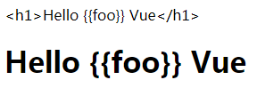

####  普通文本绑定与属性绑定

~~~html
<ul>
    <li v-for="item in todos">
        <!-- v-bind只能用于属性
             它的值是一个JavaScript表达式，和{{}}里面的语法一致、
             唯一的区别就是：{{}}用于标签文本绑定，v-bind用于属性文本绑定。
        -->
        <a v-bind:href="'/todos?id='+item.id">{{item.title +  'Vue'}}</a>
        <!--<a v-bind:href="'/todos?id='+item.id">{{item.title}} Vue</a>-->
    </li>
</ul>
<script>
    var app = new Vue({
        el:'#app',
        data:{
            todos:[
                {
                    id:1,
                    title:'aaa'
                },{
                    id:2,
                    title:'bbb'
                },{
                    id:3,
                    title:'ccc'
                }
            ]
        },
        methods:{
        }
    });
</script>
~~~

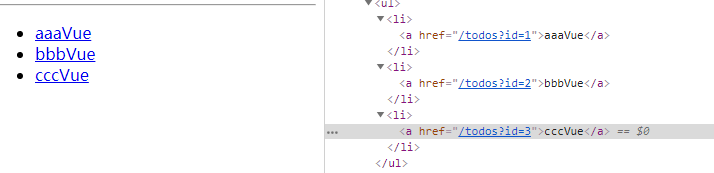


#### 使用JavaScript表达式

~~~html
<ul>
    <li v-for="item in todos">
        <a v-bind:href="true?123:345">{{true?123:345}}</a>
    </li>
</ul>

<！--官方示例-->
{{ number + 1 }}

{{ ok ? 'YES' : 'NO' }}

{{ message.split('').reverse().join('') }}

<div v-bind:id="'list-' + id"></div>
~~~

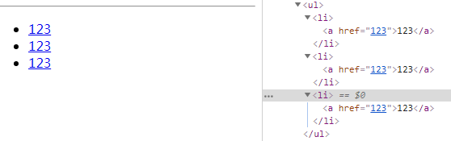

### 指令

#### 简介

~~~html
指令 (Directives) 是带有 v- 前缀的特殊特性。指令特性的值预期是单个 JavaScript 表达式 (v-for 是例外情况，稍后我们再讨论)。指令的职责是，当表达式的值改变时，将其产生的连带影响，响应式地作用于 DOM。回顾我们在介绍中看到的例子：

<p v-if="seen">现在你看到我了</p>
这里，v-if 指令将根据表达式 seen 的值的真假来插入/移除 <p> 元素。
  
v-i 条件渲染
v-for 列表渲染
v-on  注册事件
v-bind 属性绑定
v-once 只绑定一次
v-html 绑定输出html
~~~

#### 参数

~~~html
一些指令能够接收一个“参数”，在指令名称之后以冒号表示。例如，v-bind 指令可以用于响应式地更新 HTML 特性：

<a v-bind:href="url">...</a>
在这里 href 是参数，告知 v-bind 指令将该元素的 href 特性与表达式 url 的值绑定。

另一个例子是 v-on 指令，它用于监听 DOM 事件：

<a v-on:click="doSomething">...</a>
在这里参数是监听的事件名。我们也会更详细地讨论事件处理。
~~~

#### 修饰符

~~~html
修饰符 (Modifiers) 是以半角句号 . 指明的特殊后缀，用于指出一个指令应该以特殊方式绑定。例如，.prevent 修饰符告诉 v-on 指令对于触发的事件调用 event.preventDefault()：

<form v-on:submit.prevent="onSubmit">...</form>
在接下来对 v-on 和 v-for 等功能的探索中，你会看到修饰符的其它例子。
~~~

~~~html
<!DOCTYPE html>
<html xmlns:v-on="http://www.w3.org/1999/xhtml">
<head lang="en">
    <meta charset="UTF-8">
    <title></title>
    <script src="node_modules/vue/dist/vue.min.js"></script>

</head>
<body>
    <div id="app">
        <!--
            v-i 条件渲染
            v-for 列表渲染
            v-on  注册事件
            v-bind 属性绑定
            v-once 只绑定一次
            v-html 绑定输出html
        -->
        <p v-if="seen">你看不见我</p>
        <!--<a v-on:click="handleGoBaidu" href="http://www.baidu.com">去百度</a>-->
        <a v-on:click.prevent="handleGoBaidu" href="http://www.baidu.com">去百度</a>
    </div>
    <script>

        var app = new Vue({
            el:'#app',//css选择器
            data:{
                seen:true
            },
            methods:{
                handleGoBaidu:function(e){
                    /*
                    * 阻止默认的a标签的跳转事件。（阻止默认事件行为）
                    * 即：如果没有e.preventDefault();弹框之后，会跳转到百度。
                    * 但是使用e.preventDefault();可以阻止默认事件，即只会弹框不会进行链接跳转。
                    * 也可以使用v-on:click.prevent=""
                    * */
                    e.preventDefault();
                    window.alert('去百度');
                }
            }
        });
    </script>
</body>
</html>
~~~

#### 缩写

~~~html
v- 前缀作为一种视觉提示，用来识别模板中 Vue 特定的特性。当你在使用 Vue.js 为现有标签添加动态行为 (dynamic behavior) 时，v- 前缀很有帮助，然而，对于一些频繁用到的指令来说，就会感到使用繁琐。同时，在构建由 Vue.js 管理所有模板的单页面应用程序 (SPA - single page application) 时，v- 前缀也变得没那么重要了。因此，Vue.js 为 v-bind 和 v-on 这两个最常用的指令，提供了特定简写：

v-bind 缩写

    <!-- 完整语法 -->
    <a v-bind:href="url">...</a>
    
    <!-- 缩写 -->
    <a :href="url">...</a>

v-on 缩写

    <!-- 完整语法 -->
    <a v-on:click="doSomething">...</a>
    
    <!-- 缩写 -->
    <a @click="doSomething">...</a>

它们看起来可能与普通的 HTML 略有不同，但 : 与 @ 对于特性名来说都是合法字符，在所有支持 Vue.js 的浏览器都能被正确地解析。而且，它们不会出现在最终渲染的标记中。缩写语法是完全可选的，但随着你更深入地了解它们的作用，你会庆幸拥有它们。
~~~


### 自定义指令

**[官方文档](https://cn.vuejs.org/v2/guide/custom-directive.html)**

**注意：**

~~~js
定义全局自定义指令  Vue.directive('',{}); 需要写在 var app = new Vue({});之前，否则不能生效。
~~~

什么是自定义指令 ？

- 除了使用vue提供的内置指令之外，我们可以自定义一些自己的指令。

什么时候需要自定义指令？

- 当需要不可避免的操作DOM的时候，使用自定义指令来解决

如何注册和使用自定义指令？

- 注册
  - 全局注册，在任何组件中都可以使用全局注册自定义指令。
  - 局部注册，只能在当前组件使用该指令。
    - 如果需要在多个不同的组件中使用该指令，则把它定义为全局的
    - 非通用的，不需要多次使用的指令我们定义为局部的，是否通用取决于你的功能业务
- 使用


自定义指令的参数：

- 第一个参数：
  - 注册一个全局自定义指令`v-focus`，在使用的时候必须加上v-前缀，建议在取名字的时候就不要加v-前缀。
  - 如果是驼峰命名法，则在使用的时候需要把驼峰转为小写使用  -  连接起来
- 第二个参数：
  - 需要配置指令的生命钩子函数

#### v-focus

**(聚焦比较特殊，不能写在bind中)**

~~~html
<div id="app">
    <!--使用指令-->
    <input v-focus placeholder="username" >
</div>
<script>
    
    //注册全局指令
    Vue.directive('focus',{
        //当被绑定的元素插入到DOM中时...
        inserted:function(el){
            //聚焦元素
            el.focus();
        }
    });
    
    var app = new Vue({
        el: '#app',
        data: {

        },
        methods: {},
        computed: {},
        watch: {}
    });
    //注册局部指令
    /*
    * ,directives:{
         focus:{
             inserted:function(el){
                el.focus();
             }
         }
     }

    * */
</script>
~~~


#### 钩子函数


一个指令定义对象可以提供如下几个钩子函数 (均为可选)：

- `bind`：只调用一次，指令第一次绑定到元素时调用。在这里可以进行一次性的初始化设置。
- `inserted`：被绑定元素插入父节点时调用 (仅保证父节点存在，但不一定已被插入文档中)。
- `update`：所在组件的 VNode 更新时调用，**但是可能发生在其子 VNode 更新之前**。指令的值可能发生了改变，也可能没有。但是你可以通过比较更新前后的值来忽略不必要的模板更新 (详细的钩子函数参数见下)。
- `componentUpdated`：指令所在组件的 VNode **及其子 VNode** 全部更新后调用。
- `unbind`：只调用一次，指令与元素解绑时调用。

总结：

- bind 初始化执行一次，后面不再执行，拿不到当前节点的父节点（el.parentNode == null）
- inserted初始化执行一次（后于bind），后面不再执行，可以拿到当前节点的父节点
  - 如果不需要操作父节点，可以使用bind/inserted，如果需要，则只能使用inserted。  
- update和componentUpdated只有在指定**所在模板**发生更新的时候才会触发调用
  - update中的el.innerHTML获取的是模板更新之前的指令所在DOM的内容
  - componentUpdated的el.innerHTML获取的是模板更新之后最新的指令所在的DOM内容、
- unbind：可以做一些收尾工作，比如清除定时器。

**所在模板**：

~~~html
<div id="app">
  //code 只要这里的任一内容更新，update与componentUpdated就会调用执行。
</div>
~~~


#### 钩子函数参数

指令钩子函数会被传入以下参数：

- el：指令所绑定的元素，可以用来直接操作 DOM 。
- binding：一个对象，包含以下属性：
  - name：指令名，不包括 v- 前缀。
  - value：指令的绑定值，例如：v-my-directive="1 + 1" 中，绑定值为 2。
  - oldValue：指令绑定的前一个值，仅在 update 和 componentUpdated 钩子中可用。无论值是否改变都可用。
  - expression：字符串形式的指令表达式。例如 v-my-directive="1 + 1" 中，表达式为 "1 + 1"。
  - arg：传给指令的参数，可选。例如 v-my-directive:foo 中，参数为 "foo"。
  - modifiers：一个包含修饰符的对象。例如：v-my-directive.foo.bar 中，修饰符对象为 { foo: true, bar: true }。

- vnode：Vue 编译生成的虚拟节点。移步 VNode API 来了解更多详情。
- oldVnode：上一个虚拟节点，仅在 update 和 componentUpdated 钩子中可用


注意:

~~~html
除了 el 之外，其它参数都应该是只读的，切勿进行修改。如果需要在钩子之间共享数据，建议通过元素的 dataset 
来进行。
~~~


#### 函数简写

在很多时候，你可能想在 `bind` 和 `update` 时触发相同行为，而不关心其它的钩子。比如这样写:

```js
Vue.directive('color-swatch', function (el, binding) {
  el.style.backgroundColor = binding.value
})
```

#### 对象字面量

如果指令需要多个值，可以传入一个 JavaScript 对象字面量。记住，指令函数能够接受所有合法的 JavaScript 表达式。

```js
<div v-demo="{ color: 'white', text: 'hello!' }"></div>
Vue.directive('demo', function (el, binding) {
  console.log(binding.value.color) // => "white"
  console.log(binding.value.text)  // => "hello!"
})
```


#### 自定义指令示例

##### 自定义指令实现v-show

~~~html
<div id="app">
    <h1 v-myshow="seen" >Hello Vue.js</h1>
</div>

<script>
    Vue.directive('myshow',{
        bind:function(el,binding){
            if(binding.value){
                el.style.display = 'block';
            }else{
                el.style.display = 'none';
            }
        },
        inserted:function(){
            //上面的bind中的代码也可以放在此处
        },
        update:function(el,binding){
            if(binding.value){
                el.style.display = 'block';
            }else{
                el.style.display = 'none';
            }
        },
        componentUpdated:function(){
            //上面的update中的代码也可以放在此处
        },
        unbind:function(){

        }
    });

    var app = new Vue({
        el: '#app',
        data: {
            seen:true
        },
        methods: {}
    });
</script>
~~~

上述代码可以简化为：（**只想在 `bind` 和 `update` 时触发相同行为，而不关心其它的钩子**）

~~~html
<div id="app">
    <h1 v-myshow="seen" >Hello Vue.js</h1>
</div>

<script>
    Vue.directive('myshow',function(el,binding){
        if(binding.value){
            el.style.display = 'block';
        }else{
            el.style.display = 'none';
        }
    });
    var app = new Vue({
        el: '#app',
        data: {
            seen:true
        },
        methods: {}
    });
</script>
~~~


##### 自定义指令实现v-bind

~~~html
<!DOCTYPE html>
<html
      xmlns:v-bind="http://www.w3.org/1999/xhtml"
      xmlns:v-mybind="http://www.w3.org/1999/xhtml">
<head lang="en">
    <meta charset="UTF-8">
    <title></title>
    <script src="node_modules/vue/dist/vue.min.js"></script>
</head>
<style>
    .border{
        width: 200px;
        height: 200px;
        border: 2px solid red;
    }
    .bg{
        background-color: blue;
    }
</style>
<body>

<div id="app">
    <span v-mybind:title=" 'Hello OuYang' ">234</span>
    <div v-bind:class="{border:border,bg:bg}">v中的v-bind</div>
    <hr/>
    <div v-mybind:class="'border'" >自定义的v-bind</div>
    <hr/>
    <input type="text" v-mybind:value="1234"/>
    <hr/>
    <div v-mybind:class="{border:border,bg:bg}">对象属性</div>
</div>
<script>

    /*Vue.directive('mybind',{
        bind:function(el,binding){
            /!**获取需要绑定的属性*!/
            var arg = binding.arg;
            if(binding.value instanceof Object && arg === 'class'){
                var values = binding.value;
                for(var key in values){
                    if(values[key] && !el.classList.contains(key)){
                        el.classList.add(key);
                    }else if(!values[key] && el.classList.contains(key)){
                        el.classList.remove(key);
                    }
                }
                return;
            }
            /!**获取需要指定的值*!/
            var value = binding.value;
            el.setAttribute(arg,value);
        },
        update:function(el,binding){
            /!**获取需要绑定的属性*!/
            var arg = binding.arg;
            if(binding.value instanceof Object && arg === 'class'){
                var values = binding.value;
                for(var key in values){
                    if(values[key] && !el.classList.contains(key)){
                        el.classList.add(key);
                    }else if(!values[key] && el.classList.contains(key)){
                        el.classList.remove(key);
                    }
                }
                return;
            }
            /!**获取需要指定的值*!/
            var value = binding.value;
            el.setAttribute(arg,value);
        }
    });*/
  	//简写方式
    Vue.directive('mybind',function(el,binding){
        /**获取需要绑定的属性*/
        var arg = binding.arg;
        if(binding.value instanceof Object && arg === 'class'){
            var values = binding.value;
            for(var key in values){
                if(values[key] && !el.classList.contains(key)){
                    el.classList.add(key);
                }else if(!values[key] && el.classList.contains(key)){
                    el.classList.remove(key);
                }
            }
            return;
        }
        /**获取需要指定的值*/
        var value = binding.value;
        el.setAttribute(arg,value);
    });

    var app = new Vue({
        el: '#app',
        data: {
            border:true,
            bg:true
        },
        methods: {},
        computed: {},
        watch: {},
        directives:{}
    });
</script>
</body>
</html>
~~~


##### 自定义指令v-color

~~~html
<div id="app">
    <div v-color="'gold'"
         style="width: 100px; height: 100px;"
         v-demo="{name:'tom',age:12}" >
    </div>
    <div v-color="'red'" style="width: 50px; height: 50px;" >123</div>
</div>

<script>

    Vue.directive('demo',{
        bind:function(el,binding){
            el.innerHTML = binding.value.name +'-' + binding.value.age;
        }
    });
   Vue.directive('color',{
        bind:function(el,binding){
            el.style.backgroundColor= binding.value;
        }
    });

    var app = new Vue({
        el: '#app',
        data: {},
        methods: {},
        computed: {},
        watch: {}
    });
</script>
~~~

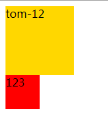


### Class 与 Style 绑定

#### 绑定HTML Class

~~~html
<!DOCTYPE html>
<html xmlns:v-bind="http://www.w3.org/1999/xhtml">
<head lang="en">
    <meta charset="UTF-8">
    <title></title>
    <script src="node_modules/vue/dist/vue.min.js"></script>
    <style>
        .active {
            color: red;
        }
    </style>
</head>
<body>
    <div id="app">
        <h1 v-bind:class="{active:isActive}" v-bind:style="{backgroundColor:'yellow'}" >Hello Vue</h1>
    </div>
    <script>
        var app = new Vue({
            el:'#app',
            data:{
                isActive:true,
                bgc:'gold'
            },
            methods:{
            }
        });
    </script>
</body>
</html>
~~~

#### 绑定内联样式

~~~html
<div id="app">
	<h1 :class="{active:isActive}" :style="{backgroundColor:bgc}" >Hello Vue</h1>
</div>
<script>
    var app = new Vue({
        el:'#app',
        data:{
            isActive:true,
            bgc:'gold'
        },
        methods:{

        }
    });
</script>
~~~

注意：v-bind:class == :class

#### 数组语法

~~~html
v-bind:style 的数组语法可以将多个样式对象应用到同一个元素上：
<div v-bind:style="[baseStyles, overridingStyles]"></div>
~~~

### http-server使用教程 hs -o

~~~html
01.npm install http-server -g全局安装
02.在要打开的项目文件夹处打开命令窗口，输入 hs -o回车
03.将对应的网址复制到浏览器打开
	注意点：一次只能运行一个项目，当要运行另外一个项目时要先结束前面项目的服务在命令窗口按住ctrl+c即可，再到另外一			个项目文件运行服务
04.遇到端口被占用的情况，可以用指令：hs -o -p 新端口号，来修改端口。
~~~

### 使用browser-sync工具

#### 安装

~~~shell
npm install -g browser-sync
~~~

#### 启动

~~~shell
browser-sync start --server --files "**/*.css, **/*.html, **/*.js"
~~~

#### 启动效果

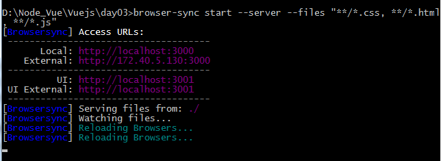

在需要使用同步刷新工具的项目或文件夹下运行，即可观察到页面与代码同步更新

#### 在package.json配置启动方式（scripts）

~~~json
{
  "private": true,
  "scripts":{
    "dev":"browser-sync start --server --files \"*.html, css/*.css,js/*.js\"",
    "start":"npm run dev"
  },
  "dependencies": {
    "browser-sync": "^2.26.3",
    "jquery": "^3.3.1",
    "todomvc-app-css": "^2.0.0",
    "todomvc-common": "^1.0.0",
    "vue": "^2.5.17"
  }
}

~~~


### 表单输入绑定

#### 基本语法

~~~html
你可以用 v-model 指令在表单 <input>、<textarea> 及 <select> 元素上创建双向数据绑定。它会根据控件类型自动选取正确的方法来更新元素。尽管有些神奇，但 v-model 本质上不过是语法糖。它负责监听用户的输入事件以更新数据，并对一些极端场景进行一些特殊处理。
  
(v-model用于表单控件)
<!--不能这样使用-->
<h1 v-model="message"></h1>
~~~

#### 文本

```html
<div id="app">
    <!--<input type="text" v-bind:value="message"/>-->
    <input type="text" v-model="message" />{{message}}
</div>
```

#### 多行文本

~~~html
<span>Multiline message is:</span>
<p style="white-space: pre-line;">{{ message }}</p>
<br>
<textarea v-model="message" placeholder="add multiple lines"></textarea>
~~~

#### 复选框

~~~html
<!DOCTYPE html>
<html xmlns:v-bind="http://www.w3.org/1999/xhtml">
<head lang="en">
    <meta charset="UTF-8">
    <title></title>
    <script src="node_modules/vue/dist/vue.min.js"></script>
    <style>
        .box{
            width: 200px;
            height: 200px;
            background-color: yellow;
        }
    </style>
</head>
<body>
<div id="app">
    <!--复选框-->
    <input type="checkbox" v-bind:checked="checked"/><!--受数据，但不影响数据-->
    <input type="checkbox" v-model="checked"/>{{checked}}<!--双向绑定-->
  	<!--两种方式-->
    <!--<div v-bind:class="{box:checked}"></div>-->
    <div v-if="checked" class="box"></div>
</div>
<script>
    var app = new Vue({
        el:'#app',
        data:{
            checked:true
        }
    });
</script>
</body>
</html>
~~~

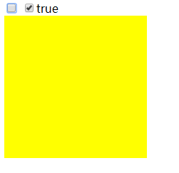

#### 单选按钮

~~~html
<div id="app">
    <input type="radio" id="one"  v-model="picked" value="One"/>One
    <!--<label for="one">One</label>-->
    <br/>
    <input type="radio" id="two" v-model="picked" value="Two" />Two
    <!--<label for="two">Two</label>-->
    <br/>
    <span>Picked:{{picked}}</span>
</div>
<script>
    var app = new Vue({
        el: '#app',
        data: {
            picked:''
        },
        methods: {}
    });
</script>
~~~

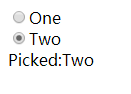

#### 单选下拉框

~~~html
<div id="app">
    <select v-model="selected">
        <!--disable 设置为不可选-->
        <option disabled value="">==请选择==</option>
        <option value="1">A</option>
        <option value="2">B</option>
        <option value="3">C</option>
    </select>
    <span>Selected:{{selected}}</span>
</div>
<script>
    var app = new Vue({
        el: '#app',
        data: {
            selected:''
        },
        methods: {}
    });
</script>
~~~

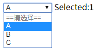

#### 复选下拉框

~~~html
<!--多选框-->
<select v-model="selected" multiple >
    <!--disable 设置为不可选-->
    <option disabled value="">==请选择==</option>
    <option value="1">A</option>
    <option value="2">B</option>
    <option value="3">C</option>
</select>
<span>Selected:{{selected}}</span>
~~~

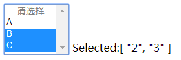

### 值绑定

对于单选按钮，复选按钮及选择框的选项，`v-model`绑定的值通常是静态字符串（对于复选框也可以是布尔值）：

~~~html
<div id="app">
    <input type="radio" v-model="picked" value="a" />
    <input type="checkbox" v-model="toggle" />

    <select v-model="selected">
        <option value="abc">ABC</option>
        <option value="def">DEF</option>
    </select>
</div>
<script>
    var app = new Vue({
        el: '#app',
        data: {
            picked:'abc',
            toggle:false,
            selected:'def'
        },
        methods: {}
    });
</script>
~~~

但是有时我们可能想把值绑定到Vue实例的一个动态属性，这是可以用`v-bind`实例，并且这个属性的值可以不是字符串。

#### 复选框

~~~html
<div id="app">
    <input
            type="checkbox"
            v-model="toggle"
            true-value="yes"
            false-value="no"
            />
       toggle: {{toggle}}
</div>
<script>
    var app = new Vue({
        el: '#app',
        data: {
            toggle:''
        },
        methods: {}
    });
</script>
~~~

~~~js
// 当选中时
vm.toggle === 'yes'
// 当没有选中时
vm.toggle === 'no'
~~~

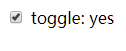

**注意：**

这里的 `true-value` 和 `false-value` 特性并不会影响输入控件的 `value` 特性，因为浏览器在提交表单时并不会包含未被选中的复选框。如果要确保表单中这两个值中的一个能够被提交，(比如“yes”或“no”)，请换用单选按钮。


#### 单选按钮

~~~html
<input type="radio" v-model="pick" v-bind:value="a"> {{pick}}/{{a}}
<script>
    var app = new Vue({
        el: '#app',
        data: {
            pick:'23',
            a:'32'
        },
        methods: {}
    });
</script>
~~~

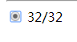

#### 内联对象字面值

~~~html
<select v-model="selected">
    <!-- 内联对象字面量 -->
  <option v-bind:value="{ number: 123 }">123</option>
</select>


// 当选中时
typeof vm.selected // => 'object'
vm.selected.number // => 123
~~~


### 修饰符

#### .lazy

在默认情况下，`v-model` 在每次 `input` 事件触发后将输入框的值与数据进行同步 (除了[上述](https://cn.vuejs.org/v2/guide/forms.html#vmodel-ime-tip)输入法组合文字时)。你可以添加 `lazy` 修饰符，从而转变为使用 `change`事件进行同步： 

```html
<!-- 在“change”时而非“input”时更新 -->
<input v-model.lazy="msg" >
```


#### .number

如果想自动将用户的输入值转为数值类型，可以给 `v-model` 添加 `number` 修饰符： 

```html
<input v-model.number="age" type="number">
```

这通常很有用，因为即使在 `type="number"` 时，HTML 输入元素的值也总会返回字符串。如果这个值无法被 `parseFloat()` 解析，则会返回原始的值。 


#### .trim

如果要自动过滤用户输入的首尾空白字符，可以给 `v-model` 添加 `trim` 修饰符： 

~~~html
<input v-model.trim="msg">
~~~


### 条件渲染/指令

#### v-if

#### v-else

#### v-else-if

参考[官方文档条件渲染](https://cn.vuejs.org/v2/guide/conditional.html)

#### v-if VS v-show

~~~html
<div id="app">
    <div v-if="ifSeen">
        <h1>Hello v-if</h1>
    </div>
    <div v-show="showSeen" >
        <h1>Hello v-show</h1>
    </div>
</div>
<script>
    var app = new Vue({
        el: '#app',
        data: {
            ifSeen:false,
            showSeen:false
        },
        methods: {}
    });
</script>
~~~

**效果图**

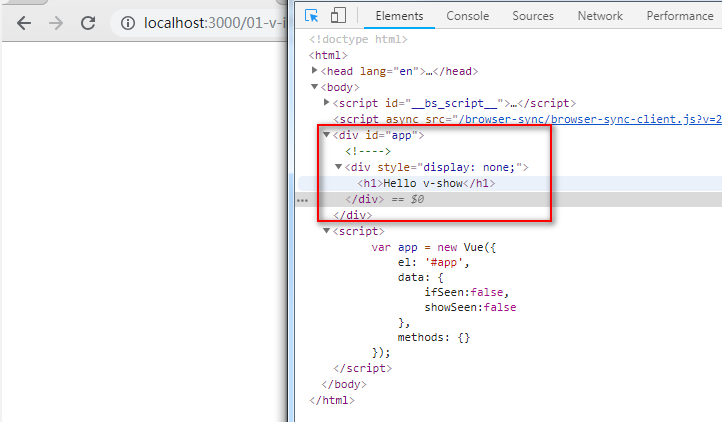


**可以看出：**

v-if与v-show在为true的时候，都会进行渲染DOM进行元素的显示，但是当为false的时候，v-if不会进行DOM节点的渲染，但是v-show依旧会进行DOM元素的渲染，只是通过css的display属性来控制元素的显示与否。

**官方寄语：**

- `v-if` 是“真正”的条件渲染，因为它会确保在切换过程中条件块内的事件监听器和子组件适当地被销毁和重建。
- `v-if` 也是**惰性的**：如果在初始渲染时条件为假，则什么也不做——直到条件第一次变为真时，才会开始渲染条件块。
- 相比之下，`v-show` 就简单得多——不管初始条件是什么，元素总是会被渲染，并且只是简单地基于 CSS 进行切换。
- 一般来说，`v-if` 有更高的切换开销，而 `v-show` 有更高的初始渲染开销。因此，如果需要非常频繁地切换，则使用 `v-show` 较好；如果在运行时条件很少改变，则使用 `v-if` 较好。


#### v-if 与 v-for一起使用

**官方寄语：**

**不推荐**同时使用 `v-if` 和 `v-for`。请查阅[风格指南](https://cn.vuejs.org/v2/style-guide/#%E9%81%BF%E5%85%8D-v-if-%E5%92%8C-v-for-%E7%94%A8%E5%9C%A8%E4%B8%80%E8%B5%B7-%E5%BF%85%E8%A6%81)以获取更多信息。

当 `v-if` 与 `v-for` 一起使用时，`v-for` 具有比 `v-if` 更高的优先级。请查阅[列表渲染指南](https://cn.vuejs.org/v2/guide/list.html#v-for-with-v-if) 以获取详细信息。


#### v-pre

~~~html
<div id="app">
    <h3>不使用v-pre</h3>
    <div>{{message}}</div>
    <h3>使用v-pre</h3>
    <div v-pre>{{message}}</div>
</div>
<script>
    var app = new Vue({
        el: '#app',
        data: {
            message:'spring springboot springmvc springdata springcloud'
        },
        methods: {}
    });
</script>
~~~

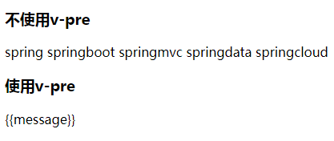

#### v-text 和 v-clock

注意：

~~~html
使用{{}}双大括号时，可能由于加载与vue渲染速度的影响，在页面上回出现短暂的多个{{message}}。而后才被vue渲染，为了解决这个闪烁问题，可以使用v-text指令进行解决，v-text指令的作用就是在message还未被渲染的时候，页面是空白的而不是显示{{message}}。但是如下所示，如何有很多<p v-text="message"></p>会显得十分麻烦，可以利用v-cloak进行解决，先是通过display=none的方式隐藏，后面渲染后通过display=block的方式来显示，
~~~

如下：

~~~html
<div id="app">
    <h2>使用{{}}</h2>
    <p>{{message}}</p>
    <p>{{message}}</p>
    <p>{{message}}</p>
    <p>{{message}}</p>
    <p>{{message}}</p>
    <p>{{message}}</p>
    <p>{{message}}</p>
    <p>{{message}}</p>
    <h2>使用v-text</h2>
    <p v-text="message"></p>
    <p v-text="message"></p>
    <p v-text="message"></p>
    <p v-text="message"></p>
    <p v-text="message"></p>
    <p v-text="message"></p>
    <p v-text="message"></p>
</div>


--------------可以使用下面的方式----------------
<style>
  [v-cloak] {
    display: none;
  }
</style>
<div id="app" v-cloak>
    <h2>使用{{}}</h2>
    <p>{{message}}</p>
    <p>{{message}}</p>
    <p>{{message}}</p>
    <p>{{message}}</p>
    <p>{{message}}</p>
    <p>{{message}}</p>
    <p>{{message}}</p>
    <p>{{message}}</p>
</div>


~~~


### 列表渲染

~~~xml
v-for 指令根据一组数组的选项列表进行渲染。
v-for 指令需要使用 item in items 形式的特殊语法，
items 是源数据数组并且 item 是数组元素迭代的别名。
~~~


#### 遍历列表（数组）

~~~html
<h2>遍历数组</h2>
<ul>
    <!--<li v-for="(item,index) in users">-->
    <li v-for="(item,index) of users">
        {{item.name}} -- {{index}}
    </li>
</ul>

<script>
    var app = new Vue({
        el: '#app',
        data: {
            users:[
                {
                    name:'张三'
                },{
                    name:'李四'
                },{
                    name:'王五'
                }
            ]
        },
        methods: {}
    });
</script>
~~~


#### 遍历对象

~~~html
<h2>遍历对象</h2>
<ul>
    <li v-for="(value,key,index) in object">
        {{key}} -- {{value}} -- {{index}}
    </li>
</ul>

<script>
    var app = new Vue({
        el: '#app',
        data: {
            object:{
                firstName:'ouYang',
                lastName:'hao',
                age:22
            }
        },
        methods: {}
    });
</script>
~~~

#### Key

~~~xml
官方解释：

当 Vue.js 用 v-for 正在更新已渲染过的元素列表时，它默认用“就地复用”策略。
如果数据项的顺序被改变，Vue 将不会移动 DOM 元素来匹配数据项的顺序，
而是简单复用此处每个元素，并且确保它在特定索引下显示已被渲染过的每个元素。
这个类似 Vue 1.x 的 track-by="$index" 。

这个默认的模式是高效的，但是只适用于不依赖子组件状态或临时 DOM 状态 (例如：表单输入值) 的列表渲染输
出。

为了给 Vue 一个提示，以便它能跟踪每个节点的身份，
从而重用和重新排序现有元素，你需要为每项提供一个唯一 key 属性。
理想的 key 值是每项都有的唯一 id。这个特殊的属性相当于 Vue 1.x 的 track-by ，
但它的工作方式类似于一个属性，所以你需要用 v-bind 来绑定动态值 (在这里使用简写)：

<div v-for="item in items" :key="item.id">
    
建议尽可能在使用 v-for 时提供 key，除非遍历输出的 DOM 内容非常简单，或者是刻意依赖默认行为以获取性能
上的提升。

因为它是 Vue 识别节点的一个通用机制，key 并不与 v-for 特别关联，key 
还具有其他用途，我们将在后面的指南中看到其他用途。
    
<ul>
    <!--<li v-for="(item,index) in users">-->
    <li v-for="(item,index) of users" v-bind:key="item.id">
        {{item.name}} -- {{index}}
    </li>
</ul>
~~~


#### 数组更新检测

##### 变异方法

```js
Vue 包含一组观察数组的变异方法，所以它们也将会触发视图更新。这些方法如下：
- push() 从后面压入
- pop()  从后面弹出
- shift() 从前面弹出
- unshift() 从前面压入
- splice(index,count) 删除指定index开始count个元素
- sort() 排序
- reverse() 翻转
```


##### 替换数组

变异方法 (mutation method)，顾名思义，会改变被这些方法调用的原始数组。相比之下，也有非变异 (non-mutating method) 方法，例如：`filter()`, `concat()` 和 `slice()` 。这些不会改变原始数组，但**总是返回一个新数组**。当使用非变异方法时，可以用新数组替换旧数组：

```js
example1.items = example1.items.filter(function (item) {
  return item.message.match(/Foo/)
})
```


##### 注意事项

由于 JavaScript 的限制，Vue 不能检测以下变动的数组：

1. 当你利用索引直接设置一个项时，例如：`vm.items[indexOfItem] = newValue`
2. 当你修改数组的长度时，例如：`vm.items.length = newLength`

举个例子：

```js
var vm = new Vue({
  data: {
    items: ['a', 'b', 'c']
  }
})
vm.items[1] = 'x' // 不是响应性的
vm.items.length = 2 // 不是响应性的
```

为了解决第一类问题，以下两种方式都可以实现和 `vm.items[indexOfItem] = newValue` 相同的效果，同时也将触发状态更新：

```js
// Vue.set
Vue.set(vm.items, indexOfItem, newValue)
```

```js
// Array.prototype.splice
vm.items.splice(indexOfItem, 1, newValue)
```

你也可以使用 [`vm.$set`](https://vuejs.org/v2/api/#vm-set) 实例方法，该方法是全局方法 `Vue.set` 的一个别名：

```js
vm.$set(vm.items, indexOfItem, newValue)
```

为了解决第二类问题，你可以使用 `splice`：

```js
vm.items.splice(newLength)
```

**实验结果**

~~~html
<script>
    var app = new Vue({
        el: '#app',
        data: {
            items:['a','b','c']
        },
        methods: {}
    });
//    app.items[1] = 'x';//不是响应式的                                   
//    app.items.length = 2; //不是响应式的                                
    Vue.set(app.items,1,'x');//将index=1上的元素修改为x                    
    app.items.splice(1,1,'xx');//将上面已修改的x变成了xx                    
    app.$set(app.items,0,'v'); //将index=0的位置上的元素修改为v             
    app.items.splice(2);//将app.item的长度修改为2，即保留index=0与1的元素。  
                        // 页面显示index=0与index=1的元素
</script>
~~~

| 操作表达式                       | 结果             |
| --------------------------- | -------------- |
| 初始                          | ['a','b','c']  |
| app.items[1] = 'x';         | ['a','b','c']  |
| app.items.length = 2;       | ['a','b','c']  |
| Vue.set(app.items,1,'x');   | ['a','x','c']  |
| app.items.splice(1,1,'xx'); | ['a','xx','c'] |
| app.$set(app.items,0,'v');  | ['v','xx','c'] |
| app.items.splice(2);        | ['v','xx']     |


#### 对象更改检测注意事项

还是由于 JavaScript 的限制，**Vue 不能检测对象属性的添加或删除**：

```js
var vm = new Vue({
  data: {
    a: 1
  }
})
// `vm.a` 现在是响应式的

vm.b = 2
// `vm.b` 不是响应式的
```

对于已经创建的实例，Vue 不能动态添加根级别的响应式属性。但是，可以使用 `Vue.set(object, key, value)` 方法向嵌套对象添加响应式属性。例如，对于：

```js
var vm = new Vue({
  data: {
    userProfile: {
      name: 'Anika'
    }
  }
})
```

你可以添加一个新的 `age` 属性到嵌套的 `userProfile` 对象：

```js
Vue.set(vm.userProfile, 'age', 27)
```

你还可以使用 `vm.$set` 实例方法，它只是全局 `Vue.set` 的别名：

```js
vm.$set(vm.userProfile, 'age', 27)
```

有时你可能需要为已有对象赋予多个新属性，比如使用 `Object.assign()` 或 `_.extend()`。在这种情况下，你应该用两个对象的属性创建一个新的对象。所以，如果你想添加新的响应式属性，不要像这样：

```js
Object.assign(vm.userProfile, {
  age: 27,
  favoriteColor: 'Vue Green'
})
```

你应该这样做：

```js
vm.userProfile = Object.assign({}, vm.userProfile, {
  age: 27,
  favoriteColor: 'Vue Green'
})
```

实验示例：

~~~html
<div id="app">
    <!--遍历对象-->
    <ul>
        <li v-for="(value,key,index) in user" :key="value.id">
            {{key}} - {{value}} - {{index}}
        </li>
    </ul>
    <hr/>
    <ul>
        <li v-for="(value,key,index) in student" :key="value.id">
            {{key}} -- {{value}} -- {{index}}
        </li>
    </ul>

</div>
<script>
    var app = new Vue({
        el: '#app',
        data: {
            user:{
                username:'admin'
            },
            student:{
                username:'张三'
            }
        },
        methods: {}
    });
    /**给指定对象一个添加一个属性*/
    app.user.password = '1234';//添加属性password
    Vue.set(app.user,'age',22);//添加属性age
    app.$set(app.user,'email','1234@12.com');//添加email属性


    /**给指定对象一次性添加多个属性*/
    app.student = Object.assign({},app.student,{
        password:'123456',
        email:'1234@163.com'
    });
</script>
~~~

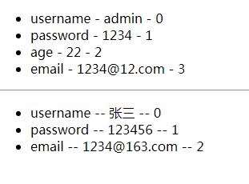

#### 显示过滤与排序结果

有时，我们想要显示一个数组的过滤或排序副本，而不实际改变或重置原始数据。在这种情况下，可以创建返回过滤或排序数组的计算属性。

例如：

```js
<li v-for="n in evenNumbers">{{ n }}</li>
```

```js
data: {
  numbers: [ 1, 2, 3, 4, 5 ]
},
computed: {
  evenNumbers: function () {
    return this.numbers.filter(function (number) {
      return number % 2 === 0
    })
  }
}
```

在计算属性不适用的情况下 (例如，在嵌套 `v-for` 循环中) 你可以使用一个 method 方法：

```js
<li v-for="n in even(numbers)">{{ n }}</li>
data: {
  numbers: [ 1, 2, 3, 4, 5 ]
},
methods: {
  even: function (numbers) {
    return numbers.filter(function (number) {
      return number % 2 === 0
    })
  }
}
```

实验示例：

~~~html
<div id="app">
    <ul>
        <li v-for="item in evenNumbers">
            {{item}}
        </li>
    </ul>
    <hr/>
    <ul>
        <li v-for="item in even(numbers)">
            {{item}}
        </li>
    </ul>
</div>
<script>
    var app = new Vue({
        el: '#app',
        data: {
            numbers:[1,2,3,4,5]
        },
        methods: {
            even:function(numbers){
                return numbers.filter(function(item){
                    return item % 2 === 0;
                });
            }
        },
        computed:{
            evenNumbers:function(){
                return this.numbers.filter(function(item){
                    return item % 2 === 0;
                });
            }
        }
    });
</script>
~~~

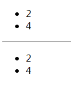

#### 一段取值范围的 `v-for`

`v-for`也可以去整数，在这种情况下，它将重复多次模板。

```html
<div>
  <span v-for="n in 10">{{ n }} </span>
</div>
```


#### `v-for` on  a `<template>`

类似于`v-if`,你也可以利用带有`v-for`的`<template>`渲染多个元素。

~~~html
<div id="app">
    <ul>
        <template v-for="fruit in fruits">
            <li>{{fruit}}</li>
            <li>o_o</li>
        </template>
    </ul>
</div>
<script>
    var app = new Vue({
        el: '#app',
        data: {
            fruits:['apple','orange','pear']
        },
        methods: {}
    });
</script>
~~~

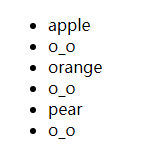

#### v-for with v-if

当它们处于同一个节点，v-for的优先级比v-if更高，这意味着v-if将分别重复运行于每个v-for循环中，当想为仅有的一些项渲染节点时，这种优先级的机制十分有用，如下：

```html
<li v-for="todo in todos" v-if="!todo.isComplete">
  {{ todo }}
</li>
```

上面的代码只传递了未完成的 todos。

而如果你的目的是有条件地跳过循环的执行，那么可以将 `v-if` 置于外层元素 (或 [`)上。如：

```html
<ul v-if="todos.length">
  <li v-for="todo in todos">
    {{ todo }}
  </li>
</ul>
<p v-else>No todos left!</p>
```

**实验示例：**

~~~html
<div id="app">
    <ul>
        <li v-for="todo in todos" v-if="!todo.completed" >
            {{todo}}
        </li>
    </ul>
</div>
<script>
    var app = new Vue({
        el: '#app',
        data: {
            message:'Hello Vue',
            fruits:['apple','orange','pear'],
            todos:[
                {
                    id:1,
                    title:'吃饭',
                    completed:true
                },{
                    id:2,
                    title:'睡觉',
                    completed:false
                },{
                    id:3,
                    title:'打豆豆',
                    completed:false
                },{
                    id:4,
                    title:'写代码',
                    completed:true
                }
            ]
        },
        methods: {}
    });
</script>
~~~

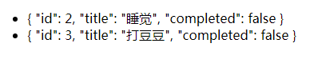


### 事件处理

#### 监听事件

==>> 可以用v-on指令来监听DOM事件，并在触发是运行一些JavaScript代码。

~~~html
<div id="app">
    <!--
        可以用v-on指令来监听DOM事件，并在触发是运行一些JavaScript代码。
    -->
    点击次数：{{times}}<br>
    <button v-on:click="times++" >点击次数+1</button>
</div>
<script>
    var app = new Vue({
        el: '#app',
        data: {
            times:0
        },
        methods: {}
    });
</script>
~~~

#### 事件处理方法

==>然而许多事件处理逻辑会更为复杂，所以直接把JavaScript代码写在v-on指定是不可行的，因此v-on还可以接受一个需要调用的方法名称。

~~~html
<div id="app">
    <!--
        然而许多事件处理逻辑会更为复杂，所以直接把JavaScript代码写在v-on指定是不可行的，
        因此v-on还可以接受一个需要调用的方法名称。
    -->
    <button v-on:click="showMessage">点击显示Message</button>
</div>
<script>
    var app = new Vue({
        el: '#app',
        data: {
        },
        methods: {
            showMessage:function(){
                alert('Hello Vuejs');
            },
        }
    });
</script>
~~~

#### 内联处理器中的方法

==>除了直接绑定到一个方法，也可以在内联JavaScript语句中调用方法。

==>有时也需要在内联语句处理器中访问原始的DOM事件，可以使用特殊变量$event把它传入方法。

~~~html
<div id="app">
    <!--
        除了直接绑定到一个方法，也可以在内联JavaScript语句中调用方法。
    -->
    <button v-on:click="say('Hi')" >sayHi</button>
    <button v-on:click="say('Hello')" >sayHello</button>

    <!--
        有时也需要在内联语句处理器中访问原始的DOM事件，可以使用特殊变量$event把它传入方法。
    -->
    <button v-on:click="showMessageAndEvent('Hello Vuejs',$event)">点击</button>
</div>
<script>
    var app = new Vue({
        el: '#app',
        data: {
        },
        methods: {
            say:function(message){
                alert(message);// Hi or Hello
            },
            showMessageAndEvent:function(message,event){
                alert(message);//Hello Vuejs
                alert(event.target.tagName);//BUTTON
            }
        }
    });
</script>
~~~

#### 事件修饰符

(后面三部分来源于官网)

在事件处理程序中调用 `event.preventDefault()` 或 `event.stopPropagation()` 是非常常见的需求。尽管我们可以在方法中轻松实现这点，但更好的方式是：方法只有纯粹的数据逻辑，而不是去处理 DOM 事件细节。

为了解决这个问题，Vue.js 为 `v-on` 提供了**事件修饰符**。之前提过，修饰符是由点开头的指令后缀来表示的。

- `.stop`
- `.prevent`
- `.capture`
- `.self`
- `.once`
- `.passive`

```html
<!-- 阻止单击事件继续传播 -->
<a v-on:click.stop="doThis"></a>

<!-- 提交事件不再重载页面 -->
<form v-on:submit.prevent="onSubmit"></form>

<!-- 修饰符可以串联 -->
<a v-on:click.stop.prevent="doThat"></a>

<!-- 只有修饰符 -->
<form v-on:submit.prevent></form>

<!-- 添加事件监听器时使用事件捕获模式 -->
<!-- 即元素自身触发的事件先在此处理，然后才交由内部元素进行处理 -->
<div v-on:click.capture="doThis">...</div>

<!-- 只当在 event.target 是当前元素自身时触发处理函数 -->
<!-- 即事件不是从内部元素触发的 -->
<div v-on:click.self="doThat">...</div>
```

使用修饰符时，顺序很重要；相应的代码会以同样的顺序产生。因此，用 `v-on:click.prevent.self` 会阻止**所有的点击**，而 `v-on:click.self.prevent` 只会阻止对元素自身的点击。

> **2.1.4 新增**

```html
<!-- 点击事件将只会触发一次 -->
<a v-on:click.once="doThis"></a>
```

不像其它只能对原生的 DOM 事件起作用的修饰符，`.once` 修饰符还能被用到自定义的[组件事件](https://cn.vuejs.org/v2/guide/components-custom-events.html)上。如果你还没有阅读关于组件的文档，现在大可不必担心。

> **2.3.0 新增**

Vue 还对应 [`addEventListener` 中的 `passive` 选项](https://developer.mozilla.org/en-US/docs/Web/API/EventTarget/addEventListener#Parameters)提供了 `.passive` 修饰符。

```html
<!-- 滚动事件的默认行为 (即滚动行为) 将会立即触发 -->
<!-- 而不会等待 `onScroll` 完成  -->
<!-- 这其中包含 `event.preventDefault()` 的情况 -->
<div v-on:scroll.passive="onScroll">...</div>
```

这个 `.passive` 修饰符尤其能够提升移动端的性能。

不要把 `.passive` 和 `.prevent` 一起使用，因为 `.prevent` 将会被忽略，同时浏览器可能会向你展示一个警告。请记住，`.passive` 会告诉浏览器你*不*想阻止事件的默认行为。

#### 按键修饰符

在监听键盘事件时，我们经常需要检查常见的键值。Vue 允许为 `v-on` 在监听键盘事件时添加按键修饰符：

```html
<!-- 只有在 `keyCode` 是 13 时调用 `vm.submit()` -->
<input v-on:keyup.13="submit">
```

记住所有的 `keyCode` 比较困难，所以 Vue 为最常用的按键提供了别名：

```html
<!-- 同上 -->
<input v-on:keyup.enter="submit">

<!-- 缩写语法 -->
<input @keyup.enter="submit">
```

全部的按键别名：

- `.enter`
- `.tab`
- `.delete` (捕获“删除”和“退格”键)
- `.esc`
- `.space`
- `.up`
- `.down`
- `.left`
- `.right`

可以通过全局 `config.keyCodes` 对象[自定义按键修饰符别名](https://cn.vuejs.org/v2/api/#keyCodes)：

```html
// 可以使用 `v-on:keyup.f1`
Vue.config.keyCodes.f1 = 112
```

##### 自动匹配按键修饰符

> 2.5.0 新增

你也可直接将 [`KeyboardEvent.key`](https://developer.mozilla.org/en-US/docs/Web/API/KeyboardEvent/key/Key_Values) 暴露的任意有效按键名转换为 kebab-case 来作为修饰符：

```html
<input @keyup.page-down="onPageDown">
```

在上面的例子中，处理函数仅在 `$event.key === 'PageDown'` 时被调用。

有一些按键 (`.esc` 以及所有的方向键) 在 IE9 中有不同的 `key` 值, 如果你想支持 IE9，它们的内置别名应该是首选。

#### 系统修饰键

> 2.1.0 新增

可以用如下修饰符来实现仅在按下相应按键时才触发鼠标或键盘事件的监听器。

- `.ctrl`
- `.alt`
- `.shift`
- `.meta`

> 注意：在 Mac 系统键盘上，meta 对应 command 键 (⌘)。在 Windows 系统键盘 meta 对应 Windows 徽标键 (⊞)。在 Sun 操作系统键盘上，meta 对应实心宝石键 (◆)。在其他特定键盘上，尤其在 MIT 和 Lisp 机器的键盘、以及其后继产品，比如 Knight 键盘、space-cadet 键盘，meta 被标记为“META”。在 Symbolics 键盘上，meta 被标记为“META”或者“Meta”。

例如：

```html
<!-- Alt + C -->
<input @keyup.alt.67="clear">

<!-- Ctrl + Click -->
<div @click.ctrl="doSomething">Do something</div>
```

请注意修饰键与常规按键不同，在和 `keyup` 事件一起用时，事件触发时修饰键必须处于按下状态。换句话说，只有在按住 `ctrl` 的情况下释放其它按键，才能触发 `keyup.ctrl`。而单单释放 `ctrl` 也不会触发事件。如果你想要这样的行为，请为 `ctrl` 换用 `keyCode`：`keyup.17`。

##### `.exact` 修饰符

> 2.5.0 新增

`.exact` 修饰符允许你控制由精确的系统修饰符组合触发的事件。

```html
<!-- 即使 Alt 或 Shift 被一同按下时也会触发 -->
<button @click.ctrl="onClick">A</button>

<!-- 有且只有 Ctrl 被按下的时候才触发 -->
<button @click.ctrl.exact="onCtrlClick">A</button>

<!-- 没有任何系统修饰符被按下的时候才触发 -->
<button @click.exact="onClick">A</button>
```

##### 鼠标按钮修饰符

> 2.2.0 新增

- `.left`
- `.right`
- `.middle`

这些修饰符会限制处理函数仅响应特定的鼠标按钮。


### 计算属性与监听器
使用计算属性
1.不用让模板逻辑太重
2.解决性能问题

计算属性是vue的一大特色：

- 该成员是一种带有行为的属性，但是在使用的时候必须当做属性来使用。
- 它相比方法(methods)的优势就在于会缓存计算的结果，效率很高。
- 计算属性只能当成属性来使用，不能用于事件处理函数。
- 计算属性相当于对某个功能丰富的一个代理，本身不存储值

#### 基础例子

~~~html
<div id="app">
    原始信息：{{message}}
    <br/>
    调用翻转函数后的信息：{{reverseMessageFunc()}}
    <br/>
    计算翻转后的信息：{{reverseMessage}}
</div>
<script>
    var app = new Vue({
        el: '#app',
        data: {
            message:'Hello'
        },
        methods: {
            reverseMessageFunc:function(){
                /*
                * message.split('');[ 'h', 'e', 'l', 'l', 'o' ]
                * message.split('').reverse();[ 'o', 'l', 'l', 'e', 'h' ]
                * message.split('').reverse().join(''); olleh
                * */
                return this.message.split('').reverse().join('');
            }
        },
        computed:{
            reverseMessage:function(){
                return this.message.split('').reverse().join('');
            }
        }
    });
</script>
~~~

结果：

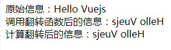

注意：

~~~xml
可以像绑定普通属性一样在模板中绑定计算属性。Vue 知道 vm.reversedMessage依赖于 vm.message，因此
当 vm.message 发生改变时，所有依赖 vm.reversedMessage 的绑定也会更新。而且最妙的是我们已经以声明的方
式创建了这种依赖关系：计算属性的 getter 函数是没有副作用 (side effect) 的，这使它更易于测试和理解。 
~~~


#### 计算属性缓存VS方法

~~~html
<div id="app">
    当前时间：{{now}}
    <br/>
    使用Methods获取时间:{{timeMethods()}}
    <br/>
    使用Computed获取时间:{{timeComputed}}

</div>
<script>
    var app = new Vue({
        el: '#app',
        data: {
            now:1
        },
        methods: {
            timeMethods:function(){
                return Date.now()+this.now;
            }
        },
        computed:{
            timeComputed:function(){
                return Date.now()+this.now;
            }
        }
    });
</script>
~~~

效果图：

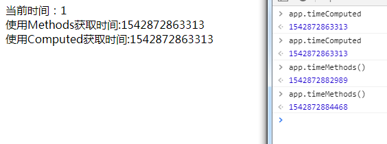


虽然我们可以使用函数调用来实现与计算属性同样的效果，但是不同的是，**计算属性是基于它们的依赖进行缓存的**。只在相关依赖发生变化的时候它们才会重新求值，这就意味着只要 `message` 还没有发生改变，多次访问 `reversedMessage` 计算属性会立即返回之前的计算结果，而不必再次执行函数。 

这也同样意味着下面的计算属性将不再更新，因为 `Date.now()` 不是响应式依赖：

```js
computed: {
  now: function () {
    return Date.now()
  }
}
```

相比之下，每当触发重新渲染时，调用方法将**总会**再次执行函数。

**我们为什么需要缓存？**假设我们有一个性能开销比较大的计算属性 **A**，它需要遍历一个巨大的数组并做大量的计算。然后我们可能有其他的计算属性依赖于 **A** 。如果没有缓存，我们将不可避免的多次执行 **A** 的 getter！如果你不希望有缓存，请用方法来替代。


#### 计算属性VS侦听器

~~~html
<div id="app">
    姓名：{{fullName}}
    姓名：{{name}}
</div>
<script>
    var app = new Vue({
        el: '#app',
        data: {
            firstName:'zhang',
            lastName:'san',
            fullName:'zhang san'
        },
        methods: {},
        computed: {
            name:function(){
                return this.firstName + this.lastName;
            }
        },
        watch: {
            firstName:function(val){
                this.fullName = val+this.lastName;
            },
            lastName:function(val){
                this.fullName = this.firstName+val;
            }
        }
    });
</script>
~~~

从上述例子可以看出，虽然计算属性 与帧听器都可以达到相同的目标，但是造成了很多重复代码的出现。


#### 计算属性的setter

~~~html
<div id="app">
    firstName:{{firstName}}
    <br/>
    lastName:{{lastName}}
    <br/>
    fullName:{{fullName}}
</div>
<script>
    var app = new Vue({
        el: '#app',
        data: {
            firstName:'zhang',
            lastName:'san'
        },
        methods: {

        },
        computed: {
            fullName:{
                get:function(){
                    return this.firstName + ' ' + this.lastName;
                },
                set:function(full){
                    var names = full.split(' ');
                    this.firstName = names[0];
                    this.lastName = names[names.length-1];
                }
            }
        },
        watch: {}
    });
</script>
~~~

效果：

- 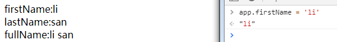

- 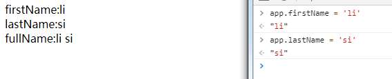
- 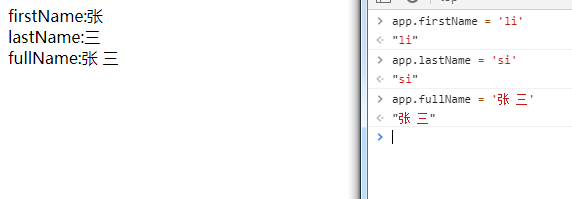


**总结：**有上述实验结果可以看出，修改firstName或lastName的时候会影响到fullName，同时当我们改变fullName的时候，firstName和lastName也会进行相应的变化。

#### 使用计算属性实现搜索框模糊匹配

~~~html
<!DOCTYPE html>
<html>
<head lang="en">
    <meta charset="UTF-8">
    <title></title>
    <script src="node_modules/vue/dist/vue.min.js"></script>
</head>
<body>
<div id="app">
    <input v-model="key" type="text"/><button @click="search">搜索</button>
    <br/>
    性别：
    <input type="radio" name="gender" value="" v-model="picker" checked /> 全部
    <input type="radio" name="gender" value="男" v-model="picker" /> 男
    <input type="radio" name="gender" value="女" v-model="picker" /> 女
    <br/>
    <table>
        <thead>
        <th>id</th>
        <th>姓名</th>
        <th>性别</th>
        </thead>
        <tbody>
            <tr v-for="item in filterUsers">
                <td>{{item.id}}</td>
                <td>{{item.name}}</td>
                <td>{{item.gender}}</td>
            </tr>
        </tbody>
    </table>
</div>

<script>

    var users = [
        {
            id:1,
            name:'Jack',
            gender:'男'
        },{
            id:2,
            name:'Tom',
            gender:'男'
        },{
            id:3,
            name:'Bob',
            gender:'男'
        },{
            id:4,
            name:'Lily',
            gender:'女'
        },{
            id:5,
            name:'lucy',
            gender:'女'
        }
    ];

    var app = new Vue({
        el: '#app',
        data: {
            users:users,
            keyword:'',
            key:'',
            picker:''
        },
        methods: {
            search:function(){
                this.keyword = this.key;
            }
        },
        computed:{
            filterUsers:function(){
                var k = this.keyword.trim().toLowerCase();
                var p = this.picker;
                return this.users.filter(function(item){
                    return item.name.toLowerCase().includes(k) && item.gender.includes(p);
                });
                /**简写方式*/
               /* return this.users.filter(
                                item => item.name.includes(this.keyword) && item.gender.includes(this.picker)
                );*/
            }
        }
    });
</script>
</body>
</html>
~~~

效果图：

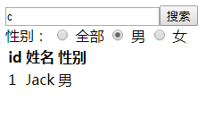


### 组件

#### 组件的概念

- 模块化是一种思想，一种构建方式，把一种很复杂的事物拆分成一个一个小模块，然后通过某种特定的方式把这些小模块组织到一起相互协作完成这个复杂的功能。
- 在程序中也是一样的，之前学习的JavaScript模块化，不要在一个文件中写大量的代码。
- 在vue中，组件就是用来封装视图的，说白了就是封装HTML。
- 组件思想其实就是把一个很大的复杂的web页面视图给拆分成一个一个的组件视图，然后利用某种特定的方式组织到一起，完成完整的web应用构建。
  - HTML结构
  - CSS样式
  - JavaScript行为
- 为什么把视图进行组件化拆分成一块一块的呢？
  - 开发效率,便于人员分工
  - 可维护性
  - 可重用性


#### 组件的组织

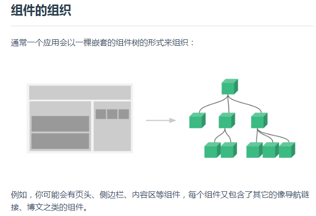


#### 使用组件

组件的定义方式分为两种，全局定义和局部定义：

- 全局组件定义在全局，在任意组件中都可以直接使用。
- 局部组件定义在组件内部，只能在当前组件使用。
- 建议把通用的组件定义在全局，把不通用的组件定义为局部。


#### 全局注册

到目前为止，我们只用过 `Vue.component` 来创建组件：

```
Vue.component('my-component-name', {
  // ... 选项对象 ...
})
```

这些组件是**全局注册的**。也就是说它们在注册之后可以用在任何新创建的 Vue 根实例 (`new Vue`) 的模板中。比如：

```
Vue.component('component-a', { /* ... */ })
Vue.component('component-b', { /* ... */ })
Vue.component('component-c', { /* ... */ })

new Vue({ el: '#app' })

<div id="app">
  <component-a></component-a>
  <component-b></component-b>
  <component-c></component-c>
</div>
```

在所有子组件中也是如此，也就是说这三个组件*在各自内部*也都可以相互使用。


#### 局部注册

全局注册往往是不够理想的。比如，如果你使用一个像 webpack 这样的构建系统，全局注册所有的组件意味着即便你已经不再使用一个组件了，它仍然会被包含在你最终的构建结果中。这造成了用户下载的 JavaScript 的无谓的增加。

在这些情况下，你可以通过一个普通的 JavaScript 对象来定义组件：

```
var ComponentA = { /* ... */ }
var ComponentB = { /* ... */ }
var ComponentC = { /* ... */ }

```

然后在 `components` 选项中定义你想要使用的组件：

```
new Vue({
  el: '#app',
  components: {
    'component-a': ComponentA,
    'component-b': ComponentB
  }
})
```

对于 `components` 对象中的每个属性来说，其属性名就是自定义元素的名字，其属性值就是这个组件的选项对象。

注意**局部注册的组件在其子组件中不可用**。例如，如果你希望 `ComponentA` 在 `ComponentB` 中可用，则你需要这样写：

```
var ComponentA = { /* ... */ }

var ComponentB = {
  components: {
    'component-a': ComponentA
  },
  // ...
}
```

或者如果你通过 Babel 和 webpack 使用 ES2015 模块，那么代码看起来更像：

```
import ComponentA from './ComponentA.vue'

export default {
  components: {
    ComponentA
  },
  // ...
}
```

注意在 ES2015+ 中，在对象中放一个类似 `ComponentA` 的变量名其实是 `ComponentA: ComponentA` 的缩写，即这个变量名同时是：

- 用在模板中的自定义元素的名称
- 包含了这个组件选项的变量名

#### 全局组件与局部组件的demo

~~~html
<div id="app">
    <global-component></global-component>
</div>
<script>
    Vue.component('global-component',{
        template:'<div>' +
        '<div>global component</div>' +
        '<global-component2></global-component2>' +
        '<hello></hello>' +
        '</div>',
        /*组件实例选项（局部组件），components用来定义组件，这种方式定义的组件只能在当前组件中使用*/
        components:{
            /** hello:是组件的名称，{}是一个对象，对象中配置组件的选项*/
            hello:{
                template:'<div>Hello Component</div>'
            }
        }
    });
  	//全局组件
    Vue.component('global-component2',{
        template:'<div>global2 component</div>'
    });
    var app = new Vue({
        el: '#app',
        data: {},
        methods: {}
    });
</script>
~~~

组件一般分为两种：

- 通用的组件，例如轮播图、评分

- 涉及业务的组件，不通用

  所以涉及业务的尽量定义成局部，不要污染全局


#### 组件的模板

template有三种形式：

- 可以是字面量字符串，缺点是没有高亮，内置在JavaScript中，写起来麻烦

  ~~~js
  //1.先定义（注册）组件
  //2.使用(相当于扩展html标签)
  // 注意：只能有一个根元素，不能写成template:'<div>My Component</div><h1>Hello vue</h1>'
  Vue.component('my-component',{
      template:'<div>My Component</div>'
  });
  ~~~

- 可以写在script标签中，虽然解决了高亮的问题，但是也麻烦。

  ~~~html
  <!--
      把type 指定为 text/x-template
      起一个id
  -->
  <script type="text/x-template" id="hello-world-template">
      <p>Hello Vue.js</p>
  </script>

  <div id="app">
      <my-component></my-component>
  </div>

  <script>
      Vue.component('my-component',{
          template:'#hello-world-template'
      });
      var app = new Vue({
          el: '#app',
          data: {},
          methods: {}
      });
  </script>
  ~~~

- 以上方式都不好，我们最终解决方案是使用vue的.vue单文件组件来写。

  - 但是要想使用这种方式必须结合一些构建工具


#### 组件的作用域

- 组件是独立的作用域，就像我们Node中的JavaScript模块一样，独立的。
  - 组件无法访问外部作用域成员
  - 外部作用域也无法访问组件内部成员
- 组件其实就是一个特殊的Vue实例，可以有自己的data，methods，computed，watch等等选项。
- 组件的data必须是方法，方法中返回一个对象作为组件的data

~~~html
<div id="app">
    <my-component></my-component>
</div>
<script>
    //1.先定义（注册）组件
    //2.使用(相当于扩展html标签)
//      注意：只能有一个根元素，不能写成template:'<div>My Component</div><h1>Hello vue</h1>'
    Vue.component('my-component',{
//        template:'<div>My Component</div>'
        template:'<div>' +
        '<div>My Component</div>' +
        '<h2>{{message}}</h2>' +
        '<input type="checkbox" v-model="seen" >' +
        '<div v-if="seen" class="box"></div>' +
        '</div>',
        data:function(){
            return {
                message:'Component Data',
                seen:true
            }
        }
    });
    var app = new Vue({
        el: '#app',
        data: {},
        methods: {}
    });
</script>
~~~


#### 组件组合

组件设计初衷就是要配合使用的，最常见的就是形成父子组件的关系：组件 A 在它的模板中使用了组件 B。它们之间必然需要相互通信：父组件可能要给子组件下发数据，子组件则可能要将它内部发生的事情告知父组件。然而，通过一个良好定义的接口来尽可能将父子组件解耦也是很重要的。这保证了每个组件的代码可以在相对隔离的环境中书写和理解，从而提高了其可维护性和复用性。 在 Vue 中，父子组件的关系可以总结为 prop 向下传递，事件向上传递。父组件通过 prop 给子组件下发数据，子组件通过事件给父组件发送消息。看看它们是怎么工作的。


### 组件通信

在树形结构里面，组件之间有几种典型的关系：父子关系、兄弟关系、没有直接关系。

相应地，组件之间有以下几种典型的通讯方案：

- 直接的父子关系
- 直接的父子关系
- 没有直接关系
- 利用 cookie 和 localstorage 进行通讯。
- 利用 session 进行通讯。
- 父传子 Props Down
- 子通知父亲 Events Up
- 通过 ref 父亲直接访问子组件
  - 给子组件起个 ref
  - 然后在父组件中通过 `this.$refs.子组件ref名`
- 子组件可以在内部通过 `this.$parent` 直接访问父组件
- 非父子关系
  - 事件通信 Events Bus
  - Global Bus
- 集中式状态管理 Vuex

#### 父子组件通信：Props Down

~~~html
父组件：<div v-bind=""></div>
子组件：prop属性接收
~~~


##### TodoMVC中的父组件给子组件传值

###### 父组件

~~~js
//采用组件化构建方式
//一个应用被一个根组件管理起来
// 根组件中嵌套了子组件
// 子组件还可以嵌套自己的子子组件
;(function(){
	var todos = [
		{
			id:1,
			title:'吃饭',
			completed:false
		},{
			id:2,
			title:'睡觉',
			completed:true
		},{
			id:3,
			title:'打豆豆',
			completed:false
		}
	];
	 window.App = {
		template:'<div id="app" >' +
		'<section class="todoapp">' +
		'<todo-header></todo-header>' +
		'<todo-list v-bind:todos="todos" ></todo-list>' +
		'<todo-footer></todo-footer>' +
		'</section>' +
		'<app-footer></app-footer>' +
		'</div>',
		 /**
		  * 1.在父组件中通过子组件标签声明属性的方式。
		  * 	注意：只有v-bind才可以传递动态数据
		  * 2.在子组件中声明props接收父组件传递给自己的数据
		  * 3.就可以在子组件中进行使用了（只能使用，不能重新赋值）
		  * */
		components:{
			'todo-header':todoHeader,
			'todo-list':todoList,
			'todo-footer':todoFooter,
			'app-footer':appFooter
		},
		 data:function(){
			 return {
				 todos:todos
			 }
		 }
	};
})();
~~~


###### 子组件

~~~js
;(function(){
    var temp =

    '<section class="main">'+
        '<input id="toggle-all" class="toggle-all" type="checkbox">'+
        '<label for="toggle-all">Mark all as complete</label>'+
        '<ul class="todo-list">'+
            '<li v-bind:class="{completed:item.completed}" v-for="item in todos" >'+
                '<div class="view">'+
                    '<input class="toggle" type="checkbox" v-model="item.completed">'+
                    '<label>{{item.title}}</label>'+
                    '<button class="destroy"></button>'+
                '</div>'+
                '<input class="edit" value="Create a TodoMVC template">'+
            '</li>'+
        '</ul>'+
    '</section>';

    window.todoList = {
        template:temp,
        //子组件就会把父组件在标签中声明的foo拿到
      	//组件接收到的props数据就可以像访问data中的数据一样直接获取
        props:['todos']
    }
})();
~~~


**1. 在父组件中通过子组件标签属性传递数据**

```html
<child message="hello!"></child>
```

**2. 在子组件显式地用 props 选项声明它预期的数据并使用**

```js
Vue.component('child', {
  // 声明 props
  props: ['message'],
  // 就像 data 一样，prop 也可以在模板中使用
  // 同样也可以在 vm 实例中通过 this.message 来使用
  template: '<span>{{ message }}</span>'
});
```

##### camelCase vs. kebab-case

HTML 特性是不区分大小写的。所以，当使用的不是字符串模板时，camelCase (驼峰式命名) 的 prop 需要转换为相对应的 kebab-case (短横线分隔式命名)。

```
Vue.component('child', {
  // 在 JavaScript 中使用 camelCase
  props: ['myMessage'],
  template: '<span>{{ myMessage }}</span>'
});

```

```
<!-- 在 HTML 中使用 kebab-case -->
<child my-message="hello!"></child>

```

如果你使用字符串模板，则没有这些限制。

##### 动态 Prop

与绑定到任何普通的 HTML 特性相类似，我们可以用 `v-bind` 来动态地将 `prop` 绑定到父组件的数据。每当父组件的数据变化时，该变化也会传导给子组件：

```
<div>
  <input v-model="parentMsg">
  <br>
  <child v-bind:my-message="parentMsg"></child>
</div>
```

你也可以使用 v-bind 的缩写语法：

```
<child :my-message="parentMsg"></child>

```

##### 字面量语法 vs 动态语法

初学者常犯的一个错误是使用字面量语法传递数值：

```
<!-- 传递了一个字符串 "1" -->
<comp some-prop="1"></comp>
```

因为它是一个字面量 prop，它的值是字符串 "1" 而不是一个数值。如果想传递一个真正的 JavaScript 数值，则需要使用 v-bind，从而让它的值被当作 JavaScript 表达式计算：

```
<!-- 传递真正的数值 -->
<comp v-bind:some-prop="1"></comp>
```

##### 单向数据流

Prop 是单向绑定的：**当父组件的属性变化时，将传导给子组件，但是反过来不会**。这是为了防止子组件无意间修改了父组件的状态，来避免应用的数据流变得难以理解。

另外，每次父组件更新时，子组件的所有 prop 都会更新为最新值。这意味着你不应该在子组件内部改变 prop。如果你这么做了，Vue 会在控制台给出警告。

在两种情况下，我们很容易忍不住想去修改 prop 中数据：

1. Prop 作为初始值传入后，子组件想把它当作局部数据来用
2. Prop 作为原始数据传入，由子组件处理成其它数据输出

对这两种情况，正确的应对方式是：

**1. 定义一个局部变量，并用 prop 的值初始化它：**

```js
props: ['initialCounter'],
data: function () {
  return { counter: this.initialCounter }
}
```

**2. 定义一个计算属性，处理 prop 的值并返回：**

```js
// ...
props: ['size'],
computed: {
  normalizedSize: function () {
    return this.size.trim().toLowerCase()
  }
},
```

!> 注意在 JavaScript 中对象和数组是引用类型，指向同一个内存空间，**如果 prop 是一个对象或数组，在子组件内部改变它会影响父组件的状态**。

- 引用类型可以修改，但是重新赋值会报错

注意：引用类型数据虽然可以修改，但是不建议使用，因为这样就违背了vue组件的通信原则，通信原则是单向数据流。

- 父组件数据的改变可以影响到孩子
  - 但是孩子不要去修改父组件的数据，因为当组件嵌套过深时，在子组件中修改父组件的数据可能让你的应用数据流变得非常复杂，而难以理解。
    - 所以：即便是引用类型有这样的特征，也不要这样使用。

##### Prop 验证

我们可以为组件的 prop 指定验证规则。如果传入的数据不符合要求，Vue 会发出警告。这对于开发给他人使用的组件非常有用。 要指定验证规则，需要用对象的形式来定义 prop，而不能用字符串数组：

```js
Vue.component('example', {
  props: {
    // 基础类型检测 (`null` 指允许任何类型)
    propA: Number,
    // 可能是多种类型
    propB: [String, Number],
    // 必传且是字符串
    propC: {
      type: String,
      required: true
    },
    // 数值且有默认值
    propD: {
      type: Number,
      default: 100
    },
    // 数组/对象的默认值应当由一个工厂函数返回
    propE: {
      type: Object,
      default: function () {
        return { message: 'hello' }
      }
    },
    // 自定义验证函数
    propF: {
      validator: function (value) {
        return value > 10
      }
    }
  }
});
```

`type` 可以是下面原生构造器：

- String
- Number
- Boolean
- Function
- Object
- Array
- Symbol

type 也可以是一个自定义构造器函数，使用 instanceof 检测。

当 prop 验证失败，Vue 会抛出警告 (如果使用的是开发版本)。 注意 prop 会在组件实例创建之前进行校验，所以在 default 或 validator 函数里，诸如 data、computed 或 methods 等实例属性还无法使用。

------

#### 父子组件通信：Events Up

我们知道，父组件使用 prop 传递数据给子组件。但子组件怎么跟父组件通信呢？这个时候 Vue 的自定义事件系统就派得上用场了。

1. **在子组件中调用 $emit() 方法发布一个事件**

   （只负责发布，即相当于广播消息，谁要接收，谁就负责订阅并进行相应的操作即可）

```js
Vue.component('button-counter', {
  template: '<button v-on:click="incrementCounter">{{ counter }}</button>',
  data: function () {
    return {
      counter: 0
    }
  },
  methods: {
    incrementCounter: function () {
      this.counter += 1
      // 发布一个名字叫 increment 的事件
      this.$emit('increment',counter)
    }
  },
});
```

**2. 在父组件中提供一个子组件内部发布的事件处理函数**

```
new Vue({
  el: '#counter-event-example',
  data: {
    total: 0
  },
  methods: {
    incrementTotal: function (counter) {
      this.total += 1
    }
  }
});
```

**3. 在使用子组件的模板的标签上订阅子组件内部发布的事件**

```
<div id="counter-event-example">
  <p>{{ total }}</p>
  <!-- 
    订阅子组件内部发布的 increment 事件
    当子组件内部 $commit('increment') 发布的时候，就会调用到父组件中的 incrementTotal 方法
  -->
  <button-counter v-on:increment="incrementTotal"></button-counter>
</div>

```

##### 给组件绑定原生事件

有时候，你可能想在某个组件的根元素上监听一个原生事件。可以使用 `v-on` 的修饰符 `.native`。例如：

```html
<my-component v-on:click.native="doTheThing"></my-component>
```

##### `.sync` 修饰符

在一些情况下，我们可能会需要对一个 prop 进行“双向绑定”。 就是当一个子组件改变了一个带 .sync 的 prop 的值时，这个变化也会同步到父组件中所绑定的值。

在使用子组件的时候加上 `.sync` 修饰符：

```html
<comp :foo.sync="bar"></comp>
```

在子组件内部更新 `foo` 的值时，显示的触发一个更新事件：

```
this.$emit('update:foo', newValue);

```


##### TodoMVC中子组件向父组件通信

（通知与订阅，相当于消息队列一样）

步骤：

- 1.在父组件中定义一个方法

  ~~~js
  methods:{
     //1.在父组件中定义一个方法（纯业务方法）
     //2.在子组件内部调用父组件的方法
     //		在子组件中发布一个自定义事件，通知父组件可以去执行相应操作
     //3.在父组件使用子组件的标签上订阅子组件内部发布的事件
     addTodo:function(titleText){
         titleText = titleText.trim();
         if(!titleText.length){
             return;
         }
         var  todos = this.todos;
         todos.push({
             id:todos[todos.length-1].id>=0?todos[todos.length-1].id+1:1,
             title:titleText,
             completed:false
         });

     }
  }
  ~~~

- 2.在子组件中调用父组件的方法（即：在子组件中发布一个自定义事件，通知父组件去执行相应的操作）

  ~~~js
  methods:{
      handleKeydown:function(e){
          var target = e.target;
          var value = target.value.trim();
          if(!value.length){
              return;
          }
          //数据准备好了,可以交给父组件使用了。
          //第一个参数是自定义事件名称
          //第二个参数是事件参数
          this.$emit('add',value);
          e.target.value = '';
      }
  }
  ~~~

- 3.在父组件使用子组件的标签上订阅子组件内部发布的事件

  ~~~html
  <todo-header v-on:add="addTodo"></todo-header>
  ~~~

子组件不关心父组件的业务及订阅与否。


完整代码：

app.js

~~~js
//采用组件化构建方式
//一个应用被一个根组件管理起来
// 根组件中嵌套了子组件
// 子组件还可以嵌套自己的子子组件
;(function(){
	var todos = [
		{
			id:1,
			title:'吃饭',
			completed:false
		},{
			id:2,
			title:'睡觉',
			completed:true
		},{
			id:3,
			title:'打豆豆',
			completed:false
		}
	];
	 window.App = {
		template:'<div id="app" >' +
		'<section class="todoapp">' +
		'<todo-header v-on:add="addTodo" ></todo-header>' +
		'<todo-list v-bind:todos="todos" ></todo-list>' +
		'<todo-footer></todo-footer>' +
		'</section>' +
		'<app-footer></app-footer>' +
		'</div>',
		 /**
		  * 1.在父组件中通过子组件标签声明属性的方式。
		  * 	注意：只有v-bind才可以传递动态数据
		  * 2.在子组件中声明props接收父组件传递给自己的数据
		  * 3.就可以在子组件中进行使用了（只能使用，不能修改）
		  * */
		components:{
			'todo-header':todoHeader,
			'todo-list':todoList,
			'todo-footer':todoFooter,
			'app-footer':appFooter
		},
		 data:function(){
			 return {
				 todos:todos
			 }
		 },
		 methods:{
			 //1.在父组件中定义一个方法（纯业务方法）
			 //2.在子组件内部调用父组件的方法
			 //		在子组件中发布一个自定义事件，通知父组件可以去执行相应操作
			 //3.在父组件使用子组件的标签上订阅子组件内部发布的事件
			 addTodo:function(titleText){
				 titleText = titleText.trim();
				 if(!titleText.length){
					 return;
				 }
				 var  todos = this.todos;
				 todos.push({
					 id:todos[todos.length-1].id>=0?todos[todos.length-1].id+1:1,
					 title:titleText,
					 completed:false
				 });

			 }
		 }
	};
})();
~~~

todo-header.js

~~~js
;(function(){
    var temp = '<header class="header">'+
        '<h1>todos</h1>'+
        '<input' +
        '@keydown.enter="handleKeydown" class="new-todo" placeholder="What needs to be done?" autofocus>'+
        '</header>';
    window.todoHeader = {
        template:temp,
        methods:{
            handleKeydown:function(e){
                var target = e.target;
                var value = target.value.trim();
                if(!value.length){
                    return;
                }
                //数据准备好了,可以交给父组件使用了。
                //第一个参数是自定义事件名称
                //第二个参数是事件参数
                this.$emit('add',value);
                e.target.value = '';

            }
        }
    }
})();
~~~


#### 非父子组件通信：Event Bus

有时候，非父子关系的两个组件之间也需要通信。在简单的场景下，可以使用一个空的 Vue 实例作为事件总线：

```js
var bus = new Vue();
```

```js
// 触发组件 A 中的事件
bus.$emit('id-selected', 1);
```

```js
 // 在组件 B 创建的钩子中监听事件
bus.$on('id-selected', function (id) {
  // ...
});
```


#### 专业组件通信大杀器：Vuex

在复杂的情况下，我们应该考虑使用专门的 [状态管理模式](https://vuex.vuejs.org/zh-cn/)。


#### 自定义组件实例

~~~html
<head lang="en">
    <meta charset="UTF-8">
    <title></title>
    <script src="node_modules/vue/dist/vue.min.js"></script>
    <style>
        .box{
            width: 100px;
            height: 100px;
            background-color: pink;
        }
    </style>
</head>
<body>

<!--
    把type 指定为 text/x-template
    起一个id
-->
<script type="text/x-template" id="hello-world-template">
    <p>Hello Vue.js</p>
</script>

<div id="app">
    <my-component></my-component>
    <hr/>
    <my-component></my-component><!--重用组件-->
</div>

<script>

    //1.先定义（注册）组件
    //2.使用(相当于扩展html标签)
//      注意：只能有一个根元素，不能写成template:'<div>My Component</div><h1>Hello vue</h1>'
    Vue.component('my-component',{
//        template:'<div>My Component</div>'
        template:'<div>' +
        '<div>My Component</div>' +
        '<h2>{{message}}</h2>' +
        '<input type="text" v-model="message" >' +
        '<button @click="showMessage">点击弹出自己的message</button>' +
        '<input type="checkbox" v-model="seen" >' +
        '<div v-if="seen" class="box"></div>' +
        '</div>',
        data:function(){
            return {
                message:'Component Data',
                seen:true
            }
        },
        methods:{
            showMessage:function(){
                window.alert(this.message);//Component Data
            }
        }
    });
    var app = new Vue({
        el: '#app',
        data: {
            message:'app'
        },
        methods: {}
    });
</script>
~~~

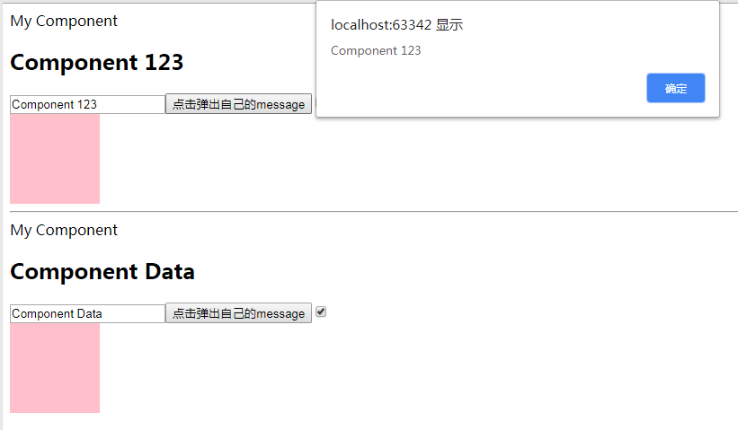


#### TodoMVC 进行组件化拆分案例

##### todoHeader.js

~~~js
/**
 * Created by ooyhao on 2018/11/24.
 */
;(function(){

    var temp = '<header class="header">'+
        '<h1>todos</h1>'+
        '<input class="new-todo" placeholder="What needs to be done?" autofocus>'+
        '</header>';

    window.todoHeader = {
        template:temp
    }
})();
~~~


##### todoList.js

~~~js
/**
 * Created by ooyhao on 2018/11/24.
 */
;(function(){
    var temp = '<section class="main">'+
        '<input id="toggle-all" class="toggle-all" type="checkbox">'+
    '<label for="toggle-all">Mark all as complete</label>'+
    '<ul class="todo-list">'+
    '<li class="completed">'+
        '<div class="view">'+
            '<input class="toggle" type="checkbox" checked>'+
                '<label>Taste JavaScript</label>'+
                '<button class="destroy"></button>'+
            '</div>'+
            '<input class="edit" value="Create a TodoMVC template">'+
            '</li>'+
            '<li>'+
                '<div class="view">'+
                    '<input class="toggle" type="checkbox">'+
                        '<label>Buy a unicorn</label>'+
                        '<button class="destroy"></button>'+
                    '</div>'+
                    '<input class="edit" value="Rule the web">'+
                    '</li>'+
                '</ul>'+
            '</section>';

    window.todoList = {
        template:temp
    }
})();
~~~


##### todoFooter.js

~~~js
/**
 * Created by ooyhao on 2018/11/24.
 */
;(function(){
    var temp = '<footer class="footer">'+
    '<span class="todo-count"><strong>0</strong> item left</span>'+
    '<ul class="filters">'+
    '<li>'+
        '<a class="selected" href="#/">All</a>'+
    '</li>'+
    '<li>'+
    '<a href="#/active">Active</a>'+
    '</li>'+
    '<li>'+
        '<a href="#/completed">Completed</a>'+
    '</li>'+
    '</ul>'+
    '<button class="clear-completed">Clear completed</button>'+
    '</footer>';

    window.todoFooter = {
        template:temp
    }

})();
~~~


##### appFooter.js

~~~js
/**
 * Created by ooyhao on 2018/11/24.
 */

;(function(){
    var temp = '<footer class="info">'+
        '<p>双击编译一个todo</p>'+
   ' <p>Template by <a href="http://sindresorhus.com">Sindre Sorhus</a></p>'+
    '<p>Created by <a href="http://todomvc.com">you</a></p>'+
    '<p>Part of <a href="http://todomvc.com">TodoMVC</a></p>'+
    '</footer>';

    window.appFooter = {
        template:temp
    }

})();1
~~~


##### app.js

~~~js
//采用组件化构建方式
//一个应用被一个根组件管理起来
// 根组件中嵌套了子组件
// 子组件还可以嵌套自己的子子组件
;(function(){
	 window.app = {
		template:'<div>' +
		'<section class="todoapp">' +
		'<todo-header></todo-header>' +
		'<todo-list></todo-list>' +
		'<todo-footer></todo-footer>' +
		'</section>' +
		'<app-footer></app-footer>' +
		'</div>',
		components:{
			'todo-header':todoHeader,
			'todo-list':todoList,
			'todo-footer':todoFooter,
			'app-footer':appFooter
		}
	};
})();

~~~


##### main.js（组件启动的入口）

~~~js
/**
 * Created by ooyhao on 2018/11/24.
 */

new Vue({
    el:'#app',
    components:{
        app:app
    }
});
~~~


##### index.html

~~~html
<!doctype html>
<html lang="en">
	<head>
		<meta charset="utf-8">
		<meta name="viewport" content="width=device-width, initial-scale=1">
		<title>Template • TodoMVC</title>
		<link rel="stylesheet" href="node_modules/todomvc-common/base.css">
		<link rel="stylesheet" href="node_modules/todomvc-app-css/index.css">
		<!-- CSS overrides - remove if you don't need it -->
		<link rel="stylesheet" href="css/app.css">

	</head>
	<body>
		<div id="app">
			<!--入口-->
			<app></app>
		</div>
		<script src="node_modules/vue/dist/vue.min.js" ></script>
		<script src="js/todo-header.js"></script>
		<script src="js/todo-list.js"></script>
		<script src="js/todo-footer.js"></script>
		<script src="js/app-footer.js"></script>
		<!--<script src="node_modules/todomvc-common/base.js"></script>-->
		<script src="js/app.js"></script>
		<script src="main.js"></script>
	</body>
</html>
~~~

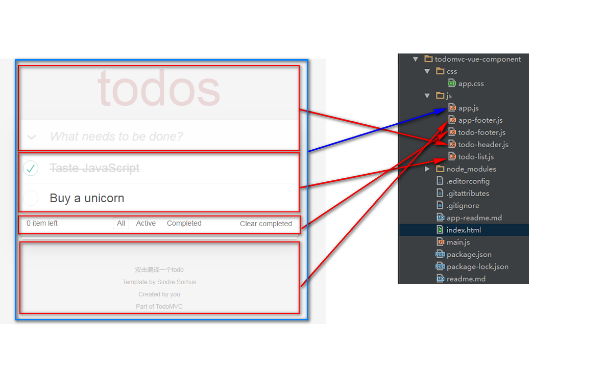

上述拆分方法会多嵌套出一层<div></div>

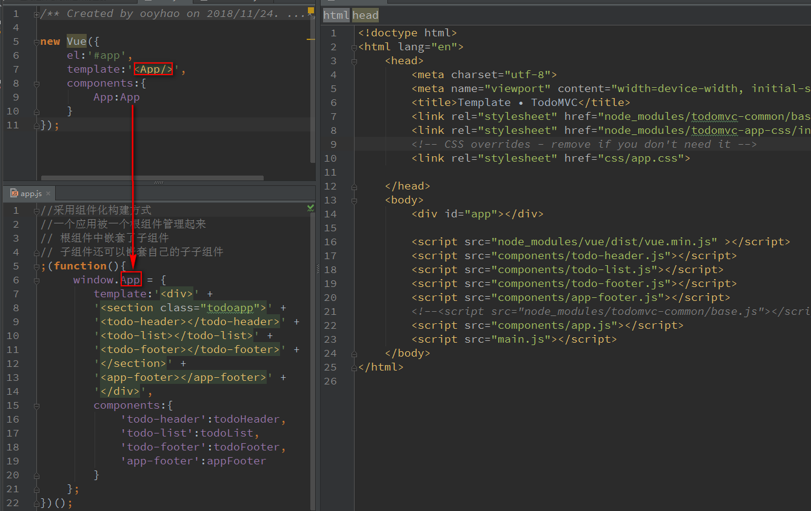

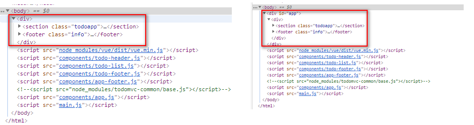


~~~html
<div id="app"></div>
声明入口节点，告诉Vue把组件渲染到这里，最终实例的template会把入口节点给替换掉
~~~

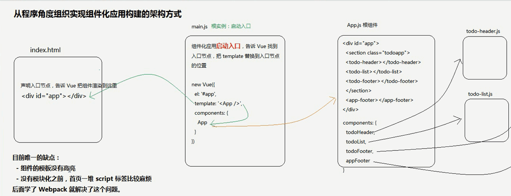


### ElementUI

#### 安装

~~~shell
npm install element-ui -S
~~~

#### demo

~~~html
<!DOCTYPE html>
<html>
<head lang="en">
    <meta charset="UTF-8">
    <title></title>
    <script src="node_modules/vue/dist/vue.min.js"></script>
    <link rel="stylesheet" href="node_modules/element-ui/lib/theme-chalk/index.css"/>
    <script src="node_modules/element-ui/lib/index.js"></script>
</head>
<body>

<!--
    导入Vue，因为是基于vue开发
    导入Element-ui
-->
<div id="app">

    <!--
        组建的封装就是封装了一个自定义HTML标签
    -->
    <el-rate
            v-model="value"
            show-text>
    </el-rate>
    <button @click="handleClick" >弹出用户评分</button>

    <hr/>
    <template>
        <div class="block">
            <span class="demonstration">默认</span>
            <el-date-picker
                    v-model="value1"
                    type="date"
                    placeholder="选择日期">
            </el-date-picker>
        </div>
    </template>
    {{value1}}

</div>

<script>
    var app = new Vue({
        el: '#app',
        data: {
            value: 4,
            value1: ''

        },
        methods: {
            handleClick:function(){
                window.alert(this.value);
            }
        }
    });
</script>
</body>
</html>
~~~

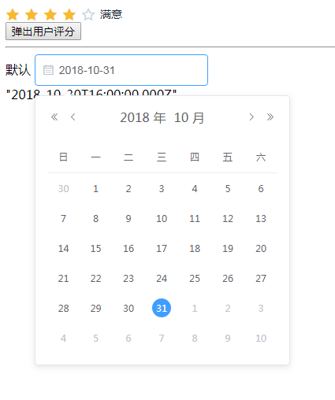


