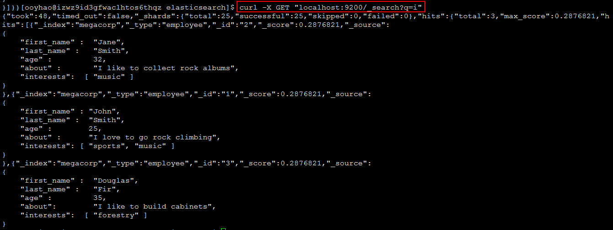

elasticsearch


索引操作

~~~shell
查询所有的索引
curl -X GET "localhost:9200/_cat/indices?v" 查询所有的索引index

创建一个customer 索引
curl -X PUT "localhost:9200/customer/_doc/1?pretty" -H'Content-Type: application/json' 
-d'{"name": "John Doe"}' 

查询id为1的文档
curl -X GET "localhost:9200/customer/_doc/1?pretty"

删除索引
curl -X DELETE "localhost:9200/customer?pretty"
~~~

API的格式

~~~shell
curl -X <HTTP Verb>/<Index>/<Type>/<ID>
~~~


文档操作


查询文档

~~~shell
curl -X GET "localhost:9200/customer/_doc/1?pretty"
~~~


添加文档

~~~shell
curl -X PUT "localhost:9200/customer/_doc/1?pretty" -H'Content-Type:application/json' 
-d'{"name":"ouYang"}'
	
注意：-H后面与-d后面不留空格
~~~

更新文档

~~~shell
修改字段的值
curl -X POST "localhost:9200/customer/_doc/1/_update?pretty" 
-H'Content-Type:application/json' -d'{"doc":{"name":"张三"}}'


更新文档是添加新的字段
curl -X POST "localhost:9200/customer/_doc/1/_update?pretty" 
-H'Content-Type:application/json' -d'{"script":"ctx._source.age += 5"}'


利用脚本进行执行
curl -X POST "localhost:9200/customer/_doc/1/_update?pretty" -H'Content-Type:application/json' 
-d'{"script":"ctx._source.age += 5"}'

~~~

删除文档

~~~shell
curl -X DELETE "localhost:9200/customer/_doc/1?pretty"
~~~

批处理

除了对单个的文档进行索引、更新和删除，Elasticsearch也提供了相关操作的批处理功能，这些批处理功能通过使用_bulk API实现。通过批处理可以非常高效的完成多个文档的操作，同时可以减少不必要的网络请求。 


查询

空查询

~~~shell
curl -X GET "localhost:9200/_search"
~~~

多索引（Index）库，所类型(Type)表

~~~shell
/_search
在所有的索引中搜索所有的类型

/gb/_search
在 gb 索引中搜索所有的类型

/gb,us/_search
在 gb 和 us 索引中搜索所有的文档

/g*,u*/_search
在任何以 g 或者 u 开头的索引中搜索所有的类型

/gb/user/_search
在 gb 索引中搜索 user 类型

/gb,us/user,tweet/_search
在 gb 和 us 索引中搜索 user 和 tweet 类型

/_all/user,tweet/_search
在所有的索引中搜索 user 和 tweet 类型
~~~

分页

在之前的 空搜索 中说明了集群中有 14 个文档匹配了（empty）query 。 但是在 `hits` 数组中只有 10 个文档。如何才能看到其他的文档？

和 SQL 使用 `LIMIT` 关键字返回单个 `page` 结果的方法相同，Elasticsearch 接受 `from` 和 `size` 参数：

- `size`

  显示应该返回的结果数量，默认是 `10`

- `from`

  显示应该跳过的初始结果数量，默认是 `0`

如果每页展示 5 条结果，可以用下面方式请求得到 1 到 3 页的结果：

```
GET /_search?size=5
GET /_search?size=5&from=5
GET /_search?size=5&from=10
```


查询在tweet类型中tweet字段包含elasticsearch单词的所有文档

~~~shell
curl -X GET "localhost:9200/_all/tweet/_search?q=tweet:elasticsearch"

~~~

 

_all 字段

~~~shell
curl -X GET "localhost:9200/_search?q=i"
~~~



当索引一个文档的时候，Elasticsearch 取出所有字段的值拼接成一个大的字符串，作为 `_all` 字段进行索引。例如，当索引这个文档时：

```
{
    "tweet":    "However did I manage before Elasticsearch?",
    "date":     "2014-09-14",
    "name":     "Mary Jones",
    "user_id":  1
}
```

这就好似增加了一个名叫 `_all` 的额外字段：

```
"However did I manage before Elasticsearch? 2014-09-14 Mary Jones 1"
```

除非设置特定字段，否则查询字符串就使用 `_all` 字段进行搜索。

> 在刚开始开发一个应用时，`_all` 字段是一个很实用的特性。之后，你会发现如果搜索时用指定字段来代替 `_all` 字段，将会更好控制搜索结果。当 `_all` 字段不再有用的时候，可以将它置为失效，正如在 [元数据: _all 字段](https://www.elastic.co/guide/cn/elasticsearch/guide/current/root-object.html#all-field) 中所解释的。


## 最重要的查询

虽然 Elasticsearch 自带了很多的查询，但经常用到的也就那么几个。我们将在 [深入搜索](https://www.elastic.co/guide/cn/elasticsearch/guide/current/search-in-depth.html) 章节详细讨论那些查询的细节，接下来我们对最重要的几个查询进行简单介绍。

### match_all 查询

`match_all` 查询简单的 匹配所有文档。在没有指定查询方式时，它是默认的查询：

```
{ "match_all": {}}
```

拷贝为 CURL[在 SENSE 中查看](http://localhost:5601/app/sense/?load_from=https://www.elastic.co/guide/cn/elasticsearch/guide/current/snippets/054_Query_DSL/70_Match_all_query.json) 

它经常与 filter 结合使用--例如，检索收件箱里的所有邮件。所有邮件被认为具有相同的相关性，所以都将获得分值为 `1` 的中性 `_score`。

### match 查询

无论你在任何字段上进行的是全文搜索还是精确查询，`match` 查询是你可用的标准查询。

如果你在一个全文字段上使用 `match` 查询，在执行查询前，它将用正确的分析器去分析查询字符串：

```
{ "match": { "tweet": "About Search" }}
```

拷贝为 CURL[在 SENSE 中查看](http://localhost:5601/app/sense/?load_from=https://www.elastic.co/guide/cn/elasticsearch/guide/current/snippets/054_Query_DSL/70_Match_query.json) 

如果在一个精确值的字段上使用它， 例如数字、日期、布尔或者一个 `not_analyzed` 字符串字段，那么它将会精确匹配给定的值：

```
{ "match": { "age":    26           }}
{ "match": { "date":   "2014-09-01" }}
{ "match": { "public": true         }}
{ "match": { "tag":    "full_text"  }}
```

拷贝为 CURL[在 SENSE 中查看](http://localhost:5601/app/sense/?load_from=https://www.elastic.co/guide/cn/elasticsearch/guide/current/snippets/054_Query_DSL/70_Match_query.json) 


对于精确值的查询，你可能需要使用 filter 语句来取代 query，因为 filter 将会被缓存。接下来，我们将看到一些关于 filter 的例子。

不像我们在 [*轻量* 搜索](https://www.elastic.co/guide/cn/elasticsearch/guide/current/search-lite.html) 章节介绍的字符串查询（query-string search）， `match` 查询不使用类似 `+user_id:2 +tweet:search` 的查询语法。它只是去查找给定的单词。这就意味着将查询字段暴露给你的用户是安全的；你需要控制那些允许被查询字段，不易于抛出语法异常。

### multi_match 查询

`multi_match` 查询可以在多个字段上执行相同的 `match` 查询：

```
{
    "multi_match": {
        "query":    "full text search",
        "fields":   [ "title", "body" ]
    }
}
```

拷贝为 CURL[在 SENSE 中查看](http://localhost:5601/app/sense/?load_from=https://www.elastic.co/guide/cn/elasticsearch/guide/current/snippets/054_Query_DSL/70_Multi_match_query.json) 

### range 查询

`range` 查询找出那些落在指定区间内的数字或者时间：

```
{
    "range": {
        "age": {
            "gte":  20,
            "lt":   30
        }
    }
}
```

拷贝为 CURL[在 SENSE 中查看](http://localhost:5601/app/sense/?load_from=https://www.elastic.co/guide/cn/elasticsearch/guide/current/snippets/054_Query_DSL/70_Range_filter.json) 

被允许的操作符如下：

- `gt`

  大于

- `gte`

  大于等于

- `lt`

  小于

- `lte`

  小于等于

### term 查询

`term` 查询被用于精确值 匹配，这些精确值可能是数字、时间、布尔或者那些 `not_analyzed` 的字符串：

```
{ "term": { "age":    26           }}
{ "term": { "date":   "2014-09-01" }}
{ "term": { "public": true         }}
{ "term": { "tag":    "full_text"  }}
```

拷贝为 CURL[在 SENSE 中查看](http://localhost:5601/app/sense/?load_from=https://www.elastic.co/guide/cn/elasticsearch/guide/current/snippets/054_Query_DSL/70_Term_filter.json) 

`term` 查询对于输入的文本不 *分析* ，所以它将给定的值进行精确查询。

### terms 查询

`terms` 查询和 `term` 查询一样，但它允许你指定多值进行匹配。如果这个字段包含了指定值中的任何一个值，那么这个文档满足条件：

```
{ "terms": { "tag": [ "search", "full_text", "nosql" ] }}
```

拷贝为 CURL[在 SENSE 中查看](http://localhost:5601/app/sense/?load_from=https://www.elastic.co/guide/cn/elasticsearch/guide/current/snippets/054_Query_DSL/70_Terms_filter.json) 

和 `term` 查询一样，`terms` 查询对于输入的文本不分析。它查询那些精确匹配的值（包括在大小写、重音、空格等方面的差异）。

### exists 查询和 missing 查询

`exists` 查询和 `missing` 查询被用于查找那些指定字段中有值 (`exists`) 或无值 (`missing`) 的文档。这与SQL中的 `IS_NULL` (`missing`) 和 `NOT IS_NULL` (`exists`) 在本质上具有共性：

```
{
    "exists":   {
        "field":    "title"
    }
}
```

拷贝为 CURL[在 SENSE 中查看](http://localhost:5601/app/sense/?load_from=https://www.elastic.co/guide/cn/elasticsearch/guide/current/snippets/054_Query_DSL/70_Exists_filter.json) 

这些查询经常用于某个字段有值的情况和某个字段缺值的情况。


