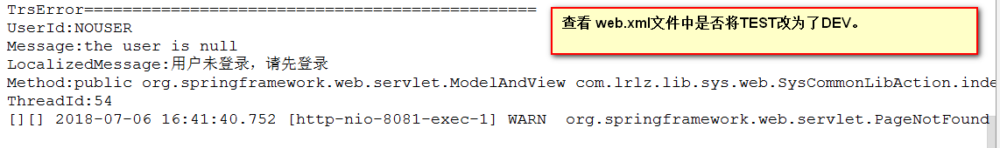
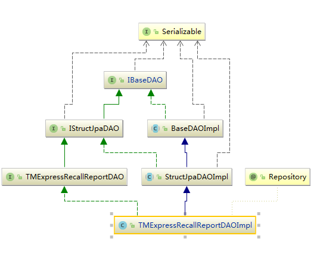
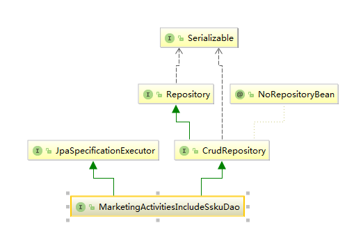
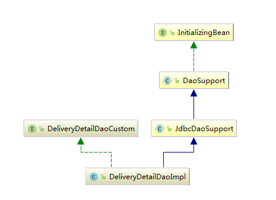

### 1.工作笔记

#### 1.DEV 和 TEST 异常




#### 2.TomCat  报 PermGen space 错误

```java
Intellij Idea中运行tomcat 报內存溢出 PermGen space 解决方案
在Run/Debug configuration 的你要运行行的tomcat里面的 
vm options里面输入
	-server -XX:PermSize=1024M -XX:MaxPermSize=1024m
```


#### 3.提取字符串中的所有的中文字符

```java
String reg = "[^\u4e00-\u9fa5]";
address = address.replaceAll(reg, "");
```


#### 4.从SVN或Git上拉项目


#### 5.从SVN更新，提交项目


#### 6.从Git上更新，提交项目


#### 7.[IntelliJ IDEA添加过滤文件或目录](https://www.cnblogs.com/jeffen/p/6024839.html) 

1. Settings→Editor→File Types

2. 在下方的忽略文件和目录（Ignore files and folders）中添加自己需要过滤的内容

   下图为我自己添加过滤的内容，例如：*.iml;*.idea;*.gitignore;*.sh;*.classpath;*.project;*.settings;target; 

   

#### 8.IDEA 快捷键

```
ctrl + shift + 鼠标左键点击  进入相应的实现类
double shift 查询文件
ctrl + e 查看最近文件
ctrl + d 复制当前行
Alt + F1，查找代码所在位置
ctrl + shift + F 全项目搜索
ctrl + F 当前页搜索
Alt + 1 切换项目目录窗口显示
ctrl + alt + v 快速接收函数返回值
ctrl + shift + v 粘贴最近所复制的信息
alt + 4 显示run控制台窗口
alt + 5 显示debug控制台窗口
ctrl + alt + L 格式化代码
ctrl + F9  编译项目
```

#### 9.如何查看tomcat 运行时的报错信息


#### 10.自动生成代码时遇到的问题


Idea进行打包的时候不会将XML文件打进到classes文件夹下，所以需要自己手动复制到classes文件夹下，再运行。

#### 11,项目结构

第一种:使用JPA，



第二种:使用Spring Data JPA 



第三种：使用Spring JdbcTemplate




### 2.工作Code

#### 1.从字符串中识别中文地址

```java

import java.util.ArrayList;
import java.util.List;

/* 

今天，我们就来聊聊怎么从一个字符串中解析出解析出地址。
有以下几种情况：
1.标准的格式 省，市，区...
2.没有省，但是包含以下级别地区的关键字。
3.没有省，也没有其他地区的关键字。

我们可以使用indexOf("关键字")来进行定位，但是不能保证地址中不包括关键字，比如袁州区，州和区都是关键字。
这样就需要把所有的关键字全部定位出来，再使用subString()来进行截取，然后进行判断是否为地址。

第一种情况：以下没有提出解决方式，稍微简单，可发邮件至ooyhao1996@163.com。
第二种情况：以下代码主要解决此类情况
第三种情况：则只需要使用下列代码取第一级方式即可获取所有地区。

完整解决方式+源码，请联系我。

*/

/**
 * 需求分析：
 * 1.字符串中的关键字有 [市, 区, 县, 旗, 盟, 州, 岛]
 * 2.第一级 ：省 区（自治区、特别行政区）市（直辖市）
 * 3.通过逐字递增和逐字递减的方式搜索第一级，
 * 4.根据第一级查询第二级[市, 区, 县, 盟, 州, 岛]
 * 5.根据第二级查询第三级[市, 区, 县, 旗, 盟, 州, 岛]
 * 6.只有三级地址完全匹配才进行相应的操作，否则，不操作。
 *
 */
public class AnalysisAddressUtils{

    /**
     * 获取第一个级地址最大的长度
     * @param addrList 需要检查的地址集合
     * @return
     */
    
    public static int getMaxLen(List<String> addrList){
        if(addrList == null || addrList.size() == 0){
            return -1;
        }
        int maxLen = addrList.get(0).length();
        for(int i = 1; i < addrList.size(); i++){
            if(maxLen < addrList.get(i).length()){
                maxLen = addrList.get(i).length();
            }
        }
        return maxLen;
    }

    /**
     * 从地址中获取第一级地址
     *
     * @param addrList 第一级地址的数组
     * @param address 要搜索第一级地址的字符串
     * @param len 第一级地址的最大长度
     * @return 数组 两个元素：
     *              1.搜索到的地区在地区数组中的位置 -1表示不存在
     *              2.地区的长度
     */
    
    public static int[] getFirstLevel(List<String> addrList, String address,int len){
        //记录第一级处于数组中的位置，0--N表示存在，-1表示不存在
        int index = -1;
        //记录临时子字符串
        String s = "";
        //记录截取的最大长度
        int maxLen = 0;
        //用来标识是否有匹配的标志位
        boolean flag = false;

        for(int i = 2; i <= len && i <= address.length(); i++){
            //获取一个子串
            s = address.substring(0,i);
            for(int j = 0; j < addrList.size(); j++){
                //判断省市的数组中是否包含该字符串
                if(addrList.get(j).contains(s)){
                    index = j;
                    maxLen = i;
                    flag = true;
                    break;
                }else{
                    flag = false;
                }
            }
            if(!flag){
                break;
            }
        }
        //返回，第一个标识处于第一级数组中的位置，第二个标识截取的最大长度
        return new int []{index,maxLen};
    }


    /**
     *
     * @param addrList 地区数组
     * @param address 需要检测的字符串
     * @param keywords 地区关键字数组
     * @return 返回数组，两个元素，
     *              1.地区在地区数组中的位置 -1表示不存在
     *              2.地区的长度
     */

    public static int [] getSecondOrThirdLevel(List<String> addrList, String address,String[] keywords){
        //记录第二,三级处于数组中的位置，0--N表示存在，-1表示不存在
        int index = -1;
        //记录临时子字符串
        String subString = "";
        //记录截取的最大长度
        int maxLen = 0;
        //用来记住关键字下标的集合
        List<Integer> keywordIndexs = new ArrayList<Integer>();

        //1.获取字符串中所有匹配关键字的下标
        for(int i = 0; i < address.length(); i++){
            //获取字符串中的每一个字
            String str = (char)address.charAt(i)+"";
            //用每一个字去与关键字匹配，使用集合记住每一个下标
            for(int j = 0; j < keywords.length; j++){
                //循环关键字列表
                if(str.equals(keywords[j])){
                    //如果当前字符与关键字中的字符相同，则记录其下标
                    keywordIndexs.add(i);
                }
            }
        }

        //2.通过记录好的下标，去二级数组中查询
        for(int i = 0; i<keywordIndexs.size(); i++){
            //遍历下标集合,获取子串
            subString = address.substring(0,keywordIndexs.get(i)+1);
            for(int j = 0; j < addrList.size(); j++){
                if(subString.equals(addrList.get(j))){
                    index = j;
                    maxLen = keywordIndexs.get(i)+1;
                }
            }
        }
        return new int[]{index,maxLen};
    }


    
public Map<String,String> analysisAddress(String address){
        System.out.println(address);
        Map<String, String> addressInfo = new HashMap<String, String>();
        addressInfo.put("addressMessage","解析异常");
        //1.firstLevel 地址第一级
        //2.secondLevel 地址第二级
        //3.thirdLevel 地址第三级
        //4.addressMessage 信息：解析成功|解析异常

        List<Map<String, String>> lists = dataCache.analysisAddress();
        List<Map<String, String>> firstLevel = new ArrayList<Map<String,String>>();
        List<String> firstLevelName = new ArrayList<String>();
        //将第一级的地区筛选出来
        for(Map<String,String> map : lists){
            if(Integer.valueOf(map.get("parentId")) == 1){
                //System.out.println(map);
                firstLevel.add(map);
                firstLevelName.add(map.get("countyName"));
            }
        }
        String[] secondLevelKeywords = {"市", "区", "县", "盟", "州", "岛"};
        String[] thirdLevelKeywords = {"市", "区", "县", "旗", "盟", "州", "岛"};
        int maxLen = AnalysisAddressUtils.getMaxLen(firstLevelName);
        int[] results = AnalysisAddressUtils.getFirstLevel(firstLevelName,address,maxLen);
        if(results[0] > -1){
            //表示第一级正确的解析出。
            addressInfo.put("firstLevel",firstLevelName.get(results[0]));
            addressInfo.put("firstLevelId",firstLevel.get(results[0]).get("regionId"));
            addressInfo.put("addressMessage","解析成功");
            System.out.println(firstLevelName.get(results[0])+" -> length:"+results[1]);
            address = address.substring(results[1]);
            //System.out.println(address);
            //根据第一级id查询出第二级的地区列表
            int parentId = Integer.valueOf(firstLevel.get(results[0]).get("regionId"));
            //System.out.println(parentId);
            List<Map<String, String>> secondLevels = getRegionByParentId(lists,parentId);

            //获取指定第二级地区名称列表
            List<String> secondLevelName = new ArrayList<String>();
            for(Map<String,String> m : secondLevels){
                secondLevelName.add(m.get("countyName"));
            }
            //得到第二级解析结果
            results = AnalysisAddressUtils.getSecondOrThirdLevel(secondLevelName,address,secondLevelKeywords);

            if(results[0] > -1){
                //表示第二级正确解析出
                addressInfo.put("secondLevel",secondLevelName.get(results[0]));
                addressInfo.put("secondLevelId",secondLevels.get(results[0]).get("regionId"));
                addressInfo.put("addressMessage","解析成功");
                System.out.println(secondLevelName.get(results[0])+" -> length:"+results[1]);
                address = address.substring(results[1]);
                //System.out.println(address);
                //根据第二级id查询出第三级的地区列表
                parentId = Integer.valueOf(secondLevels.get(results[0]).get("regionId"));
                //System.out.println(parentId);
                List<Map<String, String>> thirdLevels = getRegionByParentId(lists,parentId);
                //获取指定第三级地区名称列表
                List<String> thirdLevelName = new ArrayList<String>();
                for(Map<String,String> m : thirdLevels){
                    thirdLevelName.add(m.get("countyName"));
                }
                //得到第三级解析结果
                results = AnalysisAddressUtils.getSecondOrThirdLevel(thirdLevelName,address,thirdLevelKeywords);
                if(results[0] > -1){
                    //表示第三级正确解析出
                    addressInfo.put("thirdLevel",thirdLevelName.get(results[0]));
                    addressInfo.put("thirdLevelId",thirdLevels.get(results[0]).get("regionId"));
                    addressInfo.put("addressMessage","解析成功");
                    System.out.println(thirdLevelName.get(results[0])+" -> length:"+results[1]);
                }

            }
        }

        return addressInfo;

    }

    //根据父级id查询地区
    public List<Map<String, String>> getRegionByParentId(List<Map<String, String>> address ,int parentId){
        List<Map<String, String>> results = new ArrayList<Map<String,String>>();
        for(int i = 0; i < address.size(); i++){
            if(Integer.valueOf(address.get(i).get("parentId")) == parentId){
                results.add(address.get(i));
            }
        }
        return results;
    }
}
```

#### 2.ModelAndView

```
@RequestMapping("/show1") 
public ModelAndView show1(HttpServletRequest request, 
       HttpServletResponse response) throws Exception { 
       ModelAndView mav = new ModelAndView("/demo2/show");
       mav.addObject("account", "account -1"); 
       return mav; 
   } 
   
通过ModelAndView构造方法可以指定返回的页面名称，也可以通过setViewName()方法跳转到指定的页面 , 使用addObject()设置需要返回的值，addObject()有几个不同参数的方法，可以默认和指定返回对象的名字。 调用addObject()方法将值设置到一个名为ModelMap的类属性，ModelMap是LinkedHashMap的子类， 具体请看类。
```


#### 3.查询参数说明

```java
url : 'getWskuPagebillNativePagination?mapCondition["int-eq-t.order_type"]=bc',

规则：
int 数字类型。
str 字符串
eq 精确匹配
like 模糊匹配
t 表名
order_type 列名
```

#### 4.JPA方法说明

```
1.queryNativePagination  使用带分页的查询  super.queryNativePagination(sql,paginationCondition);
	返回是一个分页对象  PaginationRepertory<Map<String, Object>>

2.queryNativeList 不带分页的查询  super.queryNativeList(sql,paginationCondition.getListParam());
	返回一个List<Map<String, Object>> 对象。

3.//这里用于后续的查询where语句
String whereSQL = Finder.whereSql(paginationCondition.getMapCondition(),paginationCondition.getListParam());
	查询是的参数封装
	
4. 返回的是一个对象的List集合。
public class WareStockTaskDAOImpl extends StructJpaDAOImpl<WareStockTask,java.lang.Long> implements WareStockTaskDAO {
	public List<WareStockTask> getList() {
		return super.queryList(" from WareStockTask  where flag=0 order by id  ", null);
	}
}


```


#### 5.保留小数 

```
//"0.0000"表示保留四位小数
DecimalFormat d = new DecimalFormat("0.0000");

//js 保留四位小数
var totalMoney = document.getElementById(“totalMoney”); 
//表示将合计金额四舍五入到四位小数 
totalMoney.value.toFixed(4);
```


#### 6.SQL 笔记

```sql
1.条件选择
case when 条件  then  结果1 else 结果2 end；


博客地址：https://www.cnblogs.com/HDK2016/p/8134802.html
--简单Case函数
CASE sex
WHEN '1' THEN '男'
WHEN '2' THEN '女'
ELSE '其他' END

--Case搜索函数
CASE WHEN sex = '1' THEN '男'
WHEN sex = '2' THEN '女'
ELSE '其他' END

2. 去除左右的空格
1.sql trim()函数去掉两头空格
sql语法中没有直接去除两头空格的函数，但有ltrim()去除左空格rtrim()去除右空格。
合起来用就是sql的trim()函数，即select ltrim(rtrim(UsrName))

in | not in 


-- 增加列
alter table ims_wsku_pagebill add column order_type varchar(5) COMMENT '订单类型';
alter table ims_wsku_pagebill_detail add column out_order_no varchar(255) COMMENT '外部单号';


@Override
public int updateConfirmById(Long id) {
    String sql="UPDATE out_auto_returnorder_confirm SET flag=2,modify_time=NOW() WHERE id=?";
    //Constanst.DBTYPE_BEETLE 跨库操作
    return super.updateByDB(Constanst.DBTYPE_BEETLE,sql,id);
}


```

#### 7.去除数据的空格

```java
line_code=line_code.replaceAll("\\s","");
line_code=line_code.replaceAll("\\n","");
line_code=line_code.replaceAll("\u00A0", "");
```


#### 8.DataGrid数据表格初始化不加载数据

```js
	
var firstTime = true;
$("#box").datagrid({

    url:"",

    onBeforeLoad:function(){
        //这里果返回false的话说明不加载，而如果返回的是true的话，则表示加载
        if(firstTime == true){
            firstTime = false;
            return false;
        }
        return true;

    }

});


```

#### 9.将字符串转成包装类型/基本类型

```java
public void test(){
        String s = "123";
        Long aLong = Long.valueOf(s);
        long l = Long.parseLong(s);
    }
```

#### 10.数据加解密

```
解密：
String detail1 = dataSecurity.decryptPub(byId2.getReceiverName(),DataSecurity.TYPE_SIMPLE,-1L,null);

加密：
DSCenter encryptBuyerNick=dataSecurity.encrypt(mergeOrderRefunds.getBuyerNick(),DataSecurity.TYPE_SIMPLE,mergeOrderRefunds.getShopId(),null);
mergeOrderRefunds.setBuyerNick(encryptBuyerNick.getPubCipher());
```

#### 11.easyui numberbox允许输入负值

~~~xml
<th data-options="field:'xiaomiSalePercent',width:120,align:'center',sortable:false,editor:{type:'numberbox',options:{min:0,precision:4}}">店小蜜销售占比(客服)</th>

注意：允许输入负值的话只需要将min属性去除，precision:为小数点后面的位数。
~~~

#### 12.sql如果将小数格式化为指定位数，以及格式化为百分制

~~~java
CONCAT(format(a.xiaomi_sale_percent*100,2),'%')  xiaomiSalePercent
format(a.xiaomi_sale_percent*100,2):
	将指定字段*100之后，格式化为保留两位小数，例：0.1234 ==>12.34
     concat()函数，即在后面拼接一个指定表达式，这里是'%'
    
~~~

#### 13，用字符进行分割拼接字段

~~~sql
select group_concat(reason_value separator ',') from fms_return_reason_info ;

退货退款类型,仓库,仓库-破损,仓库-错发,仓库-少/漏发,延迟发货,产品,产品残次（内件短少/瑕疵）
~~~

#### 14，时间往前后推

~~~java
if(paginationCondition.getCondition().getCreateTime()!=null&&paginationCondition.getCondition().getModifyTime() != null){
    SimpleDateFormat simpleDateFormat = new SimpleDateFormat("yyyy-MM-dd HH:mm:ss");

    String startTime = simpleDateFormat.format(paginationCondition.getCondition().getCreateTime());

    Calendar calendar = Calendar.getInstance();
    calendar.setTime(paginationCondition.getCondition().getModifyTime());
    calendar.add(Calendar.DAY_OF_MONTH,1);//往后推一天
    calendar.add(Calendar.SECOND,-1);
    String endTime = simpleDateFormat.format(calendar.getTime());
    whereSql.append(" and  a.create_time>='"+startTime+"'");
    whereSql.append(" and  a.create_time<='"+endTime+"'");
}
~~~

#### 15.下拉框有没有请选择

~~~java
url:'getSysCommonLibDropDownData?paramsval=sys_ssku_wharehouse|N|0|',//Y表示有请选择，N表示没有请选择
~~~


#### 16. Object-->String, String-->Object

~~~java
//fastjson
//String->Object
JSONObject ton = JSON.parseObject(EntityUtils.toString(response1.getEntity()));
//Object->String
String json = JSON.toJSONString(map);
~~~


#### 17 哪些sql 会引起全盘扫描

覆盖索引是[select](https://baike.baidu.com/item/select/12504672)的数据列只用从索引中就能够取得，不必读取数据行，换句话说查询列要被所建的索引覆盖 

~~~xml
1. select count(*) 会全盘扫描 应该杜绝

2.对于大数据量查询，应先分页，再join,直接join 会损耗集群资源

3.update 不要更新全盘字段

4.or 有时候会引起全局扫描 where a = 1 or b  = 2

5.查询条件中使用了不等于操作符（<>、!=）的select语句执行慢

6.应该尽量避免查询条件使用like

7.查询条件中 有is null select 语句执行慢
~~~

#### 18.开始时间与结束时间限制为一个月之内

~~~html

<tr>
    <td valign="middle">起始时间: </td>
    <td>
        <input type="text" id="oper_effectiveDate" name="effectiveDate"  required="required" style="width:120px;" class="Wdate easyui-validatebox" onclick="WdatePicker({dateFmt:'yyyy-MM-dd',maxDate:'#F{$dp.$D(\'oper_expiryDate\')}'});"/>
    </td>
</tr>
<tr>
    <td valign="middle">结束时间: </td>
    <td>
        <input type="text" id="oper_expiryDate" name="expiryDate"  required="required" 
			style="width:120px;" class="Wdate easyui-validatebox"
               onFocus="WdatePicker({dateFmt:'yyyy-MM-dd',
maxDate:'#F{$dp.$D(\'oper_effectiveDate\',
{d:31})}',minDate:'#F{$dp.$D(\'oper_effectiveDate\')}'})" disabled="disabled"/>
    </td>
</tr>


----------------------------------------
<script>
   $("#select-time").click(function () {
      WdatePicker({
          el: this, //点击对象id，一般可省略el
          lang: 'auto', //语言选择，一般用auto
          dateFmt: 'yyyy-MM-dd HH:mm:ss', //时间显示格式，年月日 时分秒，年月日就是yyyy-MM-dd
          minDate: '#F{$dp.$D(\'inputstarttime\')}', //最小日期
          maxDate: '%y-%M-%d', //最大日期（当前时间）
          readOnly: true, //是否只读
          isShowClear: true, //是否显示“清空”按钮
          isShowOK: true, //是否显示“确定”按钮
          isShowToday: true, //是否显示“今天”按钮
          autoPickDate: true //为false时 点日期的时候不自动输入,而是要通过确定才能输入，为true时 即点击日期即可返回日期值，为null时(推荐使用) 如果有时间置为false 否则置为true
      })
  })
</script>
--------------------------------------------------------
<script>
    $("#select-start-time").click(function () {
        WdatePicker({
            lang: 'auto',
            dateFmt: 'yyyy-MM-dd',
            maxDate: '#F{$dp.$D(\'select-end-time\')||\'%y-%M-%d\'}',
            readOnly: true
        })
    })
    $("#select-end-time").click(function () {
        WdatePicker({
            lang: 'auto',
            dateFmt: 'yyyy-MM-dd',
            minDate: '#F{$dp.$D(\'select-start-time\')}',
            maxDate: '%y-%M-%d',
            readOnly: true
        })
    })
</script>


-----------示例-------------
<!DOCTYPE html>
<html>
<title></title>
<!-- 引入datepicker.css -->
<link rel="stylesheet" type="text/css" href="datepicker/skin/default/datepicker.css">
<!-- 引入easyui.css -->
<link rel="stylesheet" type="text/css" href="jquery-easyui-1.5.5.4/themes/default/easyui.css">
<!-- 使用jQuery操作 -->
<script type="text/javascript" src="jquery-3.3.1.min.js"></script>
<script type="text/javascript" src="jquery-easyui-1.5.5.4/locale/easyui-lang-zh_CN.js"></script>
<script type="text/javascript" src="jquery-easyui-1.5.5.4/jquery.easyui.min.js"></script>
<!-- 使用wdatepicker.js -->
<script type="text/javascript" src="datepicker/WdatePicker.js"></script>


<body>
	<!--  class="Wdate easyui-validbox" -->
	<input required="required" id="start_time" class="Wdate easyui-validatebox" ><br><br>
	<input required="required" id="end_time" class="Wdate easyui-validatebox"  /><br><br>

<script type="text/javascript">
	$("#start_time").click(function () {
		WdatePicker({
			el:this,
			lang:'auto',
			dateFmt:'yyyy-MM-dd HH:mm:ss',
			// minDate:'#F{$dp.$D(\'start_time\')}',
			maxDate: '#F{$dp.$D(\'end_time\')||\'%y-%M-%d %H:%m:%s\'}',
			// maxDate: '#F{$dp.$D(\'end_time\')}',
			readOnly: true
		});
	});

	$("#end_time").click(function () {
		WdatePicker({
			el:this,
			lang:'auto',
			dateFmt:'yyyy-MM-dd HH:mm:ss',
			minDate: '#F{$dp.$D(\'start_time\')}',
			maxDate: '#F{$dp.$D(\'start_time\',{d:+31})}',
			readOnly: true
		});
	});	
</script>
</body>
</html>

~~~

#### 19.判断指定单选框是否被选中

~~~js
beforeSubmit: function() {
    // radio类型，名字为orderType
    var isChecked = $("input[type='radio'][name='orderType']:checked").length == 0;
    if(isChecked){
        $.messager.alert('提示', '请选择模板类型！', 'error');
        return false;
    }
}

~~~

#### 20.EasyUI progress进度条循环

~~~js
//开启 
$.messager.progress({
    title:'执行中',
    msg:'努力上传中...',
    text:'亲，不要着急哦！',
    interval:1000,
});

//关闭
$.messager.progress('close');
~~~


