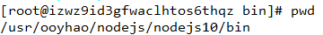
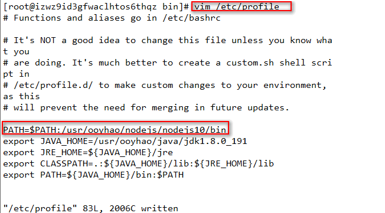
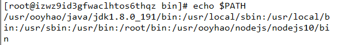
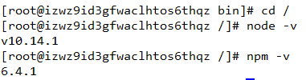
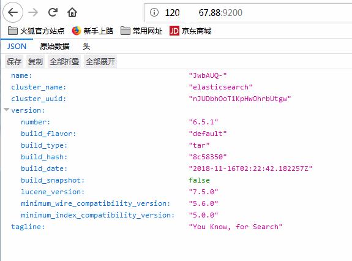
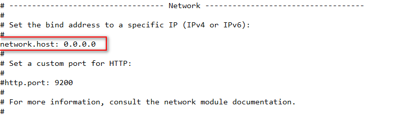
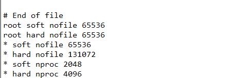
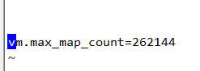

### linux 基本的命令

复制文件：cp

移动文件：mv 目标文件 目标目录

~~~shell
mv elasticsearch-6.5.1.tar.gz ./elasticsearch
~~~

创建文件夹：mkdir 文件夹名字

~~~shell
mkdir redis
~~~


### [linux的zip和unzip用法](https://www.cnblogs.com/dyh-air/articles/9069642.html)

#### linux中提示没有unzip命令解决方法

如果你如法使用unzip命令解压.zip文件，可能是你没有安装unzip软件，下面是安装方法

命令： yum list | grep zip/unzip   #获取安装列表

安装命令： yum install zip    #提示输入时，请输入y；

安装命令：yum install unzip #提示输入时，请输入y；

#### **unzip 和 unzip 解压文件到指定的目录**

  Linux 常用的压缩命令有 gzip 和 zip，两种压缩包的结尾不同：zip 压缩的后文件是 *.zip ，而 gzip 压缩后的文件 *.gz 

相应的解压缩命令则是 gunzip 和 unzip 

gzip 命令： 

~~~shell
gzip test.txt 
~~~

它会将文件压缩为文件 test.txt.gz，原来的文件则没有了，解压缩也一样 

~~~shell
gunzip test.txt.gz 
~~~

它会将文件解压缩为文件 test.txt，原来的文件则没有了，为了保留原有的文件，我们可以加上 -c 选项并利用 linux 的重定向 

~~~shell
gzip -c test.txt > /root/test.gz 
~~~

这样不但可以将原有的文件保留，而且可以将压缩包放到任何目录中，解压缩也一样 

~~~shell
gunzip -c /root/test.gz > ./test.txt 
~~~

zip 命令： 

~~~shell
 zip test.zip test.txt 
~~~

它会将 test.txt 文件压缩为 test.zip ，当然也可以指定压缩包的目录，例如 /root/test.zip 

~~~shell
unzip test.zip 
~~~

它会默认将文件解压到当前目录，如果要解压到指定目录，可以加上 -d 选项 

~~~shell
unzip test.zip -d /root/ 
~~~


### [linux端口开放指定端口的两种方法](https://www.cnblogs.com/DanBrown/p/7921336.html)

重要的事情说三遍,强烈建议使用第二种方法!第二种方法!第二!;

开放端口的方法：

方法一：命令行方式
               1. 开放端口命令： /sbin/iptables -I INPUT -p tcp --dport 8080 -j ACCEPT
               2.保存：/etc/rc.d/init.d/iptables save
               3.重启服务：/etc/init.d/iptables restart
               4.查看端口是否开放：/sbin/iptables -L -n

 方法二：直接编辑/etc/sysconfig/iptables文件
               1.编辑/etc/sysconfig/iptables文件：vi /etc/sysconfig/iptables
                   加入内容并保存：-A RH-Firewall-1-INPUT -m state --state NEW -m tcp -p tcp --dport 8080 -j ACCEPT
               2.重启服务：/etc/init.d/iptables restart
               3.查看端口是否开放：/sbin/iptables -L -n

但是我用方法一一直保存不上，查阅网上发现直接修改文件不需要iptables save，重启下iptables 重新加载下配置。iptables save 是将当前的iptables写入到/etc/sysconfig/iptables。我不save直接restart也不行，所以还是方法二吧

```
chmod u+x *.sh
```


查询端口是否有进程守护用如下命令grep对应端口，如80为端口号
例：netstat -nalp|grep 80


### 在xshell 中安装 rz/sz命令

使用xshell连接linux服务器，可以使用rs/rz 命令.

`sz`：将选定的文件发送（send）到本地机器 
`rz`：运行该命令会弹出一个文件选择窗口，从本地选择文件上传到Linux服务器

安装命令：

```shell
yum install lrzsz
```

从服务器下载文件到客户端：

```shell
sz filename
```

从客户端上传文件到服务器：

```shell
rz  （在弹出框中选中文件，上传文件的用户和组就是当前登录的用户）
```

Xshell设置默认路径： 
右键会话 -> 属性 -> ZMODEM -> 接收文件夹


### 在linux上安装jdk

1.在本机下载好linux版本的jdk，再上传到服务器。

2.使用tar -vxf 进行解压缩

~~~shell
tar -xvf jdk-8u191-linux-x64.tar.gz
~~~

或解压到其他目录

~~~shell
tar -zxvf jdk-8u131-linux-x64.tar.gz -C /usr/lib/jvm
~~~

3.设置环境变量

编辑文件（使用`i`进入编辑模式）

~~~shell
vim /etc/profile
~~~

保存并退出(先按esc键，再按`  wq`退出)

4.在文件的最前面添加：

~~~shell
export JAVA_HOME=/usr/lib/jvm/jdk1.8.0_131  
export JRE_HOME=${JAVA_HOME}/jre  
export CLASSPATH=.:${JAVA_HOME}/lib:${JRE_HOME}/lib  
export  PATH=${JAVA_HOME}/bin:$PATH
~~~

5.使用`java -version`检查是否安装成功


### 在linux上安装nodejs

1.到官网上下载linux的源码包source code （https://nodejs.org/en/download/）并上传

2.使用解压命令解压

~~~shell
tar -xvf node-v10.14.1-linux-x64.tar.xz 
~~~

3.进入到nodejs目录下的bin中执行下面的命令，可以看到版本号。但是不能全局查看

~~~shell
./node -v
~~~

4.因为 /usr/ooyhao/nodejs/nodejs10/bin这个目录是不在环境变量中的，所以只能到该目录下才能node的程序。

如果在其他的目录下执行node命令的话 ，必须通过绝对路径访问才可以的

如果要在任意目录可以访问的话，需要将node 所在的目录，添加PATH环境变量里面，或者通过软连接的形式将node和npm链接到系统默认的PATH目录下的一个

- 4.1软连接方式

~~~xml
在终端执行echo $PATH可以获取PATH变量包含的内容，系统默认的PATH环境变量包括/usr/local/bin:/usr/bin:/bin:/usr/local/sbin:/usr/sbin:/sbin: ，冒号为分隔符。所以我们可以将node和npm链接到/usr/local/bin 目录下如下执行
~~~

~~~shell
ln -s /usr/ooyhao/nodejs/nodejs10/bin/node /usr/local/bin/node
ln -s /usr/ooyhao/nodejs/nodejs10/bin/npm /usr/local/bin/npm
~~~

通过如此，就可以访问Node了，同时node部署也已经完毕。

- 4.2环境变量的方式

4.2.1.在node目录下执行pwd 获取node所在的目录，要把这个目录添加到PATH环境变量



​	4.2.2.使用下面命令进行环境变量的配置

~~~shell
vim /etc/profile
~~~

```
在vi 环境下 点击 i 进入插入状态，在export PATH的上一行添加如下内容 (环境变量中的内容 是以冒号分割的)
PATH=$PATH:/usr/ooyhao/nodejs/nodejs10/bin/
```

​     4.2.3.编辑完成后按Esc键 然后输入 :wq 按回车保存退出。



4.2.4.然后执行 echo $PATH ，看看输出内容是否包含自己添加的内容



5.然后到任意目录下去执行一次执行node -v   npm -v 



6.到此，nodejs在linux上就安装成功了


### 在linux上安装elasticSearch

使用`wget`命令下载/下载好上传到服务器上

```shell
wget https://artifacts.elastic.co/downloads/elasticsearch/elasticsearch-6.5.1.tar.gz (安装包链接地址)
```

使用命令解压即可

启动elasticSearch:(到解压目录)

~~~shell
sh ./bin/elasticsearch
~~~


使用ip:9200访问，返回结果即为成功




但是理想很丰满，显示很骨感，在配置启动的时候会出现很多问题

1.首先我们需要配置 elasticSearch/config/elasticseach.yml文件：

~~~shell
vim elasticsearch.yml
~~~



需要设置network.host，否则外网是无法通过9200端口访问

2.此时访问的话可能会有错误

> [1]max file descriptors [4096] for elasticsearch process is too low, increase to at least [65536]

意思是说你的进程不够用了

解决方案： 切到root 用户：进入到security目录下的limits.conf；执行命令 vim /etc/security/limits.conf 在文件的末尾添加下面的参数值：

~~~shell
* soft nofile 65536
* hard nofile 131072
* soft nproc 2048
* hard nproc 4096

前面的*符号必须带上，然后重新启动就可以了。
执行完成后可以使用命令 ulimit -n 查看进程数      
~~~




>[2]max virtual memory areas vm.max_map_count [65530] is too low, increase to at least [262144]

解决方案：切换到root用户修改配置/etc/sysctl.conf  增加配置值： vm.max_map_count=262144

执行命令 sysctl -p   这样就可以了，然后重新启动ES服务 就可以了




>[3] JavaHotSpot(TM) 64-Bit Server VM warning: INFO: error='Cannotallocate memory' (errno=12)

错误：“JavaHotSpot(TM) 64-Bit Server VM warning: INFO: error='Cannotallocate memory' (errno=12)”表示内存不足，其配置文件为config目录下的jvm.options,默认为2g，可以修改为1g。


还需记得开放9200端口号


