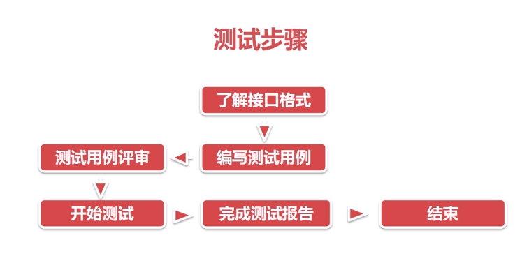

### REST API 接口规范

#### 1.什么是接口？

电梯，踩油门，搜索引擎（双向）

#### 2.Http状态码

~~~xml

~~~

#### 3.返回结果设计

~~~xml
通用错误码，具体产品由具体产品api文档给出
{
	"msg":"uri_not_found",
	"code":1001,
	"request":"GET\/v2\/photo\/132"
}
~~~

#### 4.REST API接口实例

~~~xml
-GET 	/product:列出所有商品
-POST 	/product:新建一个商品
-GET  	/product/ID:获得某个指定商品的信息
-PUT  	/product/ID:更新某个指定商品的信息
-DELETE /product/ID:删除某个商品
-GET 	/product/ID/purchase:列出某个指定商品的所有投资者
-GET 	/product/ID/purchase/ID:获得某个指定商品的指定投信息
~~~

### 测试

#### 测试类别

~~~xml
手动测试：通过工具进行测试
自动测试：编写自动化脚本实现（一劳永逸，加入回归测试集合）
~~~

#### 测试工具

~~~xml
常见的测试工具：Postman，JMeter，RestClinet等等。
~~~

#### 测试覆盖

~~~xml
功能测试：
    业务流程
    边界值，特殊字符
    参数类型，必选项，可选项
性能测试：
	并发量
	吞吐量，tps
	出错率等
安全性测试：
	敏感数据加密
	恶意攻击
~~~

#### 测试步骤

### Postman介绍

#### 简介

~~~xml
Postman是Google开发的一款功能强大的网页调试与发送网页HTTP请求，并能运行测试用例的Chrome插件。
~~~

#### 主要功能

~~~xml
- 模拟各种HTTP requests。
- Collection功能(测试集合)
- 人性化的Response整理
- 内置测试脚本语言
- 设定变量与环境
~~~

#### HTTP Header

~~~xml
Accept:指定客户端能够接受的内容类型
Accept-Charset：浏览器可以接受的字符编码集
Authorization：HTTP授权的授权证书
Content-Type:请求的与实体对应的MIME信息
Referer：先前网页地址，当前网页紧随其后，即来路
~~~

